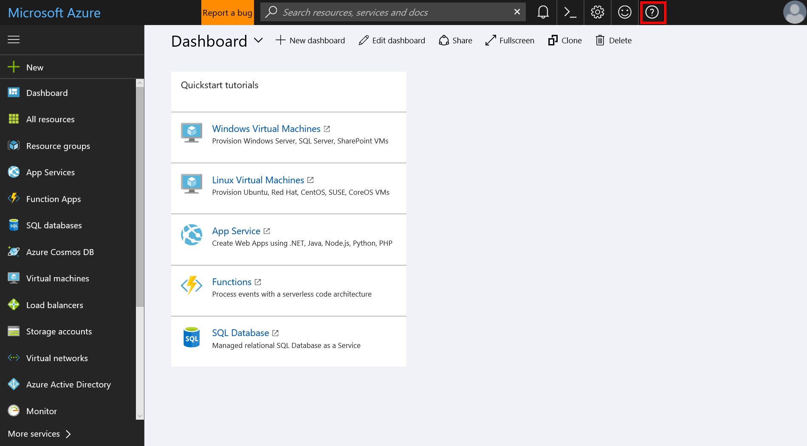

# How to contact Microsoft Genomics for support
This overview describes how to file a support request to contact Microsoft Genomics. This can be helpful if you are not able to troubleshoot your issue using the [troubleshooting guide](troubleshooting-guide-genomics.md) or the [FAQ](frequently-asked-questions-genomics.md). 

## File a support ticket through the Azure portal
First, log into your Azure account in the Azure portal. Click on the question mark on the top right corner and select `Help + support`.

 

Then, select `New support request`. 

 

Fill out the `Basics`, including `Issue type` and your `Subscription`. Select the most relevant `Issue type` to your issue; as an example in the image below, `Technical` has been selected. Be sure to select `Microsoft Genomics` as the relevant service.  `Microsoft Genomics` will be listed under the `Intelligence and Analytics` category.   After selecting `Microsoft Genomics`, you will also be asked to supply your `Support plan` type.

Next, add details about your issue. The request tool will also link to existing documentation that may be helpful to help you. In this example, the issue is related to `Genomics keys`, but several other options are also available.

Last, add your contact information and select `Create` at the bottom of the screen in order to submit your support request.

## Next steps
In this article, you learned how to submit a support request. You can also resolve common issues using our [FAQ](frequently-asked-questions-genomics.md) and our [troubleshooting guide](troubleshooting-guide-genomics.md). 