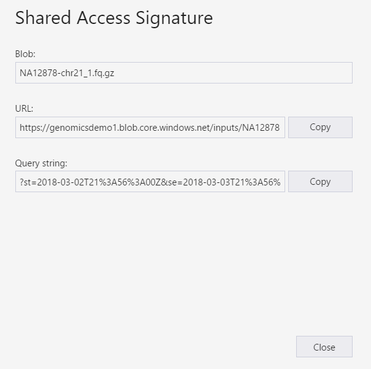
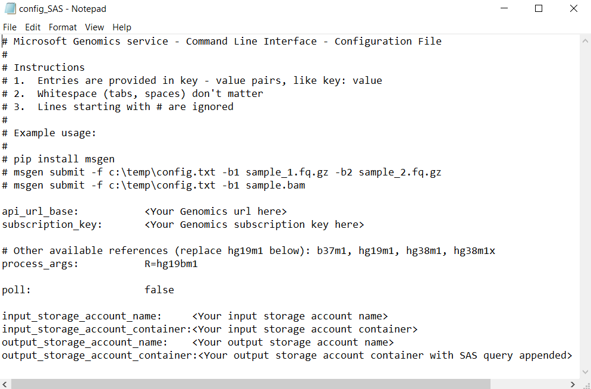

# Submit a workflow to Microsoft Genomics using a SAS instead of a storage account key 

This article demonstrates how to submit a workflow to the Microsoft Genomics service using a config.txt file that contains [shared access signatures (SAS)](../storage/common/storage-sas-overview.md) instead of storage account keys. This feature could be useful if there are security concerns about having the storage account key visible in the config.txt file. 

This article assumes you have already installed and run the `msgen` client, and are familiar with how to use Azure Storage. If you have successfully submitted a workflow using the provided sample data, you are ready to proceed with this article. 

## What is a SAS?
A [shared access signature (SAS)](../storage/common/storage-sas-overview.md) provides delegated access to resources in your storage account. With a SAS, you can grant  access to resources in your storage account, without sharing your account keys. This is the key point of using shared access signatures in your applications--a SAS is a secure way to share your storage resources without compromising your account keys.

The SAS that is submitted to Microsoft Genomics should be a [Service SAS](/rest/api/storageservices/Constructing-a-Service-SAS) that delegates access only to the blob or container where the input and output files are stored. 

The URI for a service-level shared access signature (SAS) token consists of the URI to the resource for which the SAS will delegate access, followed by the SAS token. The SAS token is the query string that includes all of the information required to authenticate the SAS, as well as specifying the resource, the permissions available for access, the time interval over which the signature is valid, the supported IP address or address range from which requests can originate, the supported protocol with which a request can be made, an optional access policy identifier associated with the request, and the signature itself. 

## SAS needed for submitting a workflow to the Microsoft Genomics service
Two or more SAS tokens are required for each workflow that is submitted to the Microsoft Genomics service, one for each input file and one for the output container.

The SAS for the input files should have the following properties:
 - Scope (account, container, blob): blob
 - Expiration: 48 hours from now
 - Permissions: read

The SAS for the output container should have the following properties:
 - Scope (account, container, blob): container
 - Expiration: 48 hours from now
 - Permissions: read, write, delete


## Create a SAS for the input files and the output container
There are two ways to create a SAS token, either using Azure Storage Explorer or programmatically.  If writing code, you can construct the SAS yourself, or use the Azure Storage SDK in your preferred language.


### Set up: Create a SAS using Azure Storage Explorer

[Azure Storage Explorer](https://azure.microsoft.com/features/storage-explorer/) is a tool to manage resources that you have stored in Azure Storage.  You can learn more about how to use Azure Storage Explorer [here](../vs-azure-tools-storage-manage-with-storage-explorer.md).

The SAS for the input files should be scoped to the specific input file (blob). To create a SAS token, follow [these instructions](../storage/blobs/quickstart-storage-explorer.md). Once you have created the SAS, the full URL with the query string as well as the query string by itself are provided and can be copied from the screen.

 


### Set up: Create a SAS programmatically

To create a SAS using the Azure Storage SDK, refer to the existing documentation in several languages, including [.NET](../storage/common/storage-sas-overview.md), [Python](../storage/blobs/storage-quickstart-blobs-python.md), and [Node.js](../storage/blobs/storage-quickstart-blobs-nodejs.md). 

To create a SAS without an SDK, the SAS query string can be directly constructed, including all the information required to authenticate the SAS. These [instructions](/rest/api/storageservices/constructing-a-service-sas) detail the components of the SAS query string and how to construct it. The required SAS signature is created by generating an HMAC using the blob/container authentication information, as described by these [instructions](/rest/api/storageservices/service-sas-examples).


## Add the SAS to the config.txt file
To run a workflow through the Microsoft Genomics service using a SAS query string, edit the config.txt file to remove the keys from the config.txt file. Then, append the SAS query string (which begins with a `?`) to the output container name, as shown. 



Use the Microsoft Genomics Python client to submit your workflow with the following command, appending the corresponding SAS query string to each of input blob names:

```python
msgen submit -f [full path to your config file] -b1 [name of your first paired end read file, SAS query string appended] -b2 [name of your second paired end read file, SAS query string appended]
```

### If adding the input file names to the config.txt file
Alternatively, the names of the paired end read files can be directly added to the config.txt file, with the SAS query tokens appended as shown:


In this case, use the Microsoft Genomics Python client to submit your workflow with the following command, omitting the `-b1` and `-b2` commands:

```python
msgen submit -f [full path to your config file] 
```

## Next steps
In this article, you used SAS tokens instead of the account keys to submit a workflow to the Microsoft Genomics service through the `msgen` Python client. For additional information about workflow submission and other commands you can use with the Microsoft Genomics service, see our [FAQ](frequently-asked-questions-genomics.yml).