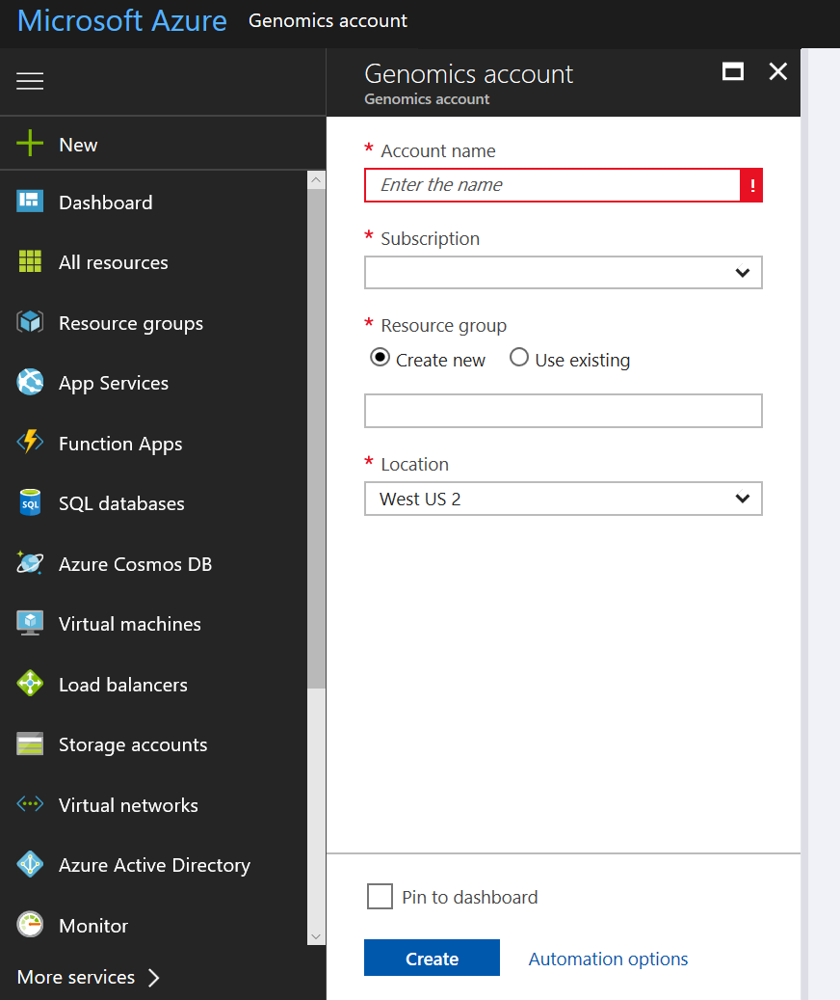
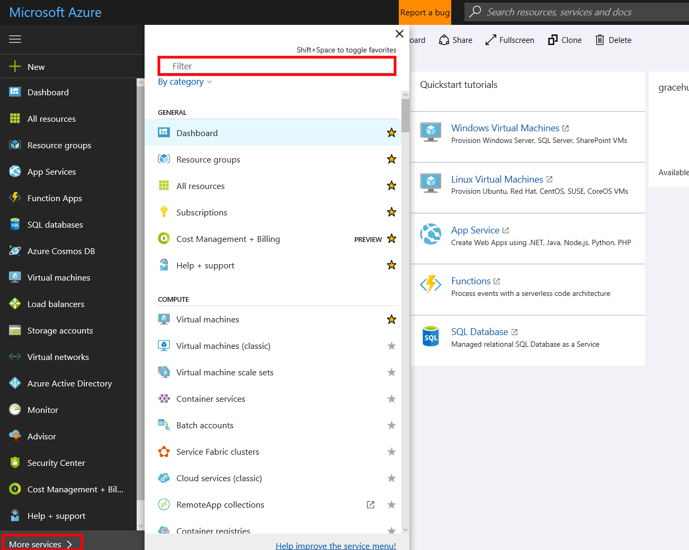
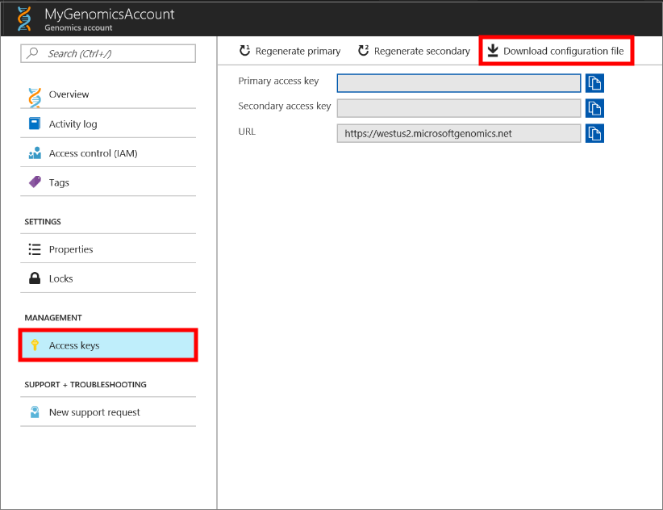
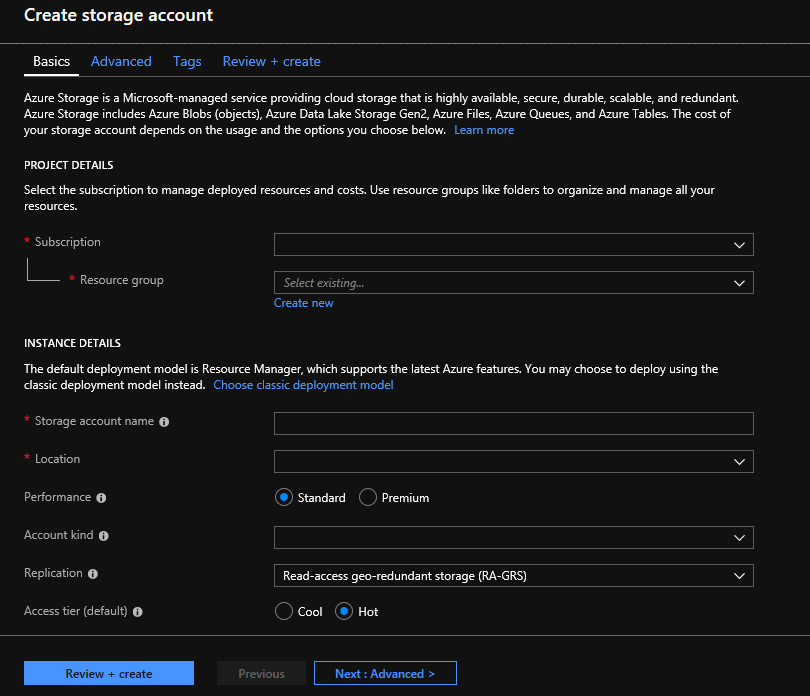

# Quickstart: Run a workflow through the Microsoft Genomics service

In this quickstart, you upload input data into an Azure Blob storage account, and run a workflow through the Microsoft Genomics service by using the Python Genomics client. Microsoft Genomics is a scalable, secure service for secondary analysis that can rapidly process a genome, starting from raw reads and producing aligned reads and variant calls. 

## Prerequisites

- An Azure account with an active subscription. [Create an account for free](https://azure.microsoft.com/free/?ref=microsoft.com&utm_source=microsoft.com&utm_medium=docs&utm_campaign=visualstudio). 
- [Python 2.7.12+](https://www.python.org/downloads/release/python-2714/), with `pip` installed, and `python` in your system path. The Microsoft Genomics client isn't compatible with Python 3. 

## Set up: Create a Microsoft Genomics account in the Azure portal

To create a Microsoft Genomics account, navigate to [Create a Genomics account](https://portal.azure.com/#create/Microsoft.Genomics) in the Azure portal. If you don’t have an Azure subscription yet, create one before creating a Microsoft Genomics account. 



Configure your Genomics account with the following information, as shown in the preceding image. 

 |**Setting**          |  **Suggested value**  | **Field description** |
 |:-------------       |:-------------         |:----------            |
 |Subscription         | Your subscription name|This is the billing unit for your Azure services - For details about your subscription see [Subscriptions](https://account.azure.com/Subscriptions) |      
 |Resource group       | MyResourceGroup       |  Resource groups allow you to group multiple Azure resources (storage account, genomics account, etc.) into a single group for simple management. For more information, see [Resource Groups](https://docs.microsoft.com/azure/azure-resource-manager/resource-group-overview#resource-groups). For valid resource group names, see [Naming Rules](/azure/architecture/best-practices/resource-naming) |
 |Account name         | MyGenomicsAccount     |Choose a unique account identifier. For valid names, see [Naming Rules](/azure/architecture/best-practices/resource-naming) |
 |Location                   | West US 2                    |    Service is available in West US 2, West Europe, and Southeast Asia |

You can select **Notifications** in the top menu bar to monitor the deployment process.


For more information about Microsoft Genomics, see [What is Microsoft Genomics?](overview-what-is-genomics.md)

## Set up: Install the Microsoft Genomics Python client

You need to install both Python and the Microsoft Genomics Python client in your local environment. 

### Install Python

The Microsoft Genomics Python client is compatible with Python 2.7.12 or a later 2.7.xx version. 2.7.14 is the suggested version. You can find the download [here](https://www.python.org/downloads/release/python-2714/). 

> [!IMPORTANT]
> Python 3.x isn't compatible with Python 2.7.xx.  MSGen is a Python 2.7 application. When running MSGen, make sure that your active Python environment is using a 2.7.xx version of Python. You may get errors when trying to use MSGen with a 3.x version of Python.

### Install the Microsoft Genomics client

Use Python `pip` to install the Microsoft Genomics client `msgen`. The follow instructions assume Python is already in your system path. If you have issues with `pip` install not recognized, you need to add Python and the scripts subfolder to your system path.

```
pip install --upgrade --no-deps msgen
pip install msgen
```

If you don't want to install `msgen` as a system-wide binary and modify system-wide Python packages, use the `–-user` flag with `pip`.
If you use the package-based installation or setup.py, all necessary required packages are installed. Otherwise, the basic required packages for `msgen` are 

 * [Azure-storage](https://pypi.python.org/pypi/azure-storage). 
 * [Requests](https://pypi.python.org/pypi/requests). 

You can install these packages using `pip`, `easy_install` or through standard `setup.py` procedures. 

### Test the Microsoft Genomics client
To test the Microsoft Genomics client, download the config file from your Genomics account. 
In the Azure portal, navigate to your Genomics account by selecting **All services** in the top left, and then searching for and selecting Genomics accounts.



Select the Genomics account you just made, navigate to **Access Keys**, and download the configuration file.



Test that the Microsoft Genomics Python client is working with the following command

```Python
msgen list -f "<full path where you saved the config file>"
```

## Create a Microsoft Azure Storage account 
The Microsoft Genomics service expects inputs to be stored as block blobs in an Azure storage account. It also writes output files as block blobs to a user-specified container in an Azure storage account. The inputs and outputs can reside in different storage accounts.
If you already have your data in an Azure storage account, you only need to make sure that it is in the same location as your Genomics account. Otherwise, egress charges are incurred when running the Microsoft Genomics service. 
If you don’t yet have an Azure storage account, you need to create one and upload your data. You can find more information about Azure storage accounts [here](https://docs.microsoft.com/azure/storage/common/storage-create-storage-account), including what a storage account is and what services it provides. To create an Azure storage account, navigate to [Create storage account](https://portal.azure.com/#create/Microsoft.StorageAccount-ARM) in the Azure portal.  



Configure your storage account with the following information, as shown in the preceding image. Use most of the standard options for a storage account, specifying only that the account is BlobStorage, not general purpose. Blob storage can be 2-5x faster for downloads and uploads.  The default deployment model, Azure Resource Manager, is recommended.  

 |**Setting**          |  **Suggested value**  | **Field description** |
 |:-------------------------       |:-------------         |:----------            |
 |Subscription         | Your Azure subscription |For details about your subscription see [Subscriptions](https://account.azure.com/Subscriptions) |      
 |Resource group       | MyResourceGroup       |  You can select the same resource group as your Genomics account. For valid resource group names, see [Naming rules](/azure/architecture/best-practices/resource-naming) |
 |Storage account name         | MyStorageAccount     |Choose a unique account identifier. For valid names, see [Naming rules](/azure/architecture/best-practices/resource-naming) |
 |Location                  | West US 2                  | Use the same location as the location of your Genomics account, to reduce egress charges, and reduce latency.  | 
 |Performance                  | Standard                   | The default is standard. For more details on standard and premium storage accounts, see [Introduction to Microsoft Azure storage](https://docs.microsoft.com/azure/storage/common/storage-introduction)    |
 |Account kind       | BlobStorage       |  Blob storage can be 2-5x faster than general purpose for downloads and uploads. |
 |Replication                  | Locally redundant storage                  | Locally redundant storage replicates your data within the datacenter in the region you created your storage account. For more information, see [Azure Storage replication](https://docs.microsoft.com/azure/storage/common/storage-redundancy)    |
 |Access tier                  | Hot                   | Hot access indicates objects in the storage account will be more frequently accessed.    |

Then select **Review + create** to create your storage account. As you did with the creation of your Genomics account, you can select **Notifications** in the top menu bar to monitor the deployment process. 

## Upload input data to your storage account

The Microsoft Genomics service expects paired end reads (fastq or bam files) as input files. You can choose to either upload your own data, or explore using publicly available sample data provided for you. If you would like to use the publicly available sample data, it is hosted here:

[https://msgensampledata.blob.core.windows.net/small/chr21_1.fq.gz](https://msgensampledata.blob.core.windows.net/small/chr21_1.fq.gz)
[https://msgensampledata.blob.core.windows.net/small/chr21_2.fq.gz](https://msgensampledata.blob.core.windows.net/small/chr21_2.fq.gz)

Within your storage account, you need to make one blob container for your input data and a second blob container for your output data.  Upload the input data into your input blob container. Various tools can be used to do this, including [Microsoft Azure Storage Explorer](https://azure.microsoft.com/features/storage-explorer/), [BlobPorter](https://github.com/Azure/blobporter), or [AzCopy](https://docs.microsoft.com/azure/storage/common/storage-use-azcopy?toc=%2fazure%2fstorage%2fblobs%2ftoc.json). 

## Run a workflow through the Microsoft Genomics service using the Python client 

To run a workflow through the Microsoft Genomics service, edit the *config.txt* file to specify the input and output storage container for your data.
Open the *config.txt* file that you downloaded from your Genomics account. The sections you need to specify are your subscription key and the six items at the bottom, the storage account name, key, and container name for both the input and output. You can find this information by navigating in the Azure portal to **Access keys** for your storage account, or directly from the Azure Storage Explorer.  


If you would like to run GATK4, set the `process_name` parameter to `gatk4`.

By default, the Genomics service outputs VCF files. If you would like a gVCF output rather than a VCF output (equivalent to `-emitRefConfidence` in GATK 3.x and `emit-ref-confidence` in GATK 4.x), add the  `emit_ref_confidence` parameter to your *config.txt* and set it to `gvcf`, as shown in the preceding figure.  To change back to VCF output, either remove it from the *config.txt* file or set the `emit_ref_confidence` parameter to `none`. 

### Submit your workflow to the Microsoft Genomics service the Microsoft Genomics client

Use the Microsoft Genomics Python client to submit your workflow with the following command:

```python
msgen submit -f [full path to your config file] -b1 [name of your first paired end read] -b2 [name of your second paired end read]
```

You can view the status of your workflows using the following command: 
```python
msgen list -f c:\temp\config.txt 
```

Once your workflow completes, you can view the output files in your Azure storage account in the output container that you configured. 

## Next steps
In this article, you uploaded sample input data into Azure storage and submitted a workflow to the Microsoft Genomics service through the `msgen` Python client. To learn more about other input file types that can be used with the Microsoft Genomics service, see the following pages: [paired FASTQ](quickstart-input-pair-FASTQ.md) | [BAM](quickstart-input-BAM.md) | [Multiple FASTQ or BAM](quickstart-input-multiple.md). You can also explore this tutorial using our [Azure notebook tutorial.](https://aka.ms/genomicsnotebook)
