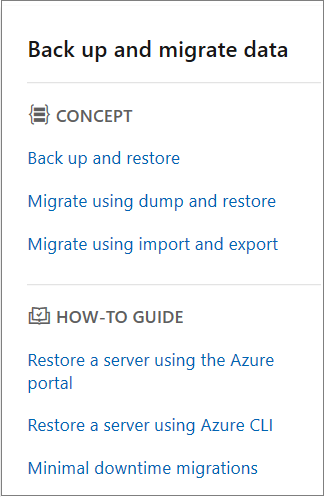

# Migrate database resources to global Azure

[!INCLUDE [closureinfo](../../includes/germany-closure-info.md)]

This article has information that can help you migrate Azure database resources from Azure Germany to global Azure.

## SQL Database

To migrate smaller Azure SQL Database workloads, without keeping the migrated database online, use the export function to create a BACPAC file. A BACPAC file is a compressed (zipped) file that contains metadata and the data from the SQL Server database. After you create the BACPAC file, you can copy the file to the target environment (for example, by using AzCopy) and use the import function to rebuild the database. Be aware of the following considerations:

- For an export to be transactionally consistent, make sure that one of the following conditions is true:
  - No write activity occurs during the export.
  - You export from a transactionally consistent copy of your SQL database.
- To export to Azure Blob storage, the BACPAC file size is limited to 200 GB. For a larger BACPAC file, export to local storage.
- If the export operation from SQL Database takes longer than 20 hours, the operation might be canceled. Check the following articles for tips about how to increase performance.

> [!NOTE]
> The connection string changes after the export operation because the DNS name of the server changes during export.

For more information:

- Learn how to [export a database to a BACPAC file](../azure-sql/database/database-export.md).
- Learn how to [import a BACPAC file to a database](../azure-sql/database/database-import.md).
- Review the [Azure SQL Database documentation](/azure/sql-database/).

[!INCLUDE [updated-for-az](../../includes/updated-for-az.md)]


## Migrate SQL Database using active geo-replication

For databases that are too large for BACPAC files, or to migrate from one cloud to another and remain online with minimum downtime, you can configure active geo-replication from Azure Germany to global Azure.

> [!IMPORTANT]
> Configuring active geo-replication to migrate databases to global Azure is only supported using Transact-SQL (T-SQL), and prior to migrating you must request enablement of your subscription to support migrating to global Azure. To submit a request, you must use [this support request link](#requesting-access). 

For details about active geo-replication costs, see the section titled **Active geo-replication** in [Azure SQL Database pricing](https://azure.microsoft.com/pricing/details/sql-database/single/).

Migrating databases with active geo-replication requires an Azure SQL logical server in global Azure. You can create the server using the portal, Azure PowerShell, Azure CLI, etc., but configuring active geo-replication to migrate from Azure Germany to global Azure is only supported using Transact-SQL (T-SQL).

> [!IMPORTANT]
> When migrating between clouds, the primary (Azure Germany) and secondary (global Azure) server name prefixes must be different. If the server names are the same, running the ALTER DATABASE statement will succeed, but the migration will fail. For example, if the prefix of the primary server name is `myserver`  (`myserver.database.cloudapi.de`), the prefix of the secondary server name in global Azure cannot be `myserver`.


The `ALTER DATABASE` statement allows you to specify a target server in global Azure by using its fully qualified dns server name on the target side. 


```sql
ALTER DATABASE [sourcedb] add secondary on server [public-server.database.windows.net]
```


- *`sourcedb`* represents the database name in an Azure SQL server in Azure Germany. 
- *`public-server.database.windows.net`* represents the Azure SQL server name that exists in global Azure, where the database should be migrated. The namespace "database.windows.net" is required, replace *public-server* with the name of your logical SQL server in global Azure. The server in global Azure must have a different name than the primary server in Azure Germany.


The command is executed on the master database on the Azure Germany server hosting the local database to be migrated. 
- The T-SQL start-copy API authenticates the logged-in user in the public cloud server by finding a user with the same SQL login/user name in master database of that server. This approach is cloud-agnostic; thus, the T-SQL API is used to start cross-cloud copies. For permissions and more information on this topic see [Creating and using active geo-replication](../azure-sql/database/active-geo-replication-overview.md) and [ALTER DATABASE (Transact-SQL)](/sql/t-sql/statements/alter-database-transact-sql/).
- Except for the initial T-SQL command extension indicating an Azure SQL logical server in global Azure, the rest of the active geo-replication process is identical to the existing execution in the local cloud. For detailed steps to create active geo-replication, see [Creating and using active geo-replication](../azure-sql/database/active-geo-replication-overview.md) with an exception the secondary database is created in the secondary logical server created in global Azure. 
- Once the secondary database exists in global Azure (as its online copy of the Azure Germany database), customer can initiate a database failover from Azure Germany to global Azure for this database using the ALTER DATABASE T-SQL command (see the table below).
- After the failover, once the secondary becomes a primary database in global Azure, you can stop the active geo-replication and remove the secondary database on the Azure Germany side at any time (see the table below and the steps present in the diagram). 
- After failover, the secondary database in Azure Germany will continue to incur costs until deleted.
      
- Using the `ALTER DATABASE` command is the only way to set up active geo-replication to migrate an Azure Germany database to global Azure. 
- No Azure portal, Azure Resource Manager, PowerShell, or CLI is available to configure active geo-replication for this migration. 

To migrate a database from Azure Germany to global Azure:   

1.	Choose the user database in Azure Germany, for example, `azuregermanydb`
2.	Create a logical server in global Azure (the public cloud), for example, `globalazureserver`. 
Its fully qualified domain name (FQDN) is `globalazureserver.database.windows.net`.
3.	Start active geo-replication from Azure Germany to global Azure by executing this T-SQL command on the server in Azure Germany. Note that the fully qualified dns name is used for the public server `globalazureserver.database.windows.net`. This is to indicate that the target server is in global Azure, and not Azure Germany.

    ```sql
    ALTER DATABASE [azuregermanydb] ADD SECONDARY ON SERVER [globalazureserver.database.windows.net];
    ```

4.	When the replication is ready to move the read-write workload to the global Azure server, initiate a planned failover to global Azure by executing this T-SQL command on the global Azure server.

    ```sql
    ALTER DATABASE [azuregermanydb] FAILOVER;
    ```

5.	Use the following T-SQL to stop active geo-replication. If this command is run after the planned failover, it will terminate the geo-link with the database in global Azure being the read-write copy. This will complete the migration process. However, if the command is executed before the planned failover, it will stop the migration process and the database in Azure Germany will remain the read-write copy. This T-SQL command should be run on the current geo-primary database's logical server, for example, on the Azure Germany server before planned failover and the global Azure server after planned failover.


    `ALTER DATABASE [azuregermanydb] REMOVE SECONDARY ON SERVER [azuregermanyserver];`
    or
    `ALTER DATABASE [azuregermanydb] REMOVE SECONDARY ON SERVER [globalazureserver];`


These steps to migrate Azure SQL databases from Azure Germany to global Azure can also be followed using active geo-replication.


For more information the following tables below indicates T-SQL commands for managing failover. The following commands are supported for cross-cloud active geo-replication between Azure Germany and global Azure: 
 
|Command |Description|
|:--|:--| 
|[ALTER DATABASE](/sql/t-sql/statements/alter-database-transact-sql?view=azuresqldb-current&preserve-view=true) |Use ADD SECONDARY ON SERVER argument to create a secondary database for an existing database and starts data replication| 
|[ALTER DATABASE](/sql/t-sql/statements/alter-database-transact-sql?view=azuresqldb-current&preserve-view=true) |Use FAILOVER or FORCE_FAILOVER_ALLOW_DATA_LOSS to switch a secondary database to be primary to initiate failover  |
|[ALTER DATABASE](/sql/t-sql/statements/alter-database-transact-sql?view=azuresqldb-current&preserve-view=true) |Use REMOVE SECONDARY ON SERVER to terminate a data replication between a SQL Database and the specified secondary database.  |
 
### Active geo-replication monitoring system views 
 
|Command |Description|
|:--|:--| 
|[sys.geo_replication_links](/sql/relational-databases/system-dynamic-management-views/sys-geo-replication-links-azure-sql-database?view=azuresqldb-current&preserve-view=true)|Returns information about all existing replication links for each database on the Azure SQL Database server. |
|[sys.dm_geo_replication_link_status](/sql/relational-databases/system-dynamic-management-views/sys-dm-geo-replication-link-status-azure-sql-database?view=azuresqldb-current&preserve-view=true) |Gets the last replication time, last replication lag, and other information about the replication link for a given SQL database. |
|[sys.dm_operation_status](/sql/relational-databases/system-dynamic-management-views/sys-dm-operation-status-azure-sql-database?view=azuresqldb-current&preserve-view=true) | Shows the status for all database operations including the status of the replication links. | 
|[sp_wait_for_database_copy_sync](/sql/relational-databases/system-stored-procedures/active-geo-replication-sp-wait-for-database-copy-sync?view=azuresqldb-current&preserve-view=true) | Causes the application to wait until all committed transactions are replicated and acknowledged by the active secondary database. |
 

## Migrate SQL Database long-term retention backups

Migrating a database with geo-replication or BACPAC file does not copy over the long-term retention backups, that the database might have in Azure Germany. To migrate existing long-term retention backups to the target global Azure region, you can use the COPY long-term retention backup procedure. 

>[!Note]
>LTR backup copy methods documented here can only copy the LTR backups from Azure Germany to global Azure. Copying PITR backups using these methods is not supported. 
>

### Pre-requisites

1. Target database where you are copying the LTR backups, in global Azure must exist before you start the copying the backups. It is recommended that you first migrate the source database using [active geo-replication](#migrate-sql-database-using-active-geo-replication) and then initiate the LTR backup copy. This will ensure that the database backups are copied to the correct destination database. This step is not required, if you are copying over LTR backups of a dropped database. When copying LTR backups of a dropped database, a dummy DatabaseID will be created in the target region. 
2. Install this [PowerShell Az Module](https://www.powershellgallery.com/packages/Az.Sql/3.0.0-preview)
3. Before you begin, ensure that required [Azure RBAC roles](https://docs.microsoft.com/azure/azure-sql/database/long-term-backup-retention-configure#azure-roles-to-manage-long-term-retention) are granted at either **subscription** or **resource group** scope. Note: To access LTR backups that belong to a dropped server, the permission must be granted in the subscription scope of that server. . 


### Limitations  

- Failover Groups are not supported. This means that customers migrating Azure Germany database(s) will need to manage connection strings themselves during failover.
- No support for Azure portal, Azure Resource Manager APIs, PowerShell, or CLI. This means that each Azure Germany migration will need to manage active geo-replication setup and failover through T-SQL.
- Customers cannot create multiple geo-secondaries in global Azure for databases in Azure Germany.
- Creation of a geo secondary must be initiated from the Azure Germany region.
- Customers can migrate databases out of Azure Germany only to global Azure. Currently no other cross-cloud migration is supported. 
- Azure AD users in Azure Germany user databases are migrated but are not available in the new Azure AD tenant where the migrated database resides. To enable these users, they must be manually dropped and recreated using the current Azure AD users available in the new Azure AD tenant where the newly migrated database resides.  


### Copy long-term retention backups using PowerShell

A new PowerShell command **Copy-AzSqlDatabaseLongTermRetentionBackup** has been introduced, which can be used to copy the long-term retention backups from Azure Germany to Azure global regions. 

1. **Copy LTR backup using backup name**
Following example shows how you can copy a LTR backup from Azure Germany to Azure global region, using the backupname.  

```powershell
# Source database and target database info
$location = "<location>"
$sourceRGName = "<source resourcegroup name>"
$sourceServerName = "<source server name>"
$sourceDatabaseName = "<source database name>"
$backupName = "<backup name>"
$targetDatabaseName = "<target database name>"
$targetSubscriptionId = "<target subscriptionID>"
$targetRGName = "<target resource group name>"
$targetServerFQDN = "<targetservername.database.windows.net>"

Copy-AzSqlDatabaseLongTermRetentionBackup 
    -Location $location 
    -ResourceGroupName $sourceRGName 
    -ServerName $sourceServerName 
    -DatabaseName $sourceDatabaseName
    -BackupName $backupName
    -TargetDatabaseName $targetDatabaseName 
    -TargetSubscriptionId $targetSubscriptionId
    -TargetResourceGroupName $targetRGName
    -TargetServerFullyQualifiedDomainName $targetServerFQDN 
```

2. **Copy LTR backup using backup resourceID**
Following example shows how you can copy LTR backup from Azure Germany to Azure global region, using a backup resourceID. This example can be used to copy backups of a deleted database as well. 

```powershell
$location = "<location>"
# list LTR backups for All databases (you have option to choose All/Live/Deleted)
$ltrBackups = Get-AzSqlDatabaseLongTermRetentionBackup -Location $location -DatabaseState All

# select the LTR backup you want to copy
$ltrBackup = $ltrBackups[0]
$resourceID = $ltrBackup.ResourceId

# Source Database and target database info
$targetDatabaseName = "<target database name>"
$targetSubscriptionId = "<target subscriptionID>"
$targetRGName = "<target resource group name>"
$targetServerFQDN = "<targetservername.database.windows.net>"

Copy-AzSqlDatabaseLongTermRetentionBackup 
    -ResourceId $resourceID 
    -TargetDatabaseName $targetDatabaseName 
    -TargetSubscriptionId $targetSubscriptionId
    -TargetResourceGroupName $targetRGName
    -TargetServerFullyQualifiedDomainName $targetServerFQDN
```


### Limitations  

- [Point-in-time restore (PITR)](../azure-sql/database/recovery-using-backups.md#point-in-time-restore) backups are only taken on the primary database, this is by design. When migrating databases from Azure Germany using Geo-DR, PITR backups will start happening on the new primary after failover. However, the existing PITR backups (on the previous primary in Azure Germany) will not be migrated. If you need PITR backups to support any point-in-time restore scenarios, you need to restore the database from PITR backups in Azure Germany and then migrate the recovered database to global Azure. 
- Long-term retention policies are not migrated with the database. If you have a [long-term retention (LTR)](../azure-sql/database/long-term-retention-overview.md) policy on your database in Azure Germany, you need to manually copy and recreate the LTR policy on the new database after migrating. 


### Requesting access

To migrate a database from Azure Germany to global Azure using geo-replication, your subscription *in Azure Germany* needs to be enabled to successfully configure the cross-cloud migration.

To enable your Azure Germany subscription, you must use the following link to create a migration support request:   

1. Browse to the following [migration support request](https://portal.microsoftazure.de/#create/Microsoft.Support/Parameters/%7B%0D%0A++++%22pesId%22%3A+%22f3dc5421-79ef-1efa-41a5-42bf3cbb52c6%22%2C%0D%0A++++%22supportTopicId%22%3A+%229fc72ed5-805f-3894-eb2b-b1f1f6557d2d%22%2C%0D%0A++++%22contextInfo%22%3A+%22Migration+from+cloud+Germany+to+Azure+global+cloud+%28Azure+SQL+Database%29%22%2C%0D%0A++++%22caller%22%3A+%22NoSupportPlanCloudGermanyMigration%22%2C%0D%0A++++%22severity%22%3A+%223%22%0D%0A%7D).

2. On the Basics tab, enter *Geo-DR migration* as the **Summary**, and then select **Next: Solutions**
 
   :::image type="content" source="media/germany-migration-databases/support-request-basics.png" alt-text="new support request form":::

3. Review the **Recommended Steps**, then select **Next: Details**. 

   :::image type="content" source="media/germany-migration-databases/support-request-solutions.png" alt-text="required support request information":::

4. On the details page, provide the following:

   1. In the Description box, enter the global Azure subscription ID to migrate to. To migrate databases to more than one subscription, add a list of the global Azure IDs you want to migrate databases to.
   1. Provide contact information: name, company name, email or phone number.
   1. Complete the form, then select **Next: Review + create**.

   :::image type="content" source="media/germany-migration-databases/support-request-details.png" alt-text="support request details":::


5. Review the support request, then select **Create**. 


You'll be contacted once the request is processed.


## Azure Cosmos DB

You can use Azure Cosmos DB Data Migration Tool to migrate data to Azure Cosmos DB. Azure Cosmos DB Data Migration Tool is an open-source solution that imports data to Azure Cosmos DB from different sources including: JSON files, MongoDB, SQL Server, CSV files, Azure Table storage, Amazon DynamoDB, HBase, and Azure Cosmos containers.


Azure Cosmos DB Data Migration Tool is available as a graphical interface tool or as command-line tool. The source code is available in the [Azure Cosmos DB Data Migration Tool](https://github.com/azure/azure-documentdb-datamigrationtool) GitHub repository. A [compiled version of the tool](https://www.microsoft.com/download/details.aspx?id=46436) is available in the Microsoft Download Center.

To migrate Azure Cosmos DB resources, we recommend that you complete the following steps:

1. Review application uptime requirements and account configurations to determine the best action plan.
1. Clone the account configurations from Azure Germany to the new region by running the data migration tool.
1. If using a maintenance window is possible, copy data from the source to the destination by running the data migration tool.
1. If using a maintenance window isn't an option, copy data from the source to the destination by running the tool, and then complete these steps:
   1. Use a config-driven approach to make changes to read/write in an application.
   1. Complete a first-time sync.
   1. Set up an incremental sync and catch up with the change feed.
   1. Point reads to the new account and validate the application.
   1. Stop writes to the old account, validate that the change feed is caught up, and then point writes to the new account.
   1. Stop the tool and delete the old account.
1. Run the tool to validate that data is consistent across old and new accounts.

For more information:

- To learn how to use the Data migration tool, see [Tutorial: Use Data migration tool to migrate your data to Azure Cosmos DB](../cosmos-db/import-data.md).
- To learn about Cosmos DB, see [Welcome to Azure Cosmos DB](../cosmos-db/introduction.md).


## Azure Cache for Redis

You have a few options if you want to migrate an Azure Cache for Redis instance from Azure Germany to global Azure. The option you choose depends on your requirements.

### Option 1: Accept data loss, create a new instance

This approach makes the most sense when both of the following conditions are true:

- You're using Azure Cache for Redis as a transient data cache.
- Your application will repopulate the cache data automatically in the new region.

To migrate with data loss and create a new instance:

1. Create a new Azure Cache for Redis instance in the new target region.
1. Update your application to use the new instance in the new region.
1. Delete the old Azure Cache for Redis instance in the source region.

### Option 2: Copy data from the source instance to the target instance

A member of the Azure Cache for Redis team wrote an open-source tool that copies data from one Azure Cache for Redis instance to another without requiring import or export functionality. See step 4 in the following steps for information about the tool.

To copy data from the source instance to the target instance:

1. Create a VM in the source region. If your dataset in Azure Cache for Redis is large, make sure that you select a relatively powerful VM size to minimize copying time.
1. Create a new Azure Cache for Redis instance in the target region.
1. Flush data from the **target** instance. (Make sure *not* to flush from the **source** instance. Flushing is required because the copy tool *doesn't overwrite* existing keys in the target location.)
1. Use the following tool to automatically copy data from the source Azure Cache for Redis instance to the target Azure Cache for Redis instance: [Tool source](https://github.com/deepakverma/redis-copy) and [tool download](https://github.com/deepakverma/redis-copy/releases/download/alpha/Release.zip).

> [!NOTE]
> This process can take a long time depending on the size of your dataset.

### Option 3: Export from the source instance, import to the destination instance

This approach takes advantage of features that are available only in the Premium tier.

To export from the source instance and import to the destination instance:

1. Create a new Premium tier Azure Cache for Redis instance in the target region. Use the same size as the source Azure Cache for Redis instance.
1. [Export data from the source cache](../azure-cache-for-redis/cache-how-to-import-export-data.md) or use the [Export-AzRedisCache PowerShell cmdlet](/powershell/module/az.rediscache/export-azrediscache).

   > [!NOTE]
   > The export Azure Storage account must be in the same region as the cache instance.

1. Copy the exported blobs to a storage account in destination region (for example, by using AzCopy).
1. [Import data to the destination cache](../azure-cache-for-redis/cache-how-to-import-export-data.md) or use the [Import-AzRedisCAche PowerShell cmdlet](/powershell/module/az.rediscache/import-azrediscache).
1. Reconfigure your application to use the target Azure Cache for Redis instance.

### Option 4: Write data to two Azure Cache for Redis instances, read from one instance

For this approach, you must modify your application. The application needs to write data to more than one cache instance while reading from one of the cache instances. This approach makes sense if the data stored in Azure Cache for Redis meets the following criteria:
- The data is refreshed regularly. 
- All data is written to the target Azure Cache for Redis instance.
- You have enough time for all data to be refreshed.

For more information:

- Review the [overview of Azure Cache for Redis](../azure-cache-for-redis/cache-overview.md).

## PostgreSQL and MySQL

For more information, see the articles in the "Back up and migrate data" section of [PostgreSQL](../postgresql/index.yml) and [MySQL](../mysql/index.yml).



## Next steps

Learn about tools, techniques, and recommendations for migrating resources in the following service categories:

- [Compute](./germany-migration-compute.md)
- [Networking](./germany-migration-networking.md)
- [Storage](./germany-migration-storage.md)
- [Web](./germany-migration-web.md)
- [Analytics](./germany-migration-analytics.md)
- [IoT](./germany-migration-iot.md)
- [Integration](./germany-migration-integration.md)
- [Identity](./germany-migration-identity.md)
- [Security](./germany-migration-security.md)
- [Management tools](./germany-migration-management-tools.md)
- [Media](./germany-migration-media.md)
