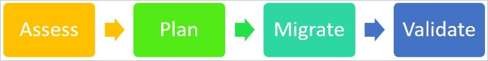

# Introduction to migration guidance for Azure Germany

These articles provide guidance to migrate your workloads from Azure Germany to global Azure. Although Azure provides tools to migrate resources at the [Azure Migration Center](https://azure.microsoft.com/migration/), some of these tools are designed only for migrations inside the same tenant or the same region.

The two regions in Germany are strictly separated from global Azure, including separate Azure Active Directory for each cloud. As a result, Azure tenants are always different between global Azure and Azure Germany. Some of the standard migration tools are based on moving resources inside the *same* tenant. When migrating between *different* tenants, below is a list of tools available.

## Migration Process

Your journey to migrate workload from Azure Germany to global Azure will typically follow similar processes used for migrating applications to the Cloud.

### Assess

- Understand your organizationAzure Germany footprint by bringing together Azure Account owners, Subscription admins, Tenant admins, and Finance/Accounting teams. Together, they'll provide a complete picture of Azure usage for large organizations.

- Compile inventory of resources
  - Each Subscription Admin and Tenant admin will execute a series of scripts to list resource groups, the resources within each of the groups, and their deployment settings
  - Document dependencies across applications within Azure, and with external systems
  - Document the count of each Azure resource, and the amount of data associated with each instance that needs to be migrated
  - Ensure the application architecture documents are consistent with the Azure resources list

At the end of this stage, you'll have

- a complete list of Azure resources in use,
- dependencies across those resources, and
- complexity of migration effort

### Plan

- Use the output of the dependency analysis from Assessment stage to define related components. Consider migrating them together in a '**migration package**'
- [Optional] Take this migration opportunity to apply [Gartner 5-R criteria](https://www.gartner.com/newsroom/id/1684114), and optimize your workload
- Determine Target environment in global Azure
  - Identify the target global Azure tenant (if your organization doesn't already have a presence, create one) 
  - create subscriptions
  - choose which global Azure location you prefer to migrate
  - Execute test migration scenarios that match your architecture from Azure Germany to Azure global
- Determine appropriate timeline/schedule of migration, and User acceptance test plan, for each migration package

### Migrate

- Use the tools, techniques, and recommendations in this document to create new resources in Azure global, and configure applications

### Validate

- Perform User acceptance testing
- Ensure applications are working as expected
- Synchronize latest data to target environment if applicable
- Cutover to new application instance in Azure global
- confirm production environment is working as expected
- Decommission resources in Azure Germany

## Terms

These terms are used in the following migration articles:

*Source* describes where you come from (for example Azure Germany):

- Source tenant name: Name of the Tenant in Azure Germany (everything after the "@" in the account name). Tenant names in Azure Germany are all ending on *microsoftazure.de*.
- Source tenant ID: The ID of the tenant in Azure Germany. The tenant ID shows up in the Azure portal when moving the mouse over the account name at the upper right corner.
- Source subscription ID: You can have more than one subscription under the same tenant. Always make sure that you're using the correct subscription.
- Source region: Either "**Germany Central**" ("**germanycentral**") or "**Germany Northeast**" ("**germanynortheast**"), depending on where the resource you want to migrate is located.

*Target* or *Destination* describes where you migrate to:

- Target tenant name: Like Source tenant name, but in Azure public.
- Target tenant ID: Like Source tenant ID.
- Target subscription ID: Like source subscription ID
- Target region: You can use nearly any region in global Azure, but most likely you want to migrate to "**West Europe**" ("**westeurope**") or "**North Europe**" ("**northeurope**").

> [!NOTE]
> Please verify that the service you are migrating is offered in the target region. All Azure services available in Azure Germany are available in **West Europe**. All Azure services available in Azure Germany are also available in **North Europe**, except for G/GS VM series and Machine Learning Studio.

Also add the global Azure portal to your favorite links in your browser. While Azure Germany portal is available under [https://portal.microsoftazure.de/](https://portal.microsoftazure.de/), the global Azure portal can be reached under [https://portal.azure.com/](https://portal.azure.com/).

### Next Steps

Learn about tools, techniques, and recommendations to migrate resources of the following service categories:

- [Compute](./germany-migration-compute.md)
- [Networking](./germany-migration-networking.md)
- [Storage](./germany-migration-storage.md)
- [Web](./germany-migration-web.md)
- [Databases](./germany-migration-databases.md)
- [Analytics](./germany-migration-analytics.md)
- [Internet of Things (IoT)](./germany-migration-iot.md)
- [Integration](./germany-migration-integration.md)
- [Identity](./germany-migration-identity.md)
- [Security](./germany-migration-security.md)
- [Management Tools](./germany-migration-management-tools.md)
- [Media](./germany-migration-media.md)
