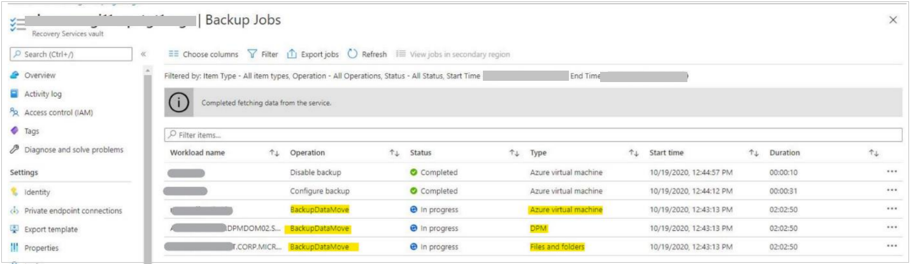

# Migrate management tool resources to global Azure

[!INCLUDE [closure info](../../includes/germany-closure-info.md)]

This article has information that can help you migrate Azure management tools from Azure Germany to global Azure.

## Traffic Manager

Azure Traffic Manager can help you complete a smooth migration. However, you can't migrate Traffic Manager profiles that you create in Azure Germany to global Azure. (During a migration, you migrate Traffic Manager endpoints to the target environment, so you need to update the Traffic Manager profile anyway.)

You can define additional endpoints in the target environment by using Traffic Manager while it's still running in the source environment. When Traffic Manager is running in the new environment, you can still define endpoints that you haven't yet migrated in the source environment. This scenario is known as the [Blue-Green scenario](https://azure.microsoft.com/blog/blue-green-deployments-using-azure-traffic-manager/). The scenario involves the following steps:

1. Create a new Traffic Manager profile in global Azure.
1. Define the endpoints in Azure Germany.
1. Change your DNS CNAME record to the new Traffic Manager profile.
1. Turn off the old Traffic Manager profile.
1. Migrate and configure endpoints. For each endpoint in Azure Germany:
   1. Migrate the endpoint to global Azure.
   1. Change the Traffic Manager profile to use the new endpoint.

For more information:

- Refresh your knowledge by completing the [Traffic Manager tutorials](../traffic-manager/index.yml).
- Review the [Traffic Manager overview](../traffic-manager/traffic-manager-overview.md).
- Learn how to [create a Traffic Manager profile](../traffic-manager/quickstart-create-traffic-manager-profile.md).
- Read about the [Blue-Green scenario](https://azure.microsoft.com/blog/blue-green-deployments-using-azure-traffic-manager/).

## Azure Backup

Azure Backup service provides simple, secure, and cost-effective solutions to back up your data and recover it from the Microsoft Azure cloud. The backup data move is now enabled from Germany Central (GEC) and Germany Northeast (GNE) to Germany West Central (GWC) via PowerShell cmdlets.

### Prerequisite for moving hybrid workloads

Once the move operation starts, backups are stopped in the existing vaults. So, it’s important to protect your data in a new vault in GWC for hybrid workloads (Data Protection Manager (DPM) server/ Azure Backup Server (MABS)/ Microsoft Azure Recovery Services (MARS) before you start moving backup data from the regions.
To start protecting in a new vault:

1. Create a new vault (VaultN) in GWC.
1. Re-register your DPM server/MABS/MARS agent to VaultN.
1. Assign Policy and start taking backups.

The initial backup will be a full copy followed by incremental backups.

>[!Important]
>- Before initiating the backup data move operation, ensure that the first full backup in VaultN is completed.
>- For DPM/MABS, maintain the passphrase from the original vault in a secure location as you need the same to restore data from the target vault. Without the original passphrase, restoration from the source vault is not possible.

### Step 1: Download the resources

Download and install the required resources.

1. [Download](https://github.com/PowerShell/PowerShell/releases/tag/v7.0.3) the latest version of PowerShell (PowerShell 7).
1. Use Az.RecoveryServices module version 4.2.0 available in Azure Cloud Shell.
1. [Update](https://aka.ms/azurebackup_agent) all MARS agents to the latest version.
1. Validate your passphrase. If you need to regenerate, follow the [validation steps](https://support.microsoft.com/topic/mandatory-update-for-azure-backup-for-microsoft-azure-recovery-services-agent-411e371c-aace-e134-de6b-bf9fda48026e#section-3).

### Step 2: Create a target vault in GWC

Create a Target Vault (Vault 2) in GWC. To learn how to create a vault, see [Create and configure a Recovery Services vault](../backup/backup-create-rs-vault.md).

>[!Note]
>- Ensure that the vault has no protected items.
>- Ensure that the target vault has necessary redundancy - locally redundant sorage (LRS) or geo-redundant storage (GRS).

### Step 3: - Use PowerShell to trigger Backup data move

#### Get the source vault from GNE or GEC

Run these cmdlets:

1. `Connect-AzAccount -Environment AzureGermanCloud`
1. `Set-AzContext -Subscription "subscriptionName"`
1. `$srcVault = Get-AzRecoveryServicesVault -name “srcVault” -ResourceGroupName “TestSourceRG”`

>[!Note]
>- `srcVault` = Source Vault
>- `TestSourceRG` = Source Resource Group

#### Get the target vault in GWC

Run these cmdlets:

1. `Connect-AzAccount`
1. `Set-AzContext -Subscription "subscriptionName"`
1. `$trgVault = Get-AzRecoveryServicesVault -name “targetVault” -ResourceGroupName “TestTargetRG”`

>[!Note]
>- `targetVault` = Target Vault
>- `TestTargetRG` = Test Resource Group

#### Perform validation
 
Run these cmdlets:

1. `$validated = $false`
1. `$validated = Test-AzRecoveryServicesDSMove -SourceVault $srcVault -TargetVault $trgVault`

#### Initialize/prepare DS move

Run these cmdlets:

1. `Connect-AzAccount -Environment AzureGermanCloud`
1. `Set-AzContext -SubscriptionName $srcSub`
1. ```azurepowershell
   if($validated) {
           $corr = Initialize-AzRecoveryServicesDSMove -SourceVault $srcVault -TargetVault $trgVault
                       }
   ```
1. `$corr`

#### Trigger DS move

Run these cmdlets:

1. `Connect-AzAccount`
1. `Set-AzContext -SubscriptionName $trgSub`
1. `Copy-AzRecoveryServicesVault - CorrelationIdForDataMove $corr -SourceVault $srcVault -TargetVault $trgVault -Force`

You can monitor the operation using the `Get-AzRecoveryServicesBackupJob` cmdlet.

>[!Note] 
>- During the backup data move operation, all backup items are moved to a transient state. In this state, the new Recovery Points (RPs) are not created, and old RPs are not cleaned up.
>- As this feature is enabled in GEC and GNE, we recommend you to perform these steps on a small vault and validate the movement. On success, perform these steps on all vaults.
>- Along side the backup data move is triggered for the entire vault, the move happens per container (VMs, DPM and MABS servers, and MARS agents). Track the progress of the moves per container in the **Jobs** section. 

 

During the move operation, the following actions are blocked on the source vault:

- New Scheduled Backups
- Stop backup with Delete data.
- Delete Data
- Resume Backup
- Modify Policy

### Step 4: Check the status of the move job

The backup data move operation happens per container. For Azure VM backups, the VM backups are considered as the containers. To indicate progress of the backup data move operation, a job is created for every container.

To monitor the jobs, run these cmdlets:

1. `Get-AzRecoveryServicesBackupJob -Operation BackupDataMove -VaultId $trgVault.ID`
1. `$Jobs = Get-AzRecoveryServicesBackupJob -Operation BackupDataMove -VaultId $trgVault.ID`
1. `Get-AzRecoveryServicesBackupJobDetail -Job $Jobs[0] -VaultId $trgVault.ID`
1. `$JobDetails.ErrorDetails`

### Step 5: Post move operations

Once the backup data move operation for all containers to the target vault is complete, no further action is required for VM backups.


#### Verify the movement of containers is complete

To check if all containers from the source vault have moved to the target vault, go to the target vault and check for all containers in that vault.

Run the following cmdlet to list all VMs moved from the source vault to target vault:

```azurepowershell
Get-AzRecoveryServicesBackupContainer -BackupManagementType “AzureVM” -VaultId $trgVault.ID
```

#### Verify the movement of policies is complete

After the backup data is moved successfully to the new region, all policies that were applied to Azure VM backup items in the source vault are applied to the target vault.

To verify if all policies have moved from the source vault to the target vault, go to the target vault and run the following cmdlet to get the list of all moved policies:

```azurepowershell
Get-AzRecoveryServicesBackupProtectionPolicy -VaultId $trgVault.ID
```

These policies continue to apply on your backup data after the move operation so that the lifecycle management of the moved recovery points is continued.

To avoid sudden clean-up of several recovery points (that may have expired during the move process or may expire immediately after the move process), the clean-up of older recovery points (RPs) are paused for a period of 10 days after the move. During this period, you are not billed for the additional data incurred by the old RPs.

>[!Important]
>If you need to recover from these older RPs, recover them immediately the backup data move within this 10-day period. Once this safety period is complete, the policies applied on each of the backup items would take effect and will enforce clean-up of the old RPs.

#### Restore operations

**Restore Azure Virtual Machines**

For Azure Virtual machines, you can restore from the recovery points in the target vault.

#### Configure MARS agent

1. Re-register to the target vault.
1. Restore from the recovery points.
1. Re-register Post Recovery to the new vault (VaultN) and resume backups.

>[!Note]
>While the MARS agent is registered to the target vault, no new backups take place.

#### Configure DPM/MABS

**Recommended**

Use the External DPM method to perform restore. For more information, see [Recover data from Azure Backup Server](../backup/backup-azure-alternate-dpm-server.md).

>[!Note]
>- Original-Location Recovery (OLR) is not supported.
>- Backups will continue in VaultN for all the machines registered.

**Other option**

For Original-Location Recovery (OLR):

1. Re-register the DPM server/MABS to the target vault.
1. Perform restore operation.
1. Re-register the DPM server/MABS back to the new vault.

>[!Note]
>Limitations of using DPM: <br><br> <ul><li>Backup operation for all the machines registered to the DPM server are stopped when you connect the DPM server to the target-vault.</li><li>After the DPM server is re-registered to the new vault after restore, consistency checks takes place (time taken to complete the same will depend on the amount of data) before resuming backups.</li></ul>

### Error codes

#### UserErrorConflictingDataMoveOnVault 

**Message:** There is another data move operation currently running on vault. 

**Scenario:** You are trying the data move operation on a source vault, while other data move operation is already running on the same source vault.

**Recommended action:** Wait until the current data move operation completes, and then try again.

#### UserErrorOperationNotAllowedDuringDataMove

**Message:** This operation is not allowed since data move operation is in progress. 

**Scenarios:** While data move operation is in progress, following operations are not allowed in the source vault:
 
- Stop Backup with Retain Data 
- Stop Backup with delete data. 
- Delete backup data. 
- Resume backup 
- Modify policy.

**Recommended action:** Wait until the data move operation completes, and then try again. [Learn more](#azure-backup) about the supported operations.

#### UserErrorNoContainersFoundForDataMove 

**Message:** There are no containers in this vault which are supported for data move operation. 

**Scenarios:** This message displays if:

- Source vault has no containers at all. 
- Source vault has only unsupported containers. 
- Source vault has all containers which are previously moved to some target vault and you have passed IgnoreMoved = true in the API.

**Recommended action:**  [Learn](#azure-backup) about the supported containers for data move.

#### UserErrorDataMoveNotSupportedAtContainerLevel 

**Message:** Data move operation is not supported at container level. 

**Scenario:** You have chosen a container level data move operation. 

**Recommended action:** Try the vault level data move operation.

### UserErrorDataMoveNotAllowedContainer RegistrationInProgress 

**Message:** Data move operation is not allowed because a container registration operation is running in source vault. 

**Scenario:** A container registration operation is in progress in the source vault when you tried data move. 

**Recommended action:** Try the data move operation after some time.

#### UserErrorDataMoveNotAllowedTargetVaultNotEmpty 

**Message:** Data move operation is not allowed because target vault has some containers already registered. 

**Scenario:** The chosen target vault has some containers already registered. 

**Recommended action:** Try the data move operation on an empty target vault.

#### UserErrorUnsupportedSourceRegionForDataMove 

**Message:** Data move operation is not supported for this region. 

**Scenario:** Source region not valid.

**Recommended action:** Check the [list of supported regions](#azure-backup) for data move.

#### UserErrorUnsupportedTargetRegionForDataMove 

**Message:** Data move operation is not supported to this region.

**Scenario:** Target region ID not valid. 

**Recommended action:** Check the [list of supported regions](#azure-backup) for data move.


#### UserErrorDataMoveTargetVaultWithPrivate EndpointNotSupported 

**Message:** Data cannot be moved as selected target vault has private endpoints. 

**Scenario:** Private end points are enabled in the target vault. 

**Recommended action:** Delete the private endpoints and retry the move operation. [Learn more](#azure-backup) about the supported operations.

### UserErrorDataMoveSourceVaultWithPrivate EndpointNotSupported 

**Message:** Data cannot be moved as selected source vault has private endpoints.

**Scenario:** Private end points are enabled in the source vault.

**Recommended action:** Delete the private endpoints and retry the move operation. [Learn more](../backup/private-endpoints.md#deleting-private-endpoints) about the supported operations.

#### UserErrorDataMoveSourceVaultWithCMK NotSupported 

**Message:** Data cannot be moved as selected source vault is encryption enabled. 

**Scenario:** Customer-Managed Keys (CMK) are enabled in the source vault.

**Recommended action:** [Learn](#azure-backup) about the supported operations.

#### UserErrorDataMoveTargetVaultWithCMKNotSupported 

**Message:** Data cannot be moved as selected target vault is encryption enabled. 

**Scenario:** Customer-Managed Keys (CMK) are enabled in the target vault

**Recommended action:** [Learn](#azure-backup) about the supported operations.

## Scheduler

Azure Scheduler is being retired. To create scheduling jobs, you can use [Azure Logic Apps](../logic-apps/logic-apps-overview.md) in global Azure instead.

For more information:

- Learn more by completing the [Azure Logic Apps tutorials](../logic-apps/tutorial-build-schedule-recurring-logic-app-workflow.md).
- Review the [Azure Logic Apps overview](../logic-apps/logic-apps-overview.md).

## Network Watcher

Migrating an Azure Network Watcher instance from Azure Germany to global Azure isn't supported at this time. We recommend that you create and configure a new Network Watcher instance in global Azure. Then, compare the results between the old and new environments. 

For more information:

- Refresh your knowledge by completing the [Network Watcher tutorials](../network-watcher/index.yml).
- Review the [Network Watcher overview](../network-watcher/network-watcher-monitoring-overview.md).
- Learn about [Network security group flow logs](../network-watcher/network-watcher-nsg-flow-logging-portal.md).
- Read about [Connection Monitor](../network-watcher/connection-monitor.md).

## Site Recovery

You can't migrate your current Azure Site Recovery setup to global Azure. You must set up a new Site Recovery solution in global Azure.

For more information about Site Recovery and to learn how to migrate VMs from Azure Germany to global Azure, see [How to use Site Recovery](./germany-migration-compute.md#compute-iaas).

Refresh your knowledge by completing these step-by-step tutorials:

- [Azure-to-Azure disaster recovery](../site-recovery/azure-to-azure-about-networking.md)
- [VMware-to-Azure disaster recovery](../site-recovery/site-recovery-deployment-planner.md)
- [Hyper-V-to-Azure disaster recovery](../site-recovery/hyper-v-deployment-planner-overview.md)

## Azure policies

You can't directly migrate policies from Azure Germany to global Azure. During a migration, the scope of assigned policies usually changes. It's especially true when the subscription is different in the target environment, as it is in this scenario. However, you can preserve policy definitions and reuse them in global Azure.

In the Azure CLI, run the following command to list all policies in your current environment.

> [!NOTE]
> Be sure to switch to the AzureGermanCloud environment in the Azure CLI before you run the following commands.


```azurecli
az policy definition list --query '[].{Type:policyType,Name:name}' --output table
```

Export only policies that have the **PolicyType** value **Custom**. Export **policyRule** to a file. The following example exports the custom policy "Allow Germany Central Only" (short version: `allowgconly`) to a file in the current folder: 

```azurecli
az policy definition show --name allowgconly --output json --query policyRule > policy.json
```

Your export file will look similar to the following example:

```json
{
  "if": {
    "not": {
      "equals": "germanycentral",
      "field": "location"
    }
  },
  "then": {
    "effect": "Deny"
  }
}
```

Next, switch to the global Azure environment. Modify the policy rule by editing the file. For example, change `germanycentral` to `westeurope`.

```json
{
  "if": {
    "not": {
      "equals": "westeurope",
      "field": "location"
    }
  },
  "then": {
    "effect": "Deny"
  }
}
```

Create the new policy:

```azurecli
cat policy.json |az policy definition create --name "allowweonly" --rules @-
```

You now have a new policy named `allowweonly`. The policy allows only West Europe as the region.

Assign the policy to the scopes in your new environment as appropriate. You can document the old assignments in Azure Germany by running the following command:

```azurecli
az policy assignment list
```

For more information:

- Refresh your knowledge by completing the [Azure policies tutorial](../governance/policy/tutorials/create-and-manage.md).
- Learn how to [view policies by using the Azure CLI](../governance/policy/tutorials/create-and-manage.md#view-policy-definitions-with-azure-cli) or [view policies by using PowerShell](../governance/policy/tutorials/create-and-manage.md#view-policy-definitions-with-powershell).
- Learn how to [create a policy definition by using the Azure CLI](../governance/policy/tutorials/create-and-manage.md#create-a-policy-definition-with-azure-cli) or [create a policy definition by using PowerShell](../governance/policy/tutorials/create-and-manage.md#create-a-policy-definition-with-powershell).

## Frequently asked questions

### Where can I move the backup data?

You can move your backup data from Recovery Services Vaults (RSVs) in Germany Central (GEC) and Germany Northeast (GNE) to Germany West Central (GWC).

### What backup data can I move?

From June 21, 2021, you can move the backup data for the following workloads from one region to another:

- Azure Virtual Machines
- Hybrid Workloads
- Files/folder backup using Microsoft Azure Recovery Services (MARS) Agent
- Data Protection Manager (DPM) server
- Azure Backup Server (MABS)

### How can I move backup data to another region?

To ensure that data in the existing regions are not lost, Azure Backup has enabled backup data move from GEC and GNE to GWC.

While the migration happens, backups will stop in GEC and GNE. So, it is essential to protect the workloads in the new region before you start the migration operation.

### What to do if the backup data move operation fails?

The backup data can happen due to the following error scenarios:

| Error messages	| Causes |
| --- | --- |
| Please provide an empty target vault. The target vault should not have any backup items or backup containers.	| You have chosen a target vault that already has some protected items. |
| Azure Backup data is only allowed to be moved to supported target regions. | You have chosen a target vault from a region that is not one of the supported regions for move. |

You need to retry backup from scratch by running the same command (given below) with a new empty target vault, or you may retry and move failed items from the source vault by indicating with a flag.

```azurepowershell
   if($validated) {
                              $corr = Initialize-AzRecoveryServicesDSMove -SourceVault $srcVault -TargetVault $trgVault -RetryOnlyFailed
                      }
```

### Is there a cost involved in moving this backup data?

No. There is no additional cost for moving your backup data from one region to another. Azure Backup bears the cost of moving data across regions. Once the move operation is complete, you will have a 10-day no billing period only. After this period, billing will start in the Target vault.

### If I face issues in moving backup data, whom should I contact?

For any issues with backup data move from GEC or GNE to GWC, write to us at [GESupportAzBackup@microsoft.com](mailto:GESupportAzBackup@microsoft.com).

## Next steps

Learn about tools, techniques, and recommendations for migrating resources in the following service categories:

- [Compute](./germany-migration-compute.md)
- [Networking](./germany-migration-networking.md)
- [Storage](./germany-migration-storage.md)
- [Web](./germany-migration-web.md)
- [Databases](./germany-migration-databases.md)
- [Analytics](./germany-migration-analytics.md)
- [IoT](./germany-migration-iot.md)
- [Integration](./germany-migration-integration.md)
- [Identity](./germany-migration-identity.md)
- [Security](./germany-migration-security.md)
- [Media](./germany-migration-media.md)
