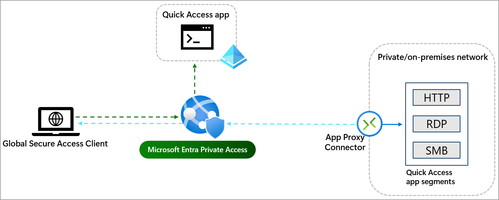
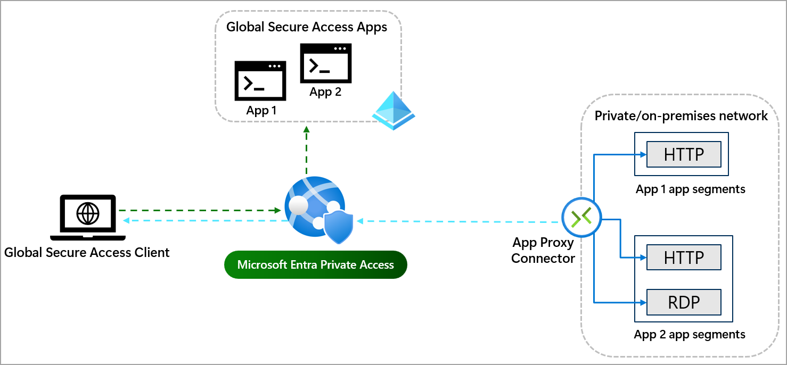

# Learn about Microsoft Entra Private Access

Microsoft Entra Private Access unlocks the ability to specify the fully qualified domain names (FQDNs) and IP addresses that you consider private or internal, so you can manage how your organization accesses them. With Private Access, you can modernize how your organization's users access private apps and resources. Remote workers don't need to use a VPN to access these resources if they have the Global Secure Access Client installed. The client quietly and seamlessly connects them to the resources they need.

Private Access provides two ways to configure the private resources that you want to tunnel through the service. You can configure Quick Access, which is the primary group of FQDNs and IP addresses that you want to secure. You can also configure a Global Secure Access app for per-app access, which allows you to specify a subset of private resources that you want to secure. The Global Secure Access app provides a granular approach to securing your private resources.

The features of Microsoft Entra Private Access provide a quick and easy way to replace your VPN to allow secure access to your internal resources with an easy-one time configuration, using the secure capabilities of Conditional Access.

## Quick Access and Global Secure Access apps

When you configure the Quick Access and Global Secure Access apps, you create a new enterprise application. The app serves as a container for the private resources that you want to secure. The application has its own [Microsoft Entra ID Application Proxy connector](how-to-configure-connectors.md) to broker the connection between the service and the internal resource. You can assign users and groups to the app, and then use Conditional Access policies to control access to the app.

Quick Access and Per-app Access are similar, but there are a few key concepts to understand so you can decide how to configure each one.

### Quick Access app

Quick Access is the primary group of FQDNs and IP addresses that you want to secure. As you're planning your Global Secure Access deployment, review your list of private resources and determine which resources you *always* want to tunnel through the service. This primary group of FQDNs, IP addresses, and IP ranges is what you add to Quick Access.

### Global Secure Access app

A Global Secure Access app could be configured if any of the following scenarios sound familiar:

- I need to apply a different set of Conditional Access policies to a subset of users.
- I have a few private resources that I want to secure, but they should have a different set of access policies.
- I have a subset of private resources that I only want to secure for a specific time frame.

The Global Secure Access app takes a more detailed approach to securing your private resources. You can create multiple per-app access apps to secure different private resources. Paired with Conditional Access policies, you have a powerful yet fine-grained way to secure your private resources.

## Next steps

- [Configure Quick Access](how-to-configure-quick-access.md)

