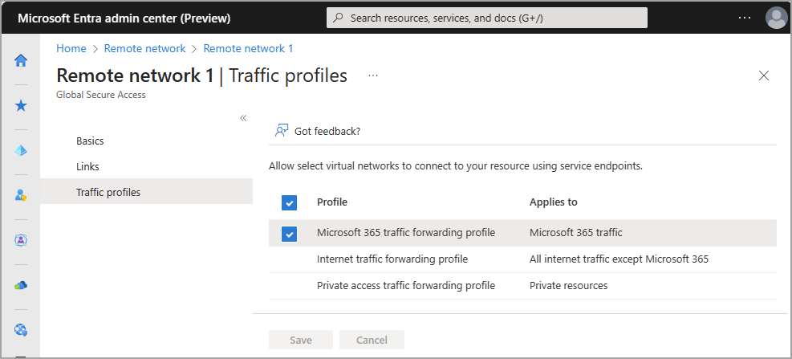
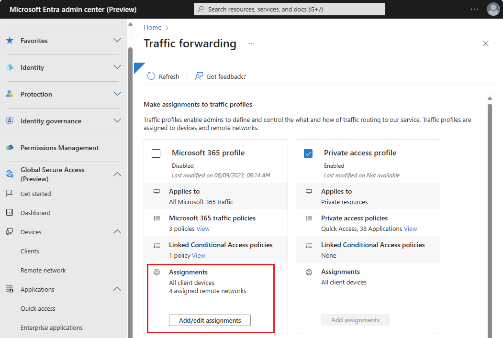

# Assign a remote network to a traffic forwarding profile for Global Secure Access (preview)

If you're tunneling your Microsoft 365 traffic through the Microsoft Entra Internet Access service, you can assign remote networks to the traffic forwarding profile. Your end users can access Microsoft 365 resources by connecting to the service from a remote network, such as a branch office location.

There are multiple ways to assign a remote network to the traffic forwarding profile:

- When you create or manage a remote network in the Microsoft Entra admin center
- When you enable or manage the traffic forwarding profile in the Microsoft Entra admin center
- Using the Microsoft Graph API

## Prerequisites 

To assign a remote network to a traffic forwarding profile to, you must have:

- A **Global Secure Access Administrator** role in Microsoft Entra ID. 
- The preview requires a Microsoft Entra ID Premium P1 license. If needed, you can [purchase licenses or get trial licenses](https://aka.ms/azureadlicense).
- To use the Microsoft 365 traffic forwarding profile, a Microsoft 365 E3 license is recommended.

### Known limitations

- At this time, remote networks can only be assigned to the Microsoft 365 traffic forwarding profile.

## Assign the Microsoft 365 traffic profile to a remote network

1. Sign in to the [Microsoft Entra admin center](https://entra.microsoft.com) as a [Global Secure Access Administrator](/azure/active-directory/roles/permissions-reference).
1. Go to **Global Secure Access (preview)** > **Devices** > **Remote network**.
1. Select a remote network. 
1. Select **Traffic profiles**. 
1. Select (or unselect) the checkbox for **Microsoft 365 traffic forwarding profile**. 
1. Select **Save**.



## Assign a remote network to the Microsoft 365 traffic forwarding profile

1. Go to **Global Secure Access** > **Connect** > **Traffic forwarding**.
1. Select the **Add/edit assignments** button for **Microsoft 365 traffic profile**. 



### Assign a traffic profile to a remote network using the Microsoft Graph API

Associating a traffic profile to your remote network using the Microsoft Graph API is two-step process. First, you need to get the traffic forwarding profile ID. This ID is unique for all tenants. With the traffic forwarding profile ID, you can assign the traffic forwarding profile with your remote network. 

A traffic forwarding profile can be assigned using Microsoft Graph on the `/beta` endpoint.
 
1. Open a web browser and navigate to the Graph Explorer at https://aka.ms/ge.
1. Select **GET** as the HTTP method from the dropdown. 
1. Select the API version to **beta**. 
1. Enter the query:
    ```
    GET https://graph.microsoft.com/beta/networkaccess/forwardingprofiles 
    ```
1. Select **Run query**. 
1. Find the ID of the desired traffic forwarding profile. 
1. Select PATCH as the HTTP method from the dropdown. 
1. Enter the query:
    ```
        PATCH https://graph.microsoft.com/beta/networkaccess/branches/d2b05c5-1e2e-4f1d-ba5a-1a678382ef16/forwardingProfiles
        {
            "@odata.context": "#$delta",
            "value":
            [{
                "ID": "1adaf535-1e31-4e14-983f-2270408162bf"
            }]
        }
    ```
1. Select **Run query** to update the branch. 

[!INCLUDE [Public preview important note](./includes/public-preview-important-note.md)]

## Next steps
- [List remote networks](how-to-list-remote-networks.md)
