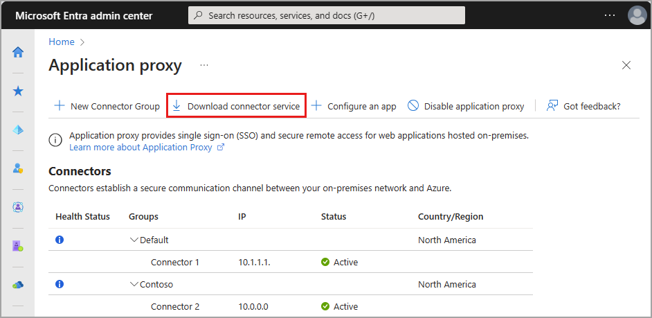
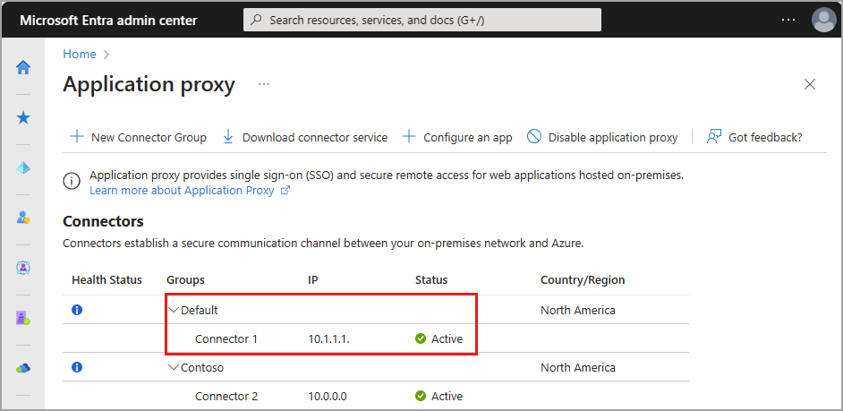

# How to configure App Proxy connectors for Microsoft Entra Private Access

Connectors are lightweight agents that sit on-premises and facilitate the outbound connection to the Global Secure Access service. Connectors must be installed on a Windows Server that has access to the backend application. You can organize connectors into connector groups, with each group handling traffic to specific applications. To learn more about connectors, see [Understand Azure AD Application Proxy connectors](/azure/active-directory/app-proxy/application-proxy-connectors).

## Prerequisites

To add an on-premises application to Azure Active Directory (Azure AD) you need:

* The preview requires a Microsoft Entra ID Premium P1 license. If needed, you can [purchase licenses or get trial licenses](https://aka.ms/azureadlicense).
* An Application Administrator account.

User identities must be synchronized from an on-premises directory or created directly within your Azure AD tenants. Identity synchronization allows Azure AD to pre-authenticate users before granting them access to App Proxy published applications and to have the necessary user identifier information to perform single sign-on (SSO).

### Windows server

To use Application Proxy, you need a Windows server running Windows Server 2012 R2 or later. You'll install the Application Proxy connector on the server. This connector server needs to connect to the Application Proxy services in Azure, and the on-premises applications that you plan to publish.

- For high availability in your environment, we recommend having more than one Windows server. 
- The minimum .NET version required for the connector is v4.7.1+.
- For more information, see [App Proxy connectors](../active-directory/app-proxy/application-proxy-connectors.md#requirements-and-deployment).
- For more information, see [Determine which .NET framework versions are installed](/dotnet/framework/migration-guide/how-to-determine-which-versions-are-installed).

### Prepare your on-premises environment

Start by enabling communication to Azure data centers to prepare your environment for Azure AD Application Proxy. If there's a firewall in the path, make sure it's open. An open firewall allows the connector to make HTTPS (TCP) requests to the Application Proxy.

> [!IMPORTANT]
> If you are installing the connector for Azure Government cloud follow the [prerequisites](/azure/active-directory/hybrid/connect/reference-connect-government-cloud#allow-access-to-urls) and [installation steps](/azure/active-directory/hybrid/connect/reference-connect-government-cloud). This requires enabling access to a different set of URLs and an additional parameter to run the installation.

#### Open ports

Open the following ports to **outbound** traffic.

| Port number | How it's used |
| ----------- | ------------------------------------------------------------ |
| 80          | Downloading certificate revocation lists (CRLs) while validating the TLS/SSL certificate |
| 443         | All outbound communication with the Application Proxy service |

If your firewall enforces traffic according to originating users, also open ports 80 and 443 for traffic from Windows services that run as a Network Service.

#### Allow access to URLs

Allow access to the following URLs:

| URL | Port | How it's used |
| --- | --- | --- |
| `*.msappproxy.net`   `*.servicebus.windows.net` | 443/HTTPS | Communication between the connector and the Application Proxy cloud service |
| `crl3.digicert.com`   `crl4.digicert.com`   `ocsp.digicert.com`   `crl.microsoft.com`   `oneocsp.microsoft.com`   `ocsp.msocsp.com`  | 80/HTTP   | The connector uses these URLs to verify certificates.        |
| `login.windows.net`   `secure.aadcdn.microsoftonline-p.com`   `*.microsoftonline.com`   `*.microsoftonline-p.com`   `*.msauth.net`   `*.msauthimages.net`   `*.msecnd.net`   `*.msftauth.net`   `*.msftauthimages.net`   `*.phonefactor.net`   `enterpriseregistration.windows.net`   `management.azure.com`   `policykeyservice.dc.ad.msft.net`   `ctldl.windowsupdate.com`   `www.microsoft.com/pkiops` | 443/HTTPS | The connector uses these URLs during the registration process. |
| `ctldl.windowsupdate.com`   `www.microsoft.com/pkiops` | 80/HTTP | The connector uses these URLs during the registration process. |

You can allow connections to `*.msappproxy.net`, `*.servicebus.windows.net`, and other URLs above if your firewall or proxy lets you configure access rules based on domain suffixes. If not, you need to allow access to the [Azure IP ranges and Service Tags - Public Cloud](https://www.microsoft.com/download/details.aspx?id=56519). The IP ranges are updated each week.

> [!IMPORTANT]
> Avoid all forms of inline inspection and termination on outbound TLS communications between Azure AD Application Proxy connectors and Azure AD Application Proxy Cloud services.

## Install and register a connector

To use Private Access, install a connector on each Windows server you're using for Microsoft Entra Private Access. The connector is an agent that manages the outbound connection from the on-premises application servers to Global Secure Access. You can install a connector on servers that also have other authentication agents installed such as Azure AD Connect.

> [!NOTE]
> Setting up App Proxy connectors and connector groups require planning and testing to ensure you have the right configuration for your organization. If you don't already have connector groups set up, pause this process and return when you have a connector group ready.
>
>The minimum version of connector required for Private Access is **1.5.3417.0**.
>Starting from the version 1.5.3437.0, having the .NET version 4.7.1 or greater is required for successful installation (upgrade). 

**To install the connector**:

1. Sign in to the **[Microsoft Entra admin center](https://entra.microsoft.com)** as a Global Administrator of the directory that uses Application Proxy.
    -  For example, if the tenant domain is contoso.com, the admin should be admin@contoso.com or any other admin alias on that domain.
1. Select your username in the upper-right corner. Verify you're signed in to a directory that uses Application Proxy. If you need to change directories, select **Switch directory** and choose a directory that uses Application Proxy.
1. Go to **Global Secure Access (Preview)** > **Connect** > **Connectors**.
1. Select **Download connector service**.

    
1. Read the Terms of Service. When you're ready, select **Accept terms & Download**.
1. At the bottom of the window, select **Run** to install the connector. An install wizard opens.
1. Follow the instructions in the wizard to install the service. When you're prompted to register the connector with the Application Proxy for your Microsoft Entra ID tenant, provide your Global Administrator credentials.
    - For Internet Explorer (IE): If IE Enhanced Security Configuration is set to On, you may not see the registration screen. To get access, follow the instructions in the error message. Make sure that Internet Explorer Enhanced Security Configuration is set to Off.

## Things to know

If you've previously installed a connector, reinstall it to get the latest version. When upgrading, uninstall the existing connector and delete any related folders. To see information about previously released versions and what changes they include, see [Application Proxy: Version Release History](/azure/active-directory/app-proxy/application-proxy-release-version-history).

If you choose to have more than one Windows server for your on-premises applications, you need to install and register the connector on each server. You can organize the connectors into connector groups. For more information, see [Connector groups](/azure/active-directory/app-proxy/application-proxy-connector-groups).

If you have installed connectors in different regions, you can optimize traffic by selecting the closest Application Proxy cloud service region to use with each connector group, see [Optimize traffic flow with Azure Active Directory Application Proxy](/azure/active-directory/app-proxy/application-proxy-network-topology).

## Verify the installation and registration

You can use the Global Secure Access portal or your Windows server to confirm that a new connector installed correctly.

### Verify the installation through the Microsoft Entra admin center

To confirm the connector installed and registered correctly:

1. Sign in to your tenant directory in the Microsoft Entra admin center.
1. Go to **Global Secure Access (Preview)** > **Connect** > **Connectors**
    - All of your connectors and connector groups appear on this page.
1. View a connector to verify its details. 
    - Expand the connector to view the details if it's not already expanded.
    - An active green label indicates that your connector can connect to the service. However, even though the label is green, a network issue could still block the connector from receiving messages.

    

For more help with installing a connector, see [Problem installing the Application Proxy Connector](/azure/active-directory/app-proxy/application-proxy-connector-installation-problem).

### Verify the installation through your Windows server

To confirm the connector installed and registered correctly:
1. Select the **Windows** key and enter `services.msc` to open the Windows Services Manager.
1. Check to see if the status for the following services **Running**.
    - *Microsoft Azure AD Application Proxy Connector* enables connectivity.
    - *Microsoft Azure AD Application Proxy Connector Updater* is an automated update service.
    - The updater checks for new versions of the connector and updates the connector as needed.

    

1. If the status for the services isn't **Running**, right-click to select each service and choose **Start**.

## Create connector groups

To create as many connector groups as you want:

1. Go to **Global Secure Access (Preview)** > **Connect** > **Connectors**.
1. Select **New connector group**. 
1. Give your new connector group a name, then use the dropdown menu to select which connectors belong in this group.
1. Select **Save**.

To learn more about connector groups, see [Publish applications on separate networks and locations using connector groups](/azure/active-directory/app-proxy/application-proxy-connector-groups).

[!INCLUDE [Public preview important note](./includes/public-preview-important-note.md)]

## Next steps

The next step for getting started with Microsoft Entra Private Access is to configure the Quick Access or Global Secure Access application:
- [Configure Quick Access to your private resources](how-to-configure-quick-access.md)
- [Configure per-app access for Microsoft Entra Private Access](how-to-configure-per-app-access.md)
