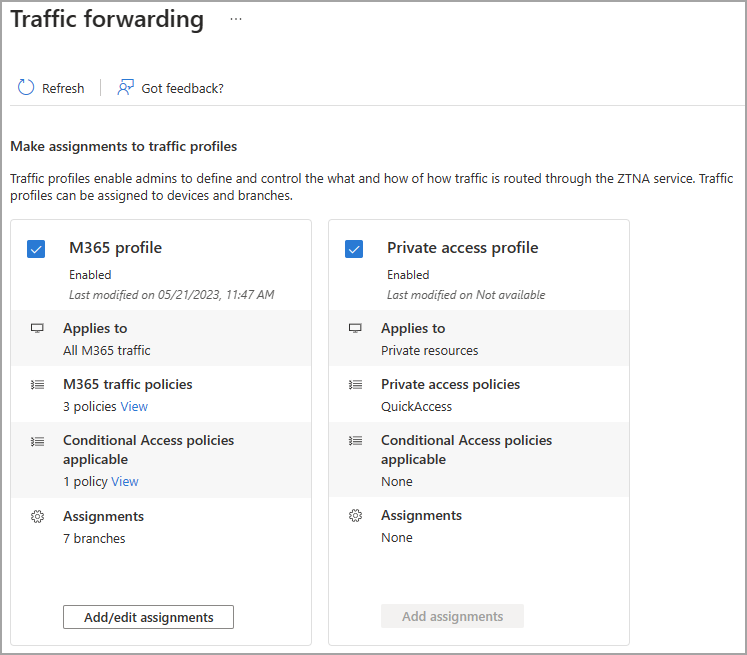

# How to configure per-app access for Global Secure Access

With Global Secure Access, you can define specific websites or IP addresses to include in the traffic for Microsoft Entra Private Access. Your organization's employees can then access the apps and sites that you specify. This article describes how to configure Quick Access for Microsoft Entra Private Access.

Microsoft Entra Private Access provides secure access to your organization's internal resources. You can specify the internal, private resources that you want to secure by configuring Quick access and by enabling per-app access through Enterprise applications. 

This article describes how to configure per-app access for Microsoft Entra Private Access.

## Prerequisites

To configure per-app access, you must have:

- A **Global Secure Access Administrator** role in Microsoft Entra ID

To manage App Proxy connector groups, which is required for per-app access, you must have:

- A Microsoft Entra ID Premium P1/P2 license
- An **Application Administrator** role in Microsoft Entra ID
- An App Proxy license

## How it works

With Quick Access and per-app access for Microsoft Entra Private Access you can specify the apps and websites that you consider private or internal. With Quick Access, you define this group of apps and websites into one app that you manage access to. With per-app access, you can package a different group of apps and websites into a separate app that you can enable or disable as needed. You can also apply separate Conditional Access policies to each of these apps for enhanced access controls.

You can include the same app or website in both your Quick Access app and in a separate app that you've configured for Microsoft Entra Private Access. The policies in place for the per-app access take priority over the policies for Quick Access.

Per-app access can be enabled and disabled at any time. This feature can be used if you need to route traffic through Global Secure Access for a specific period of time, without affecting the rest of your organization's traffic.

By configuring per-app access with Microsoft Entra Private Access, you can apply traffic forwarding profiles and assign Conditional Access policies to connect your users to the right apps using comprehensive access policies. 

## Setup overview

To configure per-app access, you need to have a [Microsoft Entra ID Application Proxy](../active-directory/app-proxy/application-proxy.md) connector group set up. This connector group handles the traffic to this new application. With Connectors, you can isolate apps per network and connector.

Per-app access is configured by creating a new Enterprise app from the Global Secure Access area of Microsoft Entra. You create the app, select a connector group, and add network access segments. These settings make up the individual app that you can assign users and groups to.

To summarize, the overall process is as follows:

1. Create an App proxy connector group, if you don't already have one.
1. Create a new enterprise app from Global Secure Access.
1. Assign users and groups to the app.
1. Enable Microsoft Entra Private Access.

Let's look at each of these steps in more detail.

## Create an App proxy connector group

Connectors are what make App proxy possible. They're simple, easy to deploy and maintain, and super powerful. To learn more about connectors, see [Understand Azure AD Application Proxy connectors](../active-directory/app-proxy/application-proxy-connectors.md).

You create App proxy connector groups so that you can assign specific connectors to serve specific applications. This capability gives you more control and ways to optimize your App proxy deployment. To learn more about connector groups, see [Publish applications on separate networks and locations using connector groups](../active-directory/app-proxy/application-proxy-connector-groups.md).

> [!IMPORTANT]
> Setting up App Proxy connectors and connector groups require planning and testing to ensure you have the right configuration for your organization. If you don't already have connector groups set up, pause this process and return when you have a connector group ready.

## Configure per-app access

To create a new app, you provide a name, select a connector group, and add websites and IP addresses. You can complete all three steps at the same time, or you can add the websites and IP addresses after the initial setup is complete. 

### Name and connector group

1. Enter a name for the app.
1. Select a Connector group from the dropdown menu.    
    - Before you can set up per-app access, you must have an App proxy connector group set up.
    - Your connector groups appear in the dropdown menu.
1. Select the **Save** button at the bottom of the page to create your app without adding websites and apps.

### Add network access segment

The **Add network access segment** portion of this process is where you define the private or internal websites and apps that you want to include in the traffic for Microsoft Entra Private Access. You can add sites when you create the app and return to add more or edit them later.

You can add fully qualified domain names (FQDN), IP addresses, and IP address ranges.

1. Go to **Global Secure Access** > **Applications** > **Enterprise applications**.
1. Select **New application**.
1. Select **Add network access segment**.
1. In the **Create application segment** panel that opens, select a **Destination type**. Choose from one of the following options. Depending on what you select, the subsequent fields change accordingly.
    - IP address
    - Fully qualified domain name
    - IP address range (CIDR)
    - IP address range (IP to IP). 
1. Enter the appropriate detail for what you selected.
1. Enter the port. 

1. Continue adding websites and apps as needed. You can add up to 500 websites and apps.

1. Select the **Save** button when you're finished.

## Manage app properties

After you create the new app, you can view and manage the details from **Enterprise applications**. You can also navigate to **Enterprise applications** and search for your app.

1. Go to **Global Secure Access** > **Applications** > **Enterprise applications**.
1. Search for and select your application.

### Assign users and groups

You need to grant access to the app you created by assigning users and/or groups to the app. For more information, see [Assign users and groups to an application.](../active-directory/manage-apps/assign-user-or-group-access-portal.md).

> [!IMPORTANT]
> The **Enabled for users to sign-in?** option is set to **Yes** and must remain set this way. Changing this setting to No means users will not be able to access the sites and apps through Entra Private Access.

1. Go to **Global Secure Access** > **Applications** > **Enterprise applications**.
1. Search for and select your application.
1. Select **Users and groups** from the side menu.
1. Add users and groups as needed.

### Manage network access segments

You can add or update the sites and apps included in your app at any time.

1. Go to **Global Secure Access**> **Enterprise applications**.
1. Search for and select your application.
1. Select **Network access properties** from the side menu.
1. To add a new site or app, select **Add  network access segment**.
1. To edit an existing app, select it from the **Destination type** column.

### Enable or disable access with the Global Secure Access client

For per-app access, you can enable or disable access to the app using the Global Secure Access client. This option is selected by default, but can be changed to not include the network access segments in the Private access traffic forwarding profile. 

## Enable Microsoft Entra Private Access

Once you have your app configured, your private websites and apps added, users assigned to the app, you can enable the Private access traffic forwarding profile. You can enable the profile before configuring Quick Access, but without the app and profile configured, there's no traffic to forward.

1. Go to **Global Secure Access** > **Traffic forwarding**.
1. Select the checkbox for **Private access profile**.

## Next steps

- [Manage the private access traffic management profile](how-to-manage-private-access-profile.md)
- [Learn about traffic management profiles](concept-traffic-forwarding.md)
