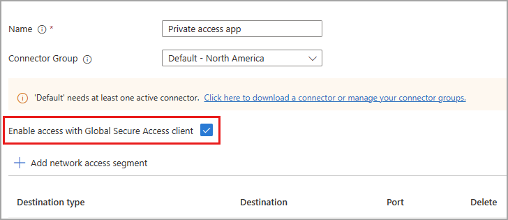

# How to configure per-app access for Global Secure Access

With Global Secure Access, you can define specific fully qualified domain names (FQDNs) or IP addresses to include in the traffic for Microsoft Entra Private Access. Your organization's employees can then access the apps and sites that you specify. This article describes how to configure per-app access for Microsoft Entra Private Access.

Microsoft Entra Private Access provides secure access to your organization's internal resources. You can specify the internal, private resources that you want to secure by configuring and enabling per-app access through Enterprise applications. 

This article describes how to configure per-app access for Microsoft Entra Private Access.

## Prerequisites

To configure per-app access, you must have:

- A **Global Administrator** role in Microsoft Entra ID

To manage App Proxy connector groups, which is required for per-app access, you must have:

- A Microsoft Entra ID Premium P1/P2 license
- An **Application Administrator** role in Microsoft Entra ID

## Setup overview

To configure per-app access, you need to have a connector group with at least one active [Microsoft Entra ID Application Proxy](../active-directory/app-proxy/application-proxy.md) connector. This connector group handles the traffic to this new application. With Connectors, you can isolate apps per network and connector.

Per-app access is configured by creating a new Enterprise app from the Global Secure Access area of Microsoft Entra. You create the app, select a connector group, and add network access segments. These settings make up the individual app that you can assign users and groups to.

To summarize, the overall process is as follows:

1. Create an App Proxy connector group, if you don't already have one.
1. Create a new enterprise app from Global Secure Access.
1. Assign users and groups to the app.
1. Configure Conditional Access policies.
1. Enable Microsoft Entra Private Access.

Let's look at each of these steps in more detail.

## Create an App Proxy connector group

To configure Quick Access, you must have a connector group with at least one active App Proxy connector.

If you don't already have a connector set up, see [Configure connectors for Quick Access](how-to-configure-quick-access.md).

## Configure per-app access

To create a new app, you provide a name, select a connector group, and add FQDNs and IP addresses. You can complete all three steps at the same time, or you can add them after the initial setup is complete. 

### Name and connector group

1. Sign in to the **[Microsoft Entra admin center](https://entra.microsoft.com)** as a Global Administrator. 
1. Go to **Global Secure Access (preview)** > **Applications** > **Enterprise applications**.
1. Select **New application**.
1. Enter a name for the app.
1. Select a Connector group from the dropdown menu.    
    - Before you can set up per-app access, you must have a connector group with at least one active App Proxy connector.
    - Your connector groups appear in the dropdown menu.
1. Select the **Save** button at the bottom of the page to create your app without adding private resources.

### Add network access segment

The **Add network access segment** portion of this process is where you define the FQDNs and IP addresses that you want to include in the traffic for Microsoft Entra Private Access. You can add sites when you create the app and return to add more or edit them later.

You can add fully qualified domain names (FQDN), IP addresses, and IP address ranges.

1. Sign in to the **[Microsoft Entra admin center](https://entra.microsoft.com)**.
1. Go to **Global Secure Access** > **Applications** > **Enterprise applications**.
1. Select **New application**.
1. Select **Add network access segment**.
1. In the **Create application segment** panel that opens, select a **Destination type**. Choose from one of the following options. Depending on what you select, the subsequent fields change accordingly.
    - IP address
    - Fully qualified domain name
    - IP address range (CIDR)
    - IP address range (IP to IP). 
1. Enter the appropriate detail for what you selected.
1. Enter the port. 

1. Continue adding as needed. You can add up to 500 network segments.

1. Select the **Save** button when you're finished.

## Manage app properties

After you create the new app, you can view and manage the details from **Enterprise applications**. You can also navigate to **Enterprise applications** and search for your app.

1. Sign in to the **[Microsoft Entra admin center](https://entra.microsoft.com)**.
1. Go to **Global Secure Access** > **Applications** > **Enterprise applications**.
1. Search for and select your application.

### Assign users and groups

You need to grant access to the app you created by assigning users and/or groups to the app. For more information, see [Assign users and groups to an application.](../active-directory/manage-apps/assign-user-or-group-access-portal.md)

1. Sign in to the **[Microsoft Entra admin center](https://entra.microsoft.com)**.
1. Go to **Global Secure Access** > **Applications** > **Enterprise applications**.
1. Search for and select your application.
1. Select **Users and groups** from the side menu.
1. Add users and groups as needed.

### Manage network access segments

You can add or update the sites and apps included in your app at any time.

1. Sign in to the **[Microsoft Entra admin center](https://entra.microsoft.com)**.
1. Go to **Global Secure Access**> **Enterprise applications**.
1. Search for and select your application.
1. Select **Network access properties** from the side menu.
1. To add a new site or app, select **Add  network access segment**.
1. To edit an existing app, select it from the **Destination type** column.

### Enable or disable access with the Global Secure Access Client

For per-app access, you can enable or disable access to the app using the Global Secure Access Client. This option is selected by default, but can be changed to not include the network access segments in the Private access traffic forwarding profile. 

### Assign Conditional Access policies

Conditional Access policies for per-app access are configured at the application level for each app. Conditional Access policies are created and applied to the application in the **Protection** area of Microsoft Entra ID. For more information, see [Quick access Conditional Access policies](how-to-configure-quick-access.md#linked-conditional-access-policies).

## Enable Microsoft Entra Private Access

Once you have your app configured, your private resources added, users assigned to the app, you can enable the Private access traffic forwarding profile. You can enable the profile before configuring Quick Access, but without the app and profile configured, there's no traffic to forward.

1. Sign in to the **[Microsoft Entra admin center](https://entra.microsoft.com)**.
1. Go to **Global Secure Access** > **Traffic forwarding**.
1. Select the checkbox for **Private access profile**.

[!INCLUDE [Public preview important note](./includes/public-preview-important-note.md)]

## Next steps

- [Manage the private access traffic management profile](how-to-manage-private-access-profile.md)
- [Learn about traffic management profiles](concept-traffic-forwarding.md)
