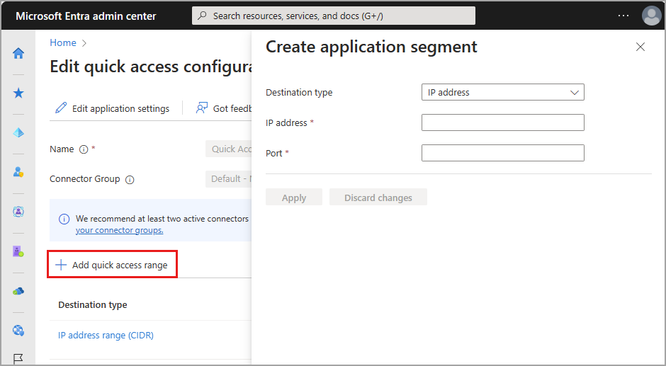

# How to configure Quick Access for Global Secure Access

With Global Secure Access, you can define specific fully qualified domain names (FQDNs) or IP addresses of private resources to include in the traffic for Microsoft Entra Private Access. Your organization's employees can then access the apps and sites that you specify. This article describes how to configure Quick Access for Microsoft Entra Private Access.

## Prerequisites

To configure Quick Access, you must have:

- A **Global Administrator** role in Microsoft Entra ID
- A connector group with at least one active App Proxy connector

To manage App Proxy connector groups, which is required for Quick Access, you must have:

- An **Application Administrator** role in Microsoft Entra ID
- A Microsoft Entra ID Premium P1/P2 license

### Known limitations

- Avoid overlapping app segments between Quick Access and per-app access.
- Tunneling traffic to Private Access destinations by IP address is supported only for IP ranges outside of the end-user device local subnet. 

## How it works <!---Remove how it works and setup overview and put in own article at some point--->

Quick Access for Microsoft Entra Private Access unlocks the ability to specify the FQDNs and IP addresses that you consider private or internal, so you can manage how your organization accesses them.

By configuring Quick Access and enabling Microsoft Entra Private Access, you can modernize how your organization's users access private apps and resources. Remote workers don't need to use a VPN to access these resources if they have the Global Secure Access Client installed. The client quietly and seamlessly connects them to the resources they need.

Quick Access can be a quick and easy way to replace your VPN to allow secure access to your internal resources with an easy-one time configuration, using the secure capabilities of Conditional Access.

## Setup overview

Configuring your Quick Access settings is a major component to utilizing Microsoft Entra Private Access. When you configure Quick Access for the first time, Microsoft Entra Private Access creates a new enterprise application. The properties of this new app are automatically configured to work with Microsoft Entra Private Access. 

To configure Quick Access, you also need to have a connector group with at least one active [Microsoft Entra ID Application Proxy](../active-directory/app-proxy/application-proxy.md) connector. This connector group handles the traffic to this new application. With Connectors, you can isolate apps per network and connector. Once you have Quick Access and an App proxy connector group configured, you need to grant access to the app. As mentioned, the properties of the Quick Access app are automatically configured.

To summarize, the overall process is as follows:

1. Create a connector group with at least one active App Proxy connector, if you don't already have one.
1. Configure Quick Access, which creates a new enterprise app.
1. Assign users and groups to the app.
1. Configure Conditional Access policies.
1. Enable the Private access traffic forwarding profile.

Let's look at each of these steps in more detail.

## Create an App Proxy connector group

To configure Quick Access, you must have a connector group with at least one active App Proxy connector.

If you don't already have a connector group set up, see [Configure connectors for Quick Access](how-to-configure-connectors.md).

## Configure Quick Access

On the Quick Access page, you provide a name for the Quick Access app, select a connector group, and add FQDNs and IP addresses. You can complete all three steps at the same time, or you can add the network segments after the initial setup is complete. 

### Name and connector group

1. Sign in to the **[Microsoft Entra admin center](https://entra.microsoft.com)** as a Global Administrator. 
1. Go to **Global Secure Access (preview)** > **Applications** > **Quick access**.
1. Enter a name. *We recommend using the name Quick Access*. 
1. Select a Connector group from the dropdown menu.

    
    
    - Before you can set up Quick Access, you must have a connector group with at least one active App Proxy connector configured.
    - Your connector groups appear in the dropdown menu.
1. Select the **Save** button at the bottom of the page to create your "Quick Access" app without FQDNs and IP addresses.

### Add Quick access range

The **Add Quick access range** portion of this process is where you define the FQDNs and IP addresses that you want to include in the traffic for Microsoft Entra Private Access. You can add these resources when you create the Quick Access app and return to add more or edit them later.

You can add fully qualified domain names (FQDN), IP addresses, and IP address ranges.

1. Sign in to the **[Microsoft Entra admin center](https://entra.microsoft.com)**.
1. Go to **Global Secure Access** > **Applications** > **Quick Access**.
1. Select **Add quick access range**.
1. In the **Create application segment** panel that opens, select a **Destination type**. Choose from one of the following options. Depending on what you select, the subsequent fields change accordingly.
    - IP address
    - Fully qualified domain name
    - IP address range (CIDR)
    - IP address range (IP to IP). 
1. Enter the appropriate detail for what you selected.
1. Enter the port. 

1. Continue adding as needed. You can add up to 500 app segments.

1. Select the **Save** button when you're finished.

## Manage Quick Access properties

When you configure Quick Access, a new enterprise app is created on your behalf. You can view the properties from **Quick Access** or navigate to **Enterprise applications** and search for your Quick Access app.

1. Select the **Edit application settings** button from Quick Access. 
1. Select **Properties** from the side menu.

### Assign users and groups

You need to grant access to the Quick Access app you created by assigning users and/or groups to the app. 

If you're viewing the Quick Access app properties, select **Users and groups** from the side menu. Otherwise you can go to **Enterprise applications**, search for and select your application, then select **Users and groups** from the side menu.

Add users and groups following the instructions in the [Assign users and groups to an application](../active-directory/manage-apps/assign-user-or-group-access-portal.md) article.

Alternatively, you can assign users and groups when you create the Conditional Access policy for Quick Access. For more information, see [Quick access Conditional Access policies](how-to-configure-quick-access.md#linked-conditional-access-policies).

### Update Quick access ranges

You can add or update the sites and apps included in your Quick Access app at any time.

1. Sign in to the **[Microsoft Entra admin center](https://entra.microsoft.com)**.
1. Go to **Global Secure Access** > **Applications** > **Quick Access**.
    - To add an FQDN or IP address, select **Add quick access range**.
    - To edit an FQDN or IP address, select it from the **Destination type** column.

## Linked Conditional Access policies

Conditional Access policies can be applied to your Quick Access and Global Secure Access applications. Applying Conditional Access policies provides more options for managing access to applications, sites, and services.

Conditional Access policies are created and applied to the Quick Access application in the **Protection** area of Microsoft Entra ID. For more information, see [Building a Conditional Access policy](../active-directory/conditional-access/concept-conditional-access-policies.md).

The following example creates a Conditional Access policy requiring multifactor authentication for your quick access applications.

1. Sign in to the **[Microsoft Entra admin center](https://entra.microsoft.com)** as a Conditional Access Administrator or Security Administrator.
1. Browse to **Microsoft Entra ID** > **Protection** > **Conditional Access**.
1. Select **Create new policy**.
1. Give your policy a name. We recommend that organizations create a meaningful standard for the names of their policies.
1. Under **Assignments**, select **Users or workload identities**.
   1. Under **Include**, select **All users**.
   1. Under **Exclude**, select **Users and groups** and choose your organization's emergency access or break-glass accounts. 
1. Under **Target resources** > **Include**, and select **Select apps**.
   1. Choose your configured quick access application.
1. Under **Access controls** > **Grant**
   1. Select **Grant access**, **Require multifactor authentication**, and select **Select**.
1. Confirm your settings and set **Enable policy** to **Report-only**.
1. Select **Create** to create to enable your policy.

After administrators confirm the policy settings using [report-only mode](../active-directory/conditional-access/howto-conditional-access-insights-reporting.md), an administrator can move the **Enable policy** toggle from **Report-only** to **On**.

## Enable Microsoft Entra Private Access

Once you have your Quick Access app configured, your private resources added, users assigned to the app, you can enable the Private access profile from the **Traffic forwarding** area of Global Secure Access. You can enable the profile before configuring Quick Access, but without the app and profile configured, there's no traffic to forward.

1. Sign in to the **[Microsoft Entra admin center](https://entra.microsoft.com)**.
1. Go to **Global Secure Access** > **Connect** > **Traffic forwarding**.
1. Select the checkbox for **Private access profile**.

[!INCLUDE [Public preview important note](./includes/public-preview-important-note.md)]

## Next steps

- [Configure per-app access](how-to-configure-per-app-access.md)
- [Manage the private access traffic management profile](how-to-manage-private-access-profile.md)
- [Learn about traffic management profiles](concept-traffic-forwarding.md)
