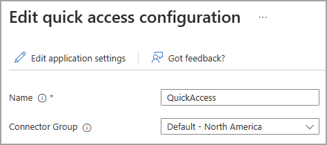
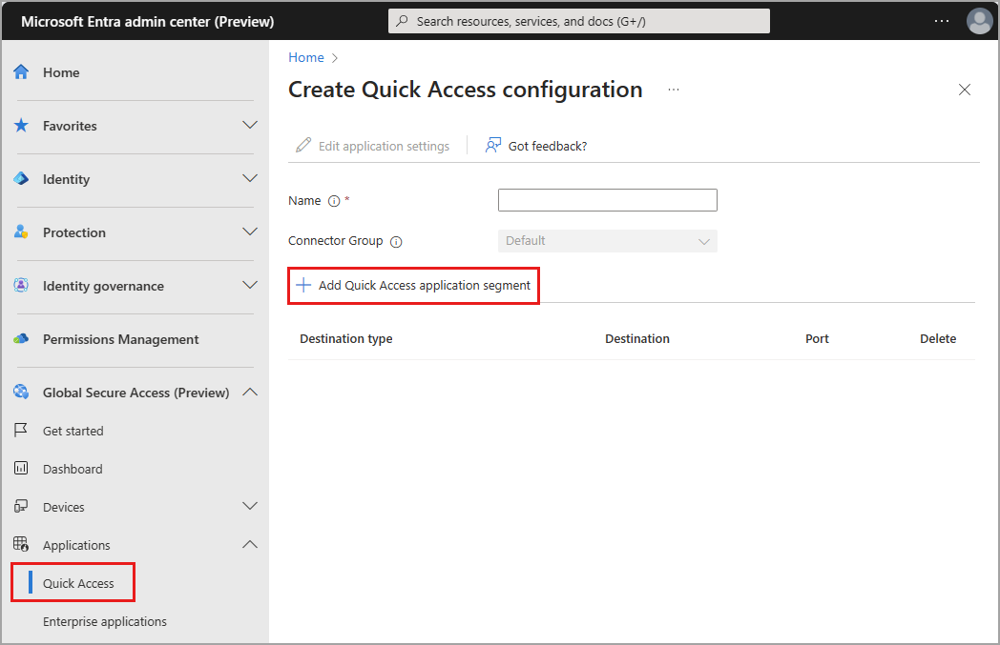
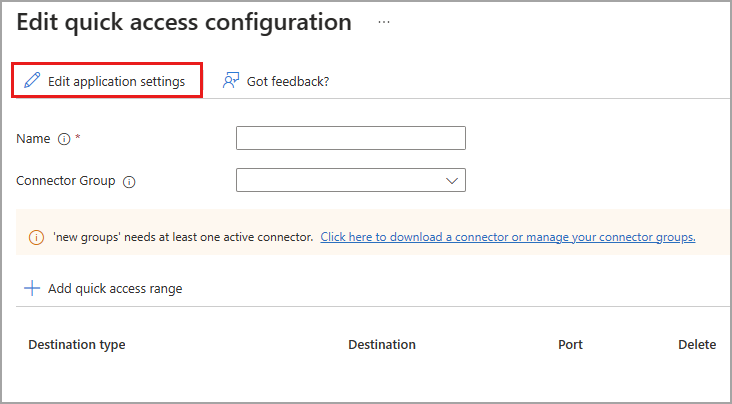
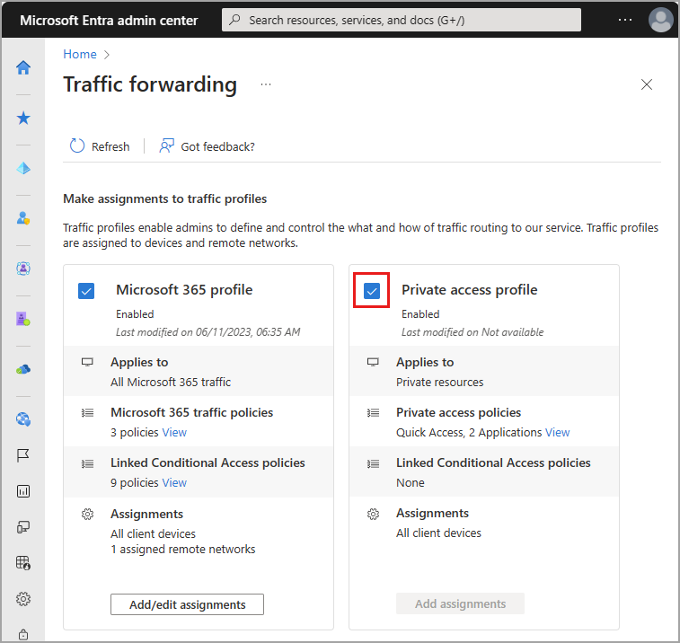

# How to configure Quick Access for Global Secure Access

With Global Secure Access, you can define specific fully qualified domain names (FQDNs) or IP addresses of private resources to include in the traffic for Microsoft Entra Private Access. Your organization's employees can then access the apps and sites that you specify. This article describes how to configure Quick Access for Microsoft Entra Private Access.

## Prerequisites

To configure Quick Access, you must have:

- The **Global Secure Access Administrator** and **Application Administrator** roles in Microsoft Entra ID
- The preview requires a Microsoft Entra ID Premium P1 license. If needed, you can [purchase licenses or get trial licenses](https://aka.ms/azureadlicense).

To manage App Proxy connector groups, which is required for Quick Access, you must have:

- An **Application Administrator** role in Microsoft Entra ID
- An Azure AD Premium P1/P2 license

### Known limitations

- Avoid overlapping app segments between Quick Access and per-app access.
- Tunneling traffic to Private Access destinations by IP address is supported only for IP ranges outside of the end-user device local subnet. 
- At this time, Private access traffic can only be acquired with the Global Secure Access Client. Remote networks can't be assigned to the Private access traffic forwarding profile.

## Setup overview

Configuring your Quick Access settings is a major component to utilizing Microsoft Entra Private Access. When you configure Quick Access for the first time, Private Access creates a new enterprise application. The properties of this new app are automatically configured to work with Private Access. 

To configure Quick Access, you need to have a connector group with at least one active [Microsoft Entra ID Application Proxy](/azure/active-directory/app-proxy/application-proxy) connector. The connector group handles the traffic to this new application. Once you have Quick Access and an App proxy connector group configured, you need to grant access to the app.

To summarize, the overall process is as follows:

1. Create a connector group with at least one active App Proxy connector, if you don't already have one. If you already have a connector group, make sure you're on the latest version.
1. Configure Quick Access, which creates a new enterprise app.
1. Assign users and groups to the app.
1. Configure Conditional Access policies.
1. Enable the Private access traffic forwarding profile.

Let's look at each of these steps in more detail.

## Create an App Proxy connector group

To configure Quick Access, you must have a connector group with at least one active App Proxy connector.

If you don't already have a connector group set up, see [Configure connectors for Quick Access](how-to-configure-connectors.md).

> [!NOTE]
> If you've previously installed a connector, reinstall it to get the latest version. When upgrading, uninstall the existing connector and delete any related folders.
>
> The minimum version of connector required for Private Access is **1.5.3417.0**.

## Configure Quick Access

On the Quick Access page, you provide a name for the Quick Access app, select a connector group, and add application segments, which include FQDNs and IP addresses. You can complete all three steps at the same time, or you can add the application segments after the initial setup is complete. 

### Name and connector group

1. Sign in to the **[Microsoft Entra admin center](https://entra.microsoft.com)** with the appropriate roles. 
1. Go to **Global Secure Access (preview)** > **Applications** > **Quick access**.
1. Enter a name. *We recommend using the name Quick Access*. 
1. Select a Connector group from the dropdown menu.

    
    
    - Existing connector groups appear in the dropdown menu.
1. Select the **Save** button at the bottom of the page to create your "Quick Access" app without FQDNs and IP addresses.

### Add Quick Access application segment

The **Add Quick Access application segment** portion of this process is where you define the FQDNs and IP addresses that you want to include in the traffic for Microsoft Entra Private Access. You can add these resources when you create the Quick Access app and return to add more or edit them later.

You can add fully qualified domain names (FQDN), IP addresses, and IP address ranges.

1. Sign in to the **[Microsoft Entra admin center](https://entra.microsoft.com)**.
1. Go to **Global Secure Access** > **Applications** > **Quick Access**.
1. Select **Add Quick Access application segment**.

    

1. In the **Create application segment** panel that opens, select a **Destination type**. Choose from one of the following options. Depending on what you select, the subsequent fields change accordingly.
    - **IP address**: Internet Protocol version 4 (IPv4) address, such as 192.0.2.1, that identifies a device on the network.
    - **Fully qualified domain name** (including wildcard FQDNs): Domain name that specifies the exact location of a computer or a host in the Domain Name System (DNS).
    - **IP address range (CIDR)**: Classless Inter-Domain Routing is a way of representing a range of IP addresses in which an IP address is followed by a suffix indicating the number of network bits in the subnet mask. For example 192.0.2.0/24 indicates that the first 24 bits of the IP address represent the network address, while the remaining 8 bits represents the host address.
    - **IP address range (IP to IP)**: Range of IP addresses from start IP (such as 192.0.2.1) to end IP (such as 192.0.2.10). 
1. Enter the appropriate detail for what you selected.
1. Enter the port. The following table provides the most commonly used ports and their associated networking protocols:
    
    | Port | Protocol | 
    | -- | -- |
    | 22 | Secure Shell (SSH) |
    | 80 | Hypertext Transfer Protocol (HTTP) |
    | 443 | Hypertext Transfer Protocol Secure (HTTPS) |
    | 445 | Server Message Block (SMB) file sharing |
    | 3389 | Remote Desktop Protocol (RDP) |

1. Select the **Save** button when you're finished.

> [!NOTE]
> You can add up to 500 application segments to your Quick Access app.
>
> Do not overlap FQDNs, IP addresses, and IP ranges between your Quick Access app and any Private Access apps.

## Assign users and groups

When you configure Quick Access, a new enterprise app is created on your behalf. You need to grant access to the Quick Access app you created by assigning users and/or groups to the app. 

You can view the properties from **Quick Access** or navigate to **Enterprise applications** and search for your Quick Access app.

1. Select the **Edit application settings** button from Quick Access. 

    

1. Select **Users and groups** from the side menu.

1. Add users and groups as needed.
    - For more information, see [Assign users and groups to an application](/azure/active-directory/manage-apps/assign-user-or-group-access-portal).

> [!NOTE]
> Users must be directly assigned to the app or to the group assigned to the app. Nested groups are not supported.

## Update Quick Access application segments

You can add or update the FQDNs and IP addresses included in your Quick Access app at any time.

1. Sign in to the **[Microsoft Entra admin center](https://entra.microsoft.com)**.
1. Go to **Global Secure Access** > **Applications** > **Quick Access**.
    - To add an FQDN or IP address, select **Add Quick Access application segment**.
    - To edit an FQDN or IP address, select it from the **Destination type** column.

## Link Conditional Access policies

Conditional Access policies can be applied to your Quick Access app. Applying Conditional Access policies provides more options for managing access to applications, sites, and services.

Creating a Conditional Access policy is covered in detail in [How to create a Conditional Access policy for Private Access apps](how-to-target-resource-private-access-apps.md).

## Enable Microsoft Entra Private Access

Once you have your Quick Access app configured, your private resources added, users assigned to the app, you can enable the Private access profile from the **Traffic forwarding** area of Global Secure Access. You can enable the profile before configuring Quick Access, but without the app and profile configured, there's no traffic to forward.

1. Sign in to the **[Microsoft Entra admin center](https://entra.microsoft.com)**.
1. Go to **Global Secure Access** > **Connect** > **Traffic forwarding**.
1. Select the checkbox for **Private access profile**.

[!INCLUDE [Public preview important note](./includes/public-preview-important-note.md)]

## Next steps

The next step for getting started with Microsoft Entra Private Access is to [enable the Private Access traffic forwarding profile](how-to-manage-private-access-profile.md).

For more information about Private Access, see the following articles:
- [Learn about traffic profiles](concept-traffic-forwarding.md)
- [Configure per-app access](how-to-configure-per-app-access.md)

