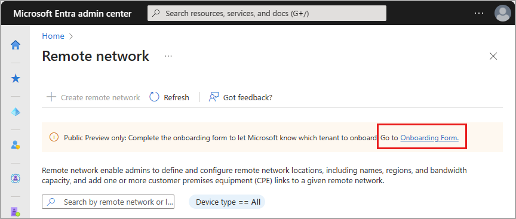
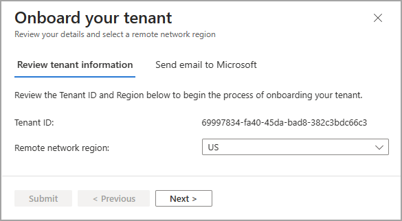
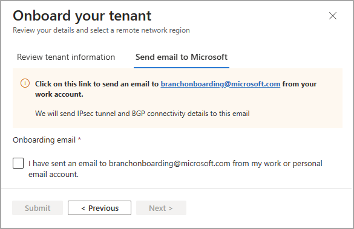
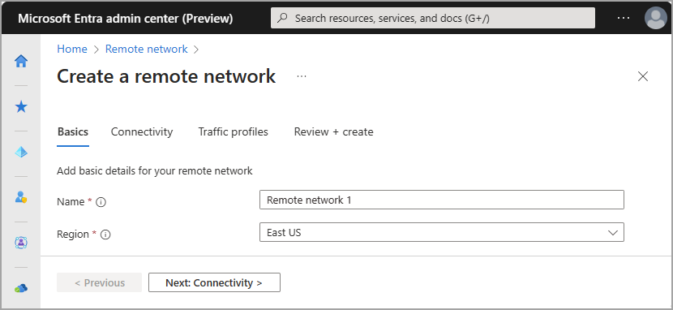

# How to create a remote network

Remote networks are remote locations, such as a branch office, or networks that require internet connectivity. Setting up remote networks connects your users in remote locations to Global Secure Access (preview). Once a remote network is configured, you can assign a traffic forwarding profile to manage your corporate network traffic. Global Secure Access provides remote network connectivity so you can apply network security policies to your outbound traffic. 

There are multiple ways to connect remote networks to Global Secure Access. In a nutshell, you're creating an Internet Protocol Security (IPSec) tunnel between a core router at your remote network and the nearest Global Secure Access endpoint. All internet-bound traffic is routed through the core router of the remote network for security policy evaluation in the cloud. Installation of a client isn't required on individual devices.

This article explains how to create a remote network for Global Secure Access (preview).

## Prerequisites

To configure remote networks, you must have: 

- A **Global Secure Access Administrator** role in Microsoft Entra ID
- Completed the [onboarding process](#onboard-your-tenant-for-remote-networks) for remote networks
- The preview requires a Microsoft Entra ID Premium P1 license. If needed, you can [purchase licenses or get trial licenses](https://aka.ms/azureadlicense).
- To use the Microsoft 365 traffic forwarding profile, a Microsoft 365 E3 license is recommended.
- Review the valid configurations for setting up remote networks here - [Global Secure Access remote network configurations](reference-remote-network-configurations.md)

### Known limitations

- At this time, the number of remote networks per tenant is limited to 10, and the number of device links per remote network is limited to four.
- Customer premises equipment (CPE) devices must support the following protocols:
    - Internet Protocol Security (IPSec)
    - Internet Key Exchange Version 2 (IKEv2)
    - Border Gateway Protocol (BGP)
- Remote network connectivity solution uses *RouteBased* and *Responder* modes.
- Microsoft 365 traffic can be accessed through remote network connectivity without the Global Secure Access Client; however the Conditional Access policy isn't enforced. In other words, Conditional Access policies for the Global Secure Access Microsoft 365 traffic are only enforced when a user has the Global Secure Access Client.

## Onboard your tenant for remote networks

Before you can set up remote networks, you need to onboard your tenant information with Microsoft. This one-time process enables your tenant to use remote network connectivity.

1. Sign in to the **[Microsoft Entra admin center](https://entra.microsoft.com)** as a Global Secure Access Administrator. 
1. Go to **Global Secure Access (preview)** > **Devices** > **Remote network**.
1. Select the link to the **Onboarding form** in the message at the top of the page.

    

1. In the window that opens, review the Tenant ID and remote network region details.
1. Select the **Next** button.
    
    

1. Select the email address link. It sends a predrafted email in your default mail client on your device. Send that email to the Global Secure Access team. Once your tenant is processed - which may take up to seven business days - we'll send IPsec tunnel and BDG connectivity details to the email you used.

    

1. Once the email step is complete, return to this form, select the acknowledgment checkbox, and select the **Submit** button.

You MUST complete the email step before selecting the checkbox. 

## Create a remote network

You can create a remote network in the Microsoft Entra admin center or through the Microsoft Graph API.

# [Microsoft Entra admin center](#tab/microsoft-entra-admin-center) 

Remote networks are configured on three tabs. You must complete each tab in order. After completing the tab either select the next tab from the top of the page, or select the **Next** button at the bottom of the page.

### Basics
The first step is to provide the name and location of your remote network. Completing this tab is required.

1. Sign in to the **[Microsoft Entra admin center](https://entra.microsoft.com)** as a Global Secure Access Administrator. 
1. Go to **Global Secure Access (preview)** > **Devices** > **Remote network**.
1. Select the **Create remote network** button and provide the following details:
    - **Name**
    - **Region**
1. Select the **Next** button.

    

### Connectivity

The connectivity tab is where you add the device links for the remote network. You need to provide the device type, IP address, border gateway protocol (BGP) address, and autonomous system number (ASN) for each device link. You can also add device links after creating the remote network.

This process is covered in detail in the [How to manage remote network device links](how-to-manage-remote-network-device-links.md).


### Traffic forwarding profiles

You can assign the remote network to a traffic forwarding profile when you create the remote network. You can also assign the remote network at a later time. For more information, see [Traffic forwarding profiles](concept-traffic-forwarding.md).

1. Either select the **Next** button or select the **Traffic profiles** tab.
1. Select the appropriate traffic forwarding profile.
1. Select the **Review + Create** button.

### Review and create

The final tab in the process is to review all of the settings that you provided. Review the details provided here and select the **Create remote network** button.

# [Microsoft Graph API](#tab/microsoft-graph-api) 

Global Secure Access remote networks can be viewed and managed using Microsoft Graph on the `/beta` endpoint. Creating a remote network and assigning a traffic forwarding profile are separate API calls.

1. Sign in to [Graph Explorer](https://aka.ms/ge).
1. Select POST as the HTTP method. 
1. Select BETA as the API version. 
1. Add the following query to use Create Branches API 
    ```
    POST https://graph.microsoft.com/beta/networkaccess/connectivity/branches 
    { 
        "name": "ContosoBranch", 
        "region": "East US", 
        "deviceLinks": [ 
        { 
            "name": "CPE Link 1", 
            "ipAddress": "20.125.118.219", 
            "deviceVendor": "Other", 
            "bgpConfiguration": { 
                "localIpAddress": "172.16.11.5",
                "peerIpAddress": "10.16.11.5", 
                "asn": 8888 
              },
            "redundancyConfiguration": {
                "redundancyTier": "noRedundancy",
                "zoneLocalIpAddress": "1.2.1.1"
            },
            "bandwidthCapacityInMbps": "mbps250"
            "tunnelConfiguration": { 
                  "@odata.type": "#microsoft.graph.networkaccess.tunnelConfigurationIKEv2Default", 
                  "preSharedKey": "Detective5OutgrowDiligence" 
              } 
        }] 
    }  
    ```

1. Select **Run query** to create a remote network.

### Assign a traffic forwarding profile

Associating a traffic forwarding profile to your remote network using the Microsoft Graph API is two step process. First, locate the ID of the traffic profile. The ID is different for all tenants. Second, associate the traffic forwarding profile with your desired remote network.

1. Sign in to [Graph Explorer](https://aka.ms/ge).
1. Select **PATCH** as the HTTP method from the dropdown. 
1. Select the API version to **beta**. 
1. Enter the query:
    ```
    GET https://graph.microsoft.com/beta/networkaccess/forwardingprofiles 
    ```
1. Select **Run query**. 
1. Find the ID of the desired traffic forwarding profile. 
1. Select PATCH as the HTTP method from the dropdown. 
1. Enter the query:
    ```
        PATCH https://graph.microsoft.com/beta/networkaccess/connectivity/branches/d2b05c5-1e2e-4f1d-ba5a-1a678382ef16/forwardingProfiles
        {
            "@odata.context": "#$delta",
            "value":
            [{
                "ID": "1adaf535-1e31-4e14-983f-2270408162bf"
            }]
        }
    ```

1. Select **Run query** to update the remote network.
---

## Verify your remote network configurations

There are a few things to consider and verify when creating remote networks. You may need to double-check some settings.

- **Verify IKE crypto profile**: The crypto profile (IKE phase 1 and phase 2 algorithms) set for a device link should match what has been set on the CPE. If you chose the **default IKE policy**, ensure that your CPE is set up with the crypto profile specified in the [Remote network configurations](reference-remote-network-configurations.md) reference article.

- **Verify pre-shared key**: Compare the pre-shared key (PSK) you specified when creating the device link in Microsoft Global Secure Access with the PSK you specified on your CPE. This detail is added on the **Security** tab during the **Add a link** process. For more information, see [How to manage remote network device links.](how-to-manage-remote-network-device-links.md#add-a-device-link-using-the-microsoft-entra-admin-center).

- **Verify local and peer BGP IP addresses**: The public IP addresses and BGP addresses specified while creating a device link in Microsoft Global Secure Access should match what you specified when configuring the CPE. 
    - The local and peer BGP addresses are reversed between the CPE and what is entered in Global Secure Access.
        - **CPE**: Local BGP IP address = IP1, Peer BGP IP address = IP2
        - **Global Secure Access**: Local BGP IP address = IP2, Peer BGP IP address = IP1
    - Choose an IP address for Global Secure Access that doesn't overlap with your on-premises network.
    - The same rule applies to ASNs.

- **Verify ASN**: Global Secure Access uses BGP to advertise routes between two autonomous systems: your network and Microsoft's. These autonomous systems should have different ASNs.
    - When creating a remote network in the Microsoft Entra admin center, use your network's ASN.
    - When configuring your CPE, use Microsoft's ASN. Go to **Global Secure Access** > **Devices** > **Remote Networks**. Select **Links** and confirm the value in the **Link ASN** column.

- **Verify your public IP address**: In a test environment or lab setup, the public IP address of your CPE may change unexpectedly. This change can cause the IKE negotiation to fail even though everything remains the same.
    - If you encounter this scenario, complete the following steps:
        - Update the public IP address in the crypto profile of your CPE.
        - Go to the **Global Secure Access** > **Devices** > **Remote Networks**.
        - Select the appropriate remote network, delete the old tunnel, and recreate a new tunnel with the updated public IP address.

- **Port forwarding**: In some situations, the ISP router can also be a network address translation (NAT) device. A NAT converts the private IP addresses of home devices to a public internet-routable device.
    - Generally, a NAT device changes both the IP address and the port. This port changing is the root of the problem.
    - For IPsec tunnels to work, Global Secure Access uses port 500. This port is where IKE negotiation happens.
    - If the ISP router changes this port to something else, Global Secure Access can't identify this traffic and negotiation fails.
    - As a result, phase 1 of IKE negotiation fails and the tunnel isn't established.
    - To remediate this failure, complete the port forwarding on your device, which tells the ISP router to not change the port and forward it as-is.

[!INCLUDE [Public preview important note](./includes/public-preview-important-note.md)]

## Next steps

The next step for getting started with Microsoft Entra Internet Access is to [target the Microsoft 365 traffic profile with Conditional Access policy](how-to-target-resource-microsoft-365-profile.md).

For more information about remote networks, see the following articles:
- [List remote networks](how-to-list-remote-networks.md)
- [Manage remote networks](how-to-manage-remote-networks.md)
- [Learn how to add remote network device links](how-to-manage-remote-network-device-links.md)
