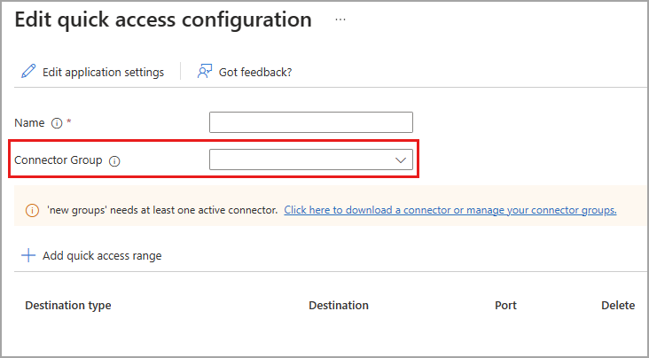

# How to define quick access ranges for Global Secure Access

With Microsoft Entra Global Secure Access, you can define specific websites or IP addresses to include in the traffic for Microsoft Entra Private Access. Your organization's employees can then access the apps and sites that you specify. This article describes how to define quick access ranges for Microsoft Private Access.

## Prerequisites

To define Quick Access ranges, you must have:

- An Azure AD Premium P1/P2 license.
- A role with **Global Administrator** access.
- App proxy license
- Connector group

## How it works

Configuring your Quick access settings is a major component to utilizing Microsoft Entra Private Access. Without configuring these settings, the service has no sites or apps to forward traffic to. 

When you configure the Quick access settings for the first time, Entra Private Access creates a new enterprise application. The properties of this new app are automatically configured to work with Entra Private Access. 

Because you're creating a new app through this process, you also need to have an Application Proxy connector group set up. This connector group handles the traffic to this new application. For more information, check out the following articles:

- [Remote access to on-premises apps through App Proxy](../active-directory/app-proxy/application-proxy.md)
- [Understand App Proxy connectors](../active-directory/app-proxy/application-proxy-connectors.md)
- [Publish apps on separate networks and locations using connector groups](../active-directory/app-proxy/application-proxy-connector-groups.md) 

With the Quick access app and connector group configured, you need to grant access to the app. As mentioned, the properties of the Quick access app are predefined. One of those properties requires that you assign users and groups through Enterprise Applications. For more information, see [Properties of an enterprise application](../active-directory/manage-apps/application-properties.md).

To summarize, overall the process is as follows:

1. Create a connector group, if you don't already have one.
1. Configure the Quick access settings, which creates a new enterprise app.
1. Assign users to the app.
1. Enable Microsoft Entra Private Access.

Let's look at each of these steps in more detail.

## Connector groups

Before you can set up Quick access, you must have an App Proxy connector group set up. The connector groups appear in the dropdown menu on the create Quick access page.

Setting up App Proxy connectors and connector groups require planning and testing to ensure you have the right configuration for your organization. 

## Enterprise applications

When you configure Quick access, you're creating a new Enterprise app. To view the properties of your new app:

1. Select the **Edit application settings** to access the app's properties. 
1. Select **Properties** from the side menu.

## How to define Quick Access ranges

1. Sign into the **Microsoft Entra admin center** using one of the defined roles.
1. Go to **Global secure access** > **Applications** > **Enterprise applications** > **Quick access**.
1. Provide a name for the Quick Access group.
1. Select a Connector Group from the list.
	- Connectors must be set up before creating Quick access groups.
	- With Connectors, you can isolate apps per network and connector.
1. Select **+ Add quick access range**.
1. In the **Create forwarding rule** panel that opens, select a **Destination type**: You can choose an IP address, a fully qualified domain name, an IP address range (CIDR), or an IP address range (IP to IP). Depending on what you select, the subsequent field changes accordingly.
1. Enter the appropriate detail (fully qualified domain name, IP address, or IP address range).
1. Enter the port. 

## Next steps

- [Learn about traffic management profiles](how-to-configure-traffic-forwarding.md)
