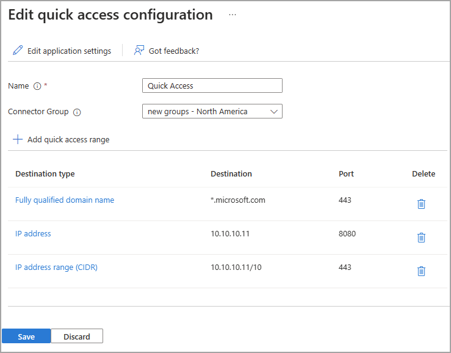

# How to define quick access ranges for Global Secure Access

With Microsoft Entra Global Secure Access, you can define specific websites or IP addresses to include in the traffic for Microsoft Entra Private Access. Your organization's employees can then access the apps and sites that you specify. This article describes how to define quick access ranges for Microsoft Private Access.

## Prerequisites

To define Quick Access ranges, you must have:

- An Azure AD Premium P1/P2 license.
- A role with **Global Administrator** access.
- App proxy license
- Connector group

## How it works

What functionality does it unlock?
Why would I use it?

## How to set it up

Configuring your Quick access settings is a major component to utilizing Microsoft Entra Private Access. If you don't configure these settings, the service has no sites or apps to forward traffic to. 

When you configure Quick access for the first time, Entra Private Access creates a new enterprise application. The properties of this new app are automatically configured to work with Entra Private Access. 

You also need to have an Application Proxy connector group set up. This connector group handles the traffic to this new application. With Connectors, you can isolate apps per network and connector. For more information, check out the following articles:

- [Remote access to on-premises apps through App Proxy](../active-directory/app-proxy/application-proxy.md)
- [Understand App Proxy connectors](../active-directory/app-proxy/application-proxy-connectors.md)
- [Publish apps on separate networks and locations using connector groups](../active-directory/app-proxy/application-proxy-connector-groups.md) 

Once you have the Quick access app and connector group configured, you need to grant access to the app. As mentioned, the properties of the Quick access app are predefined. One of those properties requires that you assign users and groups through Enterprise Applications. For more information, see [Properties of an enterprise application](../active-directory/manage-apps/application-properties.md).

To summarize, overall the process is as follows:

1. Create a connector group, if you don't already have one.
1. Configure the Quick access settings, which creates a new enterprise app.
1. Assign users to the app.
1. Enable Microsoft Entra Private Access.

Let's look at each of these steps in more detail.

## Create the Quick access app

On the Quick access page, you provide a name, select a connector group, and add websites and IP addresses. You can complete all three steps at the same time, or you can add the websites and IP addresses after the initial setup is complete. 

> [!IMPORTANT]
> Setting up App Proxy connectors and connector groups require planning and testing to ensure you have the right configuration for your organization. If you don't already have connector groups set up, pause this process and return when you have a connector group ready.

### Name and connector group

1. Enter a name. *We recommend naming the new app **QuickAccess** with no spaces.*
1. Select a Connector group from the dropdown menu.

    
    
    - Before you can set up Quick access, you must have an App Proxy connector group set up.
    - Your connector groups appear in the dropdown menu on the Quick access page.
1. Select the **Save** button at the bottom of the page to create your QuickAccess app without adding websites and apps.

### Add Quick access ranges

The **Add quick access range** portion of this process is where you define the private or internal websites and apps that you want to include in the traffic for Microsoft Entra Private Access. You can add sites when you create the Quick access app and return to add more or edit them later.

You can add fully qualified domain names (FQDN), IP addresses, and IP address ranges.

1. Go to **Global secure access** > **Applications** > **Quick access**.
1. Select **+ Add quick access range**.
1. In the **Create application segment** panel that opens, select a **Destination type**. Choose from one of the following options. Depending on what you select, the subsequent field change accordingly.
    - IP address
    - Fully qualified domain name
    - IP address range (CIDR)
    - IP address range (IP to IP). 
1. Enter the appropriate detail for what you selected.
1. Enter the port. 

1. Continue adding websites and apps as needed. You can add up to 500 websites and apps.

1. Select the **Save** button when you're finished.

## View the enterprise app

When you configure Quick access, a new enterprise app is created on your behalf. To view the properties of your new app:

1. Select the **Edit application settings** button from Quick access. 
1. Select **Properties** from the side menu.

You can also navigate to **Enterprise applications** and search for your QuickAccess app.

### Assign users and groups

You need to grant access to the Quick access app you created by assigning users and/or groups to the app. For more information, see [Assign users and groups to an application.](../active-directory/manage-apps/assign-user-or-group-access-portal.md).

> [!IMPORTANT]
> The **Enabled for users to sign-in?** option is set to **Yes** and must remain set this way. Changing this setting to No means users will not be able to access the sites and apps through Entra Private Access.

1. Open your Quick access app from **Enterprise apps**.
1. Select **Users and groups** from the side menu.
1. Add users and groups as needed.

## Enable Microsoft Entra Private Access

Once you have your Quick access app configured, your private websites and apps added, users assigned to the app, you can enable the Private access profile from **Traffic forwarding**. You can enable the profile before configuring Quick access, but without the app and profile configured, there's no traffic to forward.

1. Go to **Global Secure Access** > **Traffic forwarding**.
1. Select the checkbox for **Private access profile**.

## Next steps

- [Learn about traffic management profiles](concept-traffic-forwarding.md)
