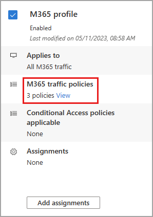
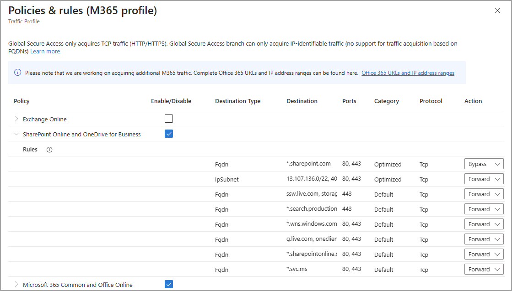

# How to enable the Microsoft 365 traffic forwarding profile.

With the M365 profile enabled, Microsoft Entra Internet Access acquires the traffic going to all Microsoft 365 services. The **M365** profile manages the following policy groups:

- Exchange Online
- SharePoint Online and OneDrive for Business
- Microsoft 365 Common and Office Online

## M365 traffic policies

To manage the domain names and IP addresses included in the policy, select the **View** link for **M365 traffic policies**. 

The policy groups are listed, with a checkbox to indicate if the policy group is enabled. Expand a policy group to view all of the IPs and FQDNs included in the group.

The policy groups include the following details:

- **Destination type**: FQDN or IP subnet
- **Destination**: The details of the FQDN or IP subnet
- **Ports**: TCP or UDP ports that are combined with the IP addresses to form the network endpoint
- **Protocol**: TCP (Transmission Control Protocol) or UDP (User Datagram Protocol)
- **Action**: Forward or Bypass

If the M365 profile isn't enabled, or a specific FQDN or IP address bypassed, users can still access the site; however, the service doesn't process the traffic. 

## M365 Conditional Access policies

Conditional Access policies can be applied to your traffic profiles to provide more options for managing access to applications, sites, and services. For example, you can create a policy that requires using compliant devices when accessing M365 services or requires multifactor authentication for all Microsoft 365 traffic.

Conditional Access policies are created and applied to the profile in the Conditional Access area of Microsoft Entra ID. For more information, see the [Conditional Access overview](../active-directory/conditional-access/overview.md).

**To view applied Conditional Access policies**:

1. Select the **View** link for **Conditional Access policies applicable**.

    

1. Select a link from the list to view the policy details. 

    

**To create a Conditional Access policy for the M365 profile**:

1. Create a new Conditional Access policy. For more information, see [Building a Conditional Access policy](../active-directory/conditional-access/concept-conditional-access-policies.md).
1. Under **Target Resources** select **No target resources selected**.
1. Select **Network Access (Preview)** from the menu.
1. From the new menu that appears, select one or more traffic profiles to apply the policy to. 

    

## M365 remote network assignments

Traffic profiles can be assigned to remote networks, so that the network traffic is forwarded to Global Secure Access without having to install the client on end user devices. As long as the device is behind the customer premises equipment (CPE), the client isn't required.  You must create a remote network before you can add it to the profile. For more information, see [How to create a remote network](how-to-manage-remote-networks.md).

**To assign a remote network to the M365 profile**:

1. Go to **Microsoft Entra ID** > **Global Secure Access** > **Traffic forwarding**.
1. Select the **Add assignments** button for the profile. 
    - If you're editing the remote network assignments, select the **Add/edit assignments** button.
1. Select a remote network from the list and select **Add**.

## Next steps

- [How to enable the Private access traffic profile](how-to-enable-private-access-profile.md)