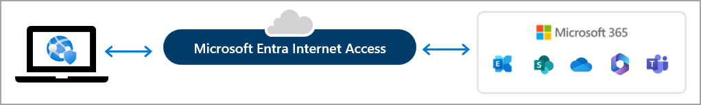
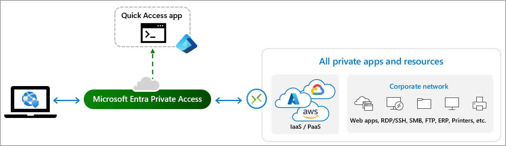
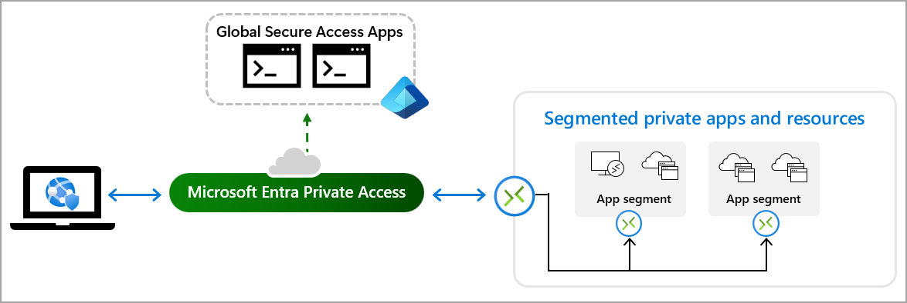

# Get started with Global Secure Access

Global Secure Access (preview) is the centralized location in the Microsoft Entra admin center where you can configure and manage Microsoft Entra Private Access and Microsoft Entra Internet Access. Many features and settings apply to both services, but some are specific to one or the other.

This guide helps you get started configuring both services for the first time.

## Prerequisites

Administrators who interact with **Global Secure Access preview** features must have the [Global Secure Access Administrator role](/azure/active-directory/roles/permissions-reference). Some features may also require other roles.

To follow the [Zero Trust principle of least privilege](/security/zero-trust/), consider using [Privileged Identity Management (PIM)](/azure/active-directory/privileged-identity-management/pim-configure) to activate just-in-time privileged role assignments.

The preview requires a Microsoft Entra ID Premium P1 license. If needed, you can [purchase licenses or get trial licenses](https://aka.ms/azureadlicense). To use the Microsoft 365 traffic forwarding profile, a Microsoft 365 E3 license is recommended. After general availability, Microsoft Entra Private Access and Microsoft Entra Internet Access may require different licenses.

There may be limitations with some features of the Global Secure Access preview, which are defined in the associated articles. 

## Access the Microsoft Entra admin center

Global Secure Access (preview) is the area in the Microsoft Entra admin center where you configure and manage Microsoft Entra Internet Access and Microsoft Entra Private Access.

- Go to [**https://entra.microsoft.com**](https://entra.microsoft.com/).

If you encounter access issues, refer to this [FAQ regarding tenant restrictions](resource-faq.yml).

## Microsoft Entra Internet Access

Microsoft Entra Internet Access isolates the traffic for Microsoft 365 applications and resources, such as Exchange Online and SharePoint Online. Users can access these resources by connecting to the Global Secure Access Client or through a remote network, such as in a branch office location.

### Install the client to access Microsoft 365 traffic

1. [Enable the Microsoft 365 traffic forwarding profile](how-to-manage-microsoft-365-profile.md).
1. [Install and configure the Global Secure Access Client on end-user devices](how-to-install-windows-client.md).
1. [Enable universal tenant restrictions](how-to-universal-tenant-restrictions.md).
1. [Enable enhanced Global Secure Access signaling and Conditional Access](how-to-compliant-network.md).

After you complete these four steps, users with the Global Secure Access client installed on their Windows device can securely access Microsoft 365 resources from anywhere. Conditional Access policy requires users to use the Global Secure Access client or a configured remote network, when they access Exchange Online and SharePoint Online.

###  Create a remote network, apply Conditional Access, and review the logs

1. [Create a remote network](how-to-manage-remote-networks.md).
1. [Target the Microsoft 365 traffic profile with Conditional Access policy](how-to-target-resource-microsoft-365-profile.md).
1. [Review the Global Secure Access logs](concept-global-secure-access-logs-monitoring.md).

After you complete these optional steps, users can connect to Microsoft 365 services without the Global Secure Access client if they're connecting through the remote network you created *and* if they meet the conditions you added to the Conditional Access policy.

## Microsoft Entra Private Access

Microsoft Entra Private Access provides a secure, zero-trust access solution for accessing internal resources without requiring a VPN. Configure Quick Access and enable the Private access traffic forwarding profile to specify the sites and apps you want routed through Microsoft Entra Private Access. At this time, the Global Secure Access Client must be installed on end-user devices to use Microsoft Entra Private Access, so that step is included in this section.

### Configure Quick Access to your primary private resources

Set up Quick Access for broader access to your network using Microsoft Entra Private Access.

1. [Configure an App Proxy connector and connector group](how-to-configure-connectors.md).
1. [Configure Quick Access to your private resources](how-to-configure-quick-access.md).
1. [Enable the Private Access traffic forwarding profile](how-to-manage-private-access-profile.md).
1. [Install and configure the Global Secure Access Client on end-user devices](how-to-install-windows-client.md).

After you complete these four steps, users with the Global Secure Access client installed on a Windows device can connect to your primary resources, through a Quick Access app and App Proxy connector. 

### Configure Global Secure Access apps for per-app access to private resources

Create specific private apps for granular segmented access to private access resources using Microsoft Entra Private Access.

1. [Configure an App Proxy connector and connector group](how-to-configure-connectors.md).
1. [Create a private Global Secure Access application](how-to-configure-per-app-access.md).
1. [Enable the Private Access traffic forwarding profile](how-to-manage-private-access-profile.md).
1. [Install and configure the Global Secure Access Client on end-user devices](how-to-install-windows-client.md).

After you complete these steps, users with the Global Secure Access client installed on a Windows device can connect to your private resources through a Global Secure Access app and App Proxy connector.

Optionally:

- [Secure Quick Access applications with Conditional Access policies](how-to-target-resource-private-access-apps.md).
- [Review the Global Secure Access logs](concept-global-secure-access-logs-monitoring.md).

[!INCLUDE [Public preview important note](./includes/public-preview-important-note.md)]

## Next steps

To get started with Microsoft Entra Internet Access, start by [enabling the Microsoft 365 traffic forwarding profile](how-to-manage-microsoft-365-profile.md).

To get started with Microsoft Entra Private Access, start by [configuring an App Proxy connector group for the Quick Access app](how-to-configure-connectors.md).

