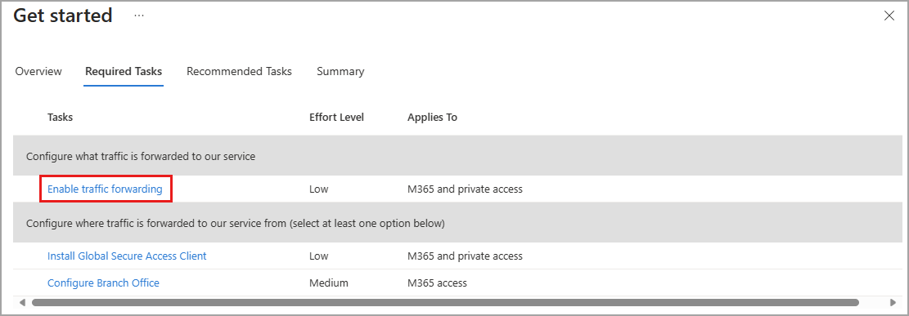
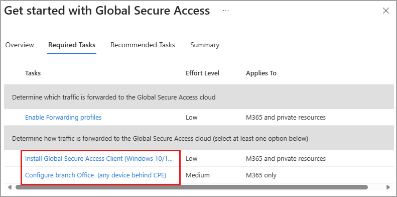
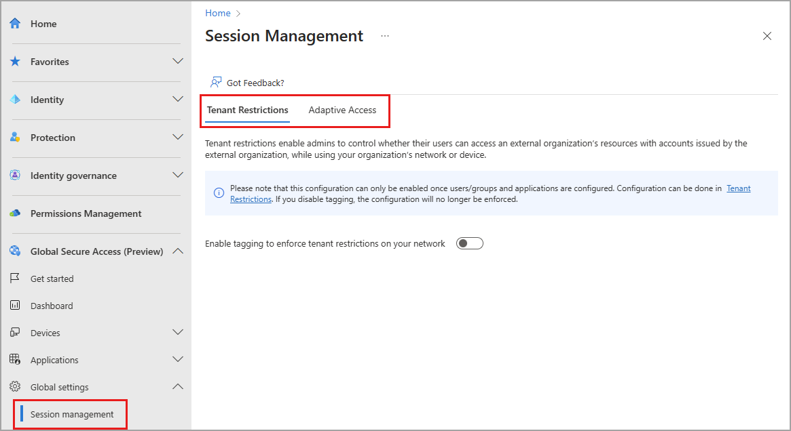

# Get started with Global Secure Access

When setting up the features of Global Secure Access for the first time, you can use the "Getting Started Wizard" in the Microsoft Entra admin center.

Before setting up the service, review the [What is Global Secure Access?](overview-what-is-global-secure-access.md) article.

The wizard is organized into required tasks and recommended tasks. The required tasks are the minimum configuration needed to get started with Global Secure Access. The recommended tasks are optional, but are recommended to get the most out of the service.

## Required tasks

The required tasks are broken down into two categories:
- Determine *which* traffic is forwarded
- Determine *how* traffic is forwarded

### Enable traffic forwarding profiles

**Traffic forwarding profiles** are used to manage the network traffic that you want to route through Global Secure Access. Select the link to configure your traffic forwarding profiles.

For more information, see [Global Secure Access traffic forwarding profiles](concept-traffic-forwarding.md).

**To enable traffic forwarding profiles**:

1. Select the **Enable Forwarding profiles** link to configure your traffic forwarding profiles.
1. Follow the documentation to configure your [Microsoft 365 profile](how-to-enable-m365-profile.md) or your [private access profile](how-to-enable-private-access-profile.md).
1. Either select the breadcrumb at the top of the page or close the window using the **X** in the upper-right corner.

### Install the client or configure branch locations

For traffic to get routed through Global Secure Access, your users must either be connected to a **branch location** that is configured to use Global Secure Access or **install the Global Secure Access client** on their Windows devices. Select the link to configure your branch locations or install the Global Secure Access client.

- [How to configure branch locations](how-to-manage-branch-locations.md)
- [How to install the Windows client](how-to-install-windows-client.md)

**To install the Windows client**:

1. Select the **Install Global Secure Access Client** link.
1. Follow the steps in the [How to install the Windows client](how-to-install-windows-client.md) article.
1. Either select the breadcrumb at the top of the page or close the window using the **X** in the upper-right corner.

**To configure branch locations**:

1. Select the **Configure branch office** link.
1. Follow the steps in the [How to configure branch locations](how-to-manage-branch-locations.md) article.
1. Either select the breadcrumb at the top of the page or close the window using the **X** in the upper-right corner.

## Recommended tasks

With your core settings in place, you can configure access controls and security measures. You can also set up log streaming to send logs to your SIEM or other log management solution.

### Apps, access control, and session management

Select the **Apply Conditional Access to the network** link to configure adaptive access controls. Enabling this setting creates a new Named Location in Conditional Access and silently enables source IP restoration. For more information on these concepts, se the following articles:

- [How to enable compliant network check](how-to-compliant-network.md)
- [How to enable source IP restoration](how-to-source-ip-restoration.md)

Select the **Prevent data exfiltration using tenant restrictions** to enable tenant restrictions. Enabling this feature prevents external, unsanctioned users from accessing your internal resources. For more information, see [How to enable tenant restrictions](how-to-universal-tenant-restrictions.md).

You can configure adaptive access controls and universal tenant restrictions from **Global Secure Access** > **Global settings** > **Session management**.

Select the **Enable Quick Access to your private resources** to configure your Quick access settings. Quick access provides the ability to identify the internal, private apps and websites that you want to include in your private access traffic profile. For more information, see the following articles:

- [Learn about traffic forwarding profiles](concept-traffic-forwarding.md)
- [How to define quick access ranges](how-to-define-quick-access-ranges.md)

### Configure enhanced monitoring and logging

Select the link.

## Next steps

- [Learn about branch connectivity](concept-understand-branch-connectivity.md)
- [Define quick access ranges](how-to-define-quick-access-ranges.md)

