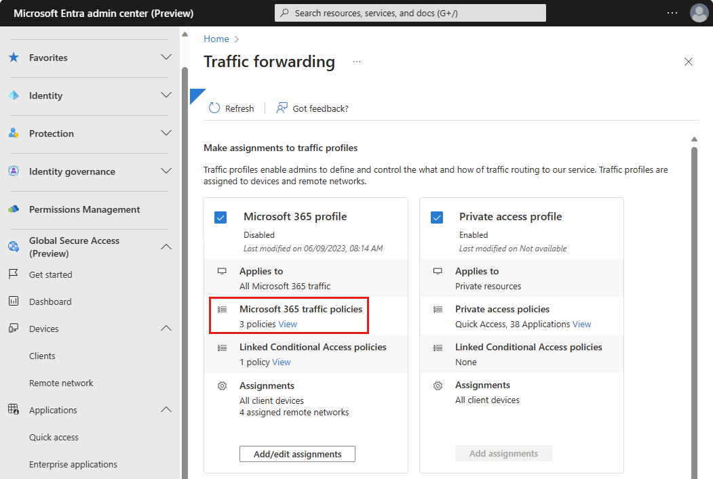
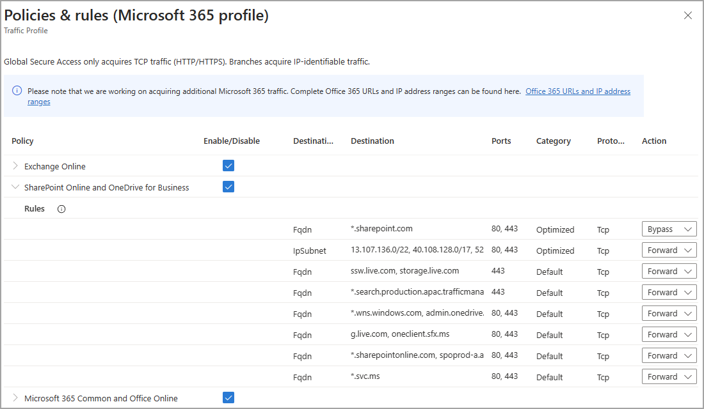
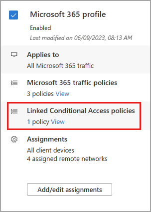

# How to enable the Microsoft 365 traffic forwarding profile

With the Microsoft 365 profile enabled, Microsoft Entra Internet Access acquires the traffic going to all Microsoft 365 services. The **Microsoft 365** profile manages the following policy groups:

- Exchange Online
- SharePoint Online and OneDrive for Business
- Microsoft 365 Common and Office Online

## Prerequisites

To enable the Microsoft 365 traffic forwarding profile for your tenant, you must have:

- A **Global Secure Access Administrator** role in Microsoft Entra ID

## Enable the Microsoft 365 traffic profile

1. Sign in to the **[Microsoft Entra admin center](https://entra.microsoft.com)**.
1. Go to **Global Secure Access** > **Connect** > **Traffic forwarding**.
1. Select the checkbox for **Microsoft 365 access profile**.

## Microsoft 365 traffic policies

To manage the details included in the Microsoft 365 traffic forwarding policy:

1. Sign in to the [Microsoft Entra admin center](https://entra.microsoft.com) as a [Global Secure Access Administrator](../active-directory/roles/permissions-reference.md).
1. Go to **Global Secure Access** > **Connect** > **Traffic forwarding**.
1. Select the **View** link for **Microsoft 365 traffic policies**. 

:::image type="content" source="media/how-to-manage-microsoft-365-profile/microsoft-365-traffic-policies.png" alt-text="Screenshot of the Private access profile, with the view applications link highlighted." lightbox="media/how-to-manage-microsoft-365-profile/microsoft-365-traffic-policies-expanded.png":::

The policy groups are listed, with a checkbox to indicate if the policy group is enabled. Expand a policy group to view all of the IPs and FQDNs included in the group.

The policy groups include the following details:

- **Destination type**: FQDN or IP subnet
- **Destination**: The details of the FQDN or IP subnet
- **Ports**: TCP or UDP ports that are combined with the IP addresses to form the network endpoint
- **Protocol**: TCP (Transmission Control Protocol) or UDP (User Datagram Protocol)
- **Action**: Forward or Bypass

If the Microsoft 365 profile isn't enabled, or a specific FQDN or IP address bypassed, users can still access the site; however, the service doesn't process the traffic. 

## Linked Conditional Access policies

Conditional Access policies are created and applied to the traffic forwarding profile in the Conditional Access area of Microsoft Entra ID. For example, you can create a policy that requires using compliant devices when accessing Microsoft 365 services.

For more information on Conditional Access, see the [Conditional Access overview](../active-directory/conditional-access/overview.md).

If you see "None" in the **Linked Conditional Access policies** section, there isn't a Conditional Access policy linked to the traffic forwarding profile. To create a Conditional Access policy, see [Universal Conditional Access through Global Secure Access.](how-to-target-resource.md).

### Edit an existing Conditional Access policy

If the traffic forwarding profile has a linked Conditional Access policy, you can view and edit that policy.

1. Select the **View** link for **Linked Conditional Access policies**.
1. Select a policy from the list. The details of the policy open in Conditional Accesss. 

    

## Microsoft 365 remote network assignments

Traffic profiles can be assigned to remote networks, so that the network traffic is forwarded to Global Secure Access without having to install the client on end user devices. As long as the device is behind the customer premises equipment (CPE), the client isn't required.  You must create a remote network before you can add it to the profile. For more information, see [How to create remote networks](how-to-create-remote-networks.md).

**To assign a remote network to the Microsoft 365 profile**:

1. Go to **Microsoft Entra ID** > **Global Secure Access** > **Traffic forwarding**.
1. Select the **Add assignments** button for the profile. 
    - If you're editing the remote network assignments, select the **Add/edit assignments** button.
1. Select a remote network from the list and select **Add**.

[!INCLUDE [Public preview important note](./includes/public-preview-important-note.md)]

## Next steps

- [How to manage the Private access traffic profile](how-to-manage-private-access-profile.md)
- [How to create remote networks](how-to-create-remote-networks.md)