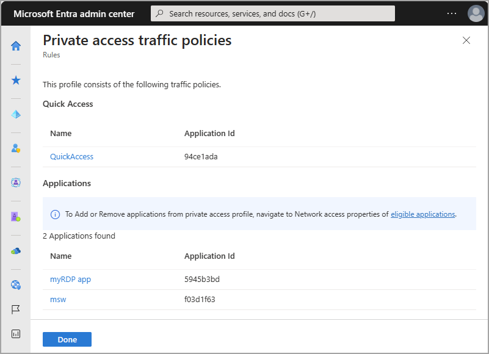
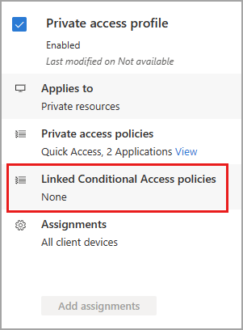

# How to manage the Private access traffic forwarding profile

The Private access traffic forwarding profile routes traffic to your private network through the Global Secure Access Client. Enabling this traffic forwarding profile allows remote workers to connect to internal resources without a VPN. With the features of Microsoft Entra Private Access, you can control which private resources to tunnel through the service and apply Conditional Access policies to secure access to those services. Once your configurations are in place, you can view and manage all of those configurations from one place.

## Prerequisites

To enable the Microsoft 365 traffic forwarding profile for your tenant, you must have:

- A **Global Secure Access Administrator** role in Microsoft Entra ID

### Known limitations

- At this time, Private access traffic can only be acquired with the Global Secure Access Client. Remote networks can't be assigned to the Private access traffic forwarding profile.
- Tunneling traffic to Private Access destinations by IP address is supported only for IP ranges outside of the end-user device local subnet. 
- You must disable DNS over HTTPS (Secure DNS) to tunnel network traffic based on the rules of the fully qualified domain names (FQDNs) in the traffic forwarding profile. 

## Enable the Private access traffic forwarding profile

1. Sign in to the **[Microsoft Entra admin center](https://entra.microsoft.com)**.
1. Go to **Global Secure Access** > **Connect** > **Traffic forwarding**.
1. Select the checkbox for **Private access profile**.

## Private access policies

To enable the Private access traffic forwarding profile, we recommend you first configure Quick Access. Quick Access includes the IP addresses, IP ranges, and fully qualified domain names (FQDNs) for the private resources you want to include in the policy. For more information, see [Configure Quick Access](how-to-configure-quick-access.md). For example, you can create a policy that requires using compliant devices when accessing Microsoft 365 services.

You can also configure per-app access to your private resources. This process is similar to configuring Quick Access, but per-app access provides the option to enable or disable the per-app access without impacting the FQDNs and IP addresses included in Quick Access.

To manage the details included in the Private access traffic forwarding policy:

1. Sign in to the [Microsoft Entra admin center](https://entra.microsoft.com) as a [Global Secure Access Administrator](../active-directory/roles/permissions-reference.md).
1. Go to **Global Secure Access** > **Connect** > **Traffic forwarding**.
1. Select the **View** link for **Private access policies**. 

:::image type="content" source="media/how-to-manage-private-access-profile/private-access-profile-link.png" alt-text="Screenshot of the Private access profile, with the view applications link highlighted." lightbox="media/how-to-manage-private-access-profile/private-access-profile-expanded.png":::

Details of your Quick Access and enterprise apps for Private access are displayed. Select the link for the application to view the details from the Enterprise applications area of Microsoft Entra ID.

## Linked Conditional Access policies

Conditional Access policies can be applied to your Quick Access and Private Access applications. Applying Conditional Access policies provides more options for managing access to applications, sites, and services.

Conditional Access policies are created and applied to the Quick Access application in the **Protection** area of Microsoft Entra ID. For more information, see [Building a Conditional Access policy](../active-directory/conditional-access/concept-conditional-access-policies.md).

[!INCLUDE [Public preview important note](./includes/public-preview-important-note.md)]

## Next steps

- [Configure Quick Access](how-to-configure-quick-access.md)
- [Learn about traffic forwarding](concept-traffic-forwarding.md)