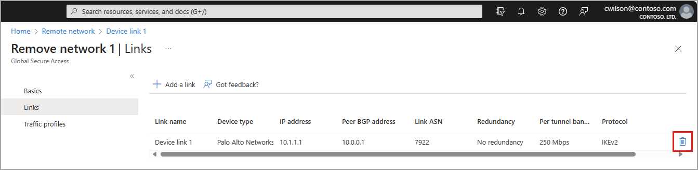

# Add and delete remote networks device links

You can create device links when you create a new remote network or add them after the remote network is created.

This article explains how to add and delete device links for remote networks for Global Secure Access.

## Prerequisites 

To configure remote networks, you must have: 

- A **Global Secure Access Administrator** role in Microsoft Entra ID.
- Completed the [onboarding process](how-to-create-remote-networks.md#onboard-your-tenant-for-remote-networks) for remote networks.
- Created a remote network.
- The preview requires a Microsoft Entra ID Premium P1 license. If needed, you can [purchase licenses or get trial licenses](https://aka.ms/azureadlicense).

## Add a device link using the Microsoft Entra admin center

You can add a device link to a remote network at any time.

1. Sign in to the **[Microsoft Entra admin center](https://entra.microsoft.com)** as a Global Secure Access Administrator. 
1. Go to **Global Secure Access (preview)** > **Devices** > **Remote network**.
1. Select a remote network from the list.
1. Select **Links** from the menu.
1. Select the **+ Add a link** button.

**General**

1. Enter the following details:
    - **Link name**: Name of your CPE.
    - **Device type**: Choose one of the options from the dropdown list.
    - **IP address**: Public IP address of your device.
    - **Peer BGP address**: The border gateway protocol address of the CPE.
    - **Link ASN**: Provide the autonomous system number of the CPE. For more information, see the **Valid ASNs** section of the [Remote network configurations](reference-remote-network-configurations.md) article.
    - **Redundancy**: Select either *No redundancy* or *Zone redundancy* for your IPSec tunnel.
    - **Bandwidth capacity (Mbps)**: Choose the bandwidth for your IPSec tunnel.
1. Select the **Next** button.


**Details**

1. **IKEv2** is selected by default. Currently only IKEv2 is supported.
1. The IPSec/IKE policy is set to **Default** but you can change to **Custom**.
    - If you select **Custom**, you must use a combination of settings that are supported by Global Secure Access.
    - The valid configurations you can use are mapped out in the [Remote network valid configurations](reference-remote-network-configurations.md) reference article.
    - Whether you choose Default or Custom, the IPSec/IKE policy you specify must match the policy on your CPE.
    - View the [remote network valid configurations](reference-remote-network-configurations.md).

1. Select the **Next** button.


**Security**

1. Enter the Preshared key (PSK): `<Enter the secret key. The same secret key must be used on your CPE.>` 
1. Select **Add link**. 

## Add a device link using Microsoft Graph API

1. Sign in to the [Graph Explorer](https://aka.ms/ge). 
1. Select `POST` as the HTTP method from the dropdown. 
1. Set the API version to beta. 
1. Enter the following query:

```http
POST https://graph.microsoft.com/beta/networkaccess/connectivity/branches/BRANCH_ID/deviceLinks
	{
	    "name": "CPE2",
	    "ipAddress": "100.1.1.56",
	    "BandwidthCapacityInMbps": "Mbps250",
	    "bgpConfiguration": {
	        "LocalIpAddress": "10.1.1.28",
	        "PeerIpAddress": "10.1.1.28",
	        "asn": 5555
	    },
	    "tunnelConfiguration": {
	        "@odata.type": "#microsoft.graph.networkaccess.tunnelConfigurationIKEv2Default",
	        "preSharedKey": "secret.ppk"
	    },
	    "redundancyConfiguration": {
	    "redundancyTier": "zoneRedundancy",
	    "zoneLocalIpAddress": "1.1.1.12"
	    },
	    "deviceVendor": "citrix"
	}

```

## Delete device links

If your remote network has device links added, they appear in the **Links** column on the list of remote networks. Select the link from the column to navigate directly to the device link details page.

To delete a device link, navigate to the device link details page and select the **Delete** icon. A confirmation dialog appears. Select **Delete** to confirm the deletion.



## Delete a device link using Microsoft Graph API

1. Sign in to the [Graph Explorer](https://aka.ms/ge). 
1. Select `DELETE` as the HTTP method from the dropdown. 
1. Set the API version to beta. 
1. Enter the following query:

```http
DELETE https://graph.microsoft.com/beta/networkaccess/connectivity/branches/BRANCH_ID/deviceLinks/LINK_ID

```

[!INCLUDE [Public preview important note](./includes/public-preview-important-note.md)]

## Next steps
- [List remote networks](how-to-list-remote-networks.md)
