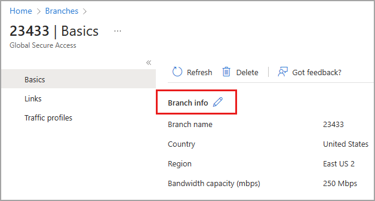

# Manage remote networks

Remote networks connect your users in remote locations to Global Secure Access (preview). Adding, updating, and removing remote networks from your environment are likely common tasks for many organizations. 

This article explains how to manage your existing remote networks for Global Secure Access.

[!INCLUDE [Public preview important note](./includes/public-preview-important-note.md)]

## Prerequisites

- A **Global Secure Access Administrator** role in Microsoft Entra ID

## Update remote networks

All details of your remote networks can be updated at any time.

1. Sign in to the [Microsoft Entra admin center](https://entra.microsoft.com).
1. Go to **Global Secure Access (preview)** > **Devices** > **Remote networks**.
1. Select the remote network you need to update.

On the **Basics** page you can update the remote network name, region, and bandwidth. Select the pencil icon to edit the details.



### Update remote network details with the Microsoft Graph API

To edit the name, location, or region of a remote network:

1. Sign in to [Graph Explorer](https://aka.ms/ge).
1. Select **PATCH** as the HTTP method from the dropdown. 
1. Select the API version to **beta**. 
1. Enter the query:
    ```
    PATCH https://graph.microsoft.com/beta/networkaccess/branches/8d2b05c5-1e2e-4f1d-ba5a-1a678382ef16
    {
        "@odata.context": "#$delta",
        "name": "ContosoRemoteNetwork2"
    }
    ``` 
1. Select **Run query** to update the remote network. 

## Delete a remote network

1. Sign in to the Microsoft Entra admin center at [https://entra.microsoft.com](https://entra.microsoft.com).
1. Go to **Global Secure Access (preview)** > **Devices** > **Remote networks**.
1. Select the remote network you need to delete.
1. Select the **Delete** button. 
1. Select **Delete** from the confirmation message.


### Delete a remote network using the API

1. Sign in to [Graph Explorer](https://aka.ms/ge).
1. Select **PATCH** as the HTTP method from the dropdown. 
1. Select the API version to **beta**. 
1. Enter the query:
    ```
    DELETE https://graph.microsoft.com/beta/networkaccess/branches/97e2a6ea-c6c4-4bbe-83ca-add9b18b1c6b 
    ```
1. Select **Run query** to delete the remote network. 

## Next steps

- [List remote networks](how-to-list-remote-networks.md)

