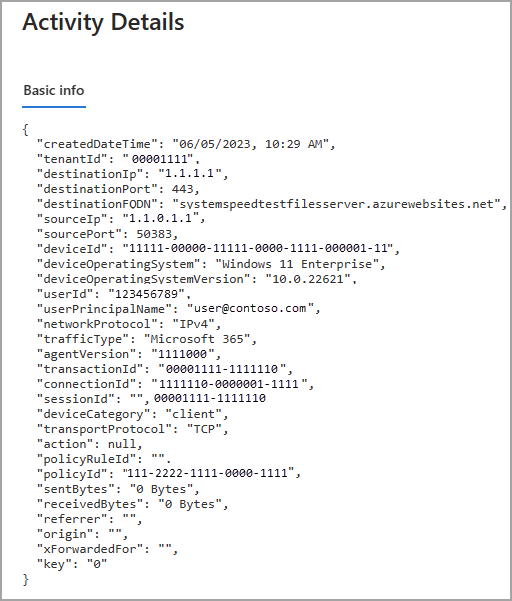
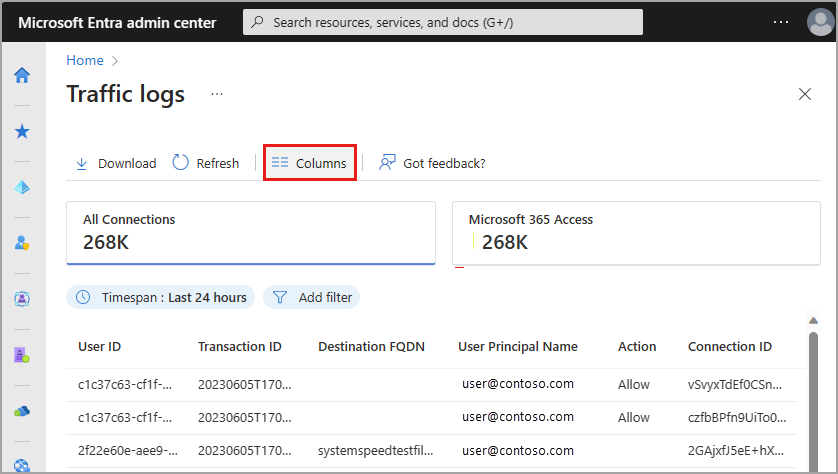
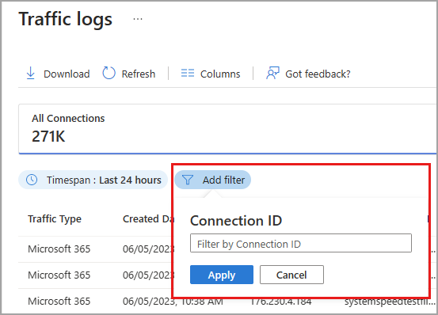

# How to use the Global Secure Access traffic logs

Monitoring the traffic for Global Secure Access is an important activity for ensuring your tenant is configured correctly and that your users are getting the best experience possible. The Global Secure Access traffic logs provide insight into who is accessing what resources, where they're accessing them from, and what action took place.

This article describes how to use the traffic logs for Global Secure Access.

## How the traffic logs work

Viewing traffic logs requires a Reports Reader role in Microsoft Entra ID. 

The Global Secure Access logs provide details of your network traffic. To better understand those details and how you can analyze those details to monitor your environment, it's helpful to look at the three levels of the logs and their relationship to each other.

A user accessing a website represents one *session*, and within that session there may be multiple *connections*, and within that connection there may be multiple *transactions*.

- **Session**: A session is identified by the first URL a user accesses. That session could then open many connections, for example a news site that contains multiple ads from several different sites.
- **Connection**: A connection includes the principal user name and device ID.
- **Transaction**: A transaction is a single request/response pair.

Within each log instance, you can see the session ID, connection ID, and transaction ID in the details. By using the filters, you can look at all connections and transactions for a single session.

## How to view the traffic logs

1. Sign in to the **[Microsoft Entra admin center](https://entra.microsoft.com)** using a Reports Reader role.
1. **Global Secure Access (Preview)** > **Monitor** > **Traffic logs**.

The top of the page displays a summary of all network connections as well as a breakdown for each traffic forwarding profile. Select the **Microsoft 365** or **Private access** buttons to filter the logs to each traffic forwarding profile.

### View the log details

Select any log from the list to view the details. These details provide valuable information that can be used to filter the logs for specific details or to troubleshoot a scenario. The details can be added as a column and used to filter the logs.

### Filter and column options

The traffic logs can provide many details, so to start only some columns are visible. Enable and disable the columns based on the analysis or troubleshooting tasks you're performing, as the logs could be difficult to view with too many columns selected. The column and filter options align with each item in the Activity details.

Select **Columns** from the top of the page to change the columns that are displayed. 

To filter the traffic logs to a specific detail, select the **Add filter** button and then enter the detail you want to filter by.

For example if you want to look at all the logs from a specific connection:

1. Select the log detail and copy the `connectionId` from the Activity details.
1. Select **Add filter** and choose **Connection ID**. 
1. In the field that appears, paste the `connectionId` and select **Apply**.

    

### Troubleshooting scenarios

The following details may be helpful for troubleshooting and analysis:

- If you're interesting in the size of the traffic being sent and received, enable the **Sent Bytes** and **Received Bytes** columns. Select the column header to sort the logs by the size of the logs.
- If you are reviewing the network activity for a risky user, you can filter the results by user principal name and then review the sites they're accessing.
- To look at traffic associated with specific 

The log details provide valuable information about your network traffic. Not all details are defined in the list below, but the following details are useful for troubleshooting and analysis:

- **Transaction ID**: Unique identifier representing the request/response pair.
- **Connection ID**: Unique identifier representing the connection that initiated the log.
- **Device category**: Device type where the transaction initiated from. Either **client** or **remote network**.
- **Action**: The action taken on the network session. Either **Allowed** or **Denied**.

[!INCLUDE [Public preview important note](./includes/public-preview-important-note.md)]

## Next steps

- [Learn about the traffic dashboard](concept-traffic-dashboard.md)
- [View the audit logs for Global Secure Access](how-to-access-audit-logs.md)

