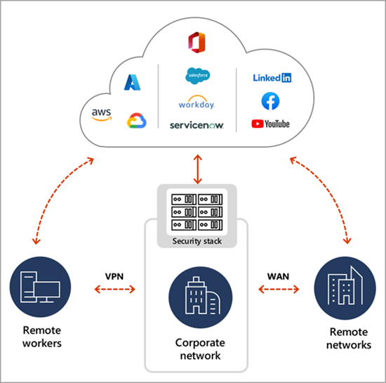
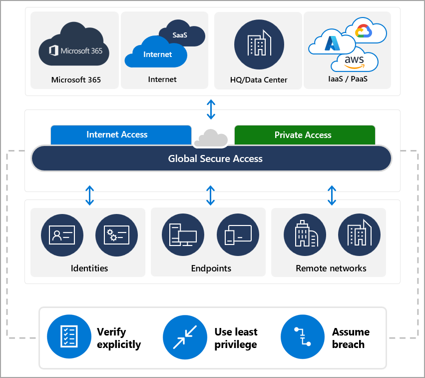

# What is Global Secure Access?

The way people work has changed. Instead of working in traditional offices, people now work from nearly anywhere. The network perimeter for the modern workforce has created a need for a new category of networking that provides control and visibility to users and devices both inside and outside of a traditional office. This new category of networking is called Security Service Edge (SSE). Microsoft's SSE solution is called Global Secure Access and it includes two services: Microsoft Entra Private Access and Microsoft Entra Internet Access.

## Challenges of the traditional network

Administrators need a way to apply consistent access controls, secure resources, and gain visibility into network traffic. Users need to be more efficient while securely accessing the resources they need to do their jobs. Many organizations have stitched together several solutions to solve these challenges, but this approach can be complex, expensive to manage, and difficult to secure.

In the previous diagram remote workers use VPN to connect to the corporate network. It's common for users to bypass the controls that IT has in place, putting themselves and the organization at risk. Risky users with compromised credentials can move laterally across the corporate network, expanding the attack surface. 

Deploying a Security Service Edge solution can help organizations simplify their network and security architecture, reduce costs, and improve the user experience. Admins can manage access to apps and resources with confidence. Users don't have to rely on the complexities of a traditional VPN. With the services included in Global Secure Access, the traditional corporate network is extended down to individual users and devices regardless of their physical location.

## Key components of Security Service Edge

Microsoft Entra Private Access and Microsoft Entra Internet Access - the two products that make up Global Secure Access - include multiple components traditionally found in a Security Service Edge solution. These components are:

- **Identity-driven:** Access is granted based on the identity of users and devices.
- **Cloud-native:** Both infrastructure and security solutions are cloud-delivered.
- **Globally distributed:** Users are secured no matter where they work.

### Secure web gateway

A secure web gateway (SWG) is a web security service that filters unauthorized traffic from accessing a specific network. The goal of an SWG is to zero in on threats before they penetrate a virtual perimeter. 

### Cloud access security broker

A cloud access security broker (CASB) is a SaaS application that acts as a security checkpoint between on-premises networks and cloud-based applications to enforce data security policies. A CASB protects corporate data through a combination of prevention, monitoring, and mitigation techniques. It can also identify malicious behavior and warn administrators about compliance violations.

### Firewall as a service

Firewall as a service (FWaaS) moves firewall protection to the cloud instead of the traditional network perimeter. This shift enables organizations to securely connect a remote, mobile workforce to the corporate network, while still enforcing consistent security policies that reach beyond the organization’s geographic footprint.

### Centralized and unified management

A modern SSE platform allows IT administrators to these key components through centralized and unified management across networking and security. This frees IT team members to focus their energy in other more pressing areas and boosts the user experience for the organization’s hybrid workforce.

### Zero trust principles

Zero Trust Network Access (ZTNA) is the result of applying Zero Trust principles to networking technologies and concepts. ZTNA operates on a framework in which trust is never implicit and access is granted on a need-to-know, least-privileged bases across all users, devices, and applications. Users are authenticated, authorized, and continuously validated before being granted access to company private applications and data.

## What is Global Secure Access?

Microsoft Entra provides two products that encompass the Security Service Edge (SSE) solution. The first is called Microsoft Entra Private Access and the second is called Microsoft Entra Internet Access. In the Microsoft Entra admin center these products show up under the left hand navigation in an area called generally Global Secure Access. Think of Global Secure Access as the area of the Microsoft Entra portal for SSE. It provides modern network access control for users and devices.

To address the challenges of the traditional network described previously, Microsoft Entra Private Access and Microsoft Entra Internet Access create a new path for employees to access corporate resources. Through Global Secure Access, employees can access resources from corporate headquarters, a branch location, or from their home office. Global Secure Access is built upon the core principles of Zero Trust to use least privilege, verify explicitly, and assume breach.

The following diagram illustrates the new network traffic flow with Global Secure Access.

The features of Global Secure Access are all accessed from the Microsoft Entra admin center. With this centralized experience you can set up your branch and client connectivity, manage your traffic profiles, and view network and usage logs. Additional security measures can be enforced using Conditional Access policies.

### License and role requirements

Global Secure Access includes **Microsoft Entra Private Access** and **Microsoft Entra Internet Access**. The following table outlines which product is required for each feature. 

|               |Private Access - Standard|Private Access - Premium|Internet Access - Standard|Internet Access - Premium|
|---------------|--------------------------------|-------|---------------------------------|-------|
| **Feature A** | X                              |       | X                               |       |
| **Feature B** |                                | X     |                                 |       |
| **Feature C** | X                              |       | X                               |       |
| **Feature D** |                                | X     |                                 | X     |

## Microsoft Entra Private Access

Microsoft Entra Private Access provides your users - whether in an office or working remotely - secured access to your private, corporate resources. Microsoft Entra Private Access uses a least-privilege access model instead of providing implicit trust and open access to all apps and resources.

Azure Active Directory Application Proxy already provides access to private apps without needing a VPN. Microsoft Entra Private Access builds on those capabilities and extends access to any private resource, port, and protocol. The CASB security checkpoint for Microsoft Entra Private Access comes from associating an App Proxy connector group with your private apps and sites.

With Microsoft Entra Private Access you can enable [traffic forwarding profiles](concept-traffic-forwarding.md) that acquire and route traffic according to your policies and destinations, which serve as the SWG. These profiles include the IP addresses and fully qualified domain names (FQDN) of the apps and sites you want to protect.

The service offers per-app adaptive access based on Conditional Access policies. You can require multi-factor authentication using Conditional Access. Microsoft Entra Private Access reduces operational complexity and cost by replacing traditional VPNs. 

## Microsoft Entra Internet Access

With Microsoft Entra Internet Access you can protect users whether they're accessing Microsoft 365 services or exploring the web. Conditional Access policies can be used to protect against malicious or non-compliant internet traffic. 

For Microsoft 365 environments, Microsoft Entra Internet Access enables best-in-class security and visibility, along with fast and seamless access to Microsoft 365 apps. With a devoted traffic forwarding policy for Microsoft 365, your users will be more productive wherever they work.

## Next steps

- [Get started with Global Secure Access](how-to-get-started-with-global-secure-access.md)
