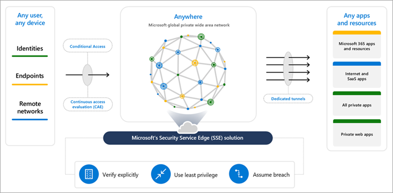

# What is Global Secure Access (preview)?

The way people work has changed. Instead of working in traditional offices, people now work from nearly anywhere. With applications and data moving to the cloud, an identity-aware, cloud-delivered network perimeter for the modern workforce is needed. This new network security category is called Security Service Edge (SSE).

Microsoft Entra Internet Access and Microsoft Entra Private Access comprise Microsoft's Security Service Edge solution. Global Secure Access (preview) is the unifying term used for both Microsoft Entra Internet Access and Microsoft Entra Private Access. Global Secure Access is the unified location in the Microsoft Entra admin center and is built upon the core principles of Zero Trust to use least privilege, verify explicitly, and assume breach.

## Global Secure Access is Microsoft's Security Service Edge solution

Microsoft Entra Internet Access and Microsoft Entra Private Access - coupled with Microsoft Defender for Cloud Apps, our SaaS-security focused Cloud Access Security Broker (CASB) - are uniquely built as a solution that converges network, identity, and endpoint access controls so you can secure access to any app or resource, from anywhere. With the addition of these Global Secure Access products, Microsoft Entra simplifies access policy management and enables access orchestration for employees, business partners, and digital workloads. You can continuously monitor and adjust user access in real time if permissions or risk level changes.

The Global Secure Access features streamline the roll-out and management of the access control capabilities with a unified portal. These features are delivered from Microsoft's Wide Area Network, spanning 140+ countries and 190+ network edge locations. This private network, which is one of the largest in the world, enables organizations to optimally connect users and devices to public and private resources seamlessly and securely. For a list of the current points of presence, see [Global Secure Access points of presence article](reference-points-of-presence.md).

## Microsoft Entra Internet Access

Microsoft Entra Internet Access secures access to Microsoft 365, SaaS, and public internet apps while protecting users, devices, and data against internet threats. Best-in-class security and visibility, along with fast and seamless access to Microsoft 365 apps is currently available in public preview. Secure access to public internet apps through the identity-centric, device-aware, cloud-delivered Secure Web Gateway (SWG) of Microsoft Entra Internet Access is in private preview.

### Key features

- Prevent stolen tokens from being replayed with the compliant network check in Conditional Access.
- Apply universal tenant restrictions to prevent data exfiltration to other tenants or personal accounts including anonymous access.
- Enriched logs with network and device signals currently supported for SharePoint Online traffic.
- Improve the precision of risk assessments on users, locations, and devices. 
- Deploy side-by-side with third party SSE solutions.
- Acquire network traffic from the desktop client or from a remote network, such as a branch location.

#### Private preview features
The following new capabilities are available in the private preview of Microsoft Entra Internet Access. To request access to the private preview, complete [the private preview interest form](https://aka.ms/entra-ia-preview).

- Dedicated public internet traffic forwarding profile.
- Protect user access to the public internet while leveraging Microsoft's cloud-delivered, identity-aware SWG solution.
- Enable web content filtering to regulate access to websites based on their content categories through secure web gateway.
- Apply universal Conditional Access policies for all internet destinations, even if not federated with Microsoft Entra ID.

## Microsoft Entra Private Access

Microsoft Entra Private Access provides your users - whether in an office or working remotely - secured access to your private, corporate resources. Microsoft Entra Private Access builds on the capabilities of Microsoft Entra ID App Proxy and extends access to any private resource, port, and protocol.

Remote users can connect to private apps across hybrid and multicloud environments, private networks, and data centers from any device and network without requiring a VPN. The service offers per-app adaptive access based on Conditional Access policies, for more granular security than a VPN. 

### Key features

- Quick Access: Zero Trust based access to a range of IP addresses and/or FQDNs without requiring a legacy VPN.
- Per-app access for TCP apps (UDP support in development).
- Modernize legacy app authentication with deep Conditional Access integration.
- Provide a seamless end-user experience by acquiring network traffic from the desktop client and deploying side-by-side with your existing third-party SSE solutions.

[!INCLUDE [Public preview important note](./includes/public-preview-important-note.md)] 

## Next steps

- [Get started with Global Secure Access](how-to-get-started-with-global-secure-access.md)
- [Stay in the loop with the latest Microsoft Entra updates](https://techcommunity.microsoft.com/t5/microsoft-entra-azure-ad-blog/bg-p/Identity)
