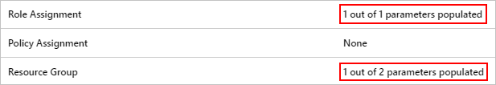
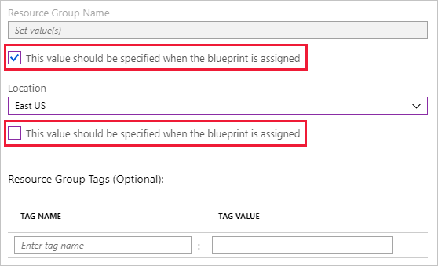
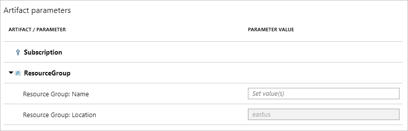

# Creating dynamic blueprints through parameters

A fully defined blueprint with various artifacts (such as resource groups, Resource Manager
templates, policies, or role assignments) offers the rapid creation and consistent provisioning of
objects within Azure. To enable flexible use of these reusable design patterns and containers,
Azure Blueprints supports parameters. The parameter creates flexibility, both during definition and
assignment, to change properties on the artifacts deployed by the blueprint.

A simple example is the resource group artifact. When a resource group is created, it has two
required values that must be provided: name and location. When adding a resource group to your
blueprint, if parameters didn’t exist, you would define that name and location for every use of the
blueprint. This would cause every use of the blueprint to create artifacts in the same resource
group. While not an issue with the resource group itself, resources inside that resource group
would become duplicated and cause a conflict.

> [!NOTE]
> It isn't an issue for two different blueprints to include a resource group with the same name.
> If a resource group included in a blueprint already exists, the blueprint continues to create the
> related artifacts in that resource group. This could cause a conflict as two resources with the
> same name and resource type cannot exist within a subscription.

This is where parameters fit in. The value for those properties, in the case of the resource group
the name and location property, Blueprints allows you to not define them during the definition of
the blueprint, but to instead define their values during assignment to a subscription. This makes
it possible to reuse a blueprint that creates a resource group and other resources within a single
subscription without having conflict.

## Blueprint parameters

Through the REST API, parameters can be created on the blueprint itself in addition to each of the
supported artifacts. When a parameter is created on the blueprint, it can be used by the artifacts
in that blueprint. An example might be the prefix for naming of the resource group. The artifact
can then use the blueprint parameter to create a "mostly dynamic" parameter, as the parameter could
still be defined during assignment, but will have a consistency that may adhere to naming rules of
the organization. For steps, see [setting static parameters - blueprint level parameter](#blueprint-level-parameter).

### Using secureString and secureObject parameters

While a Resource Manager template _artifact_ supports parameters of the **secureString** and
**secureObject** types, Azure Blueprints requires each to be connected with an Azure Key Vault.
This prevents the unsafe practice of storing secrets along with the Blueprint and encourages
employment of secure patterns. Azure Blueprints facilitates this by detecting the inclusion of
either secure parameter in a Resource Manager template _artifact_ and prompting during Blueprint
assignment for the following Key Vault properties per detected secure parameter:

- Key Vault resource ID
- Key Vault secret name
- Key Vault secret version

The referenced Key Vault must exist in the same subscription as the Blueprint is being assigned to
and must also have **Enable access to Azure Resource Manager for template deployment** configured on
the Key Vault's **Access policies** page. For directions on how to enable this feature, see [Key Vault - Enable template deployment](../../../managed-applications/key-vault-access.md#enable-template-deployment).
For more information about Azure Key Vault, see [Key Vault Overview](../../../key-vault/key-vault-overview.md).

## Parameter types

### Static parameters

A parameter value defined in the definition of a blueprint is called a **static parameter**. This is
because every use of the blueprint will deploy the artifact using that static value. In the
resource group example, while this wouldn't make sense for the name of the resource group, it might
make sense for the location. Then, every assignment of the blueprint would create the resource
group, whatever it's called during assignment, in the same location. This allows you to be
selective in what you define as required vs what can be changed during assignment.

#### Setting static parameters in the portal

1. Launch the Azure Blueprints service in the Azure portal by clicking on **All services** and searching for and selecting **Policy** in the left pane. On the **Policy** page, click on **Blueprints**.

1. Select **Blueprint Definitions** from the page on the left.

1. Click on an existing blueprint and then click **Edit Blueprint** OR click **+ Create Blueprint** and fill out the information on the **Basics** tab.

1. Click **Next: Artifacts** OR click on the **Artifacts** tab.

1. Artifacts added to the blueprint that have parameter options display **X of Y parameters populated** in the **Parameters** column. Click on the artifact row to edit the artifact parameters.

   

1. The **Edit Artifact** page displays value options appropriate to the artifact clicked on. Each parameter on the artifact has a title, a value box, and a checkbox. Set the box to unchecked to make it a **static parameter**. In the example below, only _Location_ is a **static parameter** as it is unchecked and _Resource Group Name_ is checked.

   

#### Setting static parameters from REST API

In each REST API URI, there are variables that are used that you need to replace with your own values:

- `{YourMG}` - Replace with the name of your management group
- `{subscriptionId}` - Replace with your subscription ID

##### Blueprint level parameter

When creating a blueprint through REST API, it is possible to create [blueprint
parameters](#blueprint-parameters). To do this, use the following REST API URI and body format:

- REST API URI

  ```http
  PUT https://management.azure.com/providers/Microsoft.Management/managementGroups/{YourMG}/providers/Microsoft.Blueprint/blueprints/MyBlueprint?api-version=2017-11-11-preview
  ```

- Request Body

  ```json
  {
      "properties": {
          "description": "This blueprint has blueprint level parameters.",
          "targetScope": "subscription",
          "parameters": {
              "owners": {
                  "type": "array",
                  "metadata": {
                      "description": "List of AAD object IDs that is assigned Owner role at the resource group"
                  }
              }
          },
          "resourceGroups": {
              "storageRG": {
                  "description": "Contains the resource template deployment and a role assignment."
              }
          }
      }
  }
  ```

Once a blueprint level parameter is created, it can be used on artifacts added to that blueprint.
The following REST API example creates a role assignment artifact on the blueprint and uses the
blueprint level parameter.

- REST API URI

  ```http
  PUT https://management.azure.com/providers/Microsoft.Management/managementGroups/{YourMG}/providers/Microsoft.Blueprint/blueprints/MyBlueprint/artifacts/roleOwner?api-version=2017-11-11-preview
  ```

- Request Body

  ```json
  {
      "kind": "roleAssignment",
      "properties": {
          "resourceGroup": "storageRG",
          "roleDefinitionId": "/providers/Microsoft.Authorization/roleDefinitions/8e3af657-a8ff-443c-a75c-2fe8c4bcb635",
          "principalIds": "[parameters('owners')]"
      }
  }
  ```

In this example, the **principalIds** property made use of the **owners** blueprint level parameter
by providing a value of `[parameters('owners')]`. Setting a parameter on an artifact using a
blueprint level parameter is still an example of a **static parameter** as it cannot be set during
blueprint assignment and will be this value on each assignment.

##### Artifact level parameter

Creating **static parameters** on an artifact is similar, but takes a straight value instead of
using the `parameters()` function. The following example creates two static parameters, **tagName**
and **tagValue**. The value on each is directly provided and does not use a function call.

- REST API URI

  ```http
  PUT https://management.azure.com/providers/Microsoft.Management/managementGroups/{YourMG}/providers/Microsoft.Blueprint/blueprints/MyBlueprint/artifacts/policyStorageTags?api-version=2017-11-11-preview
  ```

- Request Body

  ```json
  {
      "kind": "policyAssignment",
      "properties": {
          "description": "Apply storage tag and the parameter also used by the template to resource groups",
          "policyDefinitionId": "/providers/Microsoft.Authorization/policyDefinitions/49c88fc8-6fd1-46fd-a676-f12d1d3a4c71",
          "parameters": {
              "tagName": {
                  "value": "StorageType"
              },
              "tagValue": {
                  "value": "Premium_LRS"
              }
          }
      }
  }
  ```

### Dynamic parameters

The opposite of a static parameter is a **dynamic parameter**. This is a parameter that is not
defined on the blueprint, but instead is defined during each assignment of the blueprint. In the
resource group example, this makes sense for the resource group name, providing a different name
for every assignment of the blueprint.

#### Setting dynamic parameters in the portal

1. Launch the Azure Blueprints service in the Azure portal by clicking on **All services** and searching for and selecting **Policy** in the left pane. On the **Policy** page, click on **Blueprints**.

1. Select **Blueprint Definitions** from the page on the left.

1. Right-click on the blueprint that you want to assign and select **Assign Blueprint** OR click on the blueprint you want to assign, then click the **Assign Blueprint** button.

1. On the **Assign Blueprint** page, find the **Artifact parameters** section. Each artifact with at least one **dynamic parameter** displays the artifact and the configuration options. Provide required values to the parameters before assigning the blueprint. In the example below, _Name_ is a **dynamic parameter** that must be defined to complete blueprint assignment.

   

#### Setting dynamic parameters from REST API

Setting **dynamic parameters** during the assignment is done by providing the desired value
directly. Instead of using a function, such as `parameters()`, the value provided is an appropriate
string. Artifacts for a resource group are defined with a "template name", and **name** and
**location** properties. All other parameters for each included artifact is defined under
**parameters** with a **\<name\>** and **value** key pair. If the blueprint is configured for a
dynamic parameter that is not provided during assignment, the assignment will fail.

- REST API URI

  ```http
  PUT https://management.azure.com/subscriptions/{subscriptionId}/providers/Microsoft.Blueprint/blueprintAssignments/assignMyBlueprint?api-version=2017-11-11-preview
  ```

- Request Body

  ```json
  {
      "properties": {
          "blueprintId": "/providers/Microsoft.Management/managementGroups/{YourMG}  /providers/Microsoft.Blueprint/blueprints/MyBlueprint",
          "resourceGroups": {
              "storageRG": {
                  "name": "StorageAccount",
                  "location": "eastus2"
              }
          },
          "parameters": {
              "storageAccountType": {
                  "value": "Standard_GRS"
              },
              "tagName": {
                  "value": "CostCenter"
              },
              "tagValue": {
                  "value": "ContosoIT"
              },
              "contributors": {
                  "value": [
                      "7be2f100-3af5-4c15-bcb7-27ee43784a1f",
                      "38833b56-194d-420b-90ce-cff578296714"
                  ]
                },
              "owners": {
                  "value": [
                      "44254d2b-a0c7-405f-959c-f829ee31c2e7",
                      "316deb5f-7187-4512-9dd4-21e7798b0ef9"
                  ]
              }
          }
      },
      "identity": {
          "type": "systemAssigned"
      },
      "location": "westus"
  }
  ```

## Next steps

- Learn about the [blueprint life-cycle](lifecycle.md)
- Learn to customize the [blueprint sequencing order](sequencing-order.md)
- Find out how to make use of [blueprint resource locking](resource-locking.md)
- Learn how to [update existing assignments](../how-to/update-existing-assignments.md)
- Resolve issues during the assignment of a blueprint with [general troubleshooting](../troubleshoot/general.md)