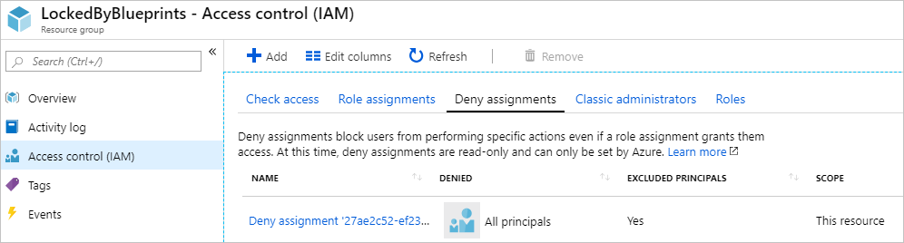

# Understand resource locking in Azure Blueprints

The creation of consistent environments at scale is only truly valuable if there's a mechanism to
maintain that consistency. This article explains how resource locking works in Azure Blueprints. To
see an example of resource locking and application of _deny assignments_, see the [protecting new resources](../tutorials/protect-new-resources.md)
tutorial.

## Locking modes and states

Locking Mode applies to the blueprint assignment and it has three options: **Don't Lock**, **Read
Only**, or **Do Not Delete**. The locking mode is configured during artifact deployment during a
blueprint assignment. A different locking mode can be set by updating the blueprint assignment.
Locking modes, however, can't be changed outside of Blueprints.

Resources created by artifacts in a blueprint assignment have four states: **Not Locked**, **Read
Only**, **Cannot Edit / Delete**, or **Cannot Delete**. Each artifact type can be in the **Not
Locked** state. The following table can be used to determine the state of a resource:

|Mode|Artifact Resource Type|State|Description|
|-|-|-|-|
|Don't Lock|*|Not Locked|Resources aren't protected by Blueprints. This state is also used for resources added to a **Read Only** or **Do Not Delete** resource group artifact from outside a blueprint assignment.|
|Read Only|Resource group|Cannot Edit / Delete|The resource group is read only and tags on the resource group can't be modified. **Not Locked** resources can be added, moved, changed, or deleted from this resource group.|
|Read Only|Non-resource group|Read Only|The resource can't be altered in any way -- no changes and it can't be deleted.|
|Do Not Delete|*|Cannot Delete|The resources can be altered, but can't be deleted. **Not Locked** resources can be added, moved, changed, or deleted from this resource group.|

## Overriding locking states

It's typically possible for someone with appropriate [role-based access
control](../../../role-based-access-control/overview.md) (RBAC) on the subscription, such as the
'Owner' role, to be allowed to alter or delete any resource. This access isn't the case when
Blueprints applies locking as part of a deployed assignment. If the assignment was set with the
**Read Only** or **Do Not Delete** option, not even the subscription owner can perform the blocked
action on the protected resource.

This security measure protects the consistency of the defined blueprint and the environment it was
designed to create from accidental or programmatic deletion or alteration.

## Removing locking states

If it becomes necessary to modify or delete a resource protected by an assignment, there are two
ways to do so.

- Updating the blueprint assignment to a locking mode of **Don't Lock**
- Delete the blueprint assignment

When the assignment is removed, the locks created by Blueprints are removed. However, the resource
is left behind and would need to be deleted through normal means.

## How blueprint locks work

An RBAC [deny assignments](../../../role-based-access-control/deny-assignments.md) deny action is
applied to artifact resources during assignment of a blueprint if the assignment selected the
**Read Only** or **Do Not Delete** option. The deny action is added by the managed identity of the
blueprint assignment and can only be removed from the artifact resources by the same managed
identity. This security measure enforces the locking mechanism and prevents removing the blueprint
lock outside Blueprints.



The
[deny assignment properties](../../../role-based-access-control/deny-assignments.md#deny-assignment-properties)
of each mode are as follows:

|Mode |Permissions.Actions |Permissions.NotActions |Principals[i].Type |ExcludePrincipals[i].Id | DoNotApplyToChildScopes |
|-|-|-|-|-|-|
|Read Only |**\*** |**\*/read** |SystemDefined (Everyone) |blueprint assignment and user-defined in **excludedPrincipals** |Resource group - _true_; Resource - _false_ |
|Do Not Delete |**\*/delete** | |SystemDefined (Everyone) |blueprint assignment and user-defined in **excludedPrincipals** |Resource group - _true_; Resource - _false_ |

> [!IMPORTANT]
> Azure Resource Manager caches role assignment details for up to 30 minutes. As a result, deny
> assignments deny action's on blueprint resources may not immediately be in full effect. During
> this period of time, it might be possible to delete a resource intended to be protected by
> blueprint locks.

## Exclude a principal from a deny assignment

In some design or security scenarios, it may be necessary to exclude a principal from the [deny assignment](../../../role-based-access-control/deny-assignments.md)
the blueprint assignment creates. This is done in REST API by adding up to five values to the
**excludedPrincipals** array in the **locks** property when [creating the assignment](/rest/api/blueprints/assignments/createorupdate).
This is an example of a request body that includes **excludedPrincipals**:

```json
{
  "identity": {
    "type": "SystemAssigned"
  },
  "location": "eastus",
  "properties": {
    "description": "enforce pre-defined simpleBlueprint to this XXXXXXXX subscription.",
    "blueprintId": "/providers/Microsoft.Management/managementGroups/{mgId}/providers/Microsoft.Blueprint/blueprints/simpleBlueprint",
    "locks": {
        "mode": "AllResourcesDoNotDelete",
        "excludedPrincipals": [
            "7be2f100-3af5-4c15-bcb7-27ee43784a1f",
            "38833b56-194d-420b-90ce-cff578296714"
        ]
    },
    "parameters": {
      "storageAccountType": {
        "value": "Standard_LRS"
      },
      "costCenter": {
        "value": "Contoso/Online/Shopping/Production"
      },
      "owners": {
        "value": [
          "johnDoe@contoso.com",
          "johnsteam@contoso.com"
        ]
      }
    },
    "resourceGroups": {
      "storageRG": {
        "name": "defaultRG",
        "location": "eastus"
      }
    }
  }
}
```

## Next steps

- Follow the [protect new resources](../tutorials/protect-new-resources.md) tutorial.
- Learn about the [blueprint life-cycle](lifecycle.md).
- Understand how to use [static and dynamic parameters](parameters.md).
- Learn to customize the [blueprint sequencing order](sequencing-order.md).
- Learn how to [update existing assignments](../how-to/update-existing-assignments.md).
- Resolve issues during the assignment of a blueprint with [general troubleshooting](../troubleshoot/general.md).