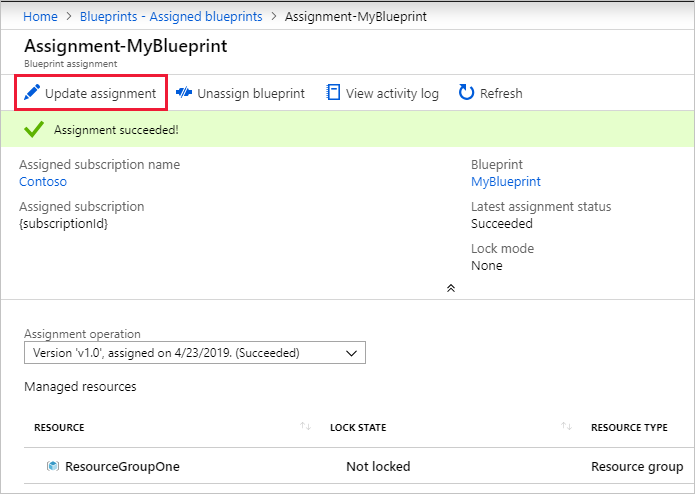
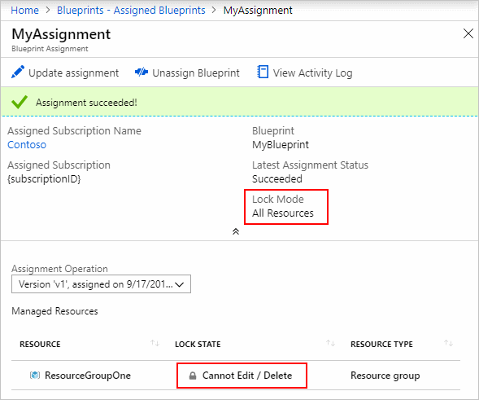
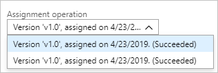

# How to update an existing blueprint assignment

When a blueprint is assigned, the assignment can be updated. There are several reasons for updating
an existing assignment, including:

- Add or remove [resource locking](../concepts/resource-locking.md)
- Change the value of [dynamic parameters](../concepts/parameters.md#dynamic-parameters)
- Upgrade the assignment to a newer **Published** version of the blueprint

## Updating assignments

1. Select **All services** in the left pane. Search for and select **Blueprints**.

1. Select **Assigned blueprints** from the page on the left.

1. In the list of blueprints, left-click the blueprint assignment. Then click the **Update assignment** button OR right-click the blueprint assignment and select **Update assignment**.

   

1. The **Assign blueprint** page will load pre-filled with all values from the original assignment. You can change the **blueprint definition version**, the **Lock Assignment** state, and any of the dynamic parameters that exist on the blueprint definition. Click **Assign** when done making changes.

1. On the updated assignment details page, see the new status. In this example, we added **Locking** to the assignment.

   

1. Explore details about other **Assignment operations** using the drop-down. The table of **Managed resources** updates by selected assignment operation.

   

## Rules for updating assignments

The deployment of the updated assignments follows a few important rules. These rules determine what
happens to already deployed resources. The requested change and the type of artifact resource being
deployed or updated determine which actions are taken.

- Role Assignments
  - If the role or the role assignee (user, group, or app) changes, a new role assignment is created. Role assignments previously deployed are left in place.
- Policy Assignments
  - If the parameters of the policy assignment are changed, the existing assignment is updated.
  - If the definition of the policy assignment is changed, a new policy assignment is created. Policy assignments previously deployed are left in place.
  - If the policy assignment artifact is removed from the blueprint, deployed policy assignments are left in place.
- Azure Resource Manager templates
  - The template is processed through Resource Manager as a **PUT**. As each resource type handles this action differently, review the documentation for each included resource to determine the impact of this action when run by Blueprints.

## Possible errors on updating assignments

When updating assignments, it's possible to make changes that break when executed. An example is
changing the location of a resource group after it has already been deployed. Any change that are
supported by [Azure Resource Manager](../../../azure-resource-manager/resource-group-overview.md)
can be made, but any change that would result in an error through Azure Resource Manager will also
result in the failure of the assignment.

There's no limit on how many times an assignment can be updated. If an error occurs, determine the
error and make another update to the assignment.  Example error scenarios:

- A bad parameter
- An already existing object
- A change not supported by Azure Resource Manager

## Next steps

- Learn about the [blueprint life-cycle](../concepts/lifecycle.md).
- Understand how to use [static and dynamic parameters](../concepts/parameters.md).
- Learn to customize the [blueprint sequencing order](../concepts/sequencing-order.md).
- Find out how to make use of [blueprint resource locking](../concepts/resource-locking.md).
- Resolve issues during the assignment of a blueprint with [general troubleshooting](../troubleshoot/general.md).