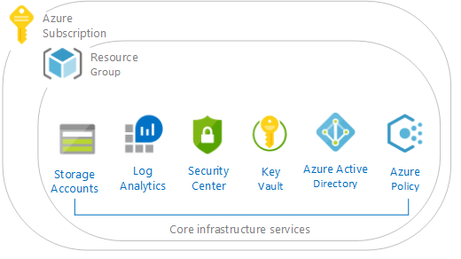

# Overview of the CAF Governance blueprint sample

The CAF Governance Blueprint is a set of controls to help you manage your cloud estate in alignment with the Microsoft Cloud Adoption Framework for Azure (CAF).

The [CAF Governance](../create-from-sample.md)
blueprint sample extends this sample.

## Architecture

The CAF Governance blueprint sample deploys foundation infrastructure resources in Azure that can
be used by organizations to put in place the governance controls necessary to manage their cloud estate.
This sample will deploy and enforce resources, policies and templates that will allow an organization to confidently get started with Azure.

This environment is composed of several Azure services used to provide a secure, fully monitored,
enterprise-ready governance. This environment is
composed of:

- An [Azure Key Vault](../../../../key-vault/key-vault-whatis.md) instance used to host secrets used
  for the VMs deployed in the shared services environment
- Deploy [Log Analytics](../../../../azure-monitor/overview.md) for the
    entire environment
- Deploy [Azure Security Center](../../../../security-center/security-center-intro.md),
    standard.
- Deploy [Azure Virtual Network](../../../../virtual-network/virtual-networks-overview.md) Hub

The blueprint also defines and deploys [Azure Policies](../../../policy/overview.md), for 
- Tagging (CostCenter) 
    - Tag Resource Group
    - Append resources in resource group with the CostCenter Tag
    - llowed Azure Region for Resources
	- Allowed Storage Account SKUs
	- Allowed Azure VM SKUs	
	- Allowed Azure Resource Types
	- Require Network Watch to be deployed 
	- Require Azure Storage Account Secure transfer Encryption
 - Initiatives
     - Enable Monitoring in Azure Security Center (78 Policies)

All these elements abide to the proven practices published in the [Azure Architecture Center - Reference Architectures](/azure/architecture/reference-architectures/).

> [!NOTE]
> The CAF Governance lays out a foundational architecture for workloads.
> You still need to deploy workloads behind this foundational architecture.

For more information, see the [Microsoft Cloud Adoption Framework for Azure](/azure/architecture/cloud-adoption/).

## Next steps

You've reviewed the overview and architecture of the CAF Governance blueprint sample.
Next, visit the following articles to learn about the control mapping and how to deploy this
sample:

> [!div class="nextstepaction"]
>  [CAF Governance blueprint - Deploy steps](./deploy.md)

Addition articles about blueprints and how to use them:

- Learn about the [blueprint life-cycle](../../concepts/lifecycle.md).
- Understand how to use [static and dynamic parameters](../../concepts/parameters.md).
- Learn to customize the [blueprint sequencing order](../../concepts/sequencing-order.md).
- Find out how to make use of [blueprint resource locking](../../concepts/resource-locking.md).
- Learn how to [update existing assignments](../../how-to/update-existing-assignments.md).