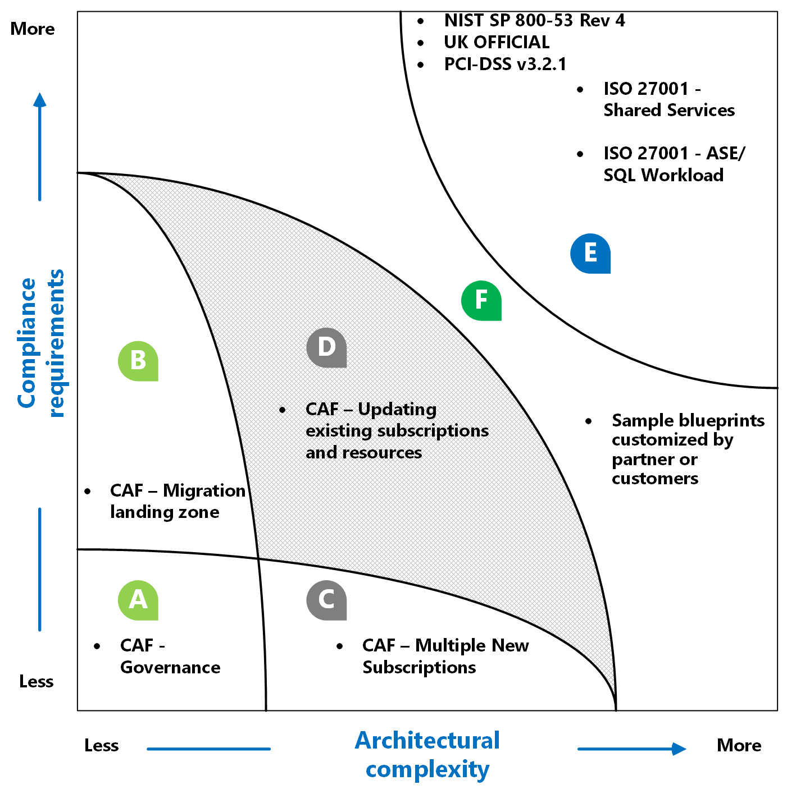

# Azure Blueprints samples

The following table includes links to samples for Azure Blueprints. Each sample is production
quality and ready to deploy today to assist you in meeting your various compliance needs.

## Standards-based blueprint samples

|  |  |
|---------|---------|
| [Canada Federal PBMM](./canada-federal-pbmm/index.md) | Provides guardrails for compliance to Canada Federal Protected B, Medium Integrity, Medium Availability (PBMM). |
| [CIS Microsoft Azure Foundations Benchmark](./cis-azure-1.1.0/index.md)| Provides a set of policies to help comply with CIS Microsoft Azure Foundations Benchmark recommendations. |
| [FedRAMP Moderate](./fedramp-m/index.md) | Provides a set of policies to help comply with FedRAMP Moderate. |
| [IRS 1075](./irs-1075/index.md) | Provides guardrails for compliance to IRS 1075.|
| [ISO 27001](./iso27001/index.md) | Provides guardrails for compliance with ISO 27001. |
| [ISO 27001 Shared Services](./iso27001-shared/index.md) | Provides a set of compliant infrastructure patterns and policy guard-rails that help towards ISO 27001 attestation. |
| [ISO 27001 App Service Environment/SQL Database workload](./iso27001-ase-sql-workload/index.md) | Provides additional infrastructure to the [ISO 27001 Shared Services](./iso27001-shared/index.md) blueprint sample. |
| [NIST SP 800-53 R4](./nist-sp-800-53-rev4/index.md) | Provides guardrails for compliance to NIST SP 800-53 R4. |
| [PCI-DSS v3.2.1](./pci-dss-3.2.1/index.md) | Provides a set of policies to aide in PCI-DSS v3.2.1 compliance. |
| [SWIFT CSP-CSCF v2020](./swift-2020/index.md) | Aides in SWIFT CSP-CSCF v2020 compliance. |
| [UK OFFICIAL and UK NHS Governance](./ukofficial/index.md) | Provides a set of compliant infrastructure patterns and policy guard-rails that help towards UK OFFICIAL and UK NHS attestation. |
| [CAF Foundation](./caf-foundation/index.md) | Provides a set of controls to help you manage your cloud estate in alignment with the [Microsoft Cloud Adoption Framework for Azure (CAF)](/azure/architecture/cloud-adoption/governance/journeys/index). |
| [CAF Migrate landing zone](./caf-migrate-landing-zone/index.md) | Provides a set of controls to help you set up for migrating your first workload and manage your cloud estate in alignment with the [Microsoft Cloud Adoption Framework for Azure (CAF)](/azure/architecture/cloud-adoption/migrate/index). |

## Samples Strategy

The CAF foundation and the CAF Migrate landing zone blueprints assume that the customer is preparing
an existing clean single subscription for migrating on premises assets / workloads in to Azure.
(Region A and B in Figure above).  

There's an opportunity to iterate on the sample blueprints and look for patterns of customizations
that a customer is applying. There is also an opportunity to proactively address blueprints that are
industry-specific like financial services and e-commerce (top end of Region B). Similarly, we
envision building blueprints for complex architectural considerations like, multiple subscriptions,
high availability, cross region resources and customers who are implementing controls over existing
subscriptions and resources (Region C and D).

There are sample blueprints that address customer scenario where the compliance requirements are
high and the architectural complexities are high (Region E in Figure above). The region F above is
one that will be addressed by customers and partners leveraging the sample blueprints and
customizing it for their unique needs.

## Next steps

- Learn about the [blueprint lifecycle](../concepts/lifecycle.md).
- Understand how to use [static and dynamic parameters](../concepts/parameters.md).
- Learn to customize the [blueprint sequencing order](../concepts/sequencing-order.md).
- Find out how to make use of [blueprint resource locking](../concepts/resource-locking.md).
- Learn how to [update existing assignments](../how-to/update-existing-assignments.md).
- Resolve issues during the assignment of a blueprint with [general troubleshooting](../troubleshoot/general.md).