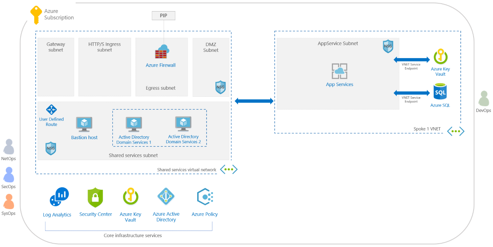

# Overview of the ISO 27001 App Service Environment/SQL Database workload blueprint sample

The ISO 27001 App Service Environment/SQL Database workload blueprint sample provides additional
infrastructure to the [ISO 27001 Shared Services](../iso27001-shared/index.md) blueprint sample.
This blueprint helps customers deploy cloud-based architectures that offer solutions to scenarios
that have accreditation or compliance requirements.

There are two ISO 27001 blueprint samples, this sample and the [ISO 27001 Shared
Services](../iso27001-shared/index.md) blueprint sample.

> [!IMPORTANT]
> This sample is dependent on infrastructure deployed by the [ISO 27001 Shared Services](../iso27001-shared/index.md)
> blueprint sample. It must be deployed first.

## Architecture

The ISO 27001 App Service Environment/SQL Database workload blueprint sample deploys a platform as
a service based web environment. The environment can be used to host multiple web applications, web
APIs, and SQL Database instances that follow the ISO 27001 standards. This blueprint sample depends
on the [ISO 27001 Shared Services](../iso27001-shared/index.md) blueprint sample.

This environment is composed of several Azure services used to provide a secure, fully monitored,
enterprise-ready workload infrastructure based on ISO 27001 standards. This environment is
composed of:

- [Role-based access control](../../../../role-based-access-control/overview.md) (RBAC) role named
  DevOps that has rights to deploy and manage resources in an [Azure App Service Environments](../../../../app-service/environment/intro.md)
  deployed by the blueprint sample
- [Azure Policies](../../../policy/overview.md) to lock down what services can be deployed to the
  environment and denying the creation of any public IP address (PIP) resource
- A virtual network containing a single subnet and peered back to a pre-existing [shared services](../iso27001-shared/index.md)
  environment and forcing all traffic to pass by the [shared services](../iso27001-shared/index.md)
  firewall. The virtual network hosts the following resources:
  - An [Azure App Service Environments](../../../../app-service/environment/intro.md) that can be
    used to host one or more web applications, web APIs, or functions
  - An [Azure Key Vault](../../../../key-vault/key-vault-overview.md) instance using a VNet service
    endpoint, for storing secrets used by applications running in the workload environment
  - An [Azure SQL Database](../../../../sql-database/sql-database-technical-overview.md) server
    instance using a VNet service endpoint, for hosting databases used for applications in the
    workload environment

## Next steps

You've reviewed the overview and architecture of the ISO 27001 App Service Environment/SQL Database
workload blueprint sample. Next, visit the following articles to learn about the control mapping
and how to deploy this sample:

> [!div class="nextstepaction"]
> [ISO 27001 App Service Environment/SQL Database workload blueprint - Control mapping](./control-mapping.md)
> [ISO 27001 App Service Environment/SQL Database workload blueprint - Deploy steps](./deploy.md)

Additional articles about blueprints and how to use them:

- Learn about the [blueprint lifecycle](../../concepts/lifecycle.md).
- Understand how to use [static and dynamic parameters](../../concepts/parameters.md).
- Learn to customize the [blueprint sequencing order](../../concepts/sequencing-order.md).
- Find out how to make use of [blueprint resource locking](../../concepts/resource-locking.md).
- Learn how to [update existing assignments](../../how-to/update-existing-assignments.md).