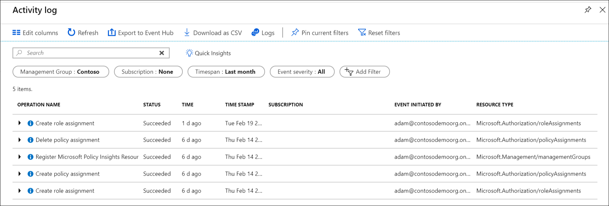

# Organize your resources with Azure management groups

If your organization has many subscriptions, you may need a way to efficiently manage access,
policies, and compliance for those subscriptions. Azure management groups provide a level of scope
above subscriptions. You organize subscriptions into containers called "management groups" and
apply your governance conditions to the management groups. All subscriptions within a management
group automatically inherit the conditions applied to the management group. Management groups give
you enterprise-grade management at a large scale no matter what type of subscriptions you might
have.

For example, you can apply policies to a management group that limits the regions available for
virtual machine (VM) creation. This policy would be applied to all management groups,
subscriptions, and resources under that management group by only allowing VMs to be created in that
region.

## Hierarchy of management groups and subscriptions

You can build a flexible structure of management groups and subscriptions to organize your
resources into a hierarchy for unified policy and access management. The following diagram shows an
example of creating a hierarchy for governance using management groups.

Create a hierarchy so you can apply a policy, for example, limit VM locations
to US West Region on the group "Production". This policy will inherit onto both EA subscriptions under that management
group and will apply to all VMs under those subscriptions. This security policy cannot be altered by the resource or
subscription owner allowing for improved governance.

Another scenario where you would use management groups is to provide user access to multi
subscriptions. By moving multiple subscriptions under that management group, you can create one [role-based access control](../../role-based-access-control/overview.md) (RBAC)
assignment on the management group, which will inherit that access to all the subscriptions.
One assignment on the management group can enable users to have access to everything they need instead of scripting RBAC over different subscriptions.

### Important facts about management groups

- 10,000 management groups can be supported in a single directory.
- A management group tree can support up to six levels of depth.
  - This limit doesn't include the Root level or the subscription level.
- Each management group and subscription can only support one parent.
- Each management group can have many children.
- All subscriptions and management groups are within a single hierarchy in each directory. See [Important facts about the Root management group](#important-facts-about-the-root-management-group).

## Root management group for each directory

Each directory is given a single top-level management group called the "Root" management group.
This root management group is built into the hierarchy to have all management groups and
subscriptions fold up to it. This root management group allows for global policies and RBAC
assignments to be applied at the directory level. The [Azure AD Global Administrator needs to elevate
themselves](../../role-based-access-control/elevate-access-global-admin.md) to the User Access Administrator role of this
root group initially. After elevating access, the administrator can assign any RBAC role to other directory users or groups to manage the hierarchy. As administrator, you can assign your own account as owner of the root management group.

### Important facts about the Root management group

- By default, the root management group's display name is **Tenant root group**. The ID is the Azure Active Directory ID.
- To change the display name, your account must be assigned the Owner or Contributor role on the root management group. For the steps to change the name, see [Change the name of a management group](manage.md#change-the-name-of-a-management-group).
- The root management group can't be moved or deleted, unlike other management groups.  
- All subscriptions and management groups fold up to the one root management group within the directory.
  - All resources in the directory fold up to the root management group for global management.
  - New subscriptions are automatically defaulted to the root management group when created.
- All Azure customers can see the root management group, but not all customers have access to manage that root management group.
  - Everyone who has access to a subscription can see the context of where that subscription is in the hierarchy.  
  - No one is given default access to the root management group. Azure AD Global Administrators are the only users that can elevate themselves to gain access.  Once they have access, the global administrators can assign any RBAC role to other users to manage.  

> [!IMPORTANT]
> Any assignment of user access or policy assignment on the root management group **applies to all resources within the directory**.
> Because of this, all customers should evaluate the need to have items defined on this scope.
> User access and policy assignments should be "Must Have" only at this scope.  

## Initial setup of management groups

When any user starts using management groups, there's an initial setup process that happens. The
first step is the root management group is created in the directory. Once this group is created,
all existing subscriptions that exist in the directory are made children of the root management
group. The reason for this process is to make sure there's only one management group hierarchy
within a directory. The single hierarchy within the directory allows administrative customers to
apply global access and policies that other customers within the directory can't bypass. Anything
assigned on the root will apply to the entire hierarchy, which includes all management groups, subscriptions, resource groups, and
resources within that Azure AD Tenant.

## Trouble seeing all subscriptions

A few directories that started using management groups early in the preview before June 25 2018 could see an issue where not all the subscriptions were within the hierarchy. The process to have all subscriptions in the hierarchy was put in place after a role or policy assignment was done on the root management group in the directory. 

### How to resolve the issue

There are two options you can do to resolve this issue.

1. Remove all Role and Policy assignments from the root management group
   1. By removing any policy and role assignments from the root management group, the service will backfill all subscriptions into the hierarchy the next overnight cycle.  This process is so there's no accidental access given or policy assignment to all of the tenants subscriptions.
   1. The best way to do this process without impacting your services is to apply the role or policy assignments one level below the Root management group. Then you can remove all assignments from the root scope.
1. Call the API directly to start the backfill process
   1. Any customer in the directory can call the *TenantBackfillStatusRequest* or *StartTenantBackfillRequest* APIs. When the StartTenantBackfillRequest API is called, it kicks off the initial setup process of moving all the subscriptions into the hierarchy. This process also starts the enforcement of all new subscription to be a child of the root management group. This process can be done without changing any assignments on the root level. By calling the API, you're saying it's okay that any policy or access assignment on the root can be applied to all subscriptions.

If you have questions on this backfill process, contact: managementgroups@microsoft.com  
  
## Management group access

Azure management groups support [Azure Role-Based Access Control
(RBAC)](../../role-based-access-control/overview.md) for all resource accesses and role definitions.
These permissions are inherited to child resources that exist in the hierarchy. Any built-in RBAC
role can be assigned to a management group that will inherit down the hierarchy to the resources.
For example, the RBAC role VM contributor can be assigned to a management group. This role has no
action on the management group, but will inherit to all VMs under that management group.

The following chart shows the list of roles and the supported actions on management groups.

| RBAC Role Name             | Create | Rename | Move** | Delete | Assign Access | Assign Policy | Read  |
|:-------------------------- |:------:|:------:|:------:|:------:|:-------------:| :------------:|:-----:|
|Owner                       | X      | X      | X      | X      | X             | X             | X     |
|Contributor                 | X      | X      | X      | X      |               |               | X     |
|MG Contributor*             | X      | X      | X      | X      |               |               | X     |
|Reader                      |        |        |        |        |               |               | X     |
|MG Reader*                  |        |        |        |        |               |               | X     |
|Resource Policy Contributor |        |        |        |        |               | X             |       |
|User Access Administrator   |        |        |        |        | X             |               |       |

*: MG Contributor and MG Reader only allow users to do those actions on the management group scope.  
**: Role Assignments on the Root management group aren't required to move a subscription or management group to and from it.  See [Manage your resources with management groups](manage.md) for details on moving items within the hierarchy.

### Custom RBAC Role Definition and Assignment

Custom RBAC roles aren't supported on management groups at this time. See the [management group
feedback forum](https://aka.ms/mgfeedback) to view the status of this item.

## Audit management groups using activity logs

Management groups are supported within [Azure Activity Log](../../azure-monitor/platform/activity-logs-overview.md). You can search all events that happen to a management group in the same central location as other Azure resources.  For example, you can see all Role Assignments or Policy Assignment changes made to a particular management group.

When looking to query on Management Groups outside of the Azure portal, the target scope for management groups looks like **"/providers/Microsoft.Management/managementGroups/{yourMgID}"**.

## Next steps

To learn more about management groups, see:

- [Create management groups to organize Azure resources](create.md)
- [How to change, delete, or manage your management groups](manage.md)
- [Review management groups in Azure PowerShell Resources Module](/powershell/module/az.resources#resources)
- [Review management groups in REST API](/rest/api/resources/managementgroups)
- [Review management groups in Azure CLI](/cli/azure/account/management-group)