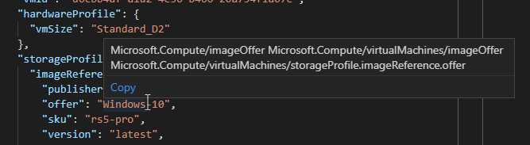

# Azure Policy definition structure

Resource policy definitions are used by Azure Policy to establish conventions for resources. Each
definition describes resource compliance and what effect to take when a resource is non-compliant.
By defining conventions, you can control costs and more easily manage your resources. For example,
you can specify that only certain types of virtual machines are allowed. Or, you can require that
all resources have a particular tag. Policies are inherited by all child resources. If a policy is
applied to a resource group, it's applicable to all the resources in that resource group.

The policy definition schema is found here: [https://schema.management.azure.com/schemas/2019-06-01/policyDefinition.json](https://schema.management.azure.com/schemas/2019-06-01/policyDefinition.json)

You use JSON to create a policy definition. The policy definition contains elements for:

- mode
- parameters
- display name
- description
- policy rule
  - logical evaluation
  - effect

For example, the following JSON shows a policy that limits where resources are deployed:

```json
{
    "properties": {
        "mode": "all",
        "parameters": {
            "allowedLocations": {
                "type": "array",
                "metadata": {
                    "description": "The list of locations that can be specified when deploying resources",
                    "strongType": "location",
                    "displayName": "Allowed locations"
                },
                "defaultValue": [ "westus2" ]
            }
        },
        "displayName": "Allowed locations",
        "description": "This policy enables you to restrict the locations your organization can specify when deploying resources.",
        "policyRule": {
            "if": {
                "not": {
                    "field": "location",
                    "in": "[parameters('allowedLocations')]"
                }
            },
            "then": {
                "effect": "deny"
            }
        }
    }
}
```

All Azure Policy samples are at [Azure Policy samples](../samples/index.md).

## Mode

**Mode** is configured depending on if the policy is targeting an Azure Resource Manager property or
a Resource Provider property.

### Resource Manager modes

The **mode** determines which resource types will be evaluated for a policy. The supported modes
are:

- `all`: evaluate resource groups and all resource types
- `indexed`: only evaluate resource types that support tags and location

We recommend that you set **mode** to `all` in most cases. All policy definitions created through
the portal use the `all` mode. If you use PowerShell or Azure CLI, you can specify the **mode**
parameter manually. If the policy definition doesn't include a **mode** value, it defaults to `all`
in Azure PowerShell and to `null` in Azure CLI. A `null` mode is the same as using `indexed` to
support backwards compatibility.

`indexed` should be used when creating policies that enforce tags or locations. While not required,
it prevents resources that don't support tags and locations from showing up as non-compliant in the
compliance results. The exception is **resource groups**. Policies that enforce location or tags on
a resource group should set **mode** to `all` and specifically target the
`Microsoft.Resources/subscriptions/resourceGroups` type. For an example, see [Enforce resource group
tags](../samples/enforce-tag-rg.md). For a list of resources that support tags, see
[Tag support for Azure resources](../../../azure-resource-manager/management/tag-support.md).

### <a name="resource-provider-modes" />Resource Provider modes (preview)

The following Resource Provider modes are currently supported during preview:

- `Microsoft.ContainerService.Data` for managing admission controller rules on
  [Azure Kubernetes Service](../../../aks/intro-kubernetes.md). Policies using this Resource
  Provider mode **must** use the [EnforceRegoPolicy](./effects.md#enforceregopolicy) effect.
- `Microsoft.Kubernetes.Data` for managing self-managed AKS Engine Kubernetes clusters on Azure.
  Policies using this Resource Provider mode **must** use the
  [EnforceOPAConstraint](./effects.md#enforceopaconstraint) effect.
- `Microsoft.KeyVault.Data` for managing vaults and certificates in
  [Azure Key Vault](../../../key-vault/key-vault-overview.md).

> [!NOTE]
> Resource Provider modes only support built-in policy definitions and don't support initiatives
> while in preview.

## Parameters

Parameters help simplify your policy management by reducing the number of policy definitions. Think
of parameters like the fields on a form – `name`, `address`, `city`, `state`. These parameters
always stay the same, however their values change based on the individual filling out the form.
Parameters work the same way when building policies. By including parameters in a policy definition,
you can reuse that policy for different scenarios by using different values.

> [!NOTE]
> Parameters may be added to an existing and assigned definition. The new parameter must include the
> **defaultValue** property. This prevents existing assignments of the policy or initiative from
> indirectly being made invalid.

### Parameter properties

A parameter has the following properties that are used in the policy definition:

- **name**: The name of your parameter. Used by the `parameters` deployment function within the
  policy rule. For more information, see [using a parameter value](#using-a-parameter-value).
- `type`: Determines if the parameter is a **string**, **array**, **object**, **boolean**,
  **integer**, **float**, or **datetime**.
- `metadata`: Defines subproperties primarily used by the Azure portal to display user-friendly
  information:
  - `description`: The explanation of what the parameter is used for. Can be used to provide
    examples of acceptable values.
  - `displayName`: The friendly name shown in the portal for the parameter.
  - `strongType`: (Optional) Used when assigning the policy definition through the portal. Provides
    a context aware list. For more information, see [strongType](#strongtype).
  - `assignPermissions`: (Optional) Set as _true_ to have Azure portal create role assignments
    during policy assignment. This property is useful in case you wish to assign permissions outside
    the assignment scope. There is one role assignment per role definition in the policy (or per
    role definition in all of the policies in the initiative). The parameter value must be a valid
    resource or scope.
- `defaultValue`: (Optional) Sets the value of the parameter in an assignment if no value is given.
  Required when updating an existing policy definition that is assigned.
- `allowedValues`: (Optional) Provides an array of values that the parameter accepts during
  assignment.

As an example, you could define a policy definition to limit the locations where resources can be
deployed. A parameter for that policy definition could be **allowedLocations**. This parameter
would be used by each assignment of the policy definition to limit the accepted values. The use of
**strongType** provides an enhanced experience when completing the assignment through the portal:

```json
"parameters": {
    "allowedLocations": {
        "type": "array",
        "metadata": {
            "description": "The list of allowed locations for resources.",
            "displayName": "Allowed locations",
            "strongType": "location"
        },
        "defaultValue": [ "westus2" ],
        "allowedValues": [
            "eastus2",
            "westus2",
            "westus"
        ]
    }
}
```

### Using a parameter value

In the policy rule, you reference parameters with the following `parameters` function syntax:

```json
{
    "field": "location",
    "in": "[parameters('allowedLocations')]"
}
```

This sample references the **allowedLocations** parameter that was demonstrated in [parameter
properties](#parameter-properties).

### strongType

Within the `metadata` property, you can use **strongType** to provide a multi-select list of
options within the Azure portal. Allowed values for **strongType** currently include:

- `location`
- `resourceTypes`
- `storageSkus`
- `vmSKUs`
- `existingResourceGroups`
- `omsWorkspace`
- `Microsoft.EventHub/Namespaces/EventHubs`
- `Microsoft.EventHub/Namespaces/EventHubs/AuthorizationRules`
- `Microsoft.EventHub/Namespaces/AuthorizationRules`
- `Microsoft.RecoveryServices/vaults`
- `Microsoft.RecoveryServices/vaults/backupPolicies`

## Definition location

While creating an initiative or policy, it's necessary to specify the definition location. The
definition location must be a management group or a subscription. This location determines the
scope to which the initiative or policy can be assigned. Resources must be direct members of or
children within the hierarchy of the definition location to target for assignment.

If the definition location is a:

- **Subscription** - Only resources within that subscription can be assigned the policy.
- **Management group** - Only resources within child management groups and child subscriptions can
  be assigned the policy. If you plan to apply the policy definition to several subscriptions, the
  location must be a management group that contains those subscriptions.

## Display name and description

You use **displayName** and **description** to identify the policy definition and provide context
for when it's used. **displayName** has a maximum length of _128_ characters and **description**
a maximum length of _512_ characters.

## Policy rule

The policy rule consists of **If** and **Then** blocks. In the **If** block, you define one or more
conditions that specify when the policy is enforced. You can apply logical operators to these
conditions to precisely define the scenario for a policy.

In the **Then** block, you define the effect that happens when the **If** conditions are fulfilled.

```json
{
    "if": {
        <condition> | <logical operator>
    },
    "then": {
        "effect": "deny | audit | append | auditIfNotExists | deployIfNotExists | disabled"
    }
}
```

### Logical operators

Supported logical operators are:

- `"not": {condition  or operator}`
- `"allOf": [{condition or operator},{condition or operator}]`
- `"anyOf": [{condition or operator},{condition or operator}]`

The **not** syntax inverts the result of the condition. The **allOf** syntax (similar to the logical
**And** operation) requires all conditions to be true. The **anyOf** syntax (similar to the logical
**Or** operation) requires one or more conditions to be true.

You can nest logical operators. The following example shows a **not** operation that is nested
within an **allOf** operation.

```json
"if": {
    "allOf": [{
            "not": {
                "field": "tags",
                "containsKey": "application"
            }
        },
        {
            "field": "type",
            "equals": "Microsoft.Storage/storageAccounts"
        }
    ]
},
```

### Conditions

A condition evaluates whether a **field** or the **value** accessor meets certain criteria. The
supported conditions are:

- `"equals": "stringValue"`
- `"notEquals": "stringValue"`
- `"like": "stringValue"`
- `"notLike": "stringValue"`
- `"match": "stringValue"`
- `"matchInsensitively": "stringValue"`
- `"notMatch": "stringValue"`
- `"notMatchInsensitively": "stringValue"`
- `"contains": "stringValue"`
- `"notContains": "stringValue"`
- `"in": ["stringValue1","stringValue2"]`
- `"notIn": ["stringValue1","stringValue2"]`
- `"containsKey": "keyName"`
- `"notContainsKey": "keyName"`
- `"less": "value"`
- `"lessOrEquals": "value"`
- `"greater": "value"`
- `"greaterOrEquals": "value"`
- `"exists": "bool"`

When using the **like** and **notLike** conditions, you provide a wildcard `*` in the value.
The value shouldn't have more than one wildcard `*`.

When using the **match** and **notMatch** conditions, provide `#` to match a digit, `?` for a
letter, `.` to match any character, and any other character to match that actual character.
**match** and **notMatch** are case-sensitive. Case-insensitive alternatives are available in
**matchInsensitively** and **notMatchInsensitively**. For examples, see [Allow several name patterns](../samples/allow-multiple-name-patterns.md).

### Fields

Conditions are formed by using fields. A field matches properties in the resource request payload
and describes the state of the resource.

The following fields are supported:

- `name`
- `fullName`
  - Returns the full name of the resource. The full name of a resource is the resource name
    prepended by any parent resource names (for example "myServer/myDatabase").
- `kind`
- `type`
- `location`
  - Use **global** for resources that are location agnostic. For an example, see [Samples - Allowed locations](../samples/allowed-locations.md).
- `identity.type`
  - Returns the type of [managed identity](../../../active-directory/managed-identities-azure-resources/overview.md)
    enabled on the resource.
- `tags`
- `tags['<tagName>']`
  - This bracket syntax supports tag names that have punctuation such as a hyphen, period, or space.
  - Where **\<tagName\>** is the name of the tag to validate the condition for.
  - Examples: `tags['Acct.CostCenter']` where **Acct.CostCenter** is the name of the tag.
- `tags['''<tagName>''']`
  - This bracket syntax supports tag names that have apostrophes in it by escaping with double
    apostrophes.
  - Where **'\<tagName\>'** is the name of the tag to validate the condition for.
  - Example: `tags['''My.Apostrophe.Tag''']` where **'My.Apostrophe.Tag'** is the name of the tag.
- property aliases - for a list, see [Aliases](#aliases).

> [!NOTE]
> `tags.<tagName>`, `tags[tagName]`, and `tags[tag.with.dots]` are still acceptable ways of
> declaring a tags field. However, the preferred expressions are those listed above.

#### Use tags with parameters

A parameter value can be passed to a tag field. Passing a parameter to a tag field increases the
flexibility of the policy definition during policy assignment.

In the following example, `concat` is used to create a tags field lookup for the tag named the
value of the **tagName** parameter. If that tag doesn't exist, the **modify** effect is used to add
the tag using the value of the same named tag set on the audited resources parent resource group by
using the `resourcegroup()` lookup function.

```json
{
    "if": {
        "field": "[concat('tags[', parameters('tagName'), ']')]",
        "exists": "false"
    },
    "then": {
        "effect": "modify",
        "details": {
            "operations": [{
                "operation": "add",
                "field": "[concat('tags[', parameters('tagName'), ']')]",
                "value": "[resourcegroup().tags[parameters('tagName')]]"
            }],
            "roleDefinitionIds": [
                "/providers/microsoft.authorization/roleDefinitions/b24988ac-6180-42a0-ab88-20f7382dd24c"
            ]
        }
    }
}
```

### Value

Conditions can also be formed using **value**. **value** checks conditions against
[parameters](#parameters), [supported template functions](#policy-functions), or literals.
**value** is paired with any supported [condition](#conditions).

> [!WARNING]
> If the result of a _template function_ is an error, policy evaluation fails. A failed evaluation
> is an implicit **deny**. For more information, see [avoiding template failures](#avoiding-template-failures).

#### Value examples

This policy rule example uses **value** to compare the result of the `resourceGroup()` function and
the returned **name** property to a **like** condition of `*netrg`. The rule denies any resource
not of the `Microsoft.Network/*` **type** in any resource group whose name ends in `*netrg`.

```json
{
    "if": {
        "allOf": [{
                "value": "[resourceGroup().name]",
                "like": "*netrg"
            },
            {
                "field": "type",
                "notLike": "Microsoft.Network/*"
            }
        ]
    },
    "then": {
        "effect": "deny"
    }
}
```

This policy rule example uses **value** to check if the result of multiple nested functions
**equals** `true`. The rule denies any resource that doesn't have at least three tags.

```json
{
    "mode": "indexed",
    "policyRule": {
        "if": {
            "value": "[less(length(field('tags')), 3)]",
            "equals": true
        },
        "then": {
            "effect": "deny"
        }
    }
}
```

#### Avoiding template failures

The use of _template functions_ in **value** allows for many complex nested functions. If the result
of a _template function_ is an error, policy evaluation fails. A failed evaluation is an implicit
**deny**. An example of a **value** that fails in certain scenarios:

```json
{
    "policyRule": {
        "if": {
            "value": "[substring(field('name'), 0, 3)]",
            "equals": "abc"
        },
        "then": {
            "effect": "audit"
        }
    }
}
```

The example policy rule above uses [substring()](../../../azure-resource-manager/templates/template-functions-string.md#substring)
to compare the first three characters of **name** to **abc**. If **name** is shorter than three
characters, the `substring()` function results in an error. This error causes the policy to become a
**deny** effect.

Instead, use the [if()](../../../azure-resource-manager/templates/template-functions-logical.md#if)
function to check if the first three characters of **name** equal **abc** without allowing a
**name** shorter than three characters to cause an error:

```json
{
    "policyRule": {
        "if": {
            "value": "[if(greaterOrEquals(length(field('name')), 3), substring(field('name'), 0, 3), 'not starting with abc')]",
            "equals": "abc"
        },
        "then": {
            "effect": "audit"
        }
    }
}
```

With the revised policy rule, `if()` checks the length of **name** before trying to get a
`substring()` on a value with fewer than three characters. If **name** is too short, the value "not
starting with abc" is returned instead and compared to **abc**. A resource with a short name that
doesn't begin with **abc** still fails the policy rule, but no longer causes an error during
evaluation.

### Count

Conditions that count how many members of an array in the resource payload satisfy a condition
expression can be formed using **count** expression. Common scenarios are checking whether 'at least
one of', 'exactly one of', 'all of', or 'none of' the array members satisfy the condition. **count**
evaluates each array member for a condition expression and sums the _true_ results, which is then
compared to the expression operator.

The structure of the **count** expression is:

```json
{
    "count": {
        "field": "<[*] alias>",
        "where": {
            /* condition expression */
        }
    },
    "<condition>": "<compare the count of true condition expression array members to this value>"
}
```

The following properties are used with **count**:

- **count.field** (required): Contains the path to the array and must be an array alias. If the
  array is missing, the expression is evaluated to _false_ without considering the condition
  expression.
- **count.where** (optional): The condition expression to individually evaluate each [\[\*\]
  alias](#understanding-the--alias) array member of **count.field**. If this property is not
  provided, all array members with the path of 'field' are evaluated to _true_. Any
  [condition](../concepts/definition-structure.md#conditions) can be used inside this property.
  [Logical operators](#logical-operators) can be used inside this property to create complex
  evaluation requirements.
- **\<condition\>** (required): The value is compared to the number of items that met the
  **count.where** condition expression. A numeric
  [condition](../concepts/definition-structure.md#conditions) should be used.

#### Count examples

Example 1: Check if an array is empty

```json
{
    "count": {
        "field": "Microsoft.Network/networkSecurityGroups/securityRules[*]"
    },
    "equals": 0
}
```

Example 2: Check for only one array member to meet the condition expression

```json
{
    "count": {
        "field": "Microsoft.Network/networkSecurityGroups/securityRules[*]",
        "where": {
            "field": "Microsoft.Network/networkSecurityGroups/securityRules[*].description",
            "equals": "My unique description"
        }
    },
    "equals": 1
}
```

Example 3: Check for at least one array member to meet the condition expression

```json
{
    "count": {
        "field": "Microsoft.Network/networkSecurityGroups/securityRules[*]",
        "where": {
            "field": "Microsoft.Network/networkSecurityGroups/securityRules[*].description",
            "equals": "My common description"
        }
    },
    "greaterOrEquals": 1
}
```

Example 4: Check that all object array members meet the condition expression

```json
{
    "count": {
        "field": "Microsoft.Network/networkSecurityGroups/securityRules[*]",
        "where": {
            "field": "Microsoft.Network/networkSecurityGroups/securityRules[*].description",
            "equals": "description"
        }
    },
    "equals": "[length(field('Microsoft.Network/networkSecurityGroups/securityRules[*]'))]"
}
```

Example 5: Check that all string array members meet the condition expression

```json
{
    "count": {
        "field": "Microsoft.Sql/servers/securityAlertPolicies/emailAddresses[*]",
        "where": {
            "field": "Microsoft.Sql/servers/securityAlertPolicies/emailAddresses[*]",
            "like": "*@contoso.com"
        }
    },
    "equals": "[length(field('Microsoft.Sql/servers/securityAlertPolicies/emailAddresses[*]'))]"
}
```

Example 6: Use **field** inside **value** to check that all array members meet the condition
expression

```json
{
    "count": {
        "field": "Microsoft.Sql/servers/securityAlertPolicies/emailAddresses[*]",
        "where": {
            "value": "[last(split(first(field('Microsoft.Sql/servers/securityAlertPolicies/emailAddresses[*]')), '@'))]",
            "equals": "contoso.com"
        }
    },
    "equals": "[length(field('Microsoft.Sql/servers/securityAlertPolicies/emailAddresses[*]'))]"
}
```

Example 7: Check that at least one array member matches multiple properties in the condition
expression

```json
{
    "count": {
        "field": "Microsoft.Network/networkSecurityGroups/securityRules[*]",
        "where": {
            "allOf": [
                {
                    "field": "Microsoft.Network/networkSecurityGroups/securityRules[*].direction",
                    "equals": "Inbound"
                },
                {
                    "field": "Microsoft.Network/networkSecurityGroups/securityRules[*].access",
                    "equals": "Allow"
                },
                {
                    "field": "Microsoft.Network/networkSecurityGroups/securityRules[*].destinationPortRange",
                    "equals": "3389"
                }
            ]
        }
    },
    "greater": 0
}
```

### Effect

Azure Policy supports the following types of effect:

- **Append**: adds the defined set of fields to the request
- **Audit**: generates a warning event in activity log but doesn't fail the request
- **AuditIfNotExists**: generates a warning event in activity log if a related resource doesn't
  exist
- **Deny**: generates an event in the activity log and fails the request
- **DeployIfNotExists**: deploys a related resource if it doesn't already exist
- **Disabled**: doesn't evaluate resources for compliance to the policy rule
- **EnforceOPAConstraint** (preview): configures the Open Policy Agent admissions controller with
  Gatekeeper v3 for self-managed Kubernetes clusters on Azure (preview)
- **EnforceRegoPolicy** (preview): configures the Open Policy Agent admissions controller with
  Gatekeeper v2 in Azure Kubernetes Service
- **Modify**: adds, updates, or removes the defined tags from a resource

For complete details on each effect, order of evaluation, properties, and examples, see
[Understanding Azure Policy Effects](effects.md).

### Policy functions

All [Resource Manager template
functions](../../../azure-resource-manager/templates/template-functions.md) are available to
use within a policy rule, except the following functions and user-defined functions:

- copyIndex()
- deployment()
- list*
- newGuid()
- pickZones()
- providers()
- reference()
- resourceId()
- variables()

The following functions are available to use in a policy rule, but differ from use in an Azure
Resource Manager template:

- addDays(dateTime, numberOfDaysToAdd)
  - **dateTime**: [Required] string - String in the Universal ISO 8601 DateTime format
    'yyyy-MM-ddTHH:mm:ss.fffffffZ'
  - **numberOfDaysToAdd**: [Required] integer - Number of days to add
- utcNow() - Unlike a Resource Manager template, this can be used outside defaultValue.
  - Returns a string that is set to the current date and time in Universal ISO 8601 DateTime format
    'yyyy-MM-ddTHH:mm:ss.fffffffZ'

Additionally, the `field` function is available to policy rules. `field` is primarily used with
**AuditIfNotExists** and **DeployIfNotExists** to reference fields on the resource that are being
evaluated. An example of this use can be seen in the [DeployIfNotExists
example](effects.md#deployifnotexists-example).

#### Policy function example

This policy rule example uses the `resourceGroup` resource function to get the **name** property,
combined with the `concat` array and object function to build a `like` condition that enforces the
resource name to start with the resource group name.

```json
{
    "if": {
        "not": {
            "field": "name",
            "like": "[concat(resourceGroup().name,'*')]"
        }
    },
    "then": {
        "effect": "deny"
    }
}
```

## Aliases

You use property aliases to access specific properties for a resource type. Aliases enable you to
restrict what values or conditions are allowed for a property on a resource. Each alias maps to
paths in different API versions for a given resource type. During policy evaluation, the policy
engine gets the property path for that API version.

The list of aliases is always growing. To find what aliases are currently supported by Azure
Policy, use one of the following methods:

- Azure Policy extension for Visual Studio Code (recommended)

  Use the [Azure Policy extension for Visual Studio Code](../how-to/extension-for-vscode.md) to view
  and discover aliases for resource properties.

  

- Azure Resource Graph

  Use the `project` operator to display the **alias** of a resource.

  ```kusto
  Resources
  | where type=~'microsoft.storage/storageaccounts'
  | limit 1
  | project aliases
  ```
  
  ```azurecli-interactive
  az graph query -q "Resources | where type=~'microsoft.storage/storageaccounts' | limit 1 | project aliases"
  ```
  
  ```azurepowershell-interactive
  Search-AzGraph -Query "Resources | where type=~'microsoft.storage/storageaccounts' | limit 1 | project aliases"
  ```

- Azure PowerShell

  ```azurepowershell-interactive
  # Login first with Connect-AzAccount if not using Cloud Shell

  # Use Get-AzPolicyAlias to list available providers
  Get-AzPolicyAlias -ListAvailable

  # Use Get-AzPolicyAlias to list aliases for a Namespace (such as Azure Compute -- Microsoft.Compute)
  (Get-AzPolicyAlias -NamespaceMatch 'compute').Aliases
  ```

- Azure CLI

  ```azurecli-interactive
  # Login first with az login if not using Cloud Shell

  # List namespaces
  az provider list --query [*].namespace

  # Get Azure Policy aliases for a specific Namespace (such as Azure Compute -- Microsoft.Compute)
  az provider show --namespace Microsoft.Compute --expand "resourceTypes/aliases" --query "resourceTypes[].aliases[].name"
  ```

- REST API / ARMClient

  ```http
  GET https://management.azure.com/providers/?api-version=2017-08-01&$expand=resourceTypes/aliases
  ```

### Understanding the [*] alias

Several of the aliases that are available have a version that appears as a 'normal' name and another
that has **\[\*\]** attached to it. For example:

- `Microsoft.Storage/storageAccounts/networkAcls.ipRules`
- `Microsoft.Storage/storageAccounts/networkAcls.ipRules[*]`

The 'normal' alias represents the field as a single value. This field is for exact match comparison
scenarios when the entire set of values must be exactly as defined, no more and no less.

The **\[\*\]** alias makes it possible to compare against the value of each element in the array and
specific properties of each element. This approach makes it possible to compare element properties
for 'if none of', 'if any of', or 'if all of' scenarios. For more complex scenarios, use the
[count](#count) condition expression. Using **ipRules\[\*\]**, an example would be validating that
every _action_ is _Deny_, but not worrying about how many rules exist or what the IP _value_ is.
This sample rule checks for any matches of **ipRules\[\*\].value** to **10.0.4.1** and applies the
**effectType** only if it doesn't find at least one match:

```json
"policyRule": {
    "if": {
        "allOf": [
            {
                "field": "Microsoft.Storage/storageAccounts/networkAcls.ipRules",
                "exists": "true"
            },
            {
                "field": "Microsoft.Storage/storageAccounts/networkAcls.ipRules[*].value",
                "notEquals": "10.0.4.1"
            }
        ]
    },
    "then": {
        "effect": "[parameters('effectType')]"
    }
}
```


For more information, see [evaluating the [\*]
alias](../how-to/author-policies-for-arrays.md#evaluating-the--alias).

## Initiatives

Initiatives enable you to group several related policy definitions to simplify assignments and
management because you work with a group as a single item. For example, you can group related
tagging policy definitions into a single initiative. Rather than assigning each policy individually,
you apply the initiative.

The following example illustrates how to create an initiative for handling two tags: `costCenter`
and `productName`. It uses two built-in policies to apply the default tag value.

```json
{
    "properties": {
        "displayName": "Billing Tags Policy",
        "policyType": "Custom",
        "description": "Specify cost Center tag and product name tag",
        "parameters": {
            "costCenterValue": {
                "type": "String",
                "metadata": {
                    "description": "required value for Cost Center tag"
                }
            },
            "productNameValue": {
                "type": "String",
                "metadata": {
                    "description": "required value for product Name tag"
                }
            }
        },
        "policyDefinitions": [{
                "policyDefinitionId": "/providers/Microsoft.Authorization/policyDefinitions/1e30110a-5ceb-460c-a204-c1c3969c6d62",
                "parameters": {
                    "tagName": {
                        "value": "costCenter"
                    },
                    "tagValue": {
                        "value": "[parameters('costCenterValue')]"
                    }
                }
            },
            {
                "policyDefinitionId": "/providers/Microsoft.Authorization/policyDefinitions/2a0e14a6-b0a6-4fab-991a-187a4f81c498",
                "parameters": {
                    "tagName": {
                        "value": "costCenter"
                    },
                    "tagValue": {
                        "value": "[parameters('costCenterValue')]"
                    }
                }
            },
            {
                "policyDefinitionId": "/providers/Microsoft.Authorization/policyDefinitions/1e30110a-5ceb-460c-a204-c1c3969c6d62",
                "parameters": {
                    "tagName": {
                        "value": "productName"
                    },
                    "tagValue": {
                        "value": "[parameters('productNameValue')]"
                    }
                }
            },
            {
                "policyDefinitionId": "/providers/Microsoft.Authorization/policyDefinitions/2a0e14a6-b0a6-4fab-991a-187a4f81c498",
                "parameters": {
                    "tagName": {
                        "value": "productName"
                    },
                    "tagValue": {
                        "value": "[parameters('productNameValue')]"
                    }
                }
            }
        ]
    },
    "id": "/subscriptions/<subscription-id>/providers/Microsoft.Authorization/policySetDefinitions/billingTagsPolicy",
    "type": "Microsoft.Authorization/policySetDefinitions",
    "name": "billingTagsPolicy"
}
```

## Next steps

- Review examples at [Azure Policy samples](../samples/index.md).
- Review [Understanding policy effects](effects.md).
- Understand how to [programmatically create policies](../how-to/programmatically-create.md).
- Learn how to [get compliance data](../how-to/get-compliance-data.md).
- Learn how to [remediate non-compliant resources](../how-to/remediate-resources.md).
- Review what a management group is with [Organize your resources with Azure management groups](../../management-groups/overview.md).
