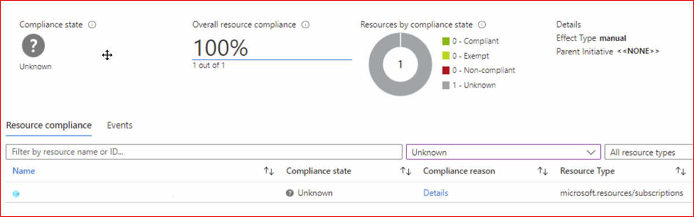

# Understand Azure Policy effects

Each policy definition in Azure Policy has a single effect. That effect determines what happens when
the policy rule is evaluated to match. The effects behave differently if they are for a new
resource, an updated resource, or an existing resource.

These effects are currently supported in a policy definition:

- [AddToNetworkGroup](#addtonetworkgroup)
- [Append](#append)
- [Audit](#audit)
- [AuditIfNotExists](#auditifnotexists)
- [Deny](#deny)
- [DenyAction](#denyaction)
- [DeployIfNotExists](#deployifnotexists)
- [Disabled](#disabled)
- [Manual](#manual)
- [Modify](#modify)
- [Mutate](#mutate-preview)

## Interchanging effects

Sometimes multiple effects can be valid for a given policy definition. Parameters are often used to specify allowed effect values so that a single definition can be more versatile. However, it's important to note that not all effects are interchangeable. Resource properties and logic in the policy rule can determine whether a certain effect is considered valid to the policy definition. For example, policy definitions with effect **AuditIfNotExists** require other details in the policy rule that aren't required for policies with effect **Audit**. The effects also behave differently. **Audit** policies assess a resource's compliance based on its own properties, while **AuditIfNotExists** policies assess a resource's compliance based on a child or extension resource's properties.

The following list is some general guidance around interchangeable effects:
- **Audit**, **Deny**, and either **Modify** or **Append** are often interchangeable.
- **AuditIfNotExists** and **DeployIfNotExists** are often interchangeable.
- **Manual** isn't interchangeable.
- **Disabled** is interchangeable with any effect.

## Order of evaluation

Requests to create or update a resource are evaluated by Azure Policy first. Azure Policy creates a
list of all assignments that apply to the resource and then evaluates the resource against each
definition. For a [Resource Manager mode](./definition-structure.md#resource-manager-modes), Azure
Policy processes several of the effects before handing the request to the appropriate Resource
Provider. This order prevents unnecessary processing by a Resource Provider when a resource doesn't
meet the designed governance controls of Azure Policy. With a
[Resource Provider mode](./definition-structure.md#resource-provider-modes), the Resource Provider
manages the evaluation and outcome and reports the results back to Azure Policy.

- **Disabled** is checked first to determine whether the policy rule should be evaluated.
- **Append** and **Modify** are then evaluated. Since either could alter the request, a change made
  might prevent an audit or deny effect from triggering. These effects are only available with a
  Resource Manager mode.
- **Deny** is then evaluated. By evaluating deny before audit, double logging of an undesired
  resource is prevented.
- **Audit** is evaluated.
- **Manual** is evaluated.
- **AuditIfNotExists** is evaluated.
- **denyAction** is evaluated last.

After the Resource Provider returns a success code on a Resource Manager mode request,
**AuditIfNotExists** and **DeployIfNotExists** evaluate to determine whether more compliance
logging or action is required.

`PATCH` requests that only modify `tags` related fields restricts policy evaluation to
policies containing conditions that inspect `tags` related fields.

## AddToNetworkGroup

AddToNetworkGroup is used in Azure Virtual Network Manager to define dynamic network group membership. This effect is specific to _Microsoft.Network.Data_ [policy mode](./definition-structure.md#resource-provider-modes) definitions only.

With network groups, your policy definition includes your conditional expression for matching virtual networks meeting your criteria, and specifies the destination network group where any matching resources are placed. The addToNetworkGroup effect is used to place resources in the destination network group.

To learn more, go to [Configuring Azure Policy with network groups in Azure Virtual Network Manager](../../../virtual-network-manager/concept-azure-policy-integration.md).

## Append

Append is used to add more fields to the requested resource during creation or update. A
common example is specifying allowed IPs for a storage resource.

> [!IMPORTANT]
> Append is intended for use with non-tag properties. While Append can add tags to a resource during
> a create or update request, it's recommended to use the [Modify](#modify) effect for tags instead.

### Append evaluation

Append evaluates before the request gets processed by a Resource Provider during the creation or
updating of a resource. Append adds fields to the resource when the **if** condition of the policy
rule is met. If the append effect would override a value in the original request with a different
value, then it acts as a deny effect and rejects the request. To append a new value to an existing
array, use the `[*]` version of the alias.

When a policy definition using the append effect is run as part of an evaluation cycle, it doesn't
make changes to resources that already exist. Instead, it marks any resource that meets the **if**
condition as non-compliant.

### Append properties

An append effect only has a **details** array, which is required. As **details** is an array, it can
take either a single **field/value** pair or multiples. Refer to
[definition structure](definition-structure.md#fields) for the list of acceptable fields.

### Append examples

Example 1: Single **field/value** pair using a non-`[*]`
[alias](definition-structure.md#aliases) with an array **value** to set IP rules on a storage
account. When the non-`[*]` alias is an array, the effect appends the **value** as the entire
array. If the array already exists, a deny event occurs from the conflict.

```json
"then": {
    "effect": "append",
    "details": [{
        "field": "Microsoft.Storage/storageAccounts/networkAcls.ipRules",
        "value": [{
            "action": "Allow",
            "value": "134.5.0.0/21"
        }]
    }]
}
```

Example 2: Single **field/value** pair using an `[*]` [alias](definition-structure.md#aliases)
with an array **value** to set IP rules on a storage account. When you use the `[*]` alias, the
effect appends the **value** to a potentially pre-existing array. If the array doesn't exist yet,
it's created.

```json
"then": {
    "effect": "append",
    "details": [{
        "field": "Microsoft.Storage/storageAccounts/networkAcls.ipRules[*]",
        "value": {
            "value": "40.40.40.40",
            "action": "Allow"
        }
    }]
}
```

## Audit

Audit is used to create a warning event in the activity log when evaluating a non-compliant
resource, but it doesn't stop the request.

### Audit evaluation

Audit is the last effect checked by Azure Policy during the creation or update of a resource. For a
Resource Manager mode, Azure Policy then sends the resource to the Resource Provider. When
evaluating a create or update request for a resource, Azure Policy adds a
`Microsoft.Authorization/policies/audit/action` operation to the activity log and marks the resource
as non-compliant. During a standard compliance evaluation cycle, only the compliance status on the
resource is updated.

### Audit properties

For a Resource Manager mode, the audit effect doesn't have any other properties for use in the
**then** condition of the policy definition.

For a Resource Provider mode of `Microsoft.Kubernetes.Data`, the audit effect has the following
subproperties of **details**. Use of `templateInfo` is required for new or updated policy
definitions as `constraintTemplate` is deprecated.

- **templateInfo** (required)
  - Can't be used with `constraintTemplate`.
  - **sourceType** (required)
    - Defines the type of source for the constraint template. Allowed values: _PublicURL_ or
      _Base64Encoded_.
    - If _PublicURL_, paired with property `url` to provide location of the constraint template. The
      location must be publicly accessible.

      > [!WARNING]
      > Don't use SAS URIs, URL tokens, or anything else that could expose secrets in plain text.

    - If _Base64Encoded_, paired with property `content` to provide the base 64 encoded constraint
      template. See
      [Create policy definition from constraint template](../how-to/extension-for-vscode.md) to
      create a custom definition from an existing
      [Open Policy Agent](https://www.openpolicyagent.org/) (OPA) Gatekeeper v3
      [constraint template](https://open-policy-agent.github.io/gatekeeper/website/docs/howto/#constraint-templates).
- **constraint** (deprecated)
  - Can't be used with `templateInfo`.
  - The CRD implementation of the Constraint template. Uses parameters passed via **values** as
    `{{ .Values.<valuename> }}`. In example 2 below, these values are
    `{{ .Values.excludedNamespaces }}` and `{{ .Values.allowedContainerImagesRegex }}`.
- **constraintTemplate** (deprecated)
  - Can't be used with `templateInfo`.
  - Must be replaced with `templateInfo` when creating or updating a policy definition.
  - The Constraint template CustomResourceDefinition (CRD) that defines new Constraints. The
    template defines the Rego logic, the Constraint schema, and the Constraint parameters that are
    passed via **values** from Azure Policy. For more information, go to [Gatekeeper constraints](https://open-policy-agent.github.io/gatekeeper/website/docs/howto/#constraints).
- **constraintInfo** (optional)
  - Can't be used with `constraint`, `constraintTemplate`, `apiGroups`, `kinds`, `scope`, `namespaces`, `excludedNamespaces`, or `labelSelector`.
  - If `constraintInfo` isn't provided, the constraint can be generated from `templateInfo` and policy.
  - **sourceType** (required)
    - Defines the type of source for the constraint. Allowed values: _PublicURL_ or _Base64Encoded_.
    - If _PublicURL_, paired with property `url` to provide location of the constraint. The location must be publicly accessible.

      > [!WARNING]
      > Don't use SAS URIs or tokens in `url` or anything else that could expose a secret.
- **namespaces** (optional)
  - An _array_ of
    [Kubernetes namespaces](https://kubernetes.io/docs/concepts/overview/working-with-objects/namespaces/)
    to limit policy evaluation to.
  - An empty or missing value causes policy evaluation to include all namespaces not
    defined in _excludedNamespaces_.
- **excludedNamespaces** (optional)
  - An _array_ of
    [Kubernetes namespaces](https://kubernetes.io/docs/concepts/overview/working-with-objects/namespaces/)
    to exclude from policy evaluation.
- **labelSelector** (optional)
  - An _object_ that includes _matchLabels_ (object) and _matchExpression_ (array) properties to
    allow specifying which Kubernetes resources to include for policy evaluation that matched the
    provided
    [labels and selectors](https://kubernetes.io/docs/concepts/overview/working-with-objects/labels/).
  - An empty or missing value causes policy evaluation to include all labels and selectors, except
    namespaces defined in _excludedNamespaces_.
- **scope** (optional)
  - A _string_ that includes the [scope](https://open-policy-agent.github.io/gatekeeper/website/docs/howto/#the-match-field) property to allow specifying if cluster-scoped or namespaced-scoped resources are matched.
- **apiGroups** (required when using _templateInfo_)
  - An _array_ that includes the
    [API groups](https://kubernetes.io/docs/reference/using-api/#api-groups) to match. An empty
    array (`[""]`) is the core API group.
  - Defining `["*"]` for _apiGroups_ is disallowed.
- **kinds** (required when using _templateInfo_)
  - An _array_ that includes the
    [kind](https://kubernetes.io/docs/concepts/overview/working-with-objects/kubernetes-objects/#required-fields)
    of Kubernetes object to limit evaluation to.
  - Defining `["*"]` for _kinds_ is disallowed.
- **values** (optional)
  - Defines any parameters and values to pass to the Constraint. Each value must exist and match a property in the validation openAPIV3Schema section of the Constraint template CRD.

### Audit example

Example 1: Using the audit effect for Resource Manager modes.

```json
"then": {
    "effect": "audit"
}
```

Example 2: Using the audit effect for a Resource Provider mode of `Microsoft.Kubernetes.Data`. The
additional information in **details.templateInfo** declares use of _PublicURL_ and sets `url` to the
location of the Constraint template to use in Kubernetes to limit the allowed container images.

```json
"then": {
    "effect": "audit",
    "details": {
        "templateInfo": {
            "sourceType": "PublicURL",
            "url": "https://store.policy.core.windows.net/kubernetes/container-allowed-images/v1/template.yaml",
        },
        "values": {
            "imageRegex": "[parameters('allowedContainerImagesRegex')]"
        },
        "apiGroups": [""],
        "kinds": ["Pod"]
    }
}
```

## AuditIfNotExists

AuditIfNotExists enables auditing of resources _related_ to the resource that matches the **if**
condition, but don't have the properties specified in the **details** of the **then** condition.

### AuditIfNotExists evaluation

AuditIfNotExists runs after a Resource Provider has handled a create or update resource request and
has returned a success status code. The audit occurs if there are no related resources or if the
resources defined by **ExistenceCondition** don't evaluate to true. For new and updated resources,
Azure Policy adds a `Microsoft.Authorization/policies/audit/action` operation to the activity log
and marks the resource as non-compliant. When triggered, the resource that satisfied the **if**
condition is the resource that is marked as non-compliant.

### AuditIfNotExists properties

The **details** property of the AuditIfNotExists effects has all the subproperties that define the
related resources to match.

- **Type** (required)
  - Specifies the type of the related resource to match.
  - If **type** is a resource type underneath the **if** condition resource, the policy
    queries for resources of this **type** within the scope of the evaluated resource. Otherwise,
    policy queries within the same resource group or subscription as the evaluated resource depending on the **existenceScope**.
- **Name** (optional)
  - Specifies the exact name of the resource to match and causes the policy to fetch one specific
    resource instead of all resources of the specified type.
  - When the condition values for **if.field.type** and **then.details.type** match, then **Name**
    becomes _required_ and must be `[field('name')]`, or `[field('fullName')]` for a child resource.
    However, an [audit](#audit) effect should be considered instead.

> [!NOTE]
>
> **Type** and **Name** segments can be combined to generically retrieve nested resources.
>
> To retrieve a specific resource, you can use `"type": "Microsoft.ExampleProvider/exampleParentType/exampleNestedType"` and `"name": "parentResourceName/nestedResourceName"`.
>
> To retrieve a collection of nested resources, a wildcard character `?` can be provided in place of the last name segment. For example, `"type": "Microsoft.ExampleProvider/exampleParentType/exampleNestedType"` and `"name": "parentResourceName/?"`. This can be combined with field functions to access resources related to the evaluated resource, such as `"name": "[concat(field('name'), '/?')]"`."

- **ResourceGroupName** (optional)
  - Allows the matching of the related resource to come from a different resource group.
  - Doesn't apply if **type** is a resource that would be underneath the **if** condition resource.
  - Default is the **if** condition resource's resource group.
- **ExistenceScope** (optional)
  - Allowed values are _Subscription_ and _ResourceGroup_.
  - Sets the scope of where to fetch the related resource to match from.
  - Doesn't apply if **type** is a resource that would be underneath the **if** condition resource.
  - For _ResourceGroup_, would limit to the resource group in **ResourceGroupName** if specified. If **ResourceGroupName** isn't specified, would limit to the **if** condition resource's resource group, which is the default behavior.
  - For _Subscription_, queries the entire subscription for the related resource. Assignment scope should be set at subscription or higher for proper evaluation.
  - Default is _ResourceGroup_.
- **EvaluationDelay** (optional)
  - Specifies when the existence of the related resources should be evaluated. The delay is only
    used for evaluations that are a result of a create or update resource request.
  - Allowed values are `AfterProvisioning`, `AfterProvisioningSuccess`, `AfterProvisioningFailure`,
    or an ISO 8601 duration between 0 and 360 minutes.
  - The _AfterProvisioning_ values inspect the provisioning result of the resource that was
    evaluated in the policy rule's IF condition. `AfterProvisioning` runs after provisioning is
    complete, regardless of outcome. If provisioning takes longer than 6 hours, it's treated as a
    failure when determining _AfterProvisioning_ evaluation delays.
  - Default is `PT10M` (10 minutes).
  - Specifying a long evaluation delay might cause the recorded compliance state of the resource to
    not update until the next
    [evaluation trigger](../how-to/get-compliance-data.md#evaluation-triggers).
- **ExistenceCondition** (optional)
  - If not specified, any related resource of **type** satisfies the effect and doesn't trigger the
    audit.
  - Uses the same language as the policy rule for the **if** condition, but is evaluated against
    each related resource individually.
  - If any matching related resource evaluates to true, the effect is satisfied and doesn't trigger
    the audit.
  - Can use [field()] to check equivalence with values in the **if** condition.
  - For example, could be used to validate that the parent resource (in the **if** condition) is in
    the same resource location as the matching related resource.

### AuditIfNotExists example

Example: Evaluates Virtual Machines to determine whether the Antimalware extension exists then
audits when missing.

```json
{
    "if": {
        "field": "type",
        "equals": "Microsoft.Compute/virtualMachines"
    },
    "then": {
        "effect": "auditIfNotExists",
        "details": {
            "type": "Microsoft.Compute/virtualMachines/extensions",
            "existenceCondition": {
                "allOf": [{
                        "field": "Microsoft.Compute/virtualMachines/extensions/publisher",
                        "equals": "Microsoft.Azure.Security"
                    },
                    {
                        "field": "Microsoft.Compute/virtualMachines/extensions/type",
                        "equals": "IaaSAntimalware"
                    }
                ]
            }
        }
    }
}
```

## Deny

Deny is used to prevent a resource request that doesn't match defined standards through a policy
definition and fails the request.

### Deny evaluation

When creating or updating a matched resource in a Resource Manager mode, deny prevents the request
before being sent to the Resource Provider. The request is returned as a `403 (Forbidden)`. In the
portal, the Forbidden can be viewed as a status on the deployment that was prevented by the policy
assignment. For a Resource Provider mode, the resource provider manages the evaluation of the
resource.

During evaluation of existing resources, resources that match a deny policy definition are marked as
non-compliant.

### Deny properties

For a Resource Manager mode, the deny effect doesn't have any more properties for use in the
**then** condition of the policy definition.

For a Resource Provider mode of `Microsoft.Kubernetes.Data`, the deny effect has the following
subproperties of **details**. Use of `templateInfo` is required for new or updated policy
definitions as `constraintTemplate` is deprecated.

- **templateInfo** (required)
  - Can't be used with `constraintTemplate`.
  - **sourceType** (required)
    - Defines the type of source for the constraint template. Allowed values: _PublicURL_ or
      _Base64Encoded_.
    - If _PublicURL_, paired with property `url` to provide location of the constraint template. The
      location must be publicly accessible.

      > [!WARNING]
      > Don't use SAS URIs or tokens in `url` or anything else that could expose a secret.

    - If _Base64Encoded_, paired with property `content` to provide the base 64 encoded constraint
      template. See
      [Create policy definition from constraint template](../how-to/extension-for-vscode.md) to
      create a custom definition from an existing
      [Open Policy Agent](https://www.openpolicyagent.org/) (OPA) Gatekeeper v3
      [constraint template](https://open-policy-agent.github.io/gatekeeper/website/docs/howto/#constraint-templates).
- **constraint** (optional)
  - Can't be used with `templateInfo`.
  - The CRD implementation of the Constraint template. Uses parameters passed via **values** as
    `{{ .Values.<valuename> }}`. In example 2 below, these values are
    `{{ .Values.excludedNamespaces }}` and `{{ .Values.allowedContainerImagesRegex }}`.
- **constraintTemplate** (deprecated)
  - Can't be used with `templateInfo`.
  - Must be replaced with `templateInfo` when creating or updating a policy definition.
  - The Constraint template CustomResourceDefinition (CRD) that defines new Constraints. The
    template defines the Rego logic, the Constraint schema, and the Constraint parameters that are
    passed via **values** from Azure Policy. For more information, go to [Gatekeeper constraints](https://open-policy-agent.github.io/gatekeeper/website/docs/howto/#constraints).
- **constraintInfo** (optional)
  - Can't be used with `constraint`, `constraintTemplate`, `apiGroups`, or `kinds`.
  - If `constraintInfo` isn't provided, the constraint can be generated from `templateInfo` and policy.
  - **sourceType** (required)
    - Defines the type of source for the constraint. Allowed values: _PublicURL_ or _Base64Encoded_.
    - If _PublicURL_, paired with property `url` to provide location of the constraint. The location must be publicly accessible.

      > [!WARNING]
      > Don't use SAS URIs or tokens in `url` or anything else that could expose a secret.
- **namespaces** (optional)
  - An _array_ of
    [Kubernetes namespaces](https://kubernetes.io/docs/concepts/overview/working-with-objects/namespaces/)
    to limit policy evaluation to.
  - An empty or missing value causes policy evaluation to include all namespaces, except the ones
    defined in _excludedNamespaces_.
- **excludedNamespaces** (required)
  - An _array_ of
    [Kubernetes namespaces](https://kubernetes.io/docs/concepts/overview/working-with-objects/namespaces/)
    to exclude from policy evaluation.
- **labelSelector** (required)
  - An _object_ that includes _matchLabels_ (object) and _matchExpression_ (array) properties to
    allow specifying which Kubernetes resources to include for policy evaluation that matched the
    provided
    [labels and selectors](https://kubernetes.io/docs/concepts/overview/working-with-objects/labels/).
  - An empty or missing value causes policy evaluation to include all labels and selectors, except
    namespaces defined in _excludedNamespaces_.
- **apiGroups** (required when using _templateInfo_)
  - An _array_ that includes the
    [API groups](https://kubernetes.io/docs/reference/using-api/#api-groups) to match. An empty
    array (`[""]`) is the core API group.
  - Defining `["*"]` for _apiGroups_ is disallowed.
- **kinds** (required when using _templateInfo_)
  - An _array_ that includes the
    [kind](https://kubernetes.io/docs/concepts/overview/working-with-objects/kubernetes-objects/#required-fields)
    of Kubernetes object to limit evaluation to.
  - Defining `["*"]` for _kinds_ is disallowed.
- **values** (optional)
  - Defines any parameters and values to pass to the Constraint. Each value must exist in the
    Constraint template CRD.

### Deny example

Example 1: Using the deny effect for Resource Manager modes.

```json
"then": {
    "effect": "deny"
}
```

Example 2: Using the deny effect for a Resource Provider mode of `Microsoft.Kubernetes.Data`. The
additional information in **details.templateInfo** declares use of _PublicURL_ and sets `url` to the
location of the Constraint template to use in Kubernetes to limit the allowed container images.

```json
"then": {
    "effect": "deny",
    "details": {
        "templateInfo": {
            "sourceType": "PublicURL",
            "url": "https://store.policy.core.windows.net/kubernetes/container-allowed-images/v1/template.yaml",
        },
        "values": {
            "imageRegex": "[parameters('allowedContainerImagesRegex')]"
        },
        "apiGroups": [""],
        "kinds": ["Pod"]
    }
}
```

## DenyAction

`DenyAction` is used to block requests based on intended action to resources at scale. The only supported action today is `DELETE`. This effect and action name helps prevent any accidental deletion of critical resources.

### DenyAction evaluation

When a request call with an applicable action name and targeted scope is submitted, `denyAction` prevents the request from succeeding. The request is returned as a `403 (Forbidden)`. In the portal, the Forbidden can be viewed as a status on the deployment that was prevented by the policy
assignment.

`Microsoft.Authorization/policyAssignments`, `Microsoft.Authorization/denyAssignments`, `Microsoft.Blueprint/blueprintAssignments`, `Microsoft.Resources/deploymentStacks`, `Microsoft.Resources/subscriptions` and `Microsoft.Authorization/locks` are all exempt from DenyAction enforcement to prevent lockout scenarios.

#### Subscription deletion

Policy doesn't block removal of resources that happens during a subscription deletion.

#### Resource group deletion

Policy evaluates resources that support location and tags against `DenyAction` policies during a resource group deletion. Only policies that have the `cascadeBehaviors` set to `deny` in the policy rule block a resource group deletion. Policy doesn't block removal of resources that don't support location and tags nor any policy with `mode:all`.

#### Cascade deletion

Cascade deletion occurs when deleting of a parent resource is implicitly deletes all its child resources. Policy doesn't block removal of child resources when a delete action targets the parent resources. For example, `Microsoft.Insights/diagnosticSettings` is a child resource of `Microsoft.Storage/storageaccounts`. If a `denyAction` policy targets `Microsoft.Insights/diagnosticSettings`, a delete call to the diagnostic setting (child) will fail, but a delete to the storage account (parent) will implicitly delete the diagnostic setting (child).

[!INCLUDE [policy-denyAction](../../../../includes/azure-policy-deny-action.md)]

### DenyAction properties

The **details** property of the DenyAction effect has all the subproperties that define the action and behaviors.

- **actionNames** (required)
  - An _array_  that specifies what actions to prevent from being executed.
  - Supported action names are: `delete`.
- **cascadeBehaviors** (optional)
  - An _object_ that defines what behavior will be followed when the resource is being implicitly deleted by the removal of a resource group.
  - Only supported in policy definitions with [mode](./definition-structure.md#resource-manager-modes) set to `indexed`.
  - Allowed values are `allow` or `deny`.
  - Default value is `deny`.

### DenyAction example

Example: Deny any delete calls targeting database accounts that have a tag environment that equals prod. Since cascade behavior is set to deny, block any `DELETE` call that targets a resource group with an applicable database account.

```json
{
   "if": {
      "allOf": [
         {
            "field": "type",
            "equals": "Microsoft.DocumentDb/accounts"
         },
         {
            "field": "tags.environment",
            "equals": "prod"
         }
      ]
   },
   "then": {
      "effect": "denyAction",
      "details": {
         "actionNames": [ "delete" ],
         "cascadeBehaviors": { "resourceGroup": "deny" }
      }
   }
}
```

## DeployIfNotExists

Similar to AuditIfNotExists, a DeployIfNotExists policy definition executes a template deployment
when the condition is met. Policy assignments with effect set as DeployIfNotExists require a [managed identity](../how-to/remediate-resources.md) to do remediation.

> [!NOTE]
> [Nested templates](../../../azure-resource-manager/templates/linked-templates.md#nested-template)
> are supported with **deployIfNotExists**, but
> [linked templates](../../../azure-resource-manager/templates/linked-templates.md#linked-template)
> are currently not supported.

### DeployIfNotExists evaluation

DeployIfNotExists runs after a configurable delay when a Resource Provider handles a create or update
subscription or resource request and has returned a success status code. A template deployment
occurs if there are no related resources or if the resources defined by **ExistenceCondition** don't
evaluate to true. The duration of the deployment depends on the complexity of resources included in
the template.

During an evaluation cycle, policy definitions with a DeployIfNotExists effect that match resources
are marked as non-compliant, but no action is taken on that resource. Existing non-compliant
resources can be remediated with a [remediation task](../how-to/remediate-resources.md).

### DeployIfNotExists properties

The **details** property of the DeployIfNotExists effect has all the subproperties that define the
related resources to match and the template deployment to execute.

- **Type** (required)
  - Specifies the type of the related resource to match.
  - If **type** is a resource type underneath the **if** condition resource, the policy
    queries for resources of this **type** within the scope of the evaluated resource. Otherwise,
    policy queries within the same resource group or subscription as the evaluated resource depending on the **existenceScope**.
- **Name** (optional)
  - Specifies the exact name of the resource to match and causes the policy to fetch one specific
    resource instead of all resources of the specified type.
  - When the condition values for **if.field.type** and **then.details.type** match, then **Name**
    becomes _required_ and must be `[field('name')]`, or `[field('fullName')]` for a child resource.

> [!NOTE]
>
> **Type** and **Name** segments can be combined to generically retrieve nested resources.
>
> To retrieve a specific resource, you can use `"type": "Microsoft.ExampleProvider/exampleParentType/exampleNestedType"` and `"name": "parentResourceName/nestedResourceName"`.
>
> To retrieve a collection of nested resources, a wildcard character `?` can be provided in place of the last name segment. For example, `"type": "Microsoft.ExampleProvider/exampleParentType/exampleNestedType"` and `"name": "parentResourceName/?"`. This can be combined with field functions to access resources related to the evaluated resource, such as `"name": "[concat(field('name'), '/?')]"`."

- **ResourceGroupName** (optional)
  - Allows the matching of the related resource to come from a different resource group.
  - Doesn't apply if **type** is a resource that would be underneath the **if** condition resource.
  - Default is the **if** condition resource's resource group.
  - If a template deployment is executed, it's deployed in the resource group of this value.
- **ExistenceScope** (optional)
  - Allowed values are _Subscription_ and _ResourceGroup_.
  - Sets the scope of where to fetch the related resource to match from.
  - Doesn't apply if **type** is a resource that would be underneath the **if** condition resource.
  - For _ResourceGroup_, would limit to the resource group in **ResourceGroupName** if specified. If **ResourceGroupName** isn't specified, would limit to the **if** condition resource's resource group, which is the default behavior.
  - For _Subscription_, queries the entire subscription for the related resource. Assignment scope should be set at subscription or higher for proper evaluation.
  - Default is _ResourceGroup_.
- **EvaluationDelay** (optional)
  - Specifies when the existence of the related resources should be evaluated. The delay is only
    used for evaluations that are a result of a create or update resource request.
  - Allowed values are `AfterProvisioning`, `AfterProvisioningSuccess`, `AfterProvisioningFailure`,
    or an ISO 8601 duration between 0 and 360 minutes.
  - The _AfterProvisioning_ values inspect the provisioning result of the resource that was
    evaluated in the policy rule's IF condition. `AfterProvisioning` runs after provisioning is
    complete, regardless of outcome. If provisioning takes longer than 6 hours, it's treated as a
    failure when determining _AfterProvisioning_ evaluation delays.
  - Default is `PT10M` (10 minutes).
  - Specifying a long evaluation delay might cause the recorded compliance state of the resource to
    not update until the next
    [evaluation trigger](../how-to/get-compliance-data.md#evaluation-triggers).
- **ExistenceCondition** (optional)
  - If not specified, any related resource of **type** satisfies the effect and doesn't trigger the
    deployment.
  - Uses the same language as the policy rule for the **if** condition, but is evaluated against
    each related resource individually.
  - If any matching related resource evaluates to true, the effect is satisfied and doesn't trigger
    the deployment.
  - Can use [field()] to check equivalence with values in the **if** condition.
  - For example, could be used to validate that the parent resource (in the **if** condition) is in
    the same resource location as the matching related resource.
- **roleDefinitionIds** (required)
  - This property must include an array of strings that match role-based access control role ID
    accessible by the subscription. For more information, see
    [remediation - configure the policy definition](../how-to/remediate-resources.md#configure-the-policy-definition).
- **DeploymentScope** (optional)
  - Allowed values are _Subscription_ and _ResourceGroup_.
  - Sets the type of deployment to be triggered. _Subscription_ indicates a
    [deployment at subscription level](../../../azure-resource-manager/templates/deploy-to-subscription.md),
    _ResourceGroup_ indicates a deployment to a resource group.
  - A _location_ property must be specified in the _Deployment_ when using subscription level
    deployments.
  - Default is _ResourceGroup_.
- **Deployment** (required)
  - This property should include the full template deployment as it would be passed to the
    `Microsoft.Resources/deployments` PUT API. For more information, see the
    [Deployments REST API](/rest/api/resources/deployments).
  - Nested `Microsoft.Resources/deployments` within the template should use unique names to avoid
    contention between multiple policy evaluations. The parent deployment's name can be used as part
    of the nested deployment name via
    `[concat('NestedDeploymentName-', uniqueString(deployment().name))]`.

  > [!NOTE]
  > All functions inside the **Deployment** property are evaluated as components of the template,
  > not the policy. The exception is the **parameters** property that passes values from the policy
  > to the template. The **value** in this section under a template parameter name is used to
  > perform this value passing (see _fullDbName_ in the DeployIfNotExists example).

### DeployIfNotExists example

Example: Evaluates SQL Server databases to determine whether `transparentDataEncryption` is enabled.
If not, then a deployment to enable is executed.

```json
"if": {
    "field": "type",
    "equals": "Microsoft.Sql/servers/databases"
},
"then": {
    "effect": "deployIfNotExists",
    "details": {
        "type": "Microsoft.Sql/servers/databases/transparentDataEncryption",
        "name": "current",
        "evaluationDelay": "AfterProvisioning",
        "roleDefinitionIds": [
            "/subscriptions/{subscriptionId}/providers/Microsoft.Authorization/roleDefinitions/{roleGUID}",
            "/providers/Microsoft.Authorization/roleDefinitions/{builtinroleGUID}"
        ],
        "existenceCondition": {
            "field": "Microsoft.Sql/transparentDataEncryption.status",
            "equals": "Enabled"
        },
        "deployment": {
            "properties": {
                "mode": "incremental",
                "template": {
                    "$schema": "https://schema.management.azure.com/schemas/2015-01-01/deploymentTemplate.json#",
                    "contentVersion": "1.0.0.0",
                    "parameters": {
                        "fullDbName": {
                            "type": "string"
                        }
                    },
                    "resources": [{
                        "name": "[concat(parameters('fullDbName'), '/current')]",
                        "type": "Microsoft.Sql/servers/databases/transparentDataEncryption",
                        "apiVersion": "2014-04-01",
                        "properties": {
                            "status": "Enabled"
                        }
                    }]
                },
                "parameters": {
                    "fullDbName": {
                        "value": "[field('fullName')]"
                    }
                }
            }
        }
    }
}
```

## Disabled

This effect is useful for testing situations or for when the policy definition has parameterized the
effect. This flexibility makes it possible to disable a single assignment instead of disabling all
of that policy's assignments.

> [!NOTE]
> Policy definitions that use the **Disabled** effect have the default compliance state **Compliant** after assignment.

An alternative to the **Disabled** effect is **enforcementMode**, which is set on the policy assignment.
When **enforcementMode** is **Disabled**, resources are still evaluated. Logging, such as Activity
logs, and the policy effect don't occur. For more information, see
[policy assignment - enforcement mode](./assignment-structure.md#enforcement-mode).

## Manual

The new `manual` effect enables you to self-attest the compliance of resources or scopes. Unlike other policy definitions that actively scan for evaluation, the Manual effect allows for manual changes to the compliance state. To change the compliance of a resource or scope targeted by a manual policy, you need to create an [attestation](attestation-structure.md). The [best practice](attestation-structure.md#best-practices) is to design manual policies that target the scope that defines the boundary of resources whose compliance need attesting.

> [!NOTE]
> Support for manual policy is available through various Microsoft Defender
> for Cloud regulatory compliance initiatives. If you are a Microsoft Defender for Cloud [Premium tier](https://azure.microsoft.com/pricing/details/defender-for-cloud/) customer, refer to their experience overview.

Currently, the following regulatory policy initiatives include policy definitions containing the manual effect:

- FedRAMP High
- FedRAMP Medium
- HIPAA
- HITRUST
- ISO 27001
- Microsoft CIS 1.3.0
- Microsoft CIS 1.4.0
- NIST SP 800-171 Rev. 2
- NIST SP 800-53 Rev. 4
- NIST SP 800-53 Rev. 5
- PCI DSS 3.2.1
- PCI DSS 4.0
- SOC TSP
- SWIFT CSP CSCF v2022

The following example targets Azure subscriptions and sets the initial compliance state to `Unknown`.

```json
{
  "if": {
    "field":  "type",
    "equals": "Microsoft.Resources/subscriptions"
  },
  "then": {
    "effect": "manual",
    "details": {
      "defaultState": "Unknown"
    }
  }
}
```

The `defaultState` property has three possible values:

- **Unknown**: The initial, default state of the targeted resources.
- **Compliant**: Resource is compliant according to your manual policy standards
- **Non-compliant**: Resource is non-compliant according to your manual policy standards

The Azure Policy compliance engine evaluates all applicable resources to the default state specified
in the definition (`Unknown` if not specified). An `Unknown` compliance state indicates that you
must manually attest the resource compliance state. If the effect state is unspecified, it defaults
to `Unknown`. The `Unknown` compliance state indicates that you must attest the compliance state yourself.

The following screenshot shows how a manual policy assignment with the `Unknown`
state appears in the Azure portal:



When a policy definition with `manual` effect is assigned, you can set the compliance states of targeted resources or scopes through custom [attestations](attestation-structure.md). Attestations also allow you to provide optional supplemental information through the form of metadata and links to **evidence** that accompany the chosen compliance state. The person assigning the manual policy can recommend a default storage location for evidence by specifying the `evidenceStorages` property of the [policy assignment's metadata](../concepts/assignment-structure.md#metadata).

## Modify

Modify is used to add, update, or remove properties or tags on a subscription or resource during
creation or update. A common example is updating tags on resources such as costCenter. Existing
non-compliant resources can be remediated with a
[remediation task](../how-to/remediate-resources.md). A single Modify rule can have any number of
operations. Policy assignments with effect set as Modify require a [managed identity](../how-to/remediate-resources.md) to do remediation.

The following operations are supported by Modify:

- Add, replace, or remove resource tags. For tags, a Modify policy should have [mode](./definition-structure.md#resource-manager-modes) set to `indexed` unless the target resource is a resource group.
- Add or replace the value of managed identity type (`identity.type`) of virtual machines and
  Virtual Machine Scale Sets.
- Add or replace the values of certain aliases.
  - Use
    `Get-AzPolicyAlias | Select-Object -ExpandProperty 'Aliases' | Where-Object { $_.DefaultMetadata.Attributes -eq 'Modifiable' }`
    in Azure PowerShell **4.6.0** or higher to get a list of aliases that can be used with Modify.

> [!IMPORTANT]
> If you're managing tags, it's recommended to use Modify instead of Append as Modify provides
> more operation types and the ability to remediate existing resources. However, Append is
> recommended if you aren't able to create a managed identity or Modify doesn't yet support the
> alias for the resource property.

### Modify evaluation

Modify evaluates before the request gets processed by a Resource Provider during the creation or
updating of a resource. The Modify operations are applied to the request content when the **if**
condition of the policy rule is met. Each Modify operation can specify a condition that determines
when it's applied. Operations with _false_ condition evaluations are skipped.

When an alias is specified, the following additional checks are performed to ensure that the Modify
operation doesn't change the request content in a way that causes the resource provider to reject
it:

- The property the alias maps to is marked as 'Modifiable' in the request's API version.
- The token type in the Modify operation matches the expected token type for the property in the
  request's API version.

If either of these checks fail, the policy evaluation falls back to the specified
**conflictEffect**.

> [!IMPORTANT]
> It's recommended that Modify definitions that include aliases use the _audit_ **conflict effect**
> to avoid failing requests using API versions where the mapped property isn't 'Modifiable'. If the
> same alias behaves differently between API versions, conditional modify operations can be used to
> determine the modify operation used for each API version.

When a policy definition using the Modify effect is run as part of an evaluation cycle, it doesn't
make changes to resources that already exist. Instead, it marks any resource that meets the **if**
condition as non-compliant.

### Modify properties

The **details** property of the Modify effect has all the subproperties that define the permissions
needed for remediation and the **operations** used to add, update, or remove tag values.

- **roleDefinitionIds** (required)
  - This property must include an array of strings that match role-based access control role ID
    accessible by the subscription. For more information, see
    [remediation - configure the policy definition](../how-to/remediate-resources.md#configure-the-policy-definition).
  - The role defined must include all operations granted to the
    [Contributor](../../../role-based-access-control/built-in-roles.md#contributor) role.
- **conflictEffect** (optional)
  - Determines which policy definition "wins" if more than one policy definition modifies the same
    property or when the Modify operation doesn't work on the specified alias.
    - For new or updated resources, the policy definition with _deny_ takes precedence. Policy
      definitions with _audit_ skip all **operations**. If more than one policy definition has the effect
      _deny_, the request is denied as a conflict. If all policy definitions have _audit_, then none
      of the **operations** of the conflicting policy definitions are processed.
    - For existing resources, if more than one policy definition has the effect _deny_, the compliance status
      is _Conflict_. If one or fewer policy definitions have the effect _deny_, each assignment returns a
      compliance status of _Non-compliant_.
  - Available values: _audit_, _deny_, _disabled_.
  - Default value is _deny_.
- **operations** (required)
  - An array of all tag operations to be completed on matching resources.
  - Properties:
    - **operation** (required)
      - Defines what action to take on a matching resource. Options are: _addOrReplace_, _Add_,
        _Remove_. _Add_ behaves similar to the [Append](#append) effect.
    - **field** (required)
      - The tag to add, replace, or remove. Tag names must adhere to the same naming convention for
        other [fields](./definition-structure.md#fields).
    - **value** (optional)
      - The value to set the tag to.
      - This property is required if **operation** is _addOrReplace_ or _Add_.
    - **condition** (optional)
      - A string containing an Azure Policy language expression with
        [Policy functions](./definition-structure.md#policy-functions) that evaluates to _true_ or
        _false_.
      - Doesn't support the following Policy functions: `field()`, `resourceGroup()`,
        `subscription()`.

### Modify operations

The **operations** property array makes it possible to alter several tags in different ways from a
single policy definition. Each operation is made up of **operation**, **field**, and **value**
properties. Operation determines what the remediation task does to the tags, field determines which
tag is altered, and value defines the new setting for that tag. The following example makes the
following tag changes:

- Sets the `environment` tag to "Test" even if it already exists with a different value.
- Removes the tag `TempResource`.
- Sets the `Dept` tag to the policy parameter _DeptName_ configured on the policy assignment.

```json
"details": {
    ...
    "operations": [
        {
            "operation": "addOrReplace",
            "field": "tags['environment']",
            "value": "Test"
        },
        {
            "operation": "Remove",
            "field": "tags['TempResource']",
        },
        {
            "operation": "addOrReplace",
            "field": "tags['Dept']",
            "value": "[parameters('DeptName')]"
        }
    ]
}
```

The **operation** property has the following options:

|Operation |Description |
|-|-|
|addOrReplace |Adds the defined property or tag and value to the resource, even if the property or tag already exists with a different value. |
|Add |Adds the defined property or tag and value to the resource. |
|Remove |Removes the defined property or tag from the resource. |

### Modify examples

Example 1: Add the `environment` tag and replace existing `environment` tags with "Test":

```json
"then": {
    "effect": "modify",
    "details": {
        "roleDefinitionIds": [
            "/providers/Microsoft.Authorization/roleDefinitions/b24988ac-6180-42a0-ab88-20f7382dd24c"
        ],
        "operations": [
            {
                "operation": "addOrReplace",
                "field": "tags['environment']",
                "value": "Test"
            }
        ]
    }
}
```

Example 2: Remove the `env` tag and add the `environment` tag or replace existing `environment` tags
with a parameterized value:

```json
"then": {
    "effect": "modify",
    "details": {
        "roleDefinitionIds": [
            "/providers/Microsoft.Authorization/roleDefinitions/b24988ac-6180-42a0-ab88-20f7382dd24c"
        ],
        "conflictEffect": "deny",
        "operations": [
            {
                "operation": "Remove",
                "field": "tags['env']"
            },
            {
                "operation": "addOrReplace",
                "field": "tags['environment']",
                "value": "[parameters('tagValue')]"
            }
        ]
    }
}
```

Example 3: Ensure that a storage account doesn't allow blob public access, the Modify operation
is applied only when evaluating requests with API version greater or equals to `2019-04-01`:

```json
"then": {
    "effect": "modify",
    "details": {
        "roleDefinitionIds": [
            "/providers/microsoft.authorization/roleDefinitions/17d1049b-9a84-46fb-8f53-869881c3d3ab"
        ],
        "conflictEffect": "audit",
        "operations": [
            {
                "condition": "[greaterOrEquals(requestContext().apiVersion, '2019-04-01')]",
                "operation": "addOrReplace",
                "field": "Microsoft.Storage/storageAccounts/allowBlobPublicAccess",
                "value": false
            }
        ]
    }
}
```
## Mutate (preview)

Mutation is used in Azure Policy for Kubernetes to remediate AKS cluster components, like pods. This effect is specific to _Microsoft.Kubernetes.Data_ [policy mode](./definition-structure.md#resource-provider-modes) definitions only.

To learn more, go to [Understand Azure Policy for Kubernetes clusters](./policy-for-kubernetes.md).

### Mutate properties
- **mutationInfo** (optional)
  - Can't be used with `constraint`, `constraintTemplate`, `apiGroups`, or `kinds`.
  - Cannot be parameterized.
  - **sourceType** (required)
    - Defines the type of source for the constraint. Allowed values: _PublicURL_ or _Base64Encoded_.
    - If _PublicURL_, paired with property `url` to provide location of the mutation template. The location must be publicly accessible.
      > [!WARNING]
      > Don't use SAS URIs or tokens in `url` or anything else that could expose a secret.


## Layering policy definitions

A resource can be affected by several assignments. These assignments might be at the same scope or at
different scopes. Each of these assignments is also likely to have a different effect defined. The
condition and effect for each policy is independently evaluated. For example:

- Policy 1
  - Restricts resource location to `westus`
  - Assigned to subscription A
  - Deny effect
- Policy 2
  - Restricts resource location to `eastus`
  - Assigned to resource group B in subscription A
  - Audit effect

This setup would result in the following outcome:

- Any resource already in resource group B in `eastus` is compliant to policy 2 and non-compliant to
  policy 1
- Any resource already in resource group B not in `eastus` is non-compliant to policy 2 and
  non-compliant to policy 1 if not in `westus`
- Any new resource in subscription A not in `westus` is denied by policy 1
- Any new resource in subscription A and resource group B in `westus` is created and non-compliant
  on policy 2

If both policy 1 and policy 2 had effect of deny, the situation changes to:

- Any resource already in resource group B not in `eastus` is non-compliant to policy 2
- Any resource already in resource group B not in `westus` is non-compliant to policy 1
- Any new resource in subscription A not in `westus` is denied by policy 1
- Any new resource in resource group B of subscription A is denied

Each assignment is individually evaluated. As such, there isn't an opportunity for a resource to
slip through a gap from differences in scope. The net result of layering policy definitions is
considered to be **cumulative most restrictive**. As an example, if both policy 1 and 2 had a deny
effect, a resource would be blocked by the overlapping and conflicting policy definitions. If you
still need the resource to be created in the target scope, review the exclusions on each assignment
to validate the right policy assignments are affecting the right scopes.

## Next steps

- Review examples at [Azure Policy samples](../samples/index.md).
- Review the [Azure Policy definition structure](definition-structure.md).
- Understand how to [programmatically create policies](../how-to/programmatically-create.md).
- Learn how to [get compliance data](../how-to/get-compliance-data.md).
- Learn how to [remediate non-compliant resources](../how-to/remediate-resources.md).
- Review what a management group is with
  [Organize your resources with Azure management groups](../../management-groups/overview.md).
