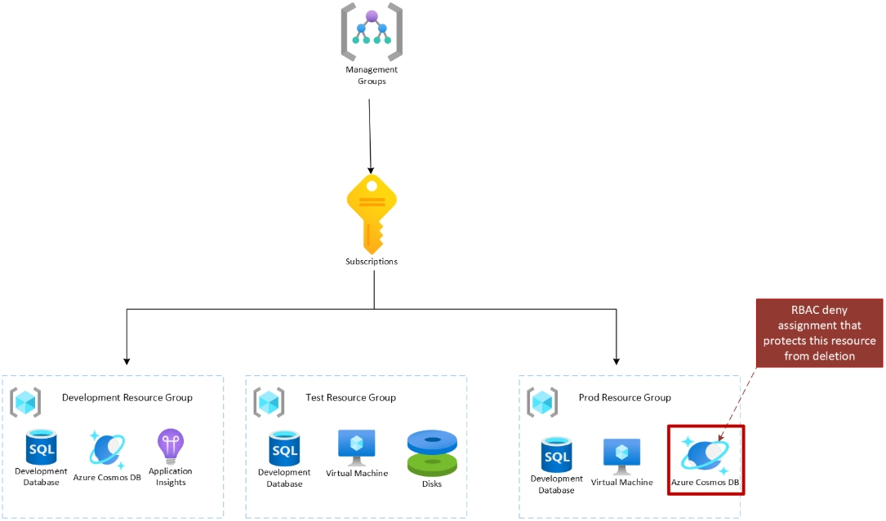
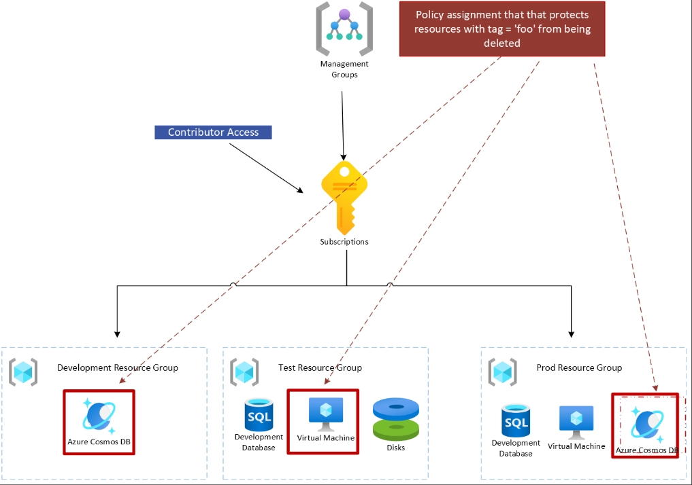

# RBAC deny assignments vs. Azure Policy deny: When to use each

Azure provides two powerful mechanisms to block actions: **Azure RBAC deny assignments** and **Azure
Policy deny effect enforced through policy assignments**. Both can prevent users from creating,
modifying, or deleting resources. Both can evaluate user context. Yet they're designed for different
problems, and choosing the wrong one can leave you with brittle governance or unnecessary complexity.

This article clarifies when to reach for each tool.

## The fundamental difference: *Who* vs. *What*

The key distinction is simple:

- **RBAC deny assignments** answer: **"Who is not allowed to perform this action?"**
  - Blocks *specific users, groups, or service principals* from performing certain operations
  - Operates at a specific resource or resource group
  - Best for granular, targeted access control

- **Azure Policy deny effect** answers: **"What resource configurations or requests do we block?"**
  - Blocks *resource requests that don't meet organizational rules*
  - Can evaluate both the resource being created and the identity making the request
  - Operates at higher scopes (management group, subscription, resource group)
  - Supports gradual rollout, exemptions, and at-scale enforcement

## Side-by-side comparison

| Dimension | **RBAC Deny** | **Azure Policy Deny** |
|-----------|---------------|----------------------|
| **Purpose** | Blocks *who* (users, groups, or service principals) can perform specific Azure resource actions at a resource or resource hierarchy scope. | Blocks *what* resource requests are allowed at a resource or resource hierarchy scope; this enforcement can also consider who is making the request. |
| **Context evaluated** | Both user and resource actions | Both user and resource actions |
| **Microsoft-recommended use + scope** | Enforcing access control at a smaller scope, such as a resource, or resource group | Enforcing organizational standards at scale, especially at management group or subscription scope |
| **When to use** | When you want to block requests at a smaller scope, such as a resource group or subscription | When you want to block requests at scale, such as at management group scope, or combine higher-scope governance with smaller-scope enforcement |

## Real-world scenarios

### When to use RBAC deny assignments

**Scenario 1: Restricting subscription owner access**  
Your organization's cloud admin wants to block subscription owner access to a certain resource group
or subscription. Even though owners have broad permissions, you need to prevent them from modifying
critical infrastructure in that scope.

**Solution:** The cloud admin creates an RBAC deny assignment targeting subscription owners (or
specific owner groups) at the resource group or subscription scope. This override takes precedence
over any role assignment, effectively removing their write access to that scope.

**Scenario 2: Protecting shared infrastructure from a delegated team**  
A platform team grants the Cosmos DB team **Contributor** access at the subscription level so they
can manage Cosmos DB resources at scale. The same environment also contains a shared virtual network
resource group that must remain under another team's control.

**Solution:** The platform team creates an RBAC deny assignment at the shared virtual network
resource group scope. This prevents the Cosmos DB team from modifying or deleting critical network
infrastructure without limiting their ability to manage Cosmos DB resources elsewhere in the
subscription.

### When to use Azure Policy deny

**Scenario 1: Blocking manual deletion of critical resources**  
Your cloud admin wants to block users in the tenant from manually deleting critical resources. To
enforce this, the cloud admin includes a condition in the policy definition that checks whether the
request was initiated by a user from any client. This policy assignment can be applied at the root
management group level and gradually rolled out by resource location and resource type.

**Solution:** Create an Azure Policy deny definition with conditions that evaluate the request
initiator and resource type. Apply it at the management group level with resource selectors to
gradually enforce across locations and resource types. This ensures safe, phased rollout without
impacting automated processes.

**Scenario 2: Enforcing multi-factor authentication for resource operations**  
Your cloud admin wants to enforce that all users have MFA enabled before creating, updating, or
deleting resources. To prevent critical workflows from breaking unexpectedly, an Azure Policy can
block these operations if the request is initiated by a user without MFA enabled.

**Solution:** Deploy an Azure Policy such as the built-in definition **Users must authenticate with
multi-factor authentication to create or update resources** with audit effect first to validate
impact, then transition to deny effect. Use exemptions for service principals or automation accounts
that require alternative authentication methods.

---

## When to use each

While both mechanisms can use user context and block resource actions, Microsoft's recommendation is
to use **Azure Policy** to enforce organizational standards at scale, especially from higher scopes,
while **Azure RBAC deny assignments** are the right mechanism for granular access control.

Azure Policy provides a richer framework for large-scale governance. You can roll out enforcement
gradually, roll it back safely, and exempt specific resources or scopes when needed. That makes
Azure Policy the safer choice for at-scale scenarios. See Safe deployment of [Azure Policy
Assignment](../how-to/policy-safe-deployment-practices.md) to learn more.

For smaller scopes such as a resource group or subscription, customers may find the simplicity of
RBAC deny assignments appealing. They're intuitive when the goal is to control which users can act
within a narrowly defined scope.

RBAC deny assignments are especially useful when a shared team needs to take effective control over
a sub-scope from the primary owners of a larger scope, such as a resource group inside a
subscription or a subscription inside a management group.

In short:

- If you want to block requests at scale, such as at management group scope, use **Azure Policy**.
- If you want to block requests at a smaller scope, such as a resource group or subscription, use **Azure RBAC deny assignments**.

---

## Decision table

Ask yourself these questions in order:

| **Question** | **Answer** | **Use** |
|:---|:---|:---|
| Do I need to restrict a small scope or individual resource? | Yes | **RBAC deny** |
| Do I need to *gradually roll out* this restriction? | Yes | **Azure Policy** |
| Do I need to *exclude certain resources* from this restriction? | Yes | **Azure Policy** |

---

## Why Azure Policy is safer for at-scale

If your scenario involves organization-wide enforcement, Azure Policy has capabilities that RBAC
deny doesn't:

1. **Resource selectors** — Narrow evaluation to a subset (by location, resource type) for safe SDP rollout
2. **Overrides** — Change effect (audit → deny) without editing the policy definition
3. **Exemptions with expiry** — Grant time-bound exceptions that automatically revoke
4. **Effect audit mode** — Deploy with `audit` effect first to validate before enforcement

This makes Azure Policy the right choice when you need to safely enforce rules across hundreds or
thousands of resources.

---