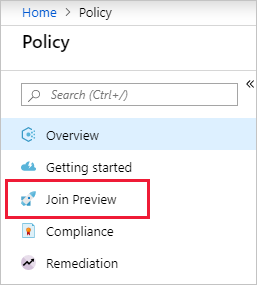

# Understand Azure Policy for Azure Kubernetes Service

Azure Policy integrates with the [Azure Kubernetes Service](../../../aks/intro-kubernetes.md) (AKS)
to apply at-scale enforcements and safeguards on your clusters in a centralized, consistent manner.
By extending use of [GateKeeper](https://github.com/open-policy-agent/gatekeeper), an _admission
controller webhook_ for [Open Policy Agent](https://www.openpolicyagent.org/) (OPA), Azure Policy
makes it possible to manage and report on the compliance state of your Azure resources and AKS
clusters from one place.

> [!NOTE]
> Azure Policy for AKS is in Limited Preview and only supports built-in policy definitions.

## Overview

To enable and use Azure Policy for AKS with your AKS cluster, take the following actions:

- [Opt-in for preview features](#opt-in-for-preview)
- [Install the Azure Policy Add-on](#installation-steps)
- [Assign a policy definition for AKS](#built-in-policies)
- [Wait for validation](#validation-and-reporting-frequency)

## Opt-in for preview

Before installing the Azure Policy Add-on or enabling any of the service features, your subscription
must enable the **Microsoft.ContainerService** resource provider and the
**Microsoft.PolicyInsights** resource provider, then be approved to join the preview. To join the
preview, follow these steps in either the Azure portal or with Azure CLI:

- Azure portal:

  1. Register the **Microsoft.ContainerService** and **Microsoft.PolicyInsights** resource
     providers. For steps, see
     [Resource providers and types](../../../azure-resource-manager/resource-manager-supported-services.md#azure-portal).

  1. Launch the Azure Policy service in the Azure portal by clicking **All services**, then
     searching for and selecting **Policy**.

     

  1. Select **Join Preview** on the left side of the Azure Policy page.

     

  1. Select the row of the subscription you want added to the preview.

  1. Select the **Opt-in** button at the top of the list of subscriptions.

- Azure CLI:

  ```azurecli-interactive
  # Log in first with az login if you're not using Cloud Shell

  # Provider register: Register the Azure Kubernetes Services provider
  az provider register --namespace Microsoft.ContainerService

  # Provider register: Register the Azure Policy provider
  az provider register --namespace Microsoft.PolicyInsights

  # Feature register: enables installing the add-on
  az feature register --namespace Microsoft.ContainerService --name AKS-AzurePolicyAutoApprove

  # Feature register: enables the add-on to call the Azure Policy resource provider
  az feature register --namespace Microsoft.PolicyInsights --name AKS-DataplaneAutoApprove
  ```

## Azure Policy Add-on

The _Azure Policy Add-on_ for Kubernetes connects the Azure Policy service to the GateKeeper
admission controller. The add-on, which is installed into the _azure-policy_ namespace, enacts the
following functions:

- Checks with Azure Policy for assignments to the AKS cluster
- Downloads and caches policy details, including the _rego_ policy definition, as **configmaps**
- Runs a full scan compliance check on the AKS cluster
- Reports auditing and compliance details back to Azure Policy

### Installing the add-on

#### Prerequisites

Before you install the add-on in your AKS cluster, the preview extension must be installed. This
step is done with Azure CLI:

1. You need the Azure CLI version 2.0.62 or later installed and configured. Run `az --version` to
   find the version. If you need to install or upgrade, see [Install the Azure CLI](/cli/azure/install-azure-cli).

1. The AKS cluster must be version _1.10_ or higher. Use the following script to validate your AKS
   cluster version:

   ```azurecli-interactive
   # Log in first with az login if you're not using Cloud Shell

   # Look for the value in kubernetesVersion
   az aks list
   ```

1. Install version _0.4.0_ of the Azure CLI preview extension for AKS, `aks-preview`:

   ```azurecli-interactive
   # Log in first with az login if you're not using Cloud Shell

   # Install/update the preview extension
   az extension add --name aks-preview

   # Validate the version of the preview extension
   az extension show --name aks-preview --query [version]
   ```

   > [!NOTE]
   > If you've previously installed the _aks-preview_ extension, install any updates using the
   > `az extension update --name aks-preview` command.

#### Installation steps

Once the prerequisites are completed, install the Azure Policy add-on in the AKS cluster you want to
manage.

- Azure portal

  1. Launch the AKS service in the Azure portal by clicking **All services**, then searching for and
     selecting **Kubernetes services**.

  1. Select one of your AKS clusters.

  1. Select **Policies (preview)** on the left side of the Kubernetes service page.

     

  1. In the main page, select the **Enable add-on** button.

     

     > [!NOTE]
     > If the **Enable add-on** button is grayed out, the subscription has not yet been added to the
     > preview. See [Opt-in for preview](#opt-in-for-preview) for the required steps.

- Azure CLI

  ```azurecli-interactive
  # Log in first with az login if you're not using Cloud Shell

  az aks enable-addons --addons azure-policy --name MyAKSCluster --resource-group MyResourceGroup
  ```

### Validation and reporting frequency

The add-on checks in with Azure Policy for changes in policy assignments every 5 minutes. During
this refresh cycle, the add-on removes all _configmaps_ in the _azure-policy_ namespace then
recreates the _configmaps_ for GateKeeper use.

> [!NOTE]
> While a _cluster admin_ may have permission to the _azure-policy_ namespace, it's not recommended
> or supported to make changes to the namespace. Any manual changes made are lost during the
> refresh cycle.

Every 5 minutes, the add-on calls for a full scan of the cluster. After gathering details of the
full scan and any real-time evaluations by GateKeeper of attempted changes to the cluster, the
add-on reports the results back to Azure Policy for inclusion in [compliance details](../how-to/get-compliance-data.md)
like any Azure Policy assignment. Only results for active policy assignments are returned during the
audit cycle.

## Policy language

The Azure Policy language structure for managing AKS follows that of existing policies. The effect
_EnforceRegoPolicy_ is used to manage your AKS clusters and takes _details_ properties specific to
working with OPA and GateKeeper. For details and examples, see the [EnforceRegoPolicy](effects.md#enforceregopolicy)
effect.

As part of the _details.policy_ property in the policy definition, Azure Policy passes the URI of a
rego policy to the add-on. Rego is the language that OPA and GateKeeper support to validate or
mutate a request to the Kubernetes cluster. By supporting an existing standard for Kubernetes
management, Azure Policy makes it possible to reuse existing rules and pair them with Azure Policy
for a unified cloud compliance reporting experience. For more information, see [What is Rego?](https://www.openpolicyagent.org/docs/how-do-i-write-policies.html#what-is-rego).

## Built-in policies

To find the built-in policies for managing AKS using the Azure portal, follow these steps:

1. Start the Azure Policy service in the Azure portal. Select **All services** in the left pane and
   then search for and select **Policy**.

1. In the left pane of the Azure Policy page, select **Definitions**.

1. From the Category drop-down list box, use **Select all** to clear the filter and then select
   **Kubernetes service**.

1. Select the policy definition, then select the **Assign** button.

> [!NOTE]
> When assigning the Azure Policy for AKS definition, the **Scope** must include the AKS cluster
> resource.

Alternately, use the [Assign a policy - Portal](../assign-policy-portal.md) quickstart to find and
assign an AKS policy. Search for a Kubernetes policy definition instead of the sample 'audit vms'.

## Logging

### Azure Policy add-on logs

As a Kubernetes controller/container, the Azure Policy add-on keeps logs in the AKS cluster. The
logs are exposed in the **Insights** page of the AKS cluster. For more information, see
[Understand AKS cluster performance with Azure Monitor for containers](../../../azure-monitor/insights/container-insights-analyze.md).

### GateKeeper logs

To enable GateKeeper logs for new resource requests, follow the steps in [Enable and review Kubernetes master node logs in AKS](../../../aks/view-master-logs.md).
Here is an example query to view denied events on new resource requests:

```kusto
| where Category == "kube-audit"
| where log_s contains "admission webhook"
| limit 100
```

To view logs from GateKeeper containers, follow the steps in [Enable and review Kubernetes master node logs in AKS](../../../aks/view-master-logs.md)
and check the _kube-apiserver_ option in the **Diagnostic settings** pane.

## Remove the add-on

To remove the Azure Policy add-on from your AKS cluster, use either the Azure portal or Azure CLI:

- Azure portal

  1. Launch the AKS service in the Azure portal by clicking **All services**, then searching for and
     selecting **Kubernetes services**.

  1. Select your AKS cluster where you want to disable the Azure Policy add-on.

  1. Select **Policies (preview)** on the left side of the Kubernetes service page.

     

  1. In the main page, select the **Disable add-on** button.

     

- Azure CLI

  ```azurecli-interactive
  # Log in first with az login if you're not using Cloud Shell

  az aks disable-addons --addons azure-policy --name MyAKSCluster --resource-group MyResourceGroup
  ```

## Next steps

- Review examples at [Azure Policy samples](../samples/index.md).
- Review the [Policy definition structure](definition-structure.md).
- Review [Understanding policy effects](effects.md).
- Understand how to [programmatically create policies](../how-to/programmatically-create.md).
- Learn how to [get compliance data](../how-to/getting-compliance-data.md).
- Learn how to [remediate non-compliant resources](../how-to/remediate-resources.md).
- Review what a management group is with [Organize your resources with Azure management groups](../../management-groups/index.md).