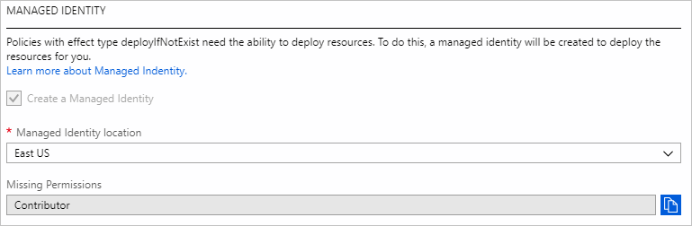
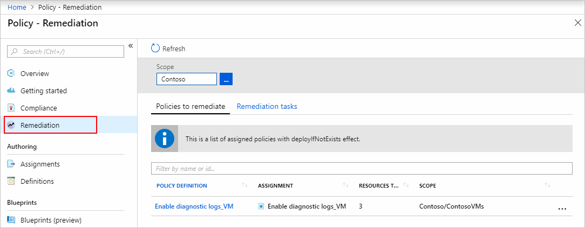
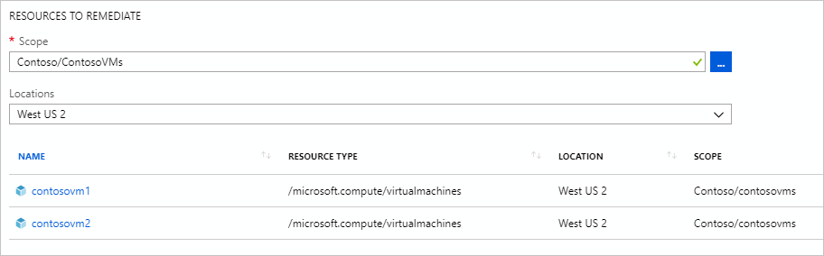
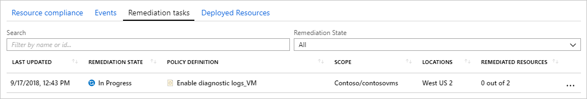
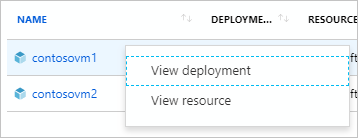

# Remediate non-compliant resources with Azure Policy

Resources that are non-compliant to a **deployIfNotExists** policy can be put into a compliant
state through **Remediation**. Remediation is accomplished by instructing Policy to run the
**deployIfNotExists** effect of the assigned policy on your existing resources. This how-to walks
through the steps needed to accomplished this.

## How remediation security works

When Policy runs the template in the **deployIfNotExists** policy definition, it does so using a
[managed identity](../../../active-directory/managed-identities-azure-resources/overview.md).
Policy creates a managed identity for each assignment for you, but must be provided details about
what roles to grant the managed identity. If the managed identity is missing roles, this is
displayed during the assignment of the policy or an initiative containing the policy. When using
the portal, Policy will automatically grant the managed identity the listed roles once assignment
is initiated.



> [!IMPORTANT]
> If a resource modified by **deployIfNotExists** is outside the scope of the policy assignment or
> the template accesses properties on resources outside the scope of the policy assignment, the
> assignment's managed identity must be [manually granted access](#manually-configure-the-managed-identity)
> or the remediation deployment will fail.

## Configure policy definition

The first step is to define the roles that **deployIfNotExists** needs in the policy definition to
successfully deploy the content of your included template. Under the **details** property, add a
**roleDefinitionIds** property. This is an array of strings that match roles in your environment.
For a full example, see the [deployIfNotExists example](../concepts/effects.md#deployifnotexists-example).

```json
"details": {
    ...
    "roleDefinitionIds": [
        "/subscription/{subscriptionId}/providers/Microsoft.Authorization/roleDefinitions/{roleGUID}",
        "/providers/Microsoft.Authorization/roleDefinitions/{builtinroleGUID}"
    ]
}
```

**roleDefinitionIds** uses the full resource identifier and doesn't take the short **roleName** of
the role. To get the ID for the 'Contributor' role in your environment, use the following code:

```azurecli-interactive
az role definition list --name 'Contributor'
```

```azurepowershell-interactive
Get-AzureRmRoleDefinition -Name 'Contributor'
```

## Manually configure the managed identity

When creating an assignment using the portal, Policy both generates the managed identity and grants
it the roles defined in **roleDefinitionIds**. In the following conditions, steps to create the
managed identity and assign it permissions must be performed manually:

- While using the SDK (such as Azure PowerShell)
- When a resource outside the assignment scope is modified by the template
- When a resource outside the assignment scope is read by the template

> [!NOTE]
> Azure PowerShell and .NET are the only SDKs that currently support this capability.

### Create managed identity with PowerShell

To create a managed identity during the assignment of the policy, **Location** must be defined and
**AssignIdentity** used. The following example gets the definition of the built-in policy **Deploy
SQL DB transparent data encryption**, sets the target resource group, and then creates the
assignment.

```azurepowershell-interactive
# Login first with Connect-AzureRmAccount if not using Cloud Shell

# Get the built-in "Deploy SQL DB transparent data encryption" policy definition
$policyDef = Get-AzureRmPolicyDefinition -Id '/providers/Microsoft.Authorization/policyDefinitions/86a912f6-9a06-4e26-b447-11b16ba8659f'

# Get the reference to the resource group
$resourceGroup = Get-AzureRmResourceGroup -Name 'MyResourceGroup'

# Create the assignment using the -Location and -AssignIdentity properties
$assignment = New-AzureRmPolicyAssignment -Name 'sqlDbTDE' -DisplayName 'Deploy SQL DB transparent data encryption' -Scope $resourceGroup.ResourceId -PolicyDefinition $policyDef -Location 'westus' -AssignIdentity
```

The `$assignment` variable now contains the principal ID of the managed identity along with the
standard values returned when creating a policy assignment. It can be accessed through
`$assignment.Identity.PrincipalId`.

### Grant defined roles with PowerShell

The new managed identity must complete replication through Azure Active Directory before it can be
granted the needed roles. Once replication is complete, the following example iterates the policy
definition in `$policyDef` for the **roleDefinitionIds** and uses
[New-AzureRmRoleAssignment](/powershell/module/azurerm.resources/new-azurermroleassignment) to
grant the new managed identity the roles.

```azurepowershell-interactive
# Use the $policyDef to get to the roleDefinitionIds array
$roleDefinitionIds = $policyDef.Properties.policyRule.then.details.roleDefinitionIds

if ($roleDefinitionIds.Count -gt 0)
{
    $roleDefinitionIds | ForEach-Object {
        $roleDefId = $_.Split("/") | Select-Object -Last 1
        New-AzureRmRoleAssignment -Scope $resourceGroup.ResourceId -ObjectId $assignment.Identity.PrincipalId -RoleDefinitionId $roleDefId
    }
}
```

### Grant defined roles through portal

There are two ways to grant an assignment's managed identity the defined roles using the portal, by
using **Access control (IAM)** or by editing the policy or initiative assignment and clicking
**Save**.

To add a role to the assignment's managed identity, follow these steps:

1. Launch the Azure Policy service in the Azure portal by clicking **All services**, then searching for and selecting **Policy**.

1. Select **Assignments** on the left side of the Azure Policy page.

1. Locate the assignment that has a managed identity and click on the name.

1. Find the **Assignment ID** property on the edit page. The assignment ID will be something like:

   ```
   /subscriptions/{subscriptionId}/resourceGroups/PolicyTarget/providers/Microsoft.Authorization/policyAssignments/2802056bfc094dfb95d4d7a5
   ```

   The name of the managed identity is the last portion of the assignment resource ID, which is `2802056bfc094dfb95d4d7a5` in this example. Copy this portion of the assignment resource ID.

1. Navigate to the resource or the resources parent container (resource group, subscription, management group) that needs the role definition manually added.

1. Click the **Access control (IAM)** link in the resources page and click **+ Add** at the top of the access control page.

1. Select the appropriate role that matches a **roleDefinitionIds** from the policy definition. Leave **Assign access to** set to the default of 'Azure AD user, group, or application'. In the **Select** box, paste or type the portion of the assignment resource ID located earlier. Once the search completes, click the object with the same name to select id and click **Save**.

## Create a remediation task

During evaluation, the policy assignment with **deployIfNotExists** effect determines if there are
non-compliant resources. When non-compliant resources are found, the details are provided on the
**Remediation** page. Along with the list of policies that have non-compliant resources is the
option to trigger a **remediation task**. This is what creates a deployment from the
**deployIfNotExists** template.

To create a **remediation task**, follow these steps:

1. Launch the Azure Policy service in the Azure portal by clicking **All services**, then searching for and selecting **Policy**.

   

1. Select **Remediation** on the left side of the Azure Policy page.

   

1. All **deployIfNotExists** policy assignments with non-compliant resources are included on the **Policies to remediate** tab and data table. Click on a policy with resources that are non-compliant. The **New remediation task** page opens.

   > [!NOTE]
   > An alternate way to open the **remediation task** page is to find and click on the policy from the
   > **Compliance** page, then click the **Create Remediation Task** button.

1. On the **New remediation task** page, filter the resources to remediate by using the **Scope** ellipses to pick child resources from where the policy was assigned (including down to the individual resource objects). Additionally, use the **Locations** drop-down to further filter the resources. Only resources listed in the table will be remediated.

   

1. Initiate the remediation task once the resources have been filtered by clicking **Remediate**. The policy compliance page will open to the **Remediation tasks** tab to show the state of the tasks progress.

   

1. Click on the **remediation task** from the policy compliance page to get details about the progress. The filtering used for the task are shown along with a list of the resources being remediated.

1. From the **remedation task** page, right-click on a resource to view either the remediation task's deployment or the resource. At the end of the row, click on **Related events** to see details such as an error message.

   

Resources deployed through a **remediation task** will be added to the **Deployed Resources** tab on the policy compliance page after a short delay.

## Next steps

- Review examples at [Azure Policy samples](../samples/index.md)
- Review the [Policy definition structure](../concepts/definition-structure.md)
- Review [Understanding policy effects](../concepts/effects.md)
- Understand how to [programmatically create policies](programmatically-create.md)
- Learn how to [get compliance data](getting-compliance-data.md)
- Review what a management group is with [Organize your resources with Azure management groups](../../management-groups/overview.md)