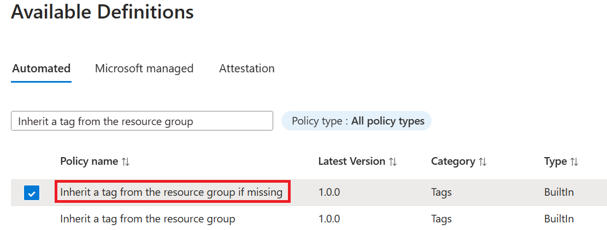

# Create and manage policies to enforce compliance

Understanding how to create and manage policies in Azure is important for staying compliant with
your corporate standards and service level agreements. In this tutorial, you learn to use Azure
Policy to do some of the more common tasks related to creating, assigning, and managing policies
across your organization, such as:

> [!div class="checklist"]
> - Assign a policy to enforce a condition for resources you create in the future
> - Create and assign an initiative definition to track compliance for multiple resources
> - Resolve a non-compliant or denied resource
> - Implement a new policy across an organization

If you would like to assign a policy to identify the current compliance state of your existing
resources, the quickstart articles go over how to do so. If you don't have an Azure subscription,
create a [free account](https://azure.microsoft.com/free/) before you begin.

## Assign a policy

The first step in enforcing compliance with Azure Policy is to assign a policy definition. A policy
definition defines under what condition a policy is enforced and what effect to take. In this
example, assign a built-in policy definition, called *Require SQL Server version 12.0*, to enforce
the condition that all SQL Server databases must be v12.0 to be compliant.

1. Launch the Azure Policy service in the Azure portal by clicking **All services**, then searching for and selecting **Policy**.

   

1. Select **Assignments** on the left side of the Azure Policy page. An assignment is a policy that has been assigned to take place within a specific scope.

   

1. Select **Assign Policy** from the top of the **Policy - Assignments** page.

   

1. On the **Assign Policy** page, select the **Scope** by clicking the ellipsis and selecting either a management group or subscription. Optionally, select a resource group. A scope determines what resources or grouping of resources the policy assignment gets enforced on.  Then click **Select** at the bottom of the **Scope** page.

   This example uses the **Contoso** subscription. Your subscription will differ.

1. Resources can be excluded based on the **Scope**.  **Exclusions** start at one level lower than the level of the **Scope**. **Exclusions** are optional, so leave it blank for now.

1. Select the **Policy definition** ellipsis to open the list of available definitions. You can filter the policy definition **Type** to *Built-in* to view all and read their descriptions.

1. Select **Require SQL Server version 12.0**. If you cannot find it right away, type **require sql server** into the search box and then press ENTER or click out of the search box. Click **Select** at the bottom of the **Available Definitions** page once you have found and selected the policy definition.

   

1. The **Assignment name** is automatically populated with the policy name you selected, but you can change it. For this example, leave *Require SQL Server version 12.0*. You can also add an optional **Description**. The description provides details about this policy assignment.  **Assigned by** is automatically fill based on who is logged in. This field is optional, so custom values can be entered.

1. Leave **Create a Managed Identity** unchecked. This _must_ be checked when the policy or initiative being assigned includes a policy with the [deployIfNotExists](../concepts/effects.md#deployifnotexists) effect. As the policy used for this tutorial does not, leave it blank. For more information, see [managed identities](../../../active-directory/managed-identities-azure-resources/overview.md) and [how remediation security works](../how-to/remediate-resources.md#how-remediation-security-works).

1. Click **Assign**.

## Implement a new custom policy

Now that you've assigned a built-in policy definition, you can do more with Azure Policy. Next,
create a new custom policy to save costs by ensuring that VMs created in your environment cannot be
in the G series. This way, every time a user in your organization tries to create VM in the G
series, the request is denied.

1. Select **Definitions** under **Authoring** in the left side of the Azure Policy page.

   

1. Select **+ Policy definition** at the top of the page. This opens to the **Policy definition** page.

1. Enter the following:

   - The management group or subscription in which the policy definition is saved. Select by using the ellipsis on **Definition location**.

     > [!NOTE]
     > If you plan to apply this policy definition to multiple subscriptions, the location must be a management group that contains the subscriptions you assign the policy to. The same is true for an initiative definition.

   - The name of the policy definition - *Require VM SKUs smaller than the G series*
   - The description of what the policy definition is intended to do – *This policy definition enforces that all VMs created in this scope have SKUs smaller than the G series to reduce cost.*
   - Choose from existing options (such as _Compute_), or create a new category for this policy definition.
   - Copy the following JSON code and then update it for your needs with:
      - The policy parameters.
      - The policy rules/conditions, in this case – VM SKU size equal to G series
      - The policy effect, in this case – **Deny**.

    Here's what the JSON should look like. Paste your revised code into the Azure portal.

    ```json
    {
        "policyRule": {
            "if": {
                "allOf": [{
                        "field": "type",
                        "equals": "Microsoft.Compute/virtualMachines"
                    },
                    {
                        "field": "Microsoft.Compute/virtualMachines/sku.name",
                        "like": "Standard_G*"
                    }
                ]
            },
            "then": {
                "effect": "deny"
            }
        }
    }
    ```

    The value of the *field* property in the policy rule must be one of the following: Name, Type, Location, Tags, or an alias. An example of an alias might be `"Microsoft.Compute/VirtualMachines/Size"`.

    To view more Azure policy samples, see [Azure Policy samples](../samples/index.md).

1. Select **Save**.

## Create a policy definition with REST API

You can create a policy with the REST API for Policy Definitions. The REST API enables you to
create and delete policy definitions, and get information about existing definitions. To create a
policy definition, use the following example:

```http-interactive
PUT https://management.azure.com/subscriptions/{subscriptionId}/providers/Microsoft.authorization/policydefinitions/{policyDefinitionName}?api-version={api-version}
```

Include a request body similar to the following example:

```json
{
    "properties": {
        "parameters": {
            "allowedLocations": {
                "type": "array",
                "metadata": {
                    "description": "The list of locations that can be specified when deploying resources",
                    "strongType": "location",
                    "displayName": "Allowed locations"
                }
            }
        },
        "displayName": "Allowed locations",
        "description": "This policy enables you to restrict the locations your organization can specify when deploying resources.",
        "policyRule": {
            "if": {
                "not": {
                    "field": "location",
                    "in": "[parameters('allowedLocations')]"
                }
            },
            "then": {
                "effect": "deny"
            }
        }
    }
}
```

## Create a policy definition with PowerShell

Before proceeding with the PowerShell example, make sure you have installed the latest version of
Azure PowerShell. Policy parameters were added in version 3.6.0. If you have an earlier version,
the examples return an error indicating the parameter cannot be found.

You can create a policy definition using the `New-AzureRmPolicyDefinition` cmdlet.

To create a policy definition from a file, pass the path to the file. For an external file, use the
following example:

```azurepowershell-interactive
$definition = New-AzureRmPolicyDefinition `
    -Name 'denyCoolTiering' `
    -DisplayName 'Deny cool access tiering for storage' `
    -Policy 'https://raw.githubusercontent.com/Azure/azure-policy-samples/master/samples/Storage/storage-account-access-tier/azurepolicy.rules.json'
```

For a local file use, use the following example:

```azurepowershell-interactive
$definition = New-AzureRmPolicyDefinition `
    -Name 'denyCoolTiering' `
    -Description 'Deny cool access tiering for storage' `
    -Policy 'c:\policies\coolAccessTier.json'
```

To create a policy definition with an inline rule, use the following example:

```azurepowershell-interactive
$definition = New-AzureRmPolicyDefinition -Name 'denyCoolTiering' -Description 'Deny cool access tiering for storage' -Policy '{
    "if": {
        "allOf": [{
                "field": "type",
                "equals": "Microsoft.Storage/storageAccounts"
            },
            {
                "field": "kind",
                "equals": "BlobStorage"
            },
            {
                "field": "Microsoft.Storage/storageAccounts/accessTier",
                "equals": "cool"
            }
        ]
    },
    "then": {
        "effect": "deny"
    }
}'
```

The output is stored in a `$definition` object, which is used during policy assignment. The
following example creates a policy definition that includes parameters:

```azurepowershell-interactive
$policy = '{
    "if": {
        "allOf": [{
                "field": "type",
                "equals": "Microsoft.Storage/storageAccounts"
            },
            {
                "not": {
                    "field": "location",
                    "in": "[parameters(''allowedLocations'')]"
                }
            }
        ]
    },
    "then": {
        "effect": "Deny"
    }
}'

$parameters = '{
    "allowedLocations": {
        "type": "array",
        "metadata": {
            "description": "The list of locations that can be specified when deploying storage accounts.",
            "strongType": "location",
            "displayName": "Allowed locations"
        }
    }
}'

$definition = New-AzureRmPolicyDefinition -Name 'storageLocations' -Description 'Policy to specify locations for storage accounts.' -Policy $policy -Parameter $parameters
```

### View policy definitions with PowerShell

To see all policy definitions in your subscription, use the following command:

```azurepowershell-interactive
Get-AzureRmPolicyDefinition
```

It returns all available policy definitions, including built-in policies. Each policy is returned
in the following format:

```output
Name               : e56962a6-4747-49cd-b67b-bf8b01975c4c
ResourceId         : /providers/Microsoft.Authorization/policyDefinitions/e56962a6-4747-49cd-b67b-bf8b01975c4c
ResourceName       : e56962a6-4747-49cd-b67b-bf8b01975c4c
ResourceType       : Microsoft.Authorization/policyDefinitions
Properties         : @{displayName=Allowed locations; policyType=BuiltIn; description=This policy enables you to
                     restrict the locations your organization can specify when deploying resources. Use to enforce
                     your geo-compliance requirements.; parameters=; policyRule=}
PolicyDefinitionId : /providers/Microsoft.Authorization/policyDefinitions/e56962a6-4747-49cd-b67b-bf8b01975c4c
```

## Create a policy definition with Azure CLI

You can create a policy definition using Azure CLI with the policy definition command. To create a
policy definition with an inline rule, use the following example:

```azurecli-interactive
az policy definition create --name 'denyCoolTiering' --description 'Deny cool access tiering for storage' --rules '{
    "if": {
        "allOf": [{
                "field": "type",
                "equals": "Microsoft.Storage/storageAccounts"
            },
            {
                "field": "kind",
                "equals": "BlobStorage"
            },
            {
                "field": "Microsoft.Storage/storageAccounts/accessTier",
                "equals": "cool"
            }
        ]
    },
    "then": {
        "effect": "deny"
    }
}'
```

### View policy definitions with Azure CLI

To see all policy definitions in your subscription, use the following command:

```azurecli-interactive
az policy definition list
```

It returns all available policy definitions, including built-in policies. Each policy is returned
in the following format:

```json
{
    "description": "This policy enables you to restrict the locations your organization can specify when deploying resources. Use to enforce your geo-compliance requirements.",
    "displayName": "Allowed locations",
    "id": "/providers/Microsoft.Authorization/policyDefinitions/e56962a6-4747-49cd-b67b-bf8b01975c4c",
    "name": "e56962a6-4747-49cd-b67b-bf8b01975c4c",
    "policyRule": {
        "if": {
            "not": {
                "field": "location",
                "in": "[parameters('listOfAllowedLocations')]"
            }
        },
        "then": {
            "effect": "Deny"
        }
    },
    "policyType": "BuiltIn"
}
```

## Create and assign an initiative definition

With an initiative definition, you can group several policy definitions to achieve one overarching
goal. You create an initiative definition to ensure that resources within the scope of the
definition stay compliant with the policy definitions that make up the initiative definition. For
more information about initiative definitions, see [Azure Policy overview](../overview.md).

### Create an initiative definition

1. Select **Definitions** under **Authoring** in the left side of the Azure Policy page.

   

1. Select **+ Initiative Definition** at the top of the page to open the **Initiative definition** page.

   

1. Use the **Definition location** ellipsis to select a management group or subscription to store the definition. If the previous page was scoped to a single management group or subscription, **Definition location** is automatically populated.

1. Enter the **Name** and **Description** of the initiative.

   This example ensures that resources are in compliance with policy definitions about getting secure. Name the initiative **Get Secure** and set the description as: **This initiative has been created to handle all policy definitions associated with securing resources**.

1. For **Category**, choose from existing options or create a new category.

1. Browse through the list of **Available Definitions** (right half of **Initiative definition** page) and select the policy definition(s) you would like to add to this initiative. For the **Get secure** initiative, add the following built-in policy definitions by clicking the **+** next to the policy definition information or clicking a policy definition row and then the **+ Add** option in the details page:

   - Require SQL Server version 12.0
   - [Preview]: Monitor unprotected web applications in Security Center.
   - [Preview]: Monitor permissive network across in Security Center.
   - [Preview]: Monitor possible app Whitelisting in Security Center.
   - [Preview]: Monitor unencrypted VM Disks in Security Center.

   After selecting the policy definition from the list, it is added under **Policies and Parameters**.

   

1. If a policy definition being added to the initiative has parameters, they are shown under the policy name in the **Policies and Parameters** area. The _value_ can be set to either 'Set value' (hard coded for all assignments of this initiative) or 'Use Initiative Parameter' (set during each initiative assignment). If 'Set value' is selected, the drown-down to the right of _Values_ allows entering or selecting the desired value(s). If 'Use Initiative Parameter' is selected, a new **Initiative parameters** section is displayed allowing you to define the parameter that is set during initiative assignment. The allowed values on this initiative parameter can further restrict what may be set during initiative assignment.

   

   > [!NOTE]
   > In the case of some `strongType` parameters, the list of values cannot be automatically
   > determined. In these cases, an ellipsis appears to the right of the parameter row. Clicking
   > it opens the 'Parameter scope (&lt;parameter name&gt;)' page. On this page, select the
   > subscription to use for providing the value options. This parameter scope is only used during
   > creation of the initiative definition and has no impact on policy evaluation or the scope of
   > the initiative when assigned.

1. Click **Save**.

### Assign an initiative definition

1. Select **Definitions** under **Authoring** in the left side of the Azure Policy page.

1. Locate the **Get Secure** initiative definition you previously created and click it. Select **Assign** at the top of the page to open to the **Get Secure: Assign initiative** page.

   

   Alternatively, you can right-click on the selected row or left-click on the ellipsis at the end of the row for a contextual menu.  Then select **Assign**.

   

1. Fill out the **Get Secure: Assign Initiative** page by entering the following example information. You can use your own information.

   - Scope: The management group or subscription you saved the initiative to becomes the default.  You can change scope to assign the initiative to a subscription or resource group within the save location.
   - Exclusions: Configure any resources within the scope to prevent the initiative assignment from being applied to them.
   - Initiative definition and Assignment name: Get Secure (pre-populated as name of initiative being assigned).
   - Description: This initiative assignment is tailored to enforce this group of policy definitions.
   - Assigned by: Automatically filled based on who is logged in. This field is optional, so custom values can be entered.

1. Leave **Create a Managed Identity** unchecked. This _must_ be checked when the policy or initiative being assigned includes a policy with the [deployIfNotExists](../concepts/effects.md#deployifnotexists) effect. As the policy used for this tutorial does not, leave it blank. For more information, see [managed identities](../../../active-directory/managed-identities-azure-resources/overview.md) and [how remediation security works](../how-to/remediate-resources.md#how-remediation-security-works).

1. Click **Assign**.

## Check initial compliance

1. Select **Compliance** in the left side of the Azure Policy page.

1. Locate the **Get Source** initiative. It is likely still in _Compliance state_ of **Not started**. Click on the initiative to get full details on the progress of the assignment.

   

1. Once the initiative assignment has been completed, the compliance page is updated with the _Compliance state_ of **Compliant**.

   

1. Clicking on any policy on the initiative compliance page opens the compliance details page for the policy. This page provides details at the resource level for compliance.

## Exempt a non-compliant or denied resource using Exclusion

Following the example above, after assigning the policy definition to require SQL server version
12.0, a SQL server created with any version other 12.0 would get denied. In this section, you walk
through resolving a denied attempt to create a SQL server by creating an exclusion on a single
resource group. The exclusion prevents enforcement of the policy (or initiative) on that resource.
In the following example, any SQL server version is allowed in a single resource group. An
exclusion can apply to a subscription, resource group, or you can narrow the exclusion to individual resources.

A deployment prevented due to an assigned policy or initiative can be viewed in two locations:

- On the resource group targeted by the deployment: Select **Deployments** in the left side of the page and click on the **Deployment Name** of the failed deployment. The resource that was denied is listed with a status of _Forbidden_. To determine the policy or initiative and assignment that denied the resource, click **Failed. Click here for details ->** on the Deployment Overview page. A window opens on the right side of the page with the error information. Under **Error Details** is the GUIDs of the related policy objects.

  

- On the Azure Policy page: Select **Compliance** in the left side of the page and click on the **Require SQL Server version 12.0** policy. On the page that opens, you would see an increase in the **Deny** count. Under the **Events** tab, you would also see who attempted the deployment that was denied by the policy.

  

In this example, Trent Baker, one of Contoso's Sr. Virtualization specialists, was doing required
work. We need to grant him an exception, but we don't want the non-version 12.0 SQL servers in just
any resource group. We've created a new resource group, **SQLServers_Excluded** and will now grant
it an exception to this policy assignment.

### Update assignment with exclusion

1. Select **Assignments** under **Authoring** in the left side of the Azure Policy page.

1. Browse through all policy assignments and open the *Require SQL Server version 12.0* assignment.

1. Set the **Exclusion** by clicking the ellipsis and selecting the resource group to exclude, *SQLServers_Excluded* in this example.

   

   > [!NOTE]
   > Depending on the policy and its effect, the exclusion could also be granted to specific resources within a resource group inside the scope of the assignment. As a **Deny** effect was used in this tutorial, it would not make sense to set the exclusion on a specific resource that already exists.

1. Click **Select** and then click **Save**.

In this section, you resolved the denial of the attempt to create a prohibited version of SQL server by creating an exclusion on a single resource group.

## Clean up resources

If you are done working with resources from this tutorial, use the following steps to delete any of the assignments or definitions created above:

1. Select **Definitions** (or **Assignments** if you are trying to delete an assignment) under **Authoring** in the left side of the Azure Policy page.

1. Search for the new initiative or policy definition (or assignment) you want to remove.

1. Right-click the row or select the ellipses at the end of the definition (or assignment), and select **Delete definition** (or **Delete assignment**).

## Next steps

In this tutorial, you successfully accomplished the following:

> [!div class="checklist"]
> - Assigned a policy to enforce a condition for resources you create in the future
> - Created and assign an initiative definition to track compliance for multiple resources
> - Resolved a non-compliant or denied resource
> - Implemented a new policy across an organization

To learn more about the structures of policy definitions, look at this article:

> [!div class="nextstepaction"]
> [Azure Policy definition structure](../concepts/definition-structure.md)