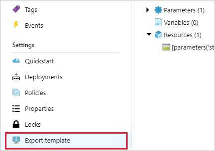

# Tutorial: Create a custom policy definition

A custom policy definition allows customers to define their own rules for using Azure. These rules
often enforce:

- Security practices
- Cost management
- Organization-specific rules (like naming or locations)

Whatever the business driver for creating a custom policy, the steps are the same for defining the
new custom policy.

Before creating a custom policy, check the [policy samples](../samples/index.md) to see if a policy
that matches your needs already exists.

The approach to creating a custom policy follows these steps:

> [!div class="checklist"]
> - Identify your business requirements
> - Map each requirement to an Azure resource property
> - Map the property to an alias
> - Determine which effect to use
> - Compose the policy definition

If you don't have an Azure subscription, create a [free account](https://azure.microsoft.com/free/)
before you begin.

## Identify requirements

Before creating the policy definition, it's important to understand the intent of the policy. For
this tutorial, we'll use a common enterprise security requirement as the goal to illustrate the
steps involved:

- Each storage account must be enabled for HTTPS
- Each storage account must be disabled for HTTP

Your requirements should clearly identify both the "to be" and the "not to be" resource states.

While we've defined the expected state of the resource, we've not yet defined what we want done with
non-compliant resources. Azure Policy supports a number of [effects](../concepts/effects.md). For
this tutorial, we'll define the business requirement as preventing the creation of resources if they
aren't compliant with the business rules. To meet this goal, we'll use the [Deny](../concepts/effects.md#deny)
effect. We also want the option to suspend the policy for specific assignments. As such, we'll use
the [Disabled](../concepts/effects.md#disabled) effect and make the effect a [parameter](../concepts/definition-structure.md#parameters)
in the policy definition.

## Determine resource properties

Based on the business requirement, the Azure resource to audit with Azure Policy is a storage
account. However, we don't know the properties to use in the policy definition. Azure Policy
evaluates against the JSON representation of the resource, so we'll need to understand the
properties available on that resource.

There are many ways to determine the properties for an Azure resource. We'll look at each for
this tutorial:

- Resource Manager templates
  - Export existing resource
  - Creation experience
  - Quickstart templates (GitHub)
  - Template reference docs
- Azure Resource Explorer

### Resource Manager templates

There are several ways to look at a [Resource Manager
template](../../../azure-resource-manager/resource-manager-tutorial-create-encrypted-storage-accounts.md)
that includes the property you're looking to manage.

#### Existing resource in the portal

The simplest way to find properties is to look at an existing resource of the same type. Resources
already configured with the setting you want to enforce also provide the value to compare against.
Look at the **Export template** page (under **Settings**) in the Azure portal for that specific
resource.



Doing so for a storage account reveals a template similar to this example:

```json
...
"resources": [{
    "comments": "Generalized from resource: '/subscriptions/{subscriptionId}/resourceGroups/myResourceGroup/providers/Microsoft.Storage/storageAccounts/mystorageaccount'.",
    "type": "Microsoft.Storage/storageAccounts",
    "sku": {
        "name": "Standard_LRS",
        "tier": "Standard"
    },
    "kind": "Storage",
    "name": "[parameters('storageAccounts_mystorageaccount_name')]",
    "apiVersion": "2018-07-01",
    "location": "westus",
    "tags": {
        "ms-resource-usage": "azure-cloud-shell"
    },
    "scale": null,
    "properties": {
        "networkAcls": {
            "bypass": "AzureServices",
            "virtualNetworkRules": [],
            "ipRules": [],
            "defaultAction": "Allow"
        },
        "supportsHttpsTrafficOnly": false,
        "encryption": {
            "services": {
                "file": {
                    "enabled": true
                },
                "blob": {
                    "enabled": true
                }
            },
            "keySource": "Microsoft.Storage"
        }
    },
    "dependsOn": []
}]
...
```

Under **properties** is a value named **supportsHttpsTrafficOnly** set to **false**. This property
looks like it may be the property we're looking for. Also, the **type** of the resource is
**Microsoft.Storage/storageAccounts**. The type lets us limit the policy to only resources of this
type.

#### Create a resource in the portal

Another way through the portal is the resource creation experience. While creating a storage account
through the portal, an option under the **Advanced** tab is **Security transfer required**. This
property has _Disabled_ and _Enabled_ options. The info icon has additional text that confirms this
option is likely the property we want. However, the portal doesn't tell us the property name on this
screen.

On the **Review + create** tab, a link is at the bottom of the page to **Download a template for
automation**. Selecting the link opens the template that creates the resource we configured. In this
case, we see two key pieces of information:

```json
...
"supportsHttpsTrafficOnly": {
    "type": "bool"
}
...
"properties": {
    "accessTier": "[parameters('accessTier')]",
    "supportsHttpsTrafficOnly": "[parameters('supportsHttpsTrafficOnly')]"
}
...
```

This information tells us the property type and also confirms **supportsHttpsTrafficOnly** is the
property we're looking for.

#### Quickstart templates on GitHub

The [Azure quickstart templates](https://github.com/Azure/azure-quickstart-templates) on GitHub has
hundreds of Resource Manager templates built for different resources. These templates can be a great
way to find the resource property you're looking for. Some properties may appear to be what you're
looking for, but control something else.

#### Resource reference docs

To validate **supportsHttpsTrafficOnly** is correct property, check the Resource Manager template
reference for the [storage account
resource](/azure/templates/microsoft.storage/2018-07-01/storageaccounts) on the storage provider.
The properties object has a list of valid parameters. Selecting the
[StorageAccountPropertiesCreateParameters-object](/azure/templates/microsoft.storage/2018-07-01/storageaccounts#storageaccountpropertiescreateparameters-object)
link shows a table of acceptable properties. **supportsHttpsTrafficOnly** is present and the
description matches what we are looking for to meet the business requirements.

### Azure Resource Explorer

Another way to explore your Azure resources is through the [Azure Resource
Explorer](https://resources.azure.com) (Preview). This tool uses the context of your subscription,
so you need to authenticate to the website with your Azure credentials. Once authenticated, you can
browse by providers, subscriptions, resource groups, and resources.

Locate a storage account resource and look at the properties. We see the
**supportsHttpsTrafficOnly** property here as well. Selecting the **Documentation** tab, we see that
the property description matches what we found in the reference docs earlier.

## Find the property alias

We've identified the resource property, but we need to map that property to an [alias](../concepts/definition-structure.md#aliases).

There are a few ways to determine the aliases for an Azure resource. We'll look at each for this
tutorial:

- Azure CLI
- Azure PowerShell
- Azure Resource Graph

### Azure CLI

In Azure CLI, the `az provider` command group is used to search for resource aliases. We'll filter
for the **Microsoft.Storage** namespace based on the details we got about the Azure resource
earlier.

```azurecli-interactive
# Login first with az login if not using Cloud Shell

# Get Azure Policy aliases for type Microsoft.Storage
az provider show --namespace Microsoft.Storage --expand "resourceTypes/aliases" --query "resourceTypes[].aliases[].name"
```

In the results, we see an alias supported by the storage accounts named
**supportsHttpsTrafficOnly**. This existence of this alias means we can write the policy to enforce
our business requirements!

### Azure PowerShell

In Azure PowerShell, the `Get-AzPolicyAlias` cmdlet is used to search for resource aliases. We'll
filter for the **Microsoft.Storage** namespace based on the details we got about the Azure resource
earlier.

```azurepowershell-interactive
# Login first with Connect-AzAccount if not using Cloud Shell

# Use Get-AzPolicyAlias to list aliases for Microsoft.Storage
(Get-AzPolicyAlias -NamespaceMatch 'Microsoft.Storage').Aliases
```

Like Azure CLI, the results show an alias supported by the storage accounts named
**supportsHttpsTrafficOnly**.

### Azure Resource Graph

[Azure Resource Graph](../../resource-graph/overview.md) is a new service in Preview. It enables
another method to find properties of Azure resources. Here is a sample query for looking at a single
storage account with Resource Graph:

```kusto
where type=~'microsoft.storage/storageaccounts'
| limit 1
```

```azurecli-interactive
az graph query -q "where type=~'microsoft.storage/storageaccounts' | limit 1"
```

```azurepowershell-interactive
Search-AzGraph -Query "where type=~'microsoft.storage/storageaccounts' | limit 1"
```

The results look similar to what we see in the Resource Manager templates and through the Azure
Resource Explorer. However, Azure Resource Graph results can also include [alias](../concepts/definition-structure.md#aliases)
details by _projecting_ the _aliases_ array:

```kusto
where type=~'microsoft.storage/storageaccounts'
| limit 1
| project aliases
```

```azurecli-interactive
az graph query -q "where type=~'microsoft.storage/storageaccounts' | limit 1 | project aliases"
```

```azurepowershell-interactive
Search-AzGraph -Query "where type=~'microsoft.storage/storageaccounts' | limit 1 | project aliases"
```

Here is example output from a storage account for aliases:

```json
"aliases": {
    "Microsoft.Storage/storageAccounts/accessTier": null,
    "Microsoft.Storage/storageAccounts/accountType": "Standard_LRS",
    "Microsoft.Storage/storageAccounts/enableBlobEncryption": true,
    "Microsoft.Storage/storageAccounts/enableFileEncryption": true,
    "Microsoft.Storage/storageAccounts/encryption": {
        "keySource": "Microsoft.Storage",
        "services": {
            "blob": {
                "enabled": true,
                "lastEnabledTime": "2018-06-04T17:59:14.4970000Z"
            },
            "file": {
                "enabled": true,
                "lastEnabledTime": "2018-06-04T17:59:14.4970000Z"
            }
        }
    },
    "Microsoft.Storage/storageAccounts/encryption.keySource": "Microsoft.Storage",
    "Microsoft.Storage/storageAccounts/encryption.keyvaultproperties.keyname": null,
    "Microsoft.Storage/storageAccounts/encryption.keyvaultproperties.keyvaulturi": null,
    "Microsoft.Storage/storageAccounts/encryption.keyvaultproperties.keyversion": null,
    "Microsoft.Storage/storageAccounts/encryption.services": {
        "blob": {
            "enabled": true,
            "lastEnabledTime": "2018-06-04T17:59:14.4970000Z"
        },
        "file": {
            "enabled": true,
            "lastEnabledTime": "2018-06-04T17:59:14.4970000Z"
        }
    },
    "Microsoft.Storage/storageAccounts/encryption.services.blob": {
        "enabled": true,
        "lastEnabledTime": "2018-06-04T17:59:14.4970000Z"
    },
    "Microsoft.Storage/storageAccounts/encryption.services.blob.enabled": true,
    "Microsoft.Storage/storageAccounts/encryption.services.file": {
        "enabled": true,
        "lastEnabledTime": "2018-06-04T17:59:14.4970000Z"
    },
    "Microsoft.Storage/storageAccounts/encryption.services.file.enabled": true,
    "Microsoft.Storage/storageAccounts/networkAcls": {
        "bypass": "AzureServices",
        "defaultAction": "Allow",
        "ipRules": [],
        "virtualNetworkRules": []
    },
    "Microsoft.Storage/storageAccounts/networkAcls.bypass": "AzureServices",
    "Microsoft.Storage/storageAccounts/networkAcls.defaultAction": "Allow",
    "Microsoft.Storage/storageAccounts/networkAcls.ipRules": [],
    "Microsoft.Storage/storageAccounts/networkAcls.ipRules[*]": [],
    "Microsoft.Storage/storageAccounts/networkAcls.ipRules[*].action": [],
    "Microsoft.Storage/storageAccounts/networkAcls.ipRules[*].value": [],
    "Microsoft.Storage/storageAccounts/networkAcls.virtualNetworkRules": [],
    "Microsoft.Storage/storageAccounts/networkAcls.virtualNetworkRules[*]": [],
    "Microsoft.Storage/storageAccounts/networkAcls.virtualNetworkRules[*].action": [],
    "Microsoft.Storage/storageAccounts/networkAcls.virtualNetworkRules[*].id": [],
    "Microsoft.Storage/storageAccounts/networkAcls.virtualNetworkRules[*].state": [],
    "Microsoft.Storage/storageAccounts/primaryEndpoints": {
        "blob": "https://mystorageaccount.blob.core.windows.net/",
        "file": "https://mystorageaccount.file.core.windows.net/",
        "queue": "https://mystorageaccount.queue.core.windows.net/",
        "table": "https://mystorageaccount.table.core.windows.net/"
    },
    "Microsoft.Storage/storageAccounts/primaryEndpoints.blob": "https://mystorageaccount.blob.core.windows.net/",
    "Microsoft.Storage/storageAccounts/primaryEndpoints.file": "https://mystorageaccount.file.core.windows.net/",
    "Microsoft.Storage/storageAccounts/primaryEndpoints.queue": "https://mystorageaccount.queue.core.windows.net/",
    "Microsoft.Storage/storageAccounts/primaryEndpoints.table": "https://mystorageaccount.table.core.windows.net/",
    "Microsoft.Storage/storageAccounts/primaryEndpoints.web": null,
    "Microsoft.Storage/storageAccounts/primaryLocation": "eastus2",
    "Microsoft.Storage/storageAccounts/provisioningState": "Succeeded",
    "Microsoft.Storage/storageAccounts/sku.name": "Standard_LRS",
    "Microsoft.Storage/storageAccounts/sku.tier": "Standard",
    "Microsoft.Storage/storageAccounts/statusOfPrimary": "available",
    "Microsoft.Storage/storageAccounts/supportsHttpsTrafficOnly": false
}
```

Azure Resource Graph (Preview) can be used through [Cloud Shell](https://shell.azure.com), making it
a fast and easy way to explore the properties of your resources.

## Determine the effect to use

Deciding what to do with your non-compliant resources is nearly as important as deciding what to
evaluate in the first place. Each possible response to a non-compliant resource is called an [effect](../concepts/effects.md).
The effect controls if the non-compliant resource is logged, blocked, has data appended, or has a
deployment associated to it for putting the resource back into a compliant state.

For our example, Deny is the effect we want as we do not want non-compliant resources created in our
Azure environment. Audit is a good first choice for a policy effect to determine what the impact of
a policy is before setting it to Deny. One way to make changing the effect per assignment easier is
to parameterize the effect. See [parameters](#parameters) below for the details on how.

## Compose the definition

We now have the property details and alias for what we plan to manage. Next, we'll compose the
policy rule itself. If you aren't yet familiar with the policy language, reference [policy
definition structure](../concepts/definition-structure.md) for how to structure the policy
definition. Here is an empty template of what a policy definition looks like:

```json
{
    "properties": {
        "displayName": "<displayName>",
        "description": "<description>",
        "mode": "<mode>",
        "parameters": {
                <parameters>
        },
        "policyRule": {
            "if": {
                <rule>
            },
            "then": {
                "effect": "<effect>"
            }
        }
    }
}
```

### Metadata

The first three components are policy metadata. These components are easy to provide values for
since we know what we are creating the rule for. [Mode](../concepts/definition-structure.md#mode) is
primarily about tags and resource location. Since we don't need to limit evaluation to resources
that support tags, we'll use the _all_ value for **mode**.

```json
"displayName": "Deny storage accounts not using only HTTPS",
"description": "Deny storage accounts not using only HTTPS. Checks the supportsHttpsTrafficOnly property on StorageAccounts.",
"mode": "all",
```

### Parameters

While we didn't use a parameter for changing the evaluation, we do want to use a parameter to allow
changing the **effect** for troubleshooting. We'll define an **effectType** parameter and limit it
to only **Deny** and **Disabled**. These two options match our business requirements. The finished
parameters block looks like this example:

```json
"parameters": {
    "effectType": {
        "type": "string",
        "defaultValue": "Deny",
        "allowedValues": [
            "Deny",
            "Disabled"
        ],
        "metadata": {
            "displayName": "Effect",
            "description": "Enable or disable the execution of the policy"
        }
    }
},
```

### Policy rule

Composing the [policy rule](../concepts/definition-structure.md#policy-rule) is the final step in
building our custom policy definition. We've identified two statements to test for:

- That the storage account **type** is **Microsoft.Storage/storageAccounts**
- That the storage account **supportsHttpsTrafficOnly** isn't **true**

Since we need both of these statements to be true, we'll use the **allOf** [logical
operator](../concepts/definition-structure.md#logical-operators). We'll pass the **effectType**
parameter to the effect instead of making a static declaration. Our finished rule looks like this
example:

```json
"if": {
    "allOf": [
        {
            "field": "type",
            "equals": "Microsoft.Storage/storageAccounts"
        },
        {
            "field": "Microsoft.Storage/storageAccounts/supportsHttpsTrafficOnly",
            "notEquals": "true"
        }
    ]
},
"then": {
    "effect": "[parameters('effectType')]"
}
```

### Completed definition

With all three parts of the policy defined, here is our completed definition:

```json
{
    "properties": {
        "displayName": "Deny storage accounts not using only HTTPS",
        "description": "Deny storage accounts not using only HTTPS. Checks the supportsHttpsTrafficOnly property on StorageAccounts.",
        "mode": "all",
        "parameters": {
            "effectType": {
                "type": "string",
                "defaultValue": "Deny",
                "allowedValues": [
                    "Deny",
                    "Disabled"
                ],
                "metadata": {
                    "displayName": "Effect",
                    "description": "Enable or disable the execution of the policy"
                }
            }
        },
        "policyRule": {
            "if": {
                "allOf": [
                    {
                        "field": "type",
                        "equals": "Microsoft.Storage/storageAccounts"
                    },
                    {
                        "field": "Microsoft.Storage/storageAccounts/supportsHttpsTrafficOnly",
                        "notEquals": "true"
                    }
                ]
            },
            "then": {
                "effect": "[parameters('effectType')]"
            }
        }
    }
}
```

The completed definition can be used to create a new policy. Portal and each SDK (Azure CLI, Azure
PowerShell, and REST API) accept the definition in different ways, so review the commands for each
to validate correct usage. Then assign it, using the parameterized effect, to appropriate resources
to manage the security of your storage accounts.

## Review

In this tutorial, you successfully accomplished the following tasks:

> [!div class="checklist"]
> - Identified your business requirements
> - Mapped each requirement to an Azure resource property
> - Mapped the property to an alias
> - Determined the effect to use
> - Composed the policy definition

## Next steps

Next, use your custom policy definition to create and assign a policy:

> [!div class="nextstepaction"]
> [Create and assign a policy definition](../how-to/programmatically-create.md#create-and-assign-a-policy-definition)