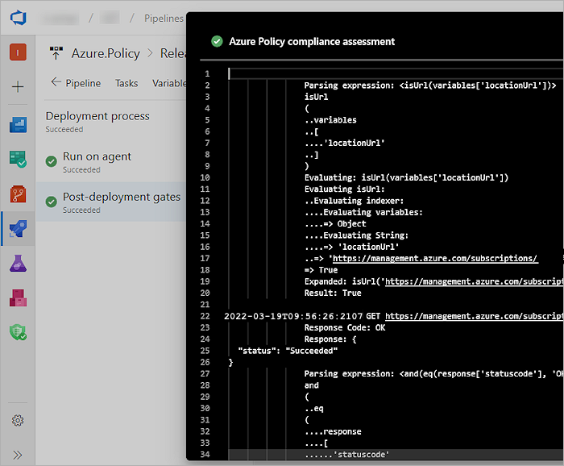

# Implement Azure Policy with Azure DevOps release pipelines

**Azure DevOps Services**

Learn how to enforce compliance policies on your Azure resources before and after deployment with Azure Pipelines. Azure Pipelines lets you build, test, and deploy with continuous integration (CI) and continuous delivery (CD) using [Azure DevOps](/azure/devops/). One scenario for adding Azure Policy to a pipeline is when you want to ensure that resources are deployed only to authorized regions and are configured to send diagnostics logs to Azure Log Analytics.

You can use either the [classic pipeline](/azure/devops/pipelines/release/define-multistage-release-process) or [YAML pipeline](/azure/devops/pipelines/get-started/yaml-pipeline-editor) processes to implement Azure Policy in your CI/CD pipelines.

For more information, see [What is Azure Pipelines?](/azure/devops/pipelines/get-started/what-is-azure-pipelines)
and [Create your first pipeline](/azure/devops/pipelines/create-first-pipeline).
## Prepare

1. Create an [Azure Policy](./create-and-manage.md) in the Azure portal.
   There are several [predefined sample policies](../samples/index.md)
   that can be applied to a management group, subscription, and resource group.

1. In Azure DevOps, create a release pipeline that contains at least one stage, or open an existing release pipeline.

1. Add a pre- or post-deployment condition that includes the **Check Azure Policy compliance** task as a gate.
   [More details](/azure/devops/pipelines/release/deploy-using-approvals#set-up-gates).

   

If you're using a YAML pipeline definition, then use the [AzurePolicyCheckGate@0](/azure/devops/pipelines/tasks/reference/azure-policy-check-gate-v0) Azure Pipelines task.

## Validate for any violation(s) during a release

> [!NOTE]
> Use the [AzurePolicyCheckGate](/azure/devops/pipelines/tasks/deploy/azure-policy) task to check for policy compliance in YAML. This task can only be used as a gate and not in a build or a release pipeline.

1. Navigate to your team project in Azure DevOps.

1. In the **Pipelines** section, open the **Releases** page and create a new release.

1. Choose the **In progress** link in the release view to open the live logs page.

1. When the release is in progress and attempts to perform an action disallowed by
   the defined policy, the deployment is marked as **Failed**. The error message contains a link to view the policy violations.

   

1. An error message is written to the logs and displayed in the stage status panel in the releases page of Azure Pipelines.

   

1. When the policy compliance gate passes the release, a **Succeeded** status is displayed.

   

1. Choose the successful deployment to view the detailed logs.

   

## Next steps

To learn more about the structures of policy definitions, look at this article:

> [!div class="nextstepaction"]
> [Azure Policy definition structure](../concepts/definition-structure.md)