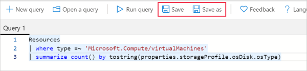
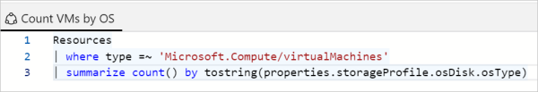

# Tutorial: Create and share an Azure Resource Graph query in the Azure portal

Azure Resource Graph Explorer lets you save your Resource Graph queries directly in the Azure
portal. There are two types of queries: _Private_ and _Shared_. A Private query is saved in your
Azure portal settings. Whereas a Shared query is a Resource Manager resource that can be managed
with role-based access controls (RBAC) and protected with resource locks. Both types of queries are
encrypted at rest.

By saving queries in the Azure portal, you save the time you might otherwise spend looking for your
favorite or commonly used queries. When you share queries, you help your team realize goals of
consistency and efficiency through repetition.

In this tutorial, you'll complete the following tasks:

> [!div class="checklist"]
> - Create and delete a Private query
> - Create a Shared query
> - Discover Shared queries
> - Delete a Shared query

## Prerequisites

To complete this tutorial, you need an Azure subscription. If you don't have one, create a
[free account](https://azure.microsoft.com/free/) before you begin.

## Create and delete a Private query

Private queries are accessible and visible only to the account that creates them. As they're saved
in an account's Azure portal settings, they can be created, used, and deleted only from inside the
Azure portal. A Private query isn't a Resource Manager resource. To create a new Private query,
follow these steps:

1. From the portal menu, select **All services** or use the Azure search box at the top of all
   pages. Search for and then select **Resource Graph Explorer**.

1. On the **Query 1** tab on the Azure Resource Graph Explorer page, enter the following query:

   ```kusto
   Resources
   | where type =~ 'Microsoft.Compute/virtualMachines'
   | summarize count() by tostring(properties.storageProfile.osDisk.osType)
   ```

   Select **Run query** to see the query results in the bottom pane.

   For more information about this query, see
   [Samples – Count virtual machines by OS type](../samples/starter.md#count-os).


1. Select **Save** or **Save as**, enter **Count VMs by OS** as the name, leave the type as
   **Private query**, and then select **Save** at the bottom of the **Save query** pane. The tab
   title changes from **Query 1** to **Count VMs by OS**.

1. Move away from Azure Resource Graph Explorer in the Azure portal and then return to it. Notice
   that the saved query is no longer displayed and the **Query 1** tab has returned.

1. Select **Open a query**. Make sure that the type is **Private query**. The saved name **Count VMs
   by OS** now appears in the **Query Name** list. When you select the title link of the saved
   query, it's loaded into a new tab with that query's name.

   > [!NOTE] 
   > When a saved query is open and the tab shows its name, selecting the **Save** button
   > updates it with any changes that have been made. To create a new saved query from this open
   > query, select **Save as** and proceed as if you were saving a brand new query.

1. To delete the saved query, select **Open a query** again, and verify that the **Type** field is
   set to **Private query**. On the row of the saved `Count VMs by OS` query, select **Delete**
   (Recycle bin icon). In the confirmation dialog box, select **Yes** to finish deleting the query.
   Then, close the **Open a query** pane.

## Create a Shared query

Unlike a Private query, a Shared query is a Resource Manager resource. This fact means the query
gets saved to a resource group, can be managed and controlled with RBAC, and can even be protected
with resource locks. As a resource, anyone who has the appropriate permissions can see and use it.
To create a new Shared query, follow these steps:

1. From the portal menu, select **All services**, or use the Azure search box at the top of all
   pages to search for and select **Resource Graph Explorer**.

1. On the **Query 1** tab on the Azure Resource Graph Explorer page, enter the following query:

   ```kusto
   Resources
   | where type =~ 'Microsoft.Compute/virtualMachines'
   | summarize count() by tostring(properties.storageProfile.osDisk.osType)
   ```
    
   Select **Run query** to see the query results in the bottom pane.

   For more information about this query, see
   [Samples – Count virtual machines by OS type](../samples/starter.md#count-os).

1. Select **Save** or **Save as**.

   
   

1. In the **Save query** pane, enter **Count VMs by OS** for the name.

1. Change the type to **Shared query**, set the description to **Count of virtual machines by OS
   type**, and set **Subscription** to specify where the query resource gets created.

1. Leave the **Publish to resource-graph-queries resource group** check box selected and the
   **Resource Group location** set to **(US) West Central US**.

1. Select **Save** at the bottom of the **Save query** pane. The tab title changes from **Query 1**
   to **Count VMs by OS**. The first time the **resource-graph-queries** resource group is used, the
   save takes longer than expected as the resource group gets created.
   
   

   > [!NOTE] 
   > You can clear the **Publish to resource-graph-queries resource group** check box if you
   > want to provide the name of an existing resource group to save the shared query into. Using the
   > default named resource group for queries makes Shared queries easier to discover. It also makes
   > the purpose of that resource group more apparent. However, you might opt to select an existing
   > resource group for security reasons based on existing permissions.

1. Move away from Azure Resource Graph Explorer in the Azure portal and then return to it. Notice
   that the saved query is no longer displayed and the **Query 1** tab has returned.

1. Select **Open a query**. Verify that the type is set to **Shared query** and the combination of
   **Subscription** and **Resource group** match where you saved the query. The saved **Count VMs by
   OS** item now appears in the **Query Name** list. Select the title link of the saved query to
   load it into a new tab with that query's name. As a Shared query, it displays an icon in the tab
   next to the title, denoting it as shared.

   

   > [!NOTE] 
   > When a saved query is open and the tab shows its name, the **Save** button updates it
   > with any changes that have been made. To create a new saved query, select **Save as** and
   > proceed as if you were saving a brand new query.

## Discover Shared queries

Because a Shared query is a Resource Manager resource, there are several ways to find one:

- From Resource Graph Explorer, select **Open a query** and set the type to **Shared query**.
- From the Resource Graph queries portal page.
- From the resource group that the Shared query was saved in.
- Through a query to Resource Graph.

### View Resource Graph queries

In the Azure portal, the Resource Graph queries page displays Shared queries that the logged-in
account has access to. This page enables filtering by name, subscription, resource group, and other
properties of the Resource Graph query. You can also tag, export, and delete Resource Graph queries
by using this interface.

Selecting one of the queries opens the Resource Graph query page. Like other Resource Manager
resources, this page offers an interactive overview along with the Activity log, access control, and
tags. You can also apply a resource lock directly from this page.

Get to the Resource Graph queries page from the portal menu by selecting **All services** or by
using the Azure search box at the top of all pages. Search for and select **Resource Graph
Explorer**.

### List Resource groups resources

The Resource Graph query is listed alongside other resources that are part of a resource group.
Selecting the Resource Graph query opens the page for that query. The ellipsis and shortcut menu
options (triggered by right-clicking) work the same as on the Resource Graph query page.

### Query Resource Graph

You can find Resource Graph queries through a query to Resource Graph. The following Resource Graph
query limits by type `Microsoft.ResourceGraph/queries`, and then uses `project` to list only the
name, time modified, and the query itself:

```kusto
Resources
| where type == "microsoft.resourcegraph/queries"
| project name, properties.timeModified, properties.query
```

## Delete a Shared query

If a Shared query is no longer needed, delete it. By deleting a Shared query, you remove the
corresponding Resource Manager resource. Any dashboards that the results chart was pinned to now
display an error message. When that error message is displayed, use the **Remove from dashboard**
button to clean up your dashboard.

You can delete a Shared query through the following interfaces:
- Resource Graph queries page
- Resource Graph query page
- The **Open a query** page in Resource Graph Explorer
- Resource groups page

## Clean up resources

When you're finished with this tutorial, delete the Private and Shared queries you created if you no
longer want them.

## Next steps

In this tutorial, you've created Private and Shared queries. To learn more about the Resource graph
language, continue to the query language details page.

> [!div class="nextstepaction"]
> [Get more information about the query language](../concepts/query-language.md)