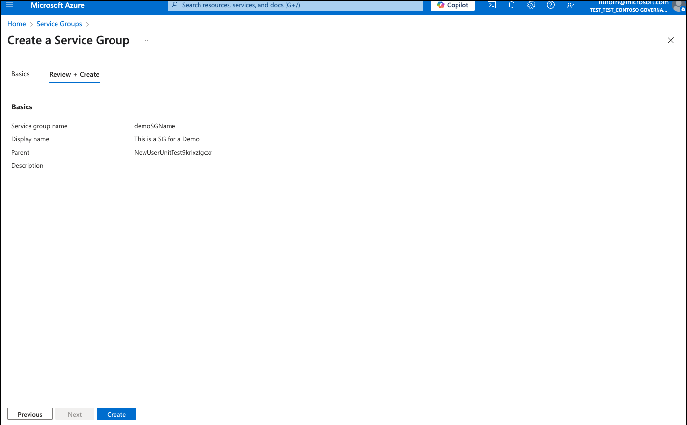

# Quickstart: Create a service group (preview) in the portal
 
Azure Service Groups offer a flexible way to organize and manage resources across subscriptions and resource groups, parallel to any existing Azure resource hierarchy. They're ideal for scenarios requiring cross-boundary grouping, minimal permissions, and aggregations of data across resources. These features empower teams to create tailored resource collections that align with operational, organizational, or persona-based needs. This article helps give you an overview of what Service Groups are, the scenarios to use them for, and provide guidance on how to get started. For more information on service groups, see [Getting started with Service Groups](overview.md).

> [!IMPORTANT]
> Azure Service Groups is currently in PREVIEW. 
> For more information about participating in the preview, see [Azure Service Groups Preview](https://aka.ms/ServiceGroups/PreviewSignup).
> See the [Supplemental Terms of Use for Microsoft Azure Previews](https://azure.microsoft.com/support/legal/preview-supplemental-terms/) for legal terms that apply to Azure features that are in beta, preview, or otherwise not yet released into general availability.

## Prerequisites

- If you don't have an Azure subscription, create a [free](https://azure.microsoft.com/free/)
  account before you begin.

- Any Microsoft Entra ID user in the tenant can create a management group without the management group write
  permission assigned to that user if
  [hierarchy protection](./how-to/protect-resource-hierarchy.md#setting-require-authorization)
  isn't enabled. This new management group becomes a child of the Root Management Group or the
  [default management group](./how-to/protect-resource-hierarchy.md#setting-define-the-default-management-group)
  and the creator is given an Owner role assignment. Management group service allows this ability
  so that role assignments aren't needed at the root level. When the Root
    Management Group is created, users don't have access to it. To start using management groups, the service allows the creation of the initial management groups at the root level. For more information, see [Root management group for each directory](./overview.md#the-root-service-group).

## Create in Azure portal

1. Log into the [Azure portal](https://portal.azure.com).

1. Select **All services** > **Management + governance**.

1. Select **Service Groups**.

1. Select **+ Add service group**.
    
  

1. Fill in the service group ID field

    - The **Service Group ID** is the directory unique identifier that is used to submit commands
         on this service group. This identifier isn't editable after creation as it's used throughout
         the Azure system to identify this group. The
         [root service group](./overview.md#the-root-service-group) is
         automatically created with an ID that is the Microsoft Entra ID. For all other
         service groups, assign a unique ID.
    - The display name field is the name that is displayed within the Azure portal. A separate
         display name is an optional field when creating the service group and can be changed at any time.

1. Select the **Parent Service Group**. 

1. Select "Next" 

1. The review page shows

1. If all information is correct, select **Create**

## Clean up resources

1. Select **All services** > **Management + governance**.

1. Select **Service Groups**.

1. Find the service group created that you want to delete, select it, then select the box. 

1. Select the **delete** button at the top of the page.  

## Next steps

In this quickstart, you created a service group. The service group can hold subscriptions, resource groups, or resources.

To learn more about service groups and how to manage your hierarchy, continue to:

> [!div class="nextstepaction"]
> [How to: Manage Service Groups](manage-service-groups.md)

## Related content
* [What are Azure Service Groups?](overview.md)
* [How to: Manage Service Groups](manage-service-groups.md)
* [Connect service group members with REST API](create-service-group-member-rest-api.md)
