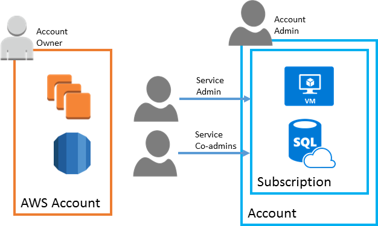
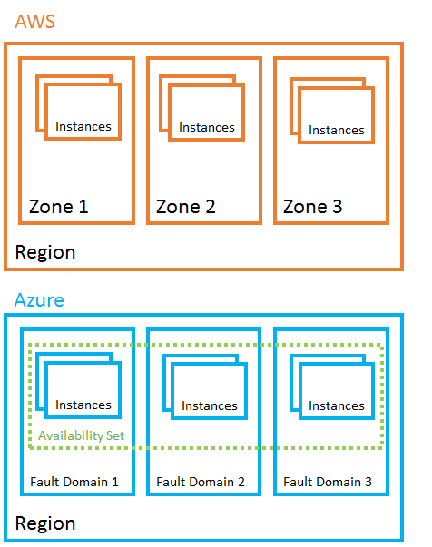
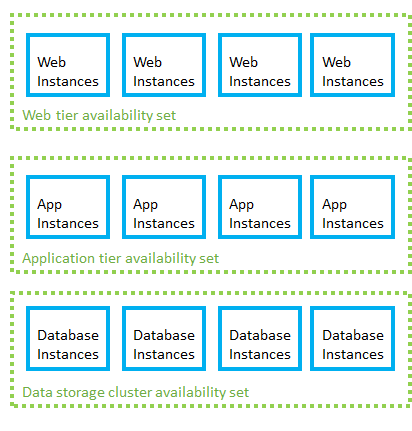

# Introduction to Microsoft Azure accounts, platform, and services for AWS experts

This article helps Amazon Web Services (AWS) experts understand the basics of Microsoft Azure accounts, platform, and services. It also covers key similarities and differences between the AWS and Azure platforms.

You'll learn:

* How accounts and resources are organized in Azure.
* How available solutions are structured in Azure.
* How the major Azure services differ from AWS services.

 Azure and AWS built their capabilities independently over time so that each has important implementation and design differences.

## Overview

Like AWS, Microsoft Azure is built around a core set of compute, storage,
database, and networking services. In many cases, both platforms offer a basic
equivalence between the products and services they offer. Both AWS and Azure
allow you to build highly available solutions based on Windows or Linux hosts. So, if you're used to development using Linux and OSS technology, both platforms
can do the job.

While the capabilities of both platforms are similar, the resources that provide
those capabilities are often organized differently. Exact one-to-one
relationships between the services required to build a solution are not always
clear. There are also cases where a particular service might be offered on one
platform, but not the other. See [charts of comparable Azure and AWS services](guidance-azure-for-aws-professionals-service-map.md).

## Accounts and subscriptions

Azure services can be purchased using several pricing options, depending on your
organization's size and needs. See the [pricing
overview](https://azure.microsoft.com/pricing/) page for details.

[Azure
subscriptions](https://azure.microsoft.com/documentation/articles/virtual-machines-linux-infrastructure-subscription-accounts-guidelines/)
are a grouping of resources with an assigned owner responsible for billing and
permissions management. Unlike AWS, where any resources created under the AWS
account are tied to that account, subscriptions exist independently of their
owner accounts, and can be reassigned to new owners as needed.

 *Comparison of structure and ownership of AWS accounts and Azure subscriptions*
  

Subscriptions are assigned three types of administrator accounts:

-   **Account Administrator** - The subscription owner and the
    account billed for the resources used in the subscription. The account
    administrator can only be changed by transferring ownership of the
    subscription.

-   **Service Administrator** - This account has rights to create and manage
    resources in the subscription, but is not responsible for billing. By
    default, the account administrator and service administrator are assigned to
    the same account. The account administrator can assign a separate user to
    the service administrator account for managing the technical and operational
    aspects of a subscription. There is only one service administrator per
    subscription.

-   **Co-administrator** - There can be multiple co-administrator accounts
    assigned to a subscription. Co-administrators cannot change the service
    administrator, but otherwise have full control over subscription resources
    and users.

Below the subscription level user roles and individual permissions can also be assigned to specific resources, similarly to how permissions are granted to IAM users and groups in AWS. In Azure all user accounts are associated with either a Microsoft Account or Organizational Account (an account managed through an Azure Active Directory).

Like AWS accounts, subscriptions have default service quotas and limits. For a
full list of these limits, see [Azure subscription and service limits, quotas,
and
constraints](https://azure.microsoft.com/documentation/articles/azure-subscription-service-limits/).
These limits can be increased up to the maximum by [filing a support request in
the management
portal](https://blogs.msdn.microsoft.com/girishp/2015/09/20/increasing-core-quota-limits-in-azure/).

### See also

-   [How to add or change Azure administrator
    roles](https://azure.microsoft.com/documentation/articles/billing-add-change-azure-subscription-administrator/)

-   [How to download your Azure billing invoice and daily usage
    data](https://azure.microsoft.com/documentation/articles/billing-download-azure-invoice-daily-usage-date/)

## Resource management

The term "resource" in Azure is used in the same way as in AWS, meaning any
compute instance, storage object, networking device, or other entity you can
create or configure within the platform.

Azure resources are deployed and managed using one of two models: [Azure
Resource Manager, or the older Azure [classic deployment model](../azure-resource-manager/resource-manager-deployment-model.md).
Any new resources are created using the Resource Manager model.

### Resource groups

Both Azure and AWS have entities called "resource groups" that organize resources such as VMs, storage, and virtual networking devices. However, [Azure resource groups](https://azure.microsoft.com/documentation/articles/virtual-machines-windows-infrastructure-resource-groups-guidelines/) are not directly comparable to AWS resource groups.

While AWS allows a resource to be tagged into multiple resource groups, an Azure
resource is always associated with one resource group. A resource created in one
resource group can be moved to another group, but can only be in one resource
group at a time. Resource groups are the fundamental grouping used by Azure
Resource Manager.

Resources can also be organized using
[tags](https://azure.microsoft.com/documentation/articles/resource-group-using-tags/).
Tags are key-value pairs that allow you to group resources across your
subscription irrespective of resource group membership.

### Management interfaces

Azure offers several ways to manage your resources:

-   [Web
    interface](https://azure.microsoft.com/documentation/articles/resource-group-portal/).
    Like the AWS Dashboard, the Azure portal provides a full web-based
    management interface for Azure resources.

-   [REST
    API](https://azure.microsoft.com/documentation/articles/resource-manager-rest-api/).
    The Azure Resource Manager REST API provides programmatic access to most of
    the features available in the Azure portal.

-   [Command
    Line](https://azure.microsoft.com/documentation/articles/xplat-cli-azure-resource-manager/).
    The Azure CLI tool provides a command-line interface capable of creating and
    managing Azure resources. Azure CLI is available for [Windows, Linux, and
    Mac OS](https://github.com/azure/azure-xplat-cli).

-   [PowerShell](https://azure.microsoft.com/documentation/articles/powershell-azure-resource-manager/).
    The Azure modules for PowerShell allow you to execute automated management
    tasks using a script. PowerShell is available for [Windows, Linux, and Mac
    OS](https://github.com/PowerShell/PowerShell).

-   [Templates](https://azure.microsoft.com/documentation/articles/resource-group-authoring-templates/).
    Azure Resource Manager templates provide similar JSON template-based
    resource management capabilities to the AWS CloudFormation service.

In each of these interfaces, the resource group is central to how Azure
resources get created, deployed, or modified. This is similar to the role a
"stack" plays in grouping AWS resources during CloudFormation deployments.

The syntax and structure of these interfaces are different from their AWS
equivalents, but they provide comparable capabilities. In addition, many third
party management tools used on AWS, like [Hashicorp's
Terraform](https://www.terraform.io/docs/providers/azurerm/) and [Netflix
Spinnaker](http://www.spinnaker.io/), are also available on Azure.

### See also

-   [Azure resource group
    guidelines](https://azure.microsoft.com/documentation/articles/virtual-machines-windows-infrastructure-resource-groups-guidelines/)

## Regions and zones (high availability)

In AWS, availability centers around the concept of Availability Zones. In Azure,
fault domains and availability sets are all involved in building highly
available solutions. Paired regions provide additional disaster recovery
capabilities.

### Availability Zones, Azure fault domains, and availability sets

In AWS, a region is divided into two or more Availability Zones. An Availability
Zone corresponds with a physically isolated datacenter in the geographic region.
If you deploy your application servers to separate Availability Zones, a
hardware or connectivity outage affecting one zone does not impact any servers
hosted in other zones.

In Azure, a [fault
domain](https://azure.microsoft.com/documentation/articles/virtual-machines-linux-manage-availability/)
defines a group of VMs that shares a physical power source and network switch.
You use [availability
sets](https://azure.microsoft.com/documentation/articles/virtual-machines-windows-manage-availability/)
to spread VMs across multiple fault domains. When instances are assigned to the
same availability set, Azure distributes them evenly across several fault
domains. If a power failure or network outage occurs in one fault domain, at
least some of the set's VMs are in another fault domain and unaffected by the
outage.

 *AWS Availability Zones compared with Azure fault domains and availability sets*
  

Availability sets should be organized by the instance's role in your application
to ensure one instance in each role is operational. For example, in a standard
three-tier web application, you would want to create a separate availability set
for front-end, application, and data instances.

 *Azure availability sets for each application role*
  

When VM instances are added to availability sets, they are also assigned an
[update
domain](https://azure.microsoft.com/documentation/articles/virtual-machines-linux-manage-availability/).
An update domain is a group of VMs that are set for planned maintenance events
at the same time. Distributing VMs across multiple update domains ensures that
planned update and patching events affect only a subset of these VMs at any
given time.

### Paired regions

In Azure, you use [paired
regions](https://azure.microsoft.com/documentation/articles/best-practices-availability-paired-regions/)
to support redundancy across two predefined geographic regions, ensuring that
even if an outage affects an entire Azure region, your solution is still
available.

Unlike AWS Availability Zones, which are physically separate datacenters but may
be in relatively nearby geographic areas, paired regions are usually separated
by at least 300 miles. This is intended to ensure larger scale disasters only impact one of the regions in the pair. Neighboring pairs can be set to sync
database and storage service data, and are configured so that platform updates
are rolled out to only one region in the pair at a time.

Azure [geo-redundant
storage](https://azure.microsoft.com/documentation/articles/storage-redundancy/#geo-redundant-storage)
is automatically backed up to the appropriate paired region. For all other
resources, creating a fully redundant solution using paired regions means
creating a full copy of your solution in both regions.

### See also

-   [Regions and availability for virtual machines in
    Azure](https://azure.microsoft.com/documentation/articles/virtual-machines-linux-regions-and-availability/)

-   [Disaster recovery and high availability for applications built on Microsoft
    Azure](https://azure.microsoft.com/documentation/articles/resiliency-disaster-recovery-high-availability-azure-applications/)

-   [Planned maintenance for Linux virtual machines in
    Azure](https://azure.microsoft.com/documentation/articles/virtual-machines-linux-planned-maintenance/)

## Services

Consult the [complete AWS and Azure service comparison matrix](https://aka.ms/azure4aws-services) for a full listing of how all services map between platforms.

Not all Azure products and
services are available in all regions. Consult the [Products by
Region](https://azure.microsoft.com/regions/services/) page for details. You can find the uptime guarantees and downtime credit policies for each Azure
product or service on the [Service Level
Agreements](https://azure.microsoft.com/support/legal/sla/) page.

The following sections provide a brief explanation of how commonly used features and services differ between the AWS and Azure platforms.

### Compute services

#### EC2 Instances and Azure virtual machines

Although AWS instance types and Azure virtual machine sizes breakdown in a
similar way, there are differences in the RAM, CPU, and storage capabilities.

-   [Amazon EC2 Instance Types](https://aws.amazon.com/ec2/instance-types/)

-   [Sizes for virtual machines in Azure
    (Windows)](https://azure.microsoft.com/documentation/articles/virtual-machines-windows-sizes/)

-   [Sizes for virtual machines in Azure
    (Linux)](https://azure.microsoft.com/documentation/articles/virtual-machines-linux-sizes/)

Unlike AWS' hourly billing, Azure on-demand VMs are billed by the minute.

Azure has no equivalent to EC2 Spot Instances, Reserved Instances, or Dedicated
Hosts.

#### EBS and Azure Storage for VM disks

Durable data storage for Azure VMs is provided by [data
disks](https://azure.microsoft.com/documentation/articles/virtual-machines-linux-about-disks-vhds/)
residing in blob storage. This is similar to how EC2 instances store disk
volumes on Elastic Block Store (EBS). [Azure temporary
storage](https://blogs.msdn.microsoft.com/mast/2013/12/06/understanding-the-temporary-drive-on-windows-azure-virtual-machines/)
also provides VMs the same low-latency temporary read-write storage as EC2
Instance Storage (also called ephemeral storage).

Higher performance disk IO is supported using [Azure premium
storage](https://docs.microsoft.com/azure/storage/storage-premium-storage).
This is similar to the Provisioned IOPS storage options provided by AWS.

#### Lambda, Azure Functions, Azure Web-Jobs, and Azure Logic Apps

[Azure Functions](https://azure.microsoft.com/services/functions/) is the
primary equivalent of AWS Lambda in providing serverless, on-demand code.
However, Lambda functionality also overlaps with other Azure services:

-   [WebJobs](https://azure.microsoft.com/documentation/articles/web-sites-create-web-jobs/) - allow you to create scheduled or continuously running background tasks.

-   [Logic Apps](https://azure.microsoft.com/services/logic-apps/) - provides communications, integration, and business rule management services.

#### Autoscaling, Azure VM scaling, and Azure App Service Autoscale

Autoscaling in Azure is handled by two services:

-   [VM scale
    sets](https://azure.microsoft.com/documentation/articles/virtual-machine-scale-sets-overview/) - allow you to deploy and manage an identical set of VMs. The number of
    instances can autoscale based on performance needs.

-   [App Service
    Autoscale](https://azure.microsoft.com/documentation/articles/web-sites-scale/) - provides the capability to autoscale Azure App Service solutions.

#### Container Service
The [Azure Container Service](https://docs.microsoft.com/azure/container-service/container-service-intro) supports Docker containers managed through Docker Swarm, Kubernetes, or DC/OS.

#### Other compute services 

Azure offers several compute services that do not have direct equivalents in
AWS:

-   [Azure
    Batch](https://azure.microsoft.com/documentation/articles/batch-technical-overview/) - allows you to manage compute-intensive work across a scalable collection
    of virtual machines.

-   [Service
    Fabric](https://azure.microsoft.com/documentation/articles/service-fabric-overview/) - platform for developing and hosting scalable
    [microservice](https://azure.microsoft.com/documentation/articles/service-fabric-overview-microservices/)
    solutions.

#### See also

-   [Create a Linux VM on Azure using the
    Portal](https://azure.microsoft.com/documentation/articles/virtual-machines-linux-quick-create-portal/)

-   [Azure Reference Architecture: Running a Linux VM on
    Azure](https://azure.microsoft.com/documentation/articles/guidance-compute-single-vm-linux/)

-   [Get started with Node.js web apps in Azure App
    Service](https://azure.microsoft.com/documentation/articles/app-service-web-nodejs-get-started/)

-   [Azure Reference Architecture: Basic web
    application](https://azure.microsoft.com/documentation/articles/guidance-web-apps-basic/)

-   [Create your first Azure
    Function](https://azure.microsoft.com/documentation/articles/functions-create-first-azure-function/)

### Storage

#### S3/EBS/EFS and Azure Storage

In the AWS platform, cloud storage is primarily broken down into three services:

-   **Simple Storage Service (S3)** - basic object storage. Makes data available
    through an Internet accessible API.

-   **Elastic Block Storage (EBS)** - block level storage, intended for access
    by a single VM.

-   **Elastic File System (EFS)** - file storage meant for use as shared storage
    for up to thousands of EC2 instances.

In Azure Storage, subscription-bound [storage
accounts](https://azure.microsoft.com/documentation/articles/storage-create-storage-account/)
allow you to create and manage the following storage services:

-   [Blob
    storage](https://azure.microsoft.com/documentation/articles/storage-create-storage-account/) - stores any type of text or binary data, such as a document, media file, or
    application installer. You can set Blob storage for private access or share
    contents publicly to the Internet. Blob storage serves the same purpose as
    both AWS S3 and EBS.

-   [Table
    storage](https://azure.microsoft.com/documentation/articles/storage-nodejs-how-to-use-table-storage/) - stores structured datasets. Table storage is a NoSQL key-attribute data
    store that allows for rapid development and fast access to large quantities
    of data. Similar to AWS' SimpleDB and DynamoDB services.

-   [Queue
    storage](https://azure.microsoft.com/documentation/articles/storage-nodejs-how-to-use-queues/) - provides messaging for workflow processing and for communication between
    components of cloud services.

-   [File
    storage](https://azure.microsoft.com/documentation/articles/storage-java-how-to-use-file-storage/) - offers shared storage for legacy applications using the standard server
    message block (SMB) protocol. File storage is used in a similar manner to
    EFS in the AWS platform.

#### Glacier and Azure Storage

Azure Storage does not offer a direct equivalent to AWS' long-term archival
Glacier storage. For data that is infrequently accessed and long-lived Azure
offers the [Azure cool blob storage
tier](https://azure.microsoft.com/documentation/articles/storage-blob-storage-tiers/).
Cool storage provides cheaper, lower performance storage than standard blob
storage and is comparable to AWS' S3 - Infrequent Access.

#### See also

-   [Microsoft Azure Storage Performance and Scalability
    Checklist](https://azure.microsoft.com/documentation/articles/storage-performance-checklist/)

-   [Azure Storage security
    guide](https://azure.microsoft.com/documentation/articles/storage-security-guide/)

-   [Patterns & Practices: Content Delivery Network (CDN)
    guidance](https://azure.microsoft.com/documentation/articles/best-practices-cdn/)

### Networking

#### Elastic Load Balancing, Azure Load Balancer, and Azure Application Gateway

The Azure equivalents of the two Elastic Load Balancing services are:

-   [Load
    Balancer](https://azure.microsoft.com/documentation/articles/load-balancer-overview/) - provides the same capabilities as the AWS Classic Load Balancer, allowing
    you to distribute traffic for multiple VMs at the network level. It also
    provides failover capability.

-   [Application
    Gateway](https://azure.microsoft.com/documentation/articles/application-gateway-introduction/) - offers application-level rule-based routing comparable to the AWS
    Application Load Balancer.

#### Route 53, Azure DNS, and Azure Traffic Manager

In AWS, Route 53 provides both DNS name management and DNS-level traffic routing
and failover services. In Azure this is handled through two services:

-   [Azure DNS](https://azure.microsoft.com/documentation/services/dns/) - provides domain and DNS management.

-   [Traffic
    Manager](https://azure.microsoft.com/documentation/articles/traffic-manager-overview/) - provides DNS level traffic routing, load balancing, and failover
    capabilities.

#### Direct Connect and Azure ExpressRoute

Azure provides similar site-to-site dedicated connections through its
[ExpressRoute](https://azure.microsoft.com/documentation/services/expressroute/)
service. ExpressRoute allows you to connect your local network directly to Azure
resources using a dedicated private network connection. Azure also offers more
conventional [site-to-site VPN
connections](https://azure.microsoft.com/documentation/articles/vpn-gateway-howto-site-to-site-resource-manager-portal/)
at a lower cost.

#### See also

-   [Create a virtual network using the Azure
    portal](https://azure.microsoft.com/documentation/articles/virtual-networks-create-vnet-arm-pportal/)

-   [Plan and design Azure Virtual
    Networks](https://azure.microsoft.com/documentation/articles/virtual-network-vnet-plan-design-arm/)

-   [Azure Network Security Best
    Practices](https://azure.microsoft.com/documentation/articles/azure-security-network-security-best-practices/)

### Database services

#### RDS and Azure SQL Database service

AWS and Azure have different approaches on relational database offerings in the
cloud. AWS' Relational Database Service (RDS) supports creating instances using
several different database engines, such as Oracle and MySQL.

[SQL
Database](https://azure.microsoft.com/documentation/articles/sql-database-technical-overview/)
is Azure's cloud database offering. It provides highly scalable relational data
storage, through a managed service. SQL Database uses its own engine, and does
not support the creation of other database types. Other database engines such as
[SQL
Server](https://azure.microsoft.com/services/virtual-machines/sql-server/),
[Oracle](https://azure.microsoft.com/campaigns/oracle/), or
[MySQL](https://azure.microsoft.com/documentation/articles/virtual-machines-windows-classic-mysql-2008r2/)
can be deployed using Azure VM Instances.

Costs for AWS RDS are determined by the amount of hardware resources that your
instance uses, like CPU, RAM, storage, and network bandwidth. In the SQL
Database service, cost depends on your database size, concurrent connections,
and throughput levels.

#### See also

-   [Azure SQL Database
    Tutorials](https://azure.microsoft.com/documentation/articles/sql-database-explore-tutorials/)

-   [Configure geo-replication for Azure SQL Database with the Azure
    portal](https://azure.microsoft.com/documentation/articles/sql-database-geo-replication-portal/)

-   [Introduction to DocumentDB: A NoSQL JSON
    Database](https://azure.microsoft.com/documentation/articles/documentdb-introduction/)

-   [How to use Azure Table storage from
    Node.js](https://azure.microsoft.com/documentation/articles/storage-nodejs-how-to-use-table-storage/)

### Security and identity

#### Directory service and Azure Active Directory

Azure splits up directory services into the following offerings:

-   [Azure Active
    Directory](https://azure.microsoft.com/documentation/articles/active-directory-whatis/) - cloud based directory and identity management service.

-   [Azure Active Directory
    B2B](https://azure.microsoft.com/documentation/articles/active-directory-b2b-collaboration-overview/) - enables access to your corporate applications from partner-managed
    identities.

-   [Azure Active Directory
    B2C](https://azure.microsoft.com/documentation/articles/active-directory-b2c-overview/) - service offering support for single sign-on and user management for
    consumer facing applications.

-   [Azure Active Directory Domain
    Services](https://azure.microsoft.com/documentation/articles/active-directory-ds-overview/) - hosted domain controller service, allowing Active Directory compatible
    domain join and user management functionality.

#### Web application firewall

In addition to the [Application Gateway Web Application
Firewall](https://azure.microsoft.com/documentation/articles/application-gateway-webapplicationfirewall-overview/),
you can also [use web application
firewalls](https://azure.microsoft.com/documentation/articles/application-gateway-webapplicationfirewall-overview/)
from third-party vendors like [Barracuda
Networks](https://azure.microsoft.com/marketplace/partners/barracudanetworks/waf/).

#### See also

-   [Getting started with Microsoft Azure
    security](https://azure.microsoft.com/documentation/articles/azure-security-getting-started/)

-   [Azure Identity Management and access control security best
    practices](https://azure.microsoft.com/documentation/articles/azure-security-identity-management-best-practices/)

### Application and messaging services

#### Simple Email Service

AWS provides the Simple Email Service (SES) for sending notification,
transactional, or marketing emails. In Azure, third-party solutions like
[Sendgrid](https://sendgrid.com/partners/azure/) provide email services.

#### Simple Queueing Service

AWS Simple Queueing Service (SQS) provides a messaging system for connecting
applications, services, and devices within the AWS platform. Azure has two
services that provide similar functionality:

-   [Queue
    storage](https://azure.microsoft.com/documentation/articles/storage-nodejs-how-to-use-queues/) - a cloud messaging service that allows communication between application
    components within the Azure platform.

-   [Service
    Bus](https://azure.microsoft.com/en-us/services/service-bus/) - a more robust messaging system for connecting applications, services, and
    devices. Using the related [Service Bus
    relay](https://docs.microsoft.com/en-us/azure/service-bus-relay/relay-what-is-it),
    Service Bus can also connect to remotely hosted applications and services.

#### Device Farm

The AWS Device Farm provides cross-device testing services. In Azure, [Xamarin
Test Cloud](https://www.xamarin.com/test-cloud) provides similar cross-device
front-end testing for mobile devices.

In addition to front-end testing, the [Azure DevTest
Labs](https://azure.microsoft.com/services/devtest-lab/) provides back end
testing resources for Linux and Windows environments.

#### See also

-   [How to use Queue storage from
    Node.js](https://azure.microsoft.com/documentation/articles/storage-nodejs-how-to-use-queues/)

-   [How to use Service Bus
    queues](https://azure.microsoft.com/documentation/articles/service-bus-nodejs-how-to-use-queues/)

### Analytics and big data

[The Cortana Intelligence
Suite](https://azure.microsoft.com/suites/cortana-intelligence-suite/) is
Azure's package of products and services designed to capture, organize, analyze,
and visualize large amounts of data. The Cortana suite consists of the following
services:

-   [HDInsight](https://azure.microsoft.com/documentation/services/hdinsight/) - managed Apache distribution that includes Hadoop, Spark, Storm, or HBase.

-   [Data
    Factory](https://azure.microsoft.com/documentation/services/data-factory/) - provides data orchestration and data pipeline functionality.

-   [SQL Data
    Warehouse](https://azure.microsoft.com/documentation/services/sql-data-warehouse/) - large-scale relational data storage.

-   [Data Lake
    Store](https://azure.microsoft.com/documentation/services/data-lake-store/) - large-scale storage optimized for big data analytics workloads.

-   [Machine
    Learning](https://azure.microsoft.com/documentation/services/machine-learning/) - used to build and apply predictive analytics on data.

-   [Stream
    Analytics](https://azure.microsoft.com/documentation/services/stream-analytics/) - real-time data analysis.

-   [Data Lake
    Analytics](https://azure.microsoft.com/documentation/articles/data-lake-analytics-overview/) - large-scale analytics service optimized to work with Data Lake Store

-   [PowerBI](https://powerbi.microsoft.com/) - used to power data
    visualization.

#### See also

-   [Cortana Intelligence Gallery](https://gallery.cortanaintelligence.com/)

-   [Understanding Microsoft big data
    solutions](https://msdn.microsoft.com/library/dn749804.aspx)

-   [Azure Data Lake & Azure HDInsight
    Blog](https://blogs.msdn.microsoft.com/azuredatalake/)

### Internet of Things

#### See also

-   [Get started with Azure IoT
    Hub](https://azure.microsoft.com/documentation/articles/iot-hub-csharp-csharp-getstarted/)

-   [Comparison of IoT Hub and Event
    Hubs](https://azure.microsoft.com/documentation/articles/iot-hub-compare-event-hubs/)

### Mobile services

#### Notifications

Notification Hubs do not support sending SMS or email messages, so third-party
services are needed for those delivery types.

#### See also

-   [Create an Android
    app](https://azure.microsoft.com/documentation/articles/app-service-mobile-android-get-started/)

-   [Authentication and Authorization in Azure Mobile
    Apps](https://azure.microsoft.com/documentation/articles/app-service-mobile-auth/)

-   [Sending push notifications with Azure Notification
    Hubs](https://azure.microsoft.com/documentation/articles/notification-hubs-android-push-notification-google-fcm-get-started/)

### Management and monitoring

#### See also
-   [Monitoring and diagnostics
    guidance](https://azure.microsoft.com/documentation/articles/best-practices-monitoring/)

-   [Best practices for creating Azure Resource Manager
    templates](https://azure.microsoft.com/documentation/articles/resource-manager-template-best-practices/)

-   [Azure Resource Manager Quickstart
    templates](https://azure.microsoft.com/documentation/templates/)

## Next steps

-   [Complete AWS and Azure service comparison
    matrix](https://aka.ms/azure4aws-services)

-   [Interactive Azure Platform Big
    Picture](http://azureplatform.azurewebsites.net/)

-   [Get started with Azure](https://azure.microsoft.com/get-started/)

-   [Azure solution
    architectures](https://azure.microsoft.com/solutions/architecture/)

-   [Azure Reference
    Architectures](https://azure.microsoft.com/documentation/articles/guidance-architecture/)

-   [Patterns & Practices: Azure
    Guidance](https://azure.microsoft.com/documentation/articles/guidance/)

-   [Free Online Course: Microsoft Azure for AWS
    Experts](http://aka.ms/azureforaws)
