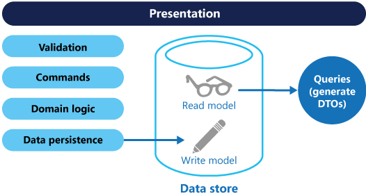
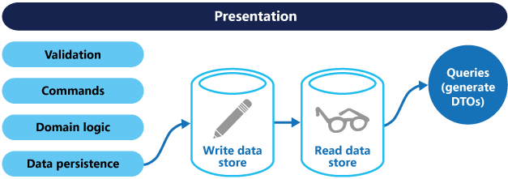

# Command and Query Responsibility Segregation (CQRS)

Segregate operations that read data from operations that update data by using separate interfaces. This can maximize performance, scalability, and security. Supports the evolution of the system over time through higher flexibility, and prevent update commands from causing merge conflicts at the domain level.

## Context and problem

In traditional data management systems, both commands (updates to the data) and queries (requests for data) are executed against the same set of entities in a single data repository. These entities can be a subset of the rows in one or more tables in a relational database such as SQL Server.

Typically in these systems, all create, read, update, and delete (CRUD) operations are applied to the same representation of the entity. For example, a data transfer object (DTO) representing a customer is retrieved from the data store by the data access layer (DAL) and displayed on the screen. A user updates some fields of the DTO (perhaps through data binding) and the DTO is then saved back in the data store by the DAL. The same DTO is used for both the read and write operations. The figure illustrates a traditional CRUD architecture.


Traditional CRUD designs work well when only limited business logic is applied to the data operations. Scaffold mechanisms provided by development tools can create data access code very quickly, which can then be customized as required.

However, the traditional CRUD approach has some disadvantages:

- It often means that there's a mismatch between the read and write representations of the data, such as additional columns or properties that must be updated correctly even though they aren't required as part of an operation.

- It risks data contention when records are locked in the data store in a collaborative domain, where multiple actors operate in parallel on the same set of data. Or update conflicts caused by concurrent updates when optimistic locking is used. These risks increase as the complexity and throughput of the system grows. In addition, the traditional approach can have a negative effect on performance due to load on the data store and data access layer, and the complexity of queries required to retrieve information.

- It can make managing security and permissions more complex because each entity is subject to both read and write operations, which might expose data in the wrong context.

> For a deeper understanding of the limits of the CRUD approach see [CRUD, Only When You Can Afford It](https://msdn.microsoft.com/library/ms978509.aspx). 

## Solution

Command and Query Responsibility Segregation (CQRS) is a pattern that segregates the operations that read data (queries) from the operations that update data (commands) by using separate interfaces. This means that the data models used for querying and updates are different. The models can then be isolated, as shown in the following figure, although that's not an absolute requirement.




Compared to the single data model used in CRUD-based systems, the use of separate query and update models for the data in CQRS-based systems simplifies design and implementation. However, one disadvantage is that unlike CRUD designs, CQRS code can't automatically be generated using scaffold mechanisms.

The query model for reading data and the update model for writing data can access the same physical store, perhaps by using SQL views or by generating projections on the fly. However, it's common to separate the data into different physical stores to maximize performance, scalability, and security, as shown in the next figure.




The read store can be a read-only replica of the write store, or the read and write stores can have a different structure altogether. Using multiple read-only replicas of the read store can greatly increase query performance and application UI responsiveness, especially in distributed scenarios where read-only replicas are located close to the application instances. Some database systems (SQL Server) provide additional features such as failover replicas to maximize availability.

Separation of the read and write stores also allows each to be scaled appropriately to match the load. For example, read stores typically encounter a much higher load than write stores.

When the query/read model contains denormalized data (see [Materialized View pattern](materialized-view.md)), performance is maximized when reading data for each of the views in an application or when querying the data in the system. 

## Issues and considerations

Consider the following points when deciding how to implement this pattern:

- Dividing the data store into separate physical stores for read and write operations can increase the performance and security of a system, but it can add complexity in terms of resiliency and eventual consistency. The read model store must be updated to reflect changes to the write model store, and it can be difficult to detect when a user has issued a request based on stale read data, which means that the operation can't be completed.

    > For a description of eventual consistency see the [Data Consistency Primer](https://msdn.microsoft.com/library/dn589800.aspx).

- Consider applying CQRS to limited sections of your system where it will be most valuable. 

- A typical approach to deploying eventual consistency is to use event sourcing in conjunction with CQRS so that the write model is an append-only stream of events driven by execution of commands. These events are used to update materialized views that act as the read model. For more information see [Event Sourcing and CQRS](https://msdn.microsoft.com/library/dn568103.aspx#EventSourcingandCQRS).

## When to use this pattern

Use this pattern in the following situations: 

- Collaborative domains where multiple operations are performed in parallel on the same data. CQRS allows you to define commands with a enough granularity to minimize merge conflicts at the domain level (any conflicts that do arise can be merged by the command), even when updating what appears to be the same type of data.

- Task-based user interfaces where users are guided through a complex process as a series of steps or with complex domain models. Also, useful for teams already familiar with domain-driven design (DDD) techniques. The write model has a full command-processing stack with business logic, input validation, and business validation to ensure that everything is always consistent for each of the aggregates (each cluster of associated objects treated as a unit for data changes) in the write model. The read model has no business logic or validation stack and just returns a DTO for use in a view model. The read model is eventually consistent with the write model. 

- Scenarios where performance of data reads must be fine tuned separately from performance of data writes, especially when the read/write ratio is very high, and when horizontal scaling is required. For example, in many systems the number of read operations is many times greater that the number of write operations. To accommodate this, consider scaling out the read model, but running the write model on only one or a few instances. A small number of write model instances also helps to minimize the occurrence of merge conflicts.

- Scenarios where one team of developers can focus on the complex domain model that is part of the write model, and another team can focus on the read model and the user interfaces. 

- Scenarios where the system is expected to evolve over time and might contain multiple versions of the model, or where business rules change regularly.

- Integration with other systems, especially in combination with event sourcing, where the temporal failure of one subsystem shouldn't affect the availability of the others.

This pattern isn't recommended in the following situations:

- Where the domain or the business rules are simple.

- Where a simple CRUD-style user interface and the related data access operations are sufficient.

- For implementation across the whole system. There are specific components of an overall data management scenario where CQRS can be useful, but it can add considerable and unnecessary complexity when it isn't required.

## Event Sourcing and CQRS

The CQRS pattern is often used along with the Event Sourcing pattern. CQRS-based systems use separate read and write data models, each tailored to relevant tasks and often located in physically separate stores. When used with the [Event Sourcing](event-sourcing.md) pattern, the store of events is the write model, and is the official source of information. The read model of a CQRS-based system provides materialized views of the data, typically as highly denormalized views. These views are tailored to the interfaces and display requirements of the application, which helps to maximize both display and query performance.

Using the stream of events as the write store, rather than the actual data at a point in time, avoids update conflicts on a single aggregate and maximizes performance and scalability. The events can be used to asynchronously generate materialized views of the data that are used to populate the read store.

Because the event store is the official source of information, it is possible to delete the materialized views and replay all past events to create a new representation of the current state when the system evolves, or when the read model must change. The materialized views are in effect a durable read-only cache of the data.

When using CQRS combined with the Event Sourcing pattern, consider the following:

- As with any system where the write and read stores are separate, systems based on this pattern are only eventually consistent. There will be some delay between the event being generated and the data store being updated.

- The pattern adds complexity because code must be created to initiate and handle events, and assemble or update the appropriate views or objects required by queries or a read model. The complexity of the CQRS pattern when used with the Event Sourcing pattern can make a successful implementation more difficult, and requires a different approach to designing systems. However, event sourcing can make it easier to model the domain, and makes it easier to rebuild views or create new ones because the intent of the changes in the data is preserved.

- Generating materialized views for use in the read model or projections of the data by replaying and handling the events for specific entities or collections of entities can require significant processing time and resource usage. This is especially true if it requires summation or analysis of values over long periods, because all the associated events might need to be examined. Resolve this by implementing snapshots of the data at scheduled intervals, such as a total count of the number of a specific action that have occurred, or the current state of an entity.

## Example

The following code shows some extracts from an example of a CQRS implementation that uses different definitions for the read and the write models. The model interfaces don't dictate any features of the underlying data stores, and they can evolve and be fine-tuned independently because these interfaces are separated.

The following code shows the read model definition.

```csharp
// Query interface
namespace ReadModel
{
  public interface ProductsDao
  {
    ProductDisplay FindById(int productId);
    IEnumerable<ProductDisplay> FindByName(string name);
    IEnumerable<ProductInventory> FindOutOfStockProducts();
    IEnumerable<ProductDisplay> FindRelatedProducts(int productId);
  }

  public class ProductDisplay
  {
    public int ID { get; set; }
    public string Name { get; set; }
    public string Description { get; set; }
    public decimal UnitPrice { get; set; }
    public bool IsOutOfStock { get; set; }
    public double UserRating { get; set; }
  }

  public class ProductInventory
  {
    public int ID { get; set; }
    public string Name { get; set; }
    public int CurrentStock { get; set; }
  }
}
```

The system allows users to rate products. The application code does this using the `RateProduct` command shown in the following code.

```csharp
public interface Icommand
{
  Guid Id { get; }
}

public class RateProduct : Icommand
{
  public RateProduct()
  {
    this.Id = Guid.NewGuid();
  }
  public Guid Id { get; set; }
  public int ProductId { get; set; }
  public int rating { get; set; }
  public int UserId {get; set; }
}
```
The system uses the `ProductsCommandHandler` class to handle commands sent by the application. Clients typically send commands to the domain through a messaging system such as a queue. The command handler accepts these commands and invokes methods of the domain interface. The granularity of each command is designed to reduce the chance of conflicting requests. The following code shows an outline of the `ProductsCommandHandler` class.

```csharp
public class ProductsCommandHandler : 
    ICommandHandler<AddNewProduct>,
    ICommandHandler<RateProduct>,
    ICommandHandler<AddToInventory>,
    ICommandHandler<ConfirmItemShipped>,
    ICommandHandler<UpdateStockFromInventoryRecount>    
{
  private readonly IRepository<Product> repository;

  public ProductsCommandHandler (IRepository<Product> repository)
  {
    this.repository = repository;
  }

  void Handle (AddNewProduct command)
  {
    ...
  }

  void Handle (RateProduct command)
  {
    var product = repository.Find(command.ProductId);
    if (product != null)
    {
      product.RateProuct(command.UserId, command.rating);
      repository.Save(product);
    }
  }

  void Handle (AddToInventory command)
  {
    ...
  }

  void Handle (ConfirmItemsShipped command)
  {
    ...
  }

  void Handle (UpdateStockFromInventoryRecount command)
  {
    ...
  }
}
```

The following code shows the `IProductsDomain` interface from the write model.

```csharp
public interface IProductsDomain
{
  void AddNewProduct(int id, string name, string description, decimal price);
  void RateProduct(int userId int rating);
  void AddToInventory(int productId, int quantity);
  void ConfirmItemsShipped(int productId, int quantity);
  void UpdateStockFromInventoryRecount(int productId, int updatedQuantity);
}
```

Also notice how the `IProductsDomain` interface contains methods that have a meaning in the domain. Typically, in a CRUD environment these methods would have generic names such as `Save` or `Update`, and have a DTO as the only argument. The CQRS approach can be designed to meet the needs of this organization's business and inventory management systems.

## Related patterns and guidance

The following patterns and guidance are useful when implementing this pattern:

- [Data Consistency Primer](https://msdn.microsoft.com/library/dn589800.aspx). Explains the issues that are typically encountered due to eventual consistency between the read and write data stores when using the CQRS pattern, and how these issues can be resolved.

- [Data Partitioning Guidance](https://msdn.microsoft.com/library/dn589795.aspx). Describes how the read and write data stores used in the CQRS pattern can be divided into partitions that can be managed and accessed separately to improve scalability, reduce contention, and optimize performance.

- [Event Sourcing Pattern](event-sourcing.md). Describes in more detail how Event Sourcing can be used with the CQRS pattern to simplify tasks in complex domains while improving performance, scalability, and responsiveness. As well as how to provide consistency for transactional data while maintaining full audit trails and history that can enable compensating actions.

- [Materialized View Pattern](materialized-view.md). The read model of a CQRS implementation can contain materialized views of the write model data, or the read model can be used to generate materialized views.

- The patterns & practices guide [CQRS Journey](http://aka.ms/cqrs). In particular, [Introducing the Command Query Responsibility Segregation Pattern](https://msdn.microsoft.com/library/jj591573.aspx) explores the pattern and when it's useful, and [Epilogue: Lessons Learned](https://msdn.microsoft.com/library/jj591568.aspx) helps you understand some of the issues that come up when using this pattern.

- The post [CQRS by Martin Fowler](http://martinfowler.com/bliki/CQRS.html), which explains the basics of the pattern and links to other useful resources.

- [Greg Young’s posts](http://codebetter.com/gregyoung/), which explore many aspects of the CQRS pattern.
