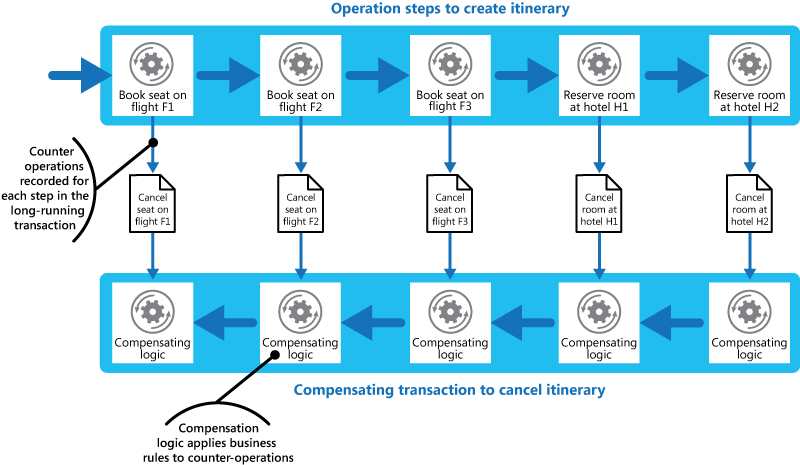

   
# Competing Consumers

Enable multiple concurrent consumers to process messages received on the same messaging channel. This enables a system to process multiple messages concurrently to optimize throughput, to improve scalability and availability, and to balance the workload.

## Context and problem

An application running in the cloud is expected to handle a large number of requests. Rather than process each request synchronously, a common technique is for the application to pass them through a messaging system to another service (a consumer service) that handles them asynchronously. This strategy helps to ensure that the business logic in the application isn't blocked while the requests are being processed.

The number of requests can vary significantly over time for many reasons. A sudden increase in user activity or aggregated requests coming from multiple tenants can cause an unpredictable workload. At peak hours a system might need to process many hundreds of requests per second, while at other times the number could be very small. Additionally, the nature of the work performed to handle these requests might be highly variable. Using a single instance of the consumer service can cause that instance to become flooded with requests, or the messaging system might be overloaded by an influx of messages coming from the application. To handle this fluctuating workload, the system can run multiple instances of the consumer service. However, these consumers must be coordinated to ensure that each message is only delivered to a single consumer. The workload also needs to be load balanced across consumers to prevent an instance from becoming a bottleneck.

## Solution

Use a message queue to implement the communication channel between the application and the instances of the consumer service. The application posts requests in the form of messages to the queue, and the consumer service instances receive messages from the queue and process them. This approach enables the same pool of consumer service instances to handle messages from any instance of the application. The figure illustrates using a message queue to distribute work to instances of a service.



This solution has the following benefits:

- It provides a load-leveled system that can handle wide variations in the volume of requests sent by application instances. The queue acts as a buffer between the application instances and the consumer service instances. This can help to minimize the impact on availability and responsiveness for both the application and the service instances, as described by the [Queue-based Load Leveling pattern](queue-based-load-leveling.md). Handling a message that requires some long-running processing doesn't prevent other messages from being handled concurrently by other instances of the consumer service.

- It improves reliability. If a producer communicates directly with a consumer instead of using this pattern, but doesn't monitor the consumer, there's a high probability that messages could be lost or fail to be processed if the consumer fails. In this pattern, messages aren't sent to a specific service instance. A failed service instance won't block a producer, and messages can be processed by any working service instance.

- It doesn't require complex coordination between the consumers, or between the producer and the consumer instances. The message queue ensures that each message is delivered at least once.

- It's scalable. The system can dynamically increase or decrease the number of instances of the consumer service as the volume of messages fluctuates.

- It can improve resiliency if the message queue provides transactional read operations. If a consumer service instance reads and processes the message as part of a transactional operation, and the consumer service instance fails, this pattern can ensure that the message will be returned to the queue to be picked up and handled by another instance of the consumer service.

## Issues and considerations

Consider the following points when deciding how to implement this pattern:

- **Message ordering**. The order in which consumer service instances receive messages isn't guaranteed, and doesn't necessarily reflect the order in which the messages were created. Design the system to ensure that message processing is idempotent because this will help to eliminate any dependency on the order in which messages are handled. For more information, see [Idempotency Patterns](http://blog.jonathanoliver.com/2010/04/idempotency-patterns/) on Jonathon Oliver’s blog.

    > Microsoft Azure Service Bus Queues can implement guaranteed first-in-first-out ordering of messages by using message sessions. For more information, see [Messaging Patterns Using Sessions](https://msdn.microsoft.com/magazine/jj863132.aspx).

- **Designing services for resiliency**. If the system is designed to detect and restart failed service instances, it might be necessary to implement the processing performed by the service instances as idempotent operations to minimize the effects of a single message being retrieved and processed more than once.

- **Detecting poison messages**. A malformed message, or a task that requires access to resources that aren't available, can cause a service instance to fail. The system should prevent such messages being returned to the queue, and instead capture and store the details of these messages elsewhere so that they can be analyzed if necessary.

- **Handling results**. The service instance handling a message is fully decoupled from the application logic that generates the message, and they might not be able to communicate directly. If the service instance generates results that must be passed back to the application logic, this information must be stored in a location that's accessible to both. In order to prevent the application logic from retrieving incomplete data the system must indicate when processing is complete.

     > If you're using Azure, a worker process can pass results back to the application logic by using a dedicated message reply queue. The application logic must be able to correlate these results with the original message. This scenario is described in more detail in the [Asynchronous Messaging Primer](https://msdn.microsoft.com/library/dn589781.aspx).
     
- **Scaling the messaging system**. In a large-scale solution, a single message queue could be overwhelmed by the number of messages and become a bottleneck in the system. In this situation, consider partitioning the messaging system to send messages from specific producers to a particular queue, or use load balancing to distribute messages across multiple message queues.

- **Ensuring reliability of the messaging system**. A reliable messaging system is needed to guarantee that after the application enqueues a message it won't be lost. This is essential for ensuring that all messages are delivered at least once.

## When to use this pattern

Use this pattern when:

- The workload for an application is divided into tasks that can run asynchronously.
- Tasks are independent and can run in parallel.
- The volume of work is highly variable, requiring a scalable solution.
- The solution must provide high availability, and must be resilient if the processing for a task fails.

This pattern might not be useful when:

- It's not easy to separate the application workload into discrete tasks, or there's a high degree of dependence between tasks.
- Tasks must be performed synchronously, and the application logic must wait for a task to complete before continuing.
- Tasks must be performed in a specific sequence.

> Some messaging systems support sessions that enable a producer to group messages together and ensure that they're all handled by the same consumer. This mechanism can be used with prioritized messages (if they are supported) to implement a form of message ordering that delivers messages in sequence from a producer to a single consumer.

## Example

Azure provides storage queues and Service Bus queues that can act as a mechanism for implementing this pattern. The application logic can post messages to a queue, and consumers implemented as tasks in one or more roles can retrieve messages from this queue and process them. For resiliency, a Service Bus queue enables a consumer to use `PeekLock` mode when it retrieves a message from the queue. This mode doesn't actually remove the message, but simply hides it from other consumers. The original consumer can delete the message when it's finished processing it. If the consumer fails, the peek lock will time out and the message will become visible again, allowing another consumer to retrieve it.

> For detailed information on using Azure Service Bus queues, see [Service Bus queues, topics, and subscriptions](https://msdn.microsoft.com/library/windowsazure/hh367516.aspx). 
For information on using Azure storage queues, see [Get started with Azure Queue storage using .NET](https://azure.microsoft.com/documentation/articles/storage-dotnet-how-to-use-queues/).

The following code from the `QueueManager` class in CompetingConsumers solution available on [GitHub](https://github.com/mspnp/cloud-design-patterns/tree/master/samples/competing-consumers) shows how you can create a queue by using a `QueueClient` instance in the `Start` event handler in a web or worker role.

```csharp
private string queueName = ...;
private string connectionString = ...;
...

public async Task Start()
{
  // Check if the queue already exists.
  var manager = NamespaceManager.CreateFromConnectionString(this.connectionString);
  if (!manager.QueueExists(this.queueName))
  {
    var queueDescription = new QueueDescription(this.queueName);

    // Set the maximum delivery count for messages in the queue. A message 
    // is automatically dead-lettered after this number of deliveries. The
    // default value for dead letter count is 10.
    queueDescription.MaxDeliveryCount = 3;

    await manager.CreateQueueAsync(queueDescription);
  }
  ...

  // Create the queue client. By default the PeekLock method is used.
  this.client = QueueClient.CreateFromConnectionString(
    this.connectionString, this.queueName);
}
```

The next code snippet shows how an application can create and send a batch of messages to the queue.

```csharp
public async Task SendMessagesAsync()
{
  // Simulate sending a batch of messages to the queue.
  var messages = new List<BrokeredMessage>();

  for (int i = 0; i < 10; i++)
  {
    var message = new BrokeredMessage() { MessageId = Guid.NewGuid().ToString() };
    messages.Add(message);
  }
  await this.client.SendBatchAsync(messages);
}
```

The following code shows how a consumer service instance can receive messages from the queue by following an event-driven approach. The `processMessageTask` parameter to the `ReceiveMessages` method is a delegate that references the code to run when a message is received. This code is run asynchronously.

```csharp
private ManualResetEvent pauseProcessingEvent;
...

public void ReceiveMessages(Func<BrokeredMessage, Task> processMessageTask)
{
  // Set up the options for the message pump.
  var options = new OnMessageOptions();

  // When AutoComplete is disabled it's necessary to manually
  // complete or abandon the messages and handle any errors.
  options.AutoComplete = false;
  options.MaxConcurrentCalls = 10;
  options.ExceptionReceived += this.OptionsOnExceptionReceived;

  // Use of the Service Bus OnMessage message pump. 
  // The OnMessage method must be called once, otherwise an exception will occur.
  this.client.OnMessageAsync(
    async (msg) =>
    {
      // Will block the current thread if Stop is called.
      this.pauseProcessingEvent.WaitOne();

      // Execute processing task here.
      await processMessageTask(msg);
    },
    options);
}
...

private void OptionsOnExceptionReceived(object sender, 
  ExceptionReceivedEventArgs exceptionReceivedEventArgs)
{
  ...
}
```

Note that autoscaling features, such as those available in Azure, can be used to start and stop role instances as the queue length fluctuates. For more information, see [Autoscaling Guidance](https://msdn.microsoft.com/library/dn589774.aspx). Also, it's not necessary to maintain a one-to-one correspondence between role instances and worker processes&mdash;a single role instance can implement multiple worker processes. For more information, see [Compute Resource Consolidation pattern](compute-resource-consolidation.md).

## Related patterns and guidance

The following patterns and guidance might be relevant when implementing this pattern:

- [Asynchronous Messaging Primer](https://msdn.microsoft.com/library/dn589781.aspx). Message queues are an asynchronous communications mechanism. If a consumer service needs to send a reply to an application, it might be necessary to implement some form of response messaging. The Asynchronous Messaging Primer provides information on how to implement request/reply messaging using message queues.
 
- [Autoscaling Guidance](https://msdn.microsoft.com/library/dn589774.aspx). It might be possible to start and stop instances of a consumer service since the length of the queue applications post messages on varies. Autoscaling can help to maintain throughput during times of peak processing.

- [Compute Resource Consolidation Pattern](compute-resource-consolidation.md). It might be possible to consolidate multiple instances of a consumer service into a single process to reduce costs and management overhead. The Compute Resource Consolidation pattern describes the benefits and tradeoffs of following this approach.

- [Queue-based Load Leveling Pattern](queue-based-load-leveling.md). Introducing a message queue can add resiliency to the system, enabling service instances to handle widely varying volumes of requests from application instances. The message queue acts as a buffer, which levels the load. The Queue-based Load Leveling pattern describes this scenario in more detail.

- This pattern has a [sample application](https://github.com/mspnp/cloud-design-patterns/tree/master/competing-consumers) associated with it.
