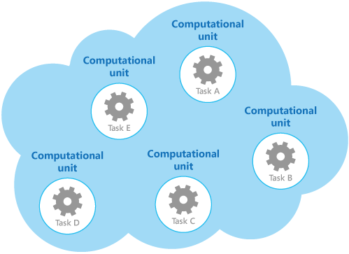
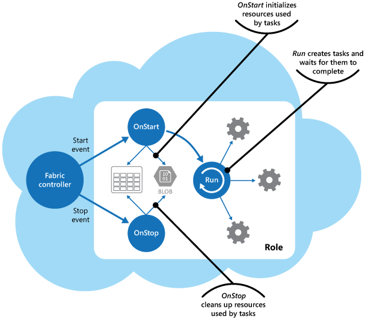

# Compute Resource Consolidation

Consolidate multiple tasks or operations into a single computational unit. This can increase compute resource utilization, and reduce the costs and management overhead associated with performing compute processing in cloud-hosted applications.

## Context and problem

A cloud application often implements a variety of operations. In some solutions it makes sense to follow the design principle of separation of concerns initially, and divide these operations into separate computational units that are hosted and deployed individually (for example, as separate App Service web apps, separate Virtual Machines, or separate Cloud Service roles). However, although this strategy can help simplify the logical design of the solution, deploying a large number of computational units as part of the same application can increase runtime hosting costs and make management of the system more complex.

As an example, the figure shows the simplified structure of a cloud-hosted solution that is implemented using more than one computational unit. Each computational unit runs in its own virtual environment. Each function has been implemented as a separate task (labeled Task A through Task E) running in its own computational unit.




Each computational unit consumes chargeable resources, even when it's idle or lightly used. Therefore, this isn't always the most cost-effective solution.

In Azure, this concern applies to roles in a Cloud Service, App Services, and Virtual Machines. These items run in their own virtual environment. Running a collection of separate roles, websites, or virtual machines that are designed to perform a set of well-defined operations, but that need to communicate and cooperate as part of a single solution, can be an inefficient use of resources.

## Solution

To help reduce costs, increase utilization, improve communication speed, and reduce management it's possible to consolidate multiple tasks or operations into a single computational unit.

Tasks can be grouped according to criteria based on the features provided by the environment and the costs associated with these features. A common approach is to look for tasks that have a similar profile concerning their scalability, lifetime, and processing requirements. Grouping these together allows them to scale as a unit. The elasticity provided by many cloud environments enables additional instances of a computational unit to be started and stopped according to the workload. For example, Azure provides autoscaling that you can apply to roles in a Cloud Service, App Services, and Virtual Machines. For more information, see [Autoscaling Guidance](https://msdn.microsoft.com/library/dn589774.aspx).

As a counter example to show how scalability can be used to determine which operations shouldn't be grouped together, consider the following two tasks:

- Task 1 polls for infrequent, time-insensitive messages sent to a queue.
- Task 2 handles high-volume bursts of network traffic.

The second task requires elasticity that can involve starting and stopping a large number of instances of the computational unit. Applying the same scaling to the first task would simply result in more tasks listening for infrequent messages on the same queue, and is a waste of resources.

In many cloud environments it's possible to specify the resources available to a computational unit in terms of the number of CPU cores, memory, disk space, and so on. Generally, the more resources specified, the greater the cost. To save money, it's important to maximize the work an expensive computational unit performs, and not let it become inactive for an extended period.

If there are tasks that require a great deal of CPU power in short bursts, consider consolidating these into a single computational unit that provides the necessary power. However, it's important to balance this need to keep expensive resources busy against the contention that could occur if they are over stressed. Long-running, compute-intensive tasks shouldn't share the same computational unit, for example.

## Issues and considerations

Consider the following points when implementing this pattern:

**Scalability and elasticity**. Many cloud solutions implement scalability and elasticity at the level of the computational unit by starting and stopping instances of units. Avoid grouping tasks that have conflicting scalability requirements in the same computational unit.

**Lifetime**. The cloud infrastructure periodically recycles the virtual environment that hosts a computational unit. When there are many long-running tasks inside a computational unit, it might be necessary to configure the unit to prevent it from being recycled until these tasks have finished. Alternatively, design the tasks by using a check-pointing approach that enables them to stop cleanly, and continue at the point they were interrupted when the computational unit is restarted.

**Release cadence**. If the implementation or configuration of a task changes frequently, it might be necessary to stop the computational unit hosting the updated code, reconfigure and redeploy the unit, and then restart it. This process will also require that all other tasks within the same computational unit are stopped, redeployed, and restarted.

**Security**. Tasks in the same computational unit might share the same security context and be able to access the same resources. There must be a high degree of trust between the tasks, and confidence that one task isn't going to corrupt or adversely affect another. Additionally, increasing the number of tasks running in a computational unit increases the attack surface of the unit. Each task is only as secure as the one with the most vulnerabilities.

**Fault tolerance**. If one task in a computational unit fails or behaves abnormally, it can affect the other tasks running within the same unit. For example, if one task fails to start correctly it can cause the entire startup logic for the computational unit to fail, and prevent other tasks in the same unit from running.

**Contention**. Avoid introducing contention between tasks that compete for resources in the same computational unit. Ideally, tasks that share the same computational unit should exhibit different resource utilization characteristics. For example, two compute-intensive tasks should probably not reside in the same computational unit, and neither should two tasks that consume large amounts of memory. However, mixing a compute intensive task with a task that requires a large amount of memory is a workable combination.

> [!NOTE]
>  Consider consolidating compute resources only for a system that's been in production for a period of time so that operators and developers can monitor the system and create a _heat map_ that identifies how each task utilizes differing resources. This map can be used to determine which tasks are good candidates for sharing compute resources.

**Complexity**. Combining multiple tasks into a single computational unit adds complexity to the code in the unit, possibly making it more difficult to test, debug, and maintain.

**Stable logical architecture**. Design and implement the code in each task so that it shouldn't need to change, even if the physical environment the task runs in does change.

**Other strategies**. Consolidating compute resources is only one way to help reduce costs associated with running multiple tasks concurrently. It requires careful planning and monitoring to ensure that it remains an effective approach. Other strategies might be more appropriate, depending on the nature of the work and where the users these tasks are running are located. For example, functional decomposition of the workload (as described by the [Compute Partitioning Guidance](https://msdn.microsoft.com/library/dn589773.aspx)) might be a better option.

## When to use this pattern

Use this pattern for tasks that are not cost effective if they run in their own computational units. If a task spends much of its time idle, running this task in a dedicated unit can be expensive.

This pattern might not be suitable for tasks that perform critical fault-tolerant operations, or tasks that process highly-sensitive or private data and require their own security context. These tasks should run in their own isolated environment, in a separate computational unit.

## Example

When building a cloud service on Azure, it’s possible to consolidate the processing performed by multiple tasks into a single role. Typically this is a worker role that performs background or asynchronous processing tasks.

>  In some cases it's possible to include background or asynchronous processing tasks in the web role. This technique helps to reduce costs and simplify deployment, although it can impact the scalability and responsiveness of the public-facing interface provided by the web role. The article [Combining Multiple Azure Worker Roles into an Azure Web Role](http://www.31a2ba2a-b718-11dc-8314-0800200c9a66.com/2012/02/combining-multiple-azure-worker-roles.html) contains a detailed description of implementing background or asynchronous processing tasks in a web role.

The role is responsible for starting and stopping the tasks. When the Azure fabric controller loads a role, it raises the `Start` event for the role. You can override the `OnStart` method of the `WebRole` or `WorkerRole` class to handle this event, perhaps to initialize the data and other resources the tasks in this method depend on.

When the `OnStart `method completes, the role can start responding to requests. You can find more information and guidance about using the `OnStart` and `Run` methods in a role in the [Application Startup Processes](https://msdn.microsoft.com/library/ff803371.aspx#sec16) section in the patterns & practices guide [Moving Applications to the Cloud](https://msdn.microsoft.com/library/ff728592.aspx). 

>  Keep the code in the `OnStart` method as concise as possible. Azure doesn't impose any limit on the time taken for this method to complete, but the role won't be able to start responding to network requests sent to it until this method completes.

When the `OnStart` method has finished, the role executes the `Run` method. At this point, the fabric controller can start sending requests to the role.

Place the code that actually creates the tasks in the `Run` method. Note that the `Run` method defines the lifetime of the role instance. When this method completes, the fabric controller will arrange for the role to be shut down.

When a role shuts down or is recycled, the fabric controller prevents any more incoming requests being received from the load balancer and raises the `Stop` event. You can capture this event by overriding the `OnStop` method of the role and perform any tidying up required before the role terminates.

>  Any actions performed in the `OnStop` method must be completed within five minutes (or 30 seconds if you are using the Azure emulator on a local computer). Otherwise the Azure fabric controller assumes that the role has stalled and will force it to stop.

The tasks are started by the `Run` method that waits for the tasks to complete. The tasks implement the business logic of the cloud service, and can respond to messages posted to the role through the Azure load balancer. The figure shows the lifecycle of tasks and resources in a role in a Azure cloud service.




The _WorkerRole.cs_ file in the _ComputeResourceConsolidation.Worker_ project shows an example of how you might implement this pattern in a Azure cloud service.

>  The _ComputeResourceConsolidation.Worker_ project is part of the _ComputeResourceConsolidation_ solution available for download from [GitHub](https://github.com/mspnp/cloud-design-patterns/tree/master/compute-resource-consolidation).

In the worker role, code that runs when the role is initialized creates the required cancellation token and a list of tasks to run.

```csharp
public class WorkerRole: RoleEntryPoint
{
  // The cancellation token source used to cooperatively cancel running tasks.
  private readonly CancellationTokenSource cts = new CancellationTokenSource ();

  // List of tasks running on the role instance.
  private readonly List<Task> tasks = new List<Task>();

  // List of worker tasks to run on this role.
  private readonly List<Func<CancellationToken, Task>> workerTasks  
                        = new List<Func<CancellationToken, Task>>
    {
      MyWorkerTask1,
      MyWorkerTask2
    };
  
  ...
}
```

The `MyWorkerTask1` and the `MyWorkerTask2` methods illustrate how to perform different tasks within the same worker role. The following code shows `MyWorkerTask1`. This is a simple task that sleeps for 30 seconds and then outputs a trace message. It repeats this process until the task is cancelled. The code in `MyWorkerTask2` is similar.

```csharp
// A sample worker role task.
private static async Task MyWorkerTask1(CancellationToken ct)
{
  // Fixed interval to wake up and check for work and/or do work.
  var interval = TimeSpan.FromSeconds(30);

  try
  {
    while (!ct.IsCancellationRequested)
    {
      // Wake up and do some background processing if not canceled.
      // TASK PROCESSING CODE HERE
      Trace.TraceInformation("Doing Worker Task 1 Work");

      // Go back to sleep for a period of time unless asked to cancel.
      // Task.Delay will throw an OperationCanceledException when canceled.
      await Task.Delay(interval, ct);
    }
  }
  catch (OperationCanceledException)
  {
    // Expect this exception to be thrown in normal circumstances or check
    // the cancellation token. If the role instances are shutting down, a
    // cancellation request will be signaled.
    Trace.TraceInformation("Stopping service, cancellation requested");

    // Rethrow the exception.
    throw;
  }
}
```

>  The sample code shows a common implementation of a background process. In a real world application you can follow this same structure, except that you should place your own processing logic in the body of the loop that waits for the cancellation request.

After the worker role has initialized the resources it uses, the `Run` method starts the two tasks concurrently, as shown here.

```csharp
// RoleEntry Run() is called after OnStart().  
// Returning from Run() will cause a role instance to recycle.
public override void Run()
{
  // Start worker tasks and add them to the task list.
  foreach (var worker in workerTasks)
    tasks.Add(worker(cts.Token));

  Trace.TraceInformation("Worker host tasks started");
  // The assumption is that all tasks should remain running and not return, 
  // similar to role entry Run() behavior.
  try
  {
    Task.WaitAny(tasks.ToArray());
  }
  catch (AggregateException ex)
  {
    Trace.TraceError(ex.Message);

    // If any of the inner exceptions in the aggregate exception 
    // are not cancellation exceptions then re-throw the exception.
    ex.Handle(innerEx => (innerEx is OperationCanceledException));
  }

  // If there wasn't a cancellation request, stop all tasks and return from Run()
  // An alternative to cancelling and returning when a task exits would be to 
  // restart the task.
  if (!cts.IsCancellationRequested)
  {
    Trace.TraceInformation("Task returned without cancellation request");
    Stop(TimeSpan.FromMinutes(5));
  }
}
...
```

In this example, the `Run` method waits for tasks to be completed. If a task is canceled, the `Run` method assumes that the role is being shut down and waits for the remaining tasks to be canceled before finishing (it waits for a maximum of five minutes before terminating). If a task fails due to an expected exception, the `Run` method cancels the task.

>  You could implement more comprehensive monitoring and exception handling strategies in the `Run` method such as restarting tasks that have failed, or including code that enables the role to stop and start individual tasks.

The `Stop` method shown in the following code is called when the fabric controller shuts down the role instance (it's invoked from the `OnStop` method). The code stops each task gracefully by cancelling it. If any task takes more than five minutes to complete, the cancellation processing in the `Stop` method ceases waiting and the role is terminated.

```csharp
// Stop running tasks and wait for tasks to complete before returning 
// unless the timeout expires.
private void Stop(TimeSpan timeout)
{
  Trace.TraceInformation("Stop called. Canceling tasks.");
  // Cancel running tasks.
  cts.Cancel();

  Trace.TraceInformation("Waiting for canceled tasks to finish and return");

  // Wait for all the tasks to complete before returning. Note that the 
  // emulator currently allows 30 seconds and Azure allows five
  // minutes for processing to complete.
  try
  {
    Task.WaitAll(tasks.ToArray(), timeout);
  }
  catch (AggregateException ex)
  {
    Trace.TraceError(ex.Message);

    // If any of the inner exceptions in the aggregate exception 
    // are not cancellation exceptions then rethrow the exception.
    ex.Handle(innerEx => (innerEx is OperationCanceledException));
  }
}
```

## Related patterns and guidance

The following patterns and guidance might also be relevant when implementing this pattern:

- [Autoscaling Guidance](https://msdn.microsoft.com/library/dn589774.aspx). Autoscaling can be used to start and stop instances of service hosting computational resources, depending on the anticipated demand for processing.

- [Compute Partitioning Guidance](https://msdn.microsoft.com/library/dn589773.aspx). Describes how to allocate the services and components in a cloud service in a way that helps to minimize running costs while maintaining the scalability, performance, availability, and security of the service.

- This pattern includes a downloadable [sample application](https://github.com/mspnp/cloud-design-patterns/tree/master/compute-resource-consolidation).
