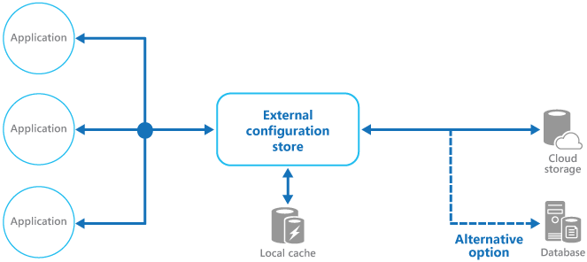

   
# External Configuration Store

Move configuration information out of the application deployment package to a centralized location. This can provide opportunities for easier management and control of configuration data, and for sharing configuration data across applications and application instances.

## Context and problem

The majority of application runtime environments include configuration information that's held in files deployed with the application. In some cases it's possible to edit these files to change the application behavior after it's been deployed. However, changes to the configuration require the application be redeployed, often resulting in unacceptable downtime and other administrative overhead.

Local configuration files also limit the configuration to a single application, but sometimes it would be useful to share configuration settings across multiple applications. Examples include database connection strings, UI theme information, or the URLs of queues and storage used by a related set of applications.

It's challenging to manage changes to local configurations across multiple running instances of the application, especially in a cloud-hosted scenario. It can result in instances using different configuration settings while the update is being deployed.

In addition, updates to applications and components might require changes to configuration schemas. Many configuration systems don't support different versions of configuration information.

## Solution

Store the configuration information in external storage, and provide an interface that can be used to quickly and efficiently read and update configuration settings. The type of external store depends on the hosting and runtime environment of the application. In a cloud-hosted scenario it's typically a cloud-based storage service, but could be a hosted database or other system.

The backing store you choose for configuration information should have an interface that provides consistent and easy-to-use access. It should expose the information in a correctly typed and structured format. The implementation might also need to authorize users’ access in order to protect configuration data, and be flexible enough to allow  storage of multiple versions of the configuration (such as development, staging, or production, including multiple release versions of each one).

>  Many built-in configuration systems read the data when the application starts up, and cache the data in memory to provide fast access and minimize the impact on application performance. Depending on the type of backing store used, and the latency of this store, it might be helpful to implement a caching mechanism within the external configuration store. For more information, see the [Caching Guidance](https://msdn.microsoft.com/library/dn589802.aspx). The figure illustrates an overview of the External Configuration Store pattern with optional local cache.




## Issues and considerations

Consider the following points when deciding how to implement this pattern:

Choose a backing store that offers acceptable performance, high availability, robustness, and can be backed up as part of the application maintenance and administration process. In a cloud-hosted application, using a cloud storage mechanism is usually a good choice to meet these requirements.

Design the schema of the backing store to allow flexibility in the types of information it can hold. Ensure that it provides for all configuration requirements such as typed data, collections of settings, multiple versions of settings, and any other features that the applications using it require. The schema should be easy to extend to support additional settings as requirements change.

Consider the physical capabilities of the backing store, how it relates to the way configuration information is stored, and the effects on performance. For example, storing an XML document containing configuration information will require either the configuration interface or the application to parse the document in order to read individual settings. It'll make updating a setting more complicated, though caching the settings can help to offset slower read performance.

Consider how the configuration interface will permit control of the scope and inheritance of configuration settings. For example, it might be a requirement to scope configuration settings at the organization, application, and the machine level. It might need to support delegation of control over access to different scopes, and to prevent or allow individual applications to override settings.

Ensure that the configuration interface can expose the configuration data in the required formats such as typed values, collections, key/value pairs, or property bags. 

Consider how the configuration store interface will behave when settings contain errors, or don't exist in the backing store. It might be appropriate to return default settings and log errors. Also consider aspects such as the case sensitivity of configuration setting keys or names, the storage and handling of binary data, and the ways that null or empty values are handled.

Consider how to protect the configuration data to allow access to only the appropriate users and applications. This is likely a feature of the configuration store interface, but it's also necessary to ensure that the data in the backing store can't be accessed directly without the appropriate permission. Ensure strict separation between the permissions required to read and to write configuration data. Also consider whether you need to encrypt some or all of the configuration settings, and how this'll be implemented in the configuration store interface.

Centrally stored configurations, which change application behavior during runtime, are critically important and should be deployed, updated, and managed using the same mechanisms as deploying application code. For example, changes that can affect more than one application must be carried out using a full test and staged deployment approach to ensure that the change is appropriate for all applications that use this configuration. If an administrator edits a setting to update one application, it could adversely impact other applications that use the same setting.

If an application caches configuration information, the application needs to be alerted if the configuration changes. It might be possible to implement an expiration policy over cached configuration data so that this information is automatically refreshed periodically and any changes picked up (and acted on). The [Runtime Reconfiguration pattern](runtime-reconfiguration.md) might be relevant to your scenario.

## When to use this pattern

This pattern is useful for:

- Configuration settings that are shared between multiple applications and application instances, or where a standard configuration must be enforced across multiple applications and application instances.

- A standard configuration system that doesn't support all of the required configuration settings, such as storing images or complex data types.

- As a complementary store for some of the settings for applications, perhaps allowing applications to override some or all of the centrally-stored settings.

- As a way to simplify administration of multiple applications, and optionally for monitoring use of configuration settings by logging some or all types of access to the configuration store. 

## Example

In a Microsoft Azure hosted application, a typical choice for storing configuration information externally is to use Azure Storage. This is resilient, offers high performance, and is replicated three times with automatic failover to offer high availability. Azure Table storage provides a key/value store with the ability to use a flexible schema for the values. Azure Blob storage provides a hierarchical, container-based store that can hold any type of data in individually named blobs.

The following example shows how a configuration store can be implemented over Blob storage to store and expose configuration information. The `BlobSettingsStore` class abstracts Blob storage for holding configuration information, and implements the `ISettingsStore` interface shown in the following code.

>  This code is provided in the _ExternalConfigurationStore.Cloud_ project in the _ExternalConfigurationStore_ solution, available from [GitHub](https://github.com/mspnp/cloud-design-patterns/tree/master/external-configuration-store).

```csharp
public interface IsettingsStore
{
  string Version { get; }

  Dictionary<string, string> FindAll();

  void Update(string key, string value);
} 
```

This interface defines methods for retrieving and updating configuration settings held in the configuration store, and includes a version number that can be used to detect whether any configuration settings have been modified recently. The `BlobSettingsStore` class uses the `ETag` property of the blob to implement versioning. The `ETag` property is updated automatically each time the blob is written.

>  By design, this simple solution exposes all configuration settings as string values rather than typed values.

The `ExternalConfigurationManager` class provides a wrapper around a `BlobSettingsStore` object. An application can use this class to store and retrieve configuration information. This class uses the Microsoft [Reactive Extensions](https://msdn.microsoft.com/en-us/library/hh242985(v=vs.103).aspx) library to expose any changes made to the configuration through an implementation of the `IObservable` interface. If a setting is modified by calling the `SetAppSetting` method, the `Changed` event is raised and all subscribers to this event will be notified.

Note that all settings are also cached in a `Dictionary` object inside the `ExternalConfigurationManager` class for fast access. The `SetAppSetting` method updates this cache, and the `GetSetting` method used to retrieve a configuration setting reads the data from the cache. If the setting isn't found in the cache, it's retrieved from the `BlobSettingsStore` object instead.

The `GetSettings` method invokes the `CheckForConfigurationChanges` method to detect whether the configuration information in blob storage has changed. It does this by examining the version number and comparing it with the current version number held by the `ExternalConfigurationManager` object. If one or more changes have occurred, the `Changed` event is raised and the configuration settings cached in the `Dictionary` object are refreshed. This is an application of the [Cache-Aside pattern](cache-aside.md).

The following code sample shows how the `Changed` event, the `SetAppSettings` method, the `GetSettings` method, and the `CheckForConfigurationChanges` method are implemented:

```csharp
public class ExternalConfigurationManager : IDisposable
{
  // An abstraction of the configuration store.
  private readonly ISettingsStore settings;
  private readonly ISubject<KeyValuePair<string, string>> changed;
  ...
  private Dictionary<string, string> settingsCache;
  private string currentVersion;
  ...
  public ExternalConfigurationManager(ISettingsStore settings, ...)
  {
    this.settings = settings;
    ...
  }
  ...
  public IObservable<KeyValuePair<string, string>> Changed
  {
    get { return this.changed.AsObservable(); }
  }
  ...
  public void SetAppSetting(string key, string value)
  {
    ...
    // Update the setting in the store.
    this.settings.Update(key, value);

    // Publish the event.
    this.Changed.OnNext(
         new KeyValuePair<string, string>(key, value));

    // Refresh the settings cache.
    this.CheckForConfigurationChanges();
  }

  public string GetAppSetting(string key)
  {
    ...
    // Try to get the value from the settings cache.  
    // If there's a miss, get the setting from the settings store.
    string value;
    if (this.settingsCache.TryGetValue(key, out value))
    {
      return value;
    }
            
    // Check for changes and refresh the cache.
    this.CheckForConfigurationChanges();

    return this.settingsCache[key];
  }
  ...
  private void CheckForConfigurationChanges()
  {
    try
    {

      // Assume that updates are infrequent. Lock to avoid
      // race conditions when refreshing the cache.
      lock (this.settingsSyncObject)
      {          {
        var latestVersion = this.settings.Version;

        // If the versions differ, the configuration has changed.
        if (this.currentVersion != latestVersion)
        {
          // Get the latest settings from the settings store and publish the changes.
          var latestSettings = this.settings.FindAll();
          latestSettings.Except(this.settingsCache).ToList().ForEach(
                                kv => this.changed.OnNext(kv));

          // Update the current version.
          this.currentVersion = latestVersion;

          // Refresh settings cache.
          this.settingsCache = latestSettings;
        }
      }
    }
    catch (Exception ex)
    {
      this.changed.OnError(ex);
    }
  }
}
```

>  The `ExternalConfigurationManager` class also provides a property named `Environment`. This property supports varying configurations for an application running in different environments, such as staging and production.

An `ExternalConfigurationManager` object can also query the `BlobSettingsStore` object periodically for any changes (using a timer). The `StartMonitor` and `StopMonitor` methods illustrated in the code sample below start and stop the timer. The `OnTimerElapsed` method runs when the timer expires and invokes the `CheckForConfigurationChanges` method to detect any changes and raise the `Changed` event, as described earlier.

```csharp
public class ExternalConfigurationManager : IDisposable
{
  ...
  private readonly ISubject<KeyValuePair<string, string>> changed;
  private readonly Timer timer;
  private ISettingsStore settings;
  ...
  public ExternalConfigurationManager(ISettingsStore settings, 
                                      TimeSpan interval, ...)
  {
    ...

    // Set up the timer.
    this.timer = new Timer(interval.TotalMilliseconds)
    {
      AutoReset = false;
    };
    this.timer.Elapsed += this.OnTimerElapsed;

    this.changed = new Subject<KeyValuePair<string, string>>();
    ...    
  }

  ...
        
  public void StartMonitor()
  {
    if (this.timer.Enabled)
    {
      return;
    }

    lock (this.timerSyncObject)
    {
      if (this.timer.Enabled)
      {
        return;
      }
      this.keepMonitoring = true;

      // Load the local settings cache.
      this.CheckForConfigurationChanges();

      this.timer.Start();
    }
  }

  public void StopMonitor()
  {
    lock (this.timerSyncObject)
    {
      this.keepMonitoring = false;
      this.timer.Stop();
    }
  }

  private void OnTimerElapsed(object sender, EventArgs e)
  {
    Trace.TraceInformation(
          "Configuration Manager: checking for configuration changes.");

    try
    {
      this.CheckForConfigurationChanges();
    }
    finally
    {
      ...
      // Restart the timer after each interval.
      this.timer.Start();
      ...
    }    
  }  
  ...
}
```

The `ExternalConfigurationManager` class is instantiated as a singleton instance by the `ExternalConfiguration` class shown below.

```csharp
public static class ExternalConfiguration
{
  private static readonly Lazy<ExternalConfigurationManager> configuredInstance 
                            = new Lazy<ExternalConfigurationManager>(
    () =>
    {
      var environment = CloudConfigurationManager.GetSetting("environment");
      return new ExternalConfigurationManager(environment);
    });

  public static ExternalConfigurationManager Instance
  {
    get { return configuredInstance.Value; }
  }
}
```

The following code is taken from the `WorkerRole` class in the _ExternalConfigurationStore.Cloud_ project. It shows how the application uses the `ExternalConfiguration` class to read and update a setting.

```csharp
public override void Run()
{
  // Start monitoring for configuration changes.
  ExternalConfiguration.Instance.StartMonitor();

  // Get a setting.
  var setting = ExternalConfiguration.Instance.GetAppSetting("setting1");
  Trace.TraceInformation("Worker Role: Get setting1, value: " + setting);

  Thread.Sleep(TimeSpan.FromSeconds(10));

  // Update a setting.
  Trace.TraceInformation("Worker Role: Updating configuration");
  ExternalConfiguration.Instance.SetAppSetting("setting1", "new value");

  this.completeEvent.WaitOne();
}
The following code, also from the `WorkerRole` class, shows how the application subscribes to configuration events.
C#
public override bool OnStart()
{ 
  ...
  // Subscribe to the event.
  ExternalConfiguration.Instance.Changed.Subscribe(
     m => Trace.TraceInformation("Configuration has changed. Key:{0} Value:{1}", 
          m.Key, m.Value),
     ex => Trace.TraceError("Error detected: " + ex.Message));
  ...
}
```

## Related patterns and guidance

The following information might also be relevant when implementing this pattern:

- [Runtime Reconfiguration pattern](runtime-reconfiguration.md). In addition to storing configuration settings externally, it's useful to be able to update them and have the changes applied without restarting the application. Describes how to design an application so that it can be reconfigured without requiring redeployment or restarting.

- A sample that demonstrates this pattern is available on [GitHub](https://github.com/mspnp/cloud-design-patterns/tree/master/external-configuration-store).
