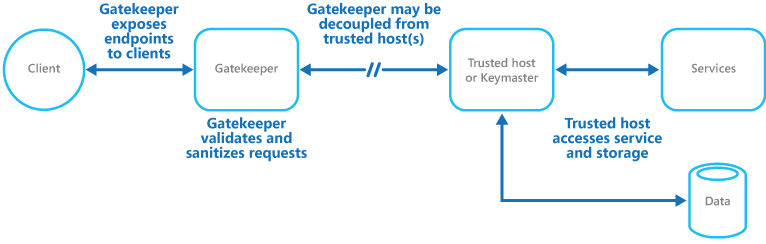
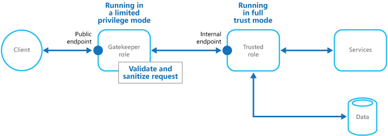

# Gatekeeper

Protect applications and services by using a dedicated host instance that acts as a broker between clients and the application or service, validates and sanitizes requests, and passes requests and data between them. This can provide an additional layer of security, and limit the attack surface of the system. 

## Context and problem

Applications expose their functionality to clients by accepting and processing requests. In cloud-hosted scenarios, applications expose endpoints clients connect to, and typically include the code to handle the requests from clients. This code performs authentication and validation, some or all request processing, and is likely to accesses storage and other services on behalf of the client.

If a malicious user is able to compromise the system and gain access to the application’s hosting environment, the security mechanisms it uses such as credentials and storage keys, and the services and data it accesses, are exposed. As a result, the malicious user can gain unrestrained access to sensitive information and other services. 

## Solution

To minimize the risk of clients gaining access to sensitive information and services, decouple hosts or tasks that expose public endpoints from the code that processes requests and accesses storage. You can achieve this by using a façade or a dedicated task that interacts with clients and then hands off the reques&mdash;perhaps through a decoupled interface&mdash;to the hosts or tasks that'll handle the request. The figure provides a high-level overview of this pattern.

The gatekeeper pattern can be used to simply protect storage, or it can be used as a more comprehensive façade to protect all of the functions of the application. The important factors are:
- **Controlled validation.** The gatekeeper validates all requests, and rejects those that don't meet validation requirements. 
- **Limited risk and exposure.** The gatekeeper doesn't have access to the credentials or keys used by the trusted host to access storage and services. If the gatekeeper is compromised, the attacker doesn't get access to these credentials or keys.
- **Appropriate security.** The gatekeeper runs in a limited privilege mode, while the rest of the application runs in the full trust mode required to access storage and services. If the gatekeeper is compromised, it can't directly access the application services or data.

This pattern acts like a firewall in a typical network topography. It allows the gatekeeper to examine requests and make a decision about whether to pass the request on to the trusted host (sometimes called the keymaster) that performs the required tasks. This decision typically requires the gatekeeper to validate and sanitize the request content before passing it on to the trusted host. 

## Issues and considerations

Consider the following points when deciding how to implement this pattern:
- Ensure that the trusted hosts the gatekeeper passes requests to expose only internal or protected endpoints, and connect only to the gatekeeper. The trusted hosts shouldn't expose any external endpoints or interfaces.
- The gatekeeper must run in a limited privilege mode. Typically this means running the gatekeeper and the trusted host in separate hosted services or virtual machines.
- The gatekeeper shouldn't perform any processing related to the application or services, or access any data. Its function is purely to validate and sanitize requests. The trusted hosts might need to perform additional validation of requests, but the core validation should be performed by the gatekeeper.
- Use a secure communication channel (HTTPS, SSL, or TLS) between the gatekeeper and the trusted hosts or tasks where this is possible. However, some hosting environments don't support HTTPS on internal endpoints.
- Adding the extra layer to the application to implement the gatekeeper pattern is likely to have some impact on performance due to the additional processing and network communication it requires.
- The gatekeeper instance could be a single point of failure. To minimize the impact of a failure, consider deploying additional instances and using an autoscaling mechanism to ensure capacity to maintain availability.

## When to use this pattern

This pattern is useful for:
- Applications that handle sensitive information, expose services that must have a high degree of protection from malicious attacks, or perform mission-critical operations that shouldn't be disrupted.
- Distributed applications where it's necessary to perform request validation separately from the main tasks, or to centralize this validation to simplify maintenance and administration.

## Example

In a cloud-hosted scenario, this pattern can be implemented by decoupling the gatekeeper role or virtual machine from the trusted roles and services in an application. Do this by using an internal endpoint, a queue, or storage as an intermediate communication mechanism. The figure illustrates using an internal endpoint.

## Related patterns

The [Valet Key pattern](valet-key.md) might also be relevant when implementing the Gatekeeper pattern. When communicating between the Gatekeeper and trusted roles it's good practice to enhance security by using keys or tokens that limit permissions for accessing resources. Describes how to use a token or key that provides clients with restricted direct access to a specific resource or service.
