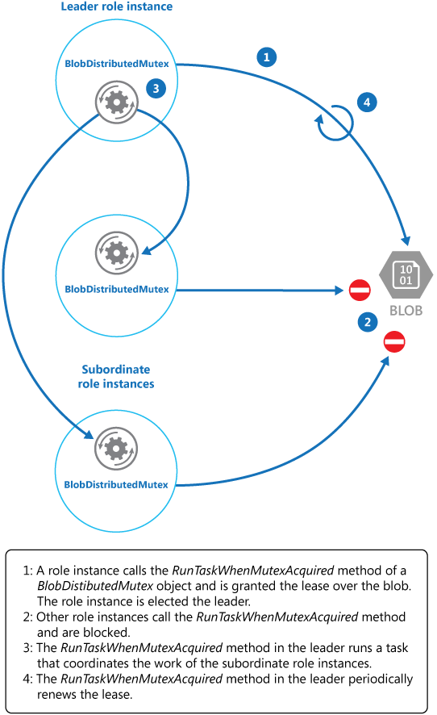

   
# Leader Election

Coordinate the actions performed by a collection of collaborating instances in a distributed application by electing one instance as the leader that assumes responsibility for managing the others. This can help to ensure that instances don't conflict with each other, cause contention for shared resources, or inadvertently interfere with the work that other instances are performing.

## Context and problem

A typical cloud application has many tasks acting in a coordinated manner. These tasks could all be instances running the same code and requiring access to the same resources, or they might be working together in parallel to perform the individual parts of a complex calculation.

The task instances might run separately for much of the time, but it might also be necessary to coordinate the actions of each instance to ensure that they don’t conflict, cause contention for shared resources, or accidentally interfere with the work that other task instances are performing. 

For example:

- In a cloud-based system that implements horizontal scaling, multiple instances of the same task could be running at the same time with each instance serving a different user. If these instances write to a shared resource, it's necessary to coordinate their actions to prevent each instance from overwriting the changes made by the others. 
- If the tasks are performing individual elements of a complex calculation in parallel, the results need to be aggregated when they all complete.

The task instances are all peers, so there isn't a natural leader that can act as the coordinator or aggregator. 

## Solution

A single task instance should be elected to act as the leader, and this instance should coordinate the actions of the other subordinate task instances. If all of the task instances are running the same code, they are each capable of acting as the leader. Therefore, the election process must be managed carefully to prevent two or more instances taking over the leader role at the same time.

The system must provide a robust mechanism for selecting the leader. This method has to cope with events such as network outages or process failures. In many solutions, the subordinate task instances monitor the leader through some type of heartbeat method, or by polling. If the designated leader terminates unexpectedly, or a network failure makes the leader unavailable to the subordinate task instances, it's necessary for them to elect a new leader.

There are several strategies for electing a leader among a set of tasks in a distributed environment, including: 
- Selecting the task instance with the lowest-ranked instance or process ID.
- Racing to acquire a shared, distributed mutex. The first task instance that acquires the mutex is the leader. However, the system must ensure that, if the leader terminates or becomes disconnected from the rest of the system, the mutex is released to allow another task instance to become the leader. 
- Implementing one of the common leader election algorithms such as the [Bully Algorithm](http://www.cs.colostate.edu/~cs551/CourseNotes/Synchronization/BullyExample.html) or the [Ring Algorithm](http://www.cs.colostate.edu/~cs551/CourseNotes/Synchronization/RingElectExample.html). These algorithms assume that each candidate in the election has a unique ID, and that it can communicate with the other candidates reliably. 

## Issues and considerations

Consider the following points when deciding how to implement this pattern:
- The process of electing a leader should be resilient to transient and persistent failures.
- It must be possible to detect when the leader has failed or has become otherwise unavailable (such as due to a communications failure). How quickly detection is needed is system dependent. Some systems might be able to function for a short time without a leader, during which a transient fault might be fixed. In other cases, it might be necessary to detect leader failure immediately and trigger a new election. 
- In a system that implements horizontal autoscaling, the leader could be terminated if the system scales back and shuts down some of the computing resources.
- Using a shared, distributed mutex introduces a dependency on the external service that provides the mutex. The service constitutes a single point of failure. If it becomes unavailable for any reason, the system won't be able to elect a leader.
- Using a single dedicated process as the leader is a straightforward approach. However, if the process fails there could be a significant delay while it's restarted. The resulting latency can affect the performance and response times of other processes if they're waiting for the leader to coordinate an operation.
- Implementing one of the leader election algorithms manually provides the greatest flexibility for tuning and optimizing the code.

## When to use this pattern

Use this pattern when the tasks in a distributed application, such as a cloud-hosted solution, need careful coordination and there's no natural leader. 

>  Avoid making the leader a bottleneck in the system. The purpose of the leader is to coordinate the work of the subordinate tasks, and it doesn't necessarily have to participate in this work itself&mdash;although it should be able to do so if the task isn't elected as the leader. 

This pattern might not be useful if:
- There's a natural leader or dedicated process that can always act as the leader. For example, it might be possible to implement a singleton process that coordinates the task instances. If this process fails or becomes unhealthy, the system can shut it down and restart it.
- The coordination between tasks can be achieved using a more lightweight method. For example, if several task instances simply need coordinated access to a shared resource, a better solution is to use optimistic or pessimistic locking to control access. 
- A third-party solution is more appropriate. For example, the Microsoft Azure HDInsight service (based on Apache Hadoop) uses the services provided by Apache Zookeeper to coordinate the map and reduce tasks that collect and summarize data. 

## Example

The DistributedMutex project in the LeaderElection solution (a sample that demonstrates this pattern is available on [GitHub](https://github.com/mspnp/cloud-design-patterns/tree/master/samples/leader-election)) shows how to use a lease on an Azure Storage blob to provide a mechanism for implementing a shared, distributed mutex. This mutex can be used to elect a leader among a group of role instances in an Azure cloud service. The first role instance to acquire the lease is elected the leader, and remains the leader until it releases the lease or isn't able to renew the lease. Other role instances can continue to monitor the blob lease in case the leader is no longer available.

>  A blob lease is an exclusive write lock over a blob. A single blob can be the subject of only one lease at any point in time. A role instance can request a lease over a specified blob, and it'll be granted the lease if no other role instance holds a lease over the same blob. Otherwise the request will throw an exception. 

> To avoid a faulted role instance retaining the lease indefinitely, specify a lifetime for the lease. When this expires, the lease becomes available. However, while a role instance holds the lease it can request that the lease is renewed, and it'll be granted the lease for a further period of time. The role instance can continually repeat this process if it wants to retain the lease. 
For more information on how to lease a blob, see [Lease Blob (REST API)](https://msdn.microsoft.com/library/azure/ee691972.aspx). 

The `BlobDistributedMutex` class in the C# example below contains the `RunTaskWhenMutexAquired` method that enables a role instance to attempt to acquire a lease over a specified blob. The details of the blob (the name, container, and storage account) are passed to the constructor in a `BlobSettings` object when the `BlobDistributedMutex` object is created (this object is a simple struct that is included in the sample code). The constructor also accepts a `Task` that references the code that the role instance should run if it successfully acquires the lease over the blob and is elected the leader. Note that the code that handles the low-level details of acquiring the lease is implemented in a separate helper class named `BlobLeaseManager`.

```csharp
public class BlobDistributedMutex
{
  ...
  private readonly BlobSettings blobSettings;
  private readonly Func<CancellationToken, Task> taskToRunWhenLeaseAcquired;
  ...

  public BlobDistributedMutex(BlobSettings blobSettings, 
           Func<CancellationToken, Task> taskToRunWhenLeaseAquired)
  {
    this.blobSettings = blobSettings;
    this.taskToRunWhenLeaseAquired = taskToRunWhenLeaseAquired;
  }
  
  public async Task RunTaskWhenMutexAcquired(CancellationToken token)
  {
    var leaseManager = new BlobLeaseManager(blobSettings);
    await this.RunTaskWhenBlobLeaseAcquired(leaseManager, token);    
  } 
  ...
```

The `RunTaskWhenMutexAquired` method in the code sample above invokes the `RunTaskWhenBlobLeaseAcquired` method shown in the following code sample to actually acquire the lease. The `RunTaskWhenBlobLeaseAcquired` method runs asynchronously. If the lease is successfully acquired, the role instance has been elected the leader. The purpose of the `taskToRunWhenLeaseAcquired` delegate is to perform the work that coordinates the other role instances. If the lease isn't acquired, another role instance has been elected as the leader and the current role instance remains a subordinate. Note that the `TryAcquireLeaseOrWait` method is a helper method that uses the `BlobLeaseManager` object to acquire the lease. 

```csharp
  private async Task RunTaskWhenBlobLeaseAcquired(
    BlobLeaseManager leaseManager, CancellationToken token)
  {
    while (!token.IsCancellationRequested)
    {
      // Try to acquire the blob lease. 
      // Otherwise wait for a short time before trying again.
      string leaseId = await this.TryAquireLeaseOrWait(leaseManager, token);

      if (!string.IsNullOrEmpty(leaseId))
      {
        // Create a new linked cancellation token source so that if either the 
        // original token is cancelled or the lease can't be renewed, the
        // leader task can be cancelled.
        using (var leaseCts = 
          CancellationTokenSource.CreateLinkedTokenSource(new[] { token }))
        {
          // Run the leader task.
          var leaderTask = this.taskToRunWhenLeaseAquired.Invoke(leaseCts.Token);          
          ...
        }
      }
    }
    ...
  }
```

The task started by the leader also runs asynchronously. While this task is running, the `RunTaskWhenBlobLeaseAquired` method shown in the following code sample periodically attempts to renew the lease. This helps to ensure that the role instance remains the leader. In the sample solution, the delay between renewal requests is less than the time specified for the duration of the lease in order to prevent another role instance from being elected the leader. If the renewal fails for any reason, the task is cancelled.

If the lease fails to be renewed or the task is cancelled (possibly as a result of the role instance shutting down), the lease is released. At this point, this or another role instance might be elected as the leader. The code extract below shows this part of the process. 

```csharp
  private async Task RunTaskWhenBlobLeaseAcquired(
    BlobLeaseManager leaseManager, CancellationToken token)
  {
    while (...)
    {
      ...
      if (...)
      {
        ...
        using (var leaseCts = ...)
        {
          ...
          // Keep renewing the lease in regular intervals. 
          // If the lease can't be renewed, then the task completes.
          var renewLeaseTask = 
            this.KeepRenewingLease(leaseManager, leaseId, leaseCts.Token);

          // When any task completes (either the leader task itself or when it
          // couldn't renew the lease) then cancel the other task.
          await CancelAllWhenAnyCompletes(leaderTask, renewLeaseTask, leaseCts);
        }
      }
    }
  }
  ...
}
```

The `KeepRenewingLease` method is another helper method that uses the `BlobLeaseManager` object to renew the lease. The `CancelAllWhenAnyCompletes` method cancels the tasks specified as the first two parameters. The following diagram illustrates using the `BlobDistributedMutex` class to elect a leader and run a task that coordinates operations. 




The following code example shows how to use the `BlobDistributedMutex` class in a worker role. This code acquires a lease over a blob named `MyLeaderCoordinatorTask` in the lease's container in development storage, and specifies that the code defined in the `MyLeaderCoordinatorTask` method should run if the role instance is elected the leader. 

```csharp
var settings = new BlobSettings(CloudStorageAccount.DevelopmentStorageAccount, 
  "leases", "MyLeaderCoordinatorTask");
var cts = new CancellationTokenSource();
var mutex = new BlobDistributedMutex(settings, MyLeaderCoordinatorTask);
mutex.RunTaskWhenMutexAcquired(this.cts.Token);
...

// Method that runs if the role instance is elected the leader
private static async Task MyLeaderCoordinatorTask(CancellationToken token)
{
  ...
}
```

Note the following points about the sample solution:
- The blob is a potential single point of failure. If the blob service becomes unavailable, or is inaccessible, the leader won't be able to renew the lease and no other role instance will be able to acquire the lease. In this case, no role instance will be able to act as the leader. However, the blob service is designed to be resilient, so complete failure of the blob service is considered to be extremely unlikely.
- If the task being performed by the leader stalls, the leader might continue to renew the lease, preventing any other role instance from acquiring the lease and taking over the leader role in order to coordinate tasks. In the real world, the health of the leader should be checked at frequent intervals. 
- The election process is nondeterministic. You can't make any assumptions about which role instance will acquire the blob lease and become the leader.
- The blob used as the target of the blob lease shouldn't be used for any other purpose. If a role instance attempts to store data in this blob, this data won't be accessible unless the role instance is the leader and holds the blob lease.

## Related patterns and guidance

The following guidance might also be relevant when implementing this pattern:
- This pattern has a downloadable [sample application](https://github.com/mspnp/cloud-design-patterns/tree/master/samples/leader-election).
- [Autoscaling Guidance](https://msdn.microsoft.com/library/dn589774.aspx). It's possible to start and stop instances of the task hosts as the load on the application varies. Autoscaling can help to maintain throughput and performance during times of peak processing.
- [Compute Partitioning Guidance](https://msdn.microsoft.com/library/dn589773.aspx). This guidance describes how to allocate tasks to hosts in a cloud service in a way that helps to minimize running costs while maintaining the scalability, performance, availability, and security of the service.
- The [Task-based Asynchronous Pattern](https://msdn.microsoft.com/library/hh873175.aspx).
- An example illustrating the [Bully Algorithm](http://www.cs.colostate.edu/~cs551/CourseNotes/Synchronization/BullyExample.html).
- An example illustrating the [Ring Algorithm](http://www.cs.colostate.edu/~cs551/CourseNotes/Synchronization/RingElectExample.html).
- The article [Apache Zookeeper on Microsoft Azure](https://msopentech.com/opentech-projects/apache-zookeeper-on-windows-azure-2/) on the Microsoft Open Technologies website.
- The article [Lease Blob (REST API)](https://msdn.microsoft.com/library/azure/ee691972.aspx) on MSDN.
